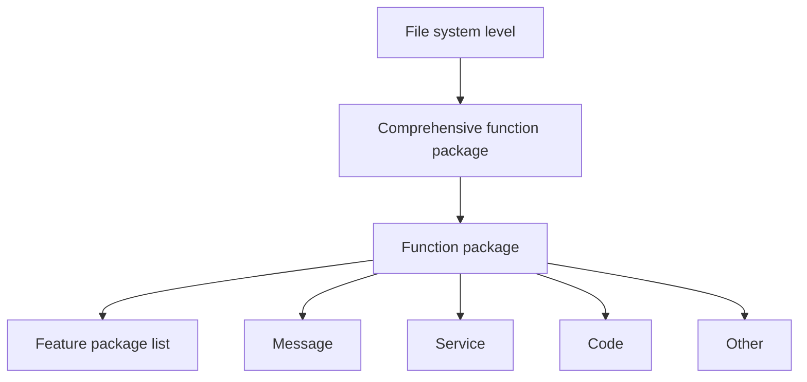
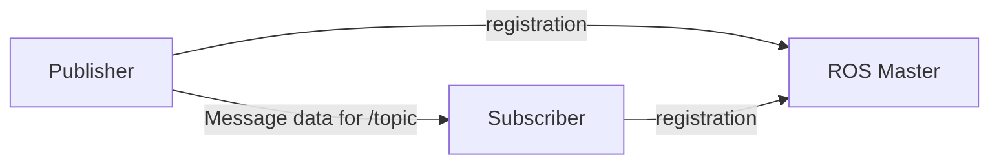
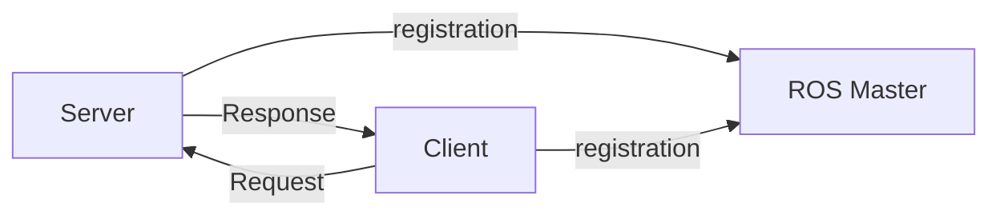
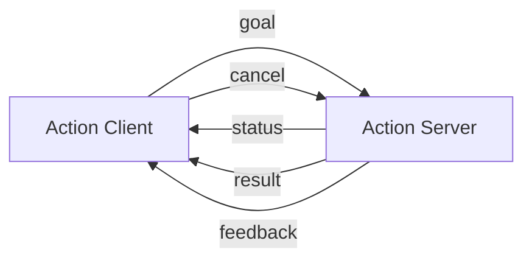
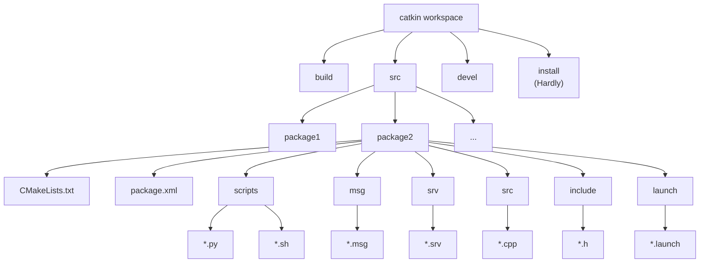

# HH-101 Complete Modules Book

This file is auto-generated from all pages under `docs/hh101/HH-101` for PDF export.

---

\newpage

# Module 02 - Board Basics Tasks

<!-- Source: 02 - Board Basics Tasks/00-module-overview.md -->

# 00-Module Overview

## Board Basics Tasks

**Estimated completion time:** 3-4 hours

**Module focus:** Jetson board fundamentals, setup decisions, and safe system preparation.

## What You Will Learn

- Identify key board interfaces and boot modes
- Choose the correct flashing and environment path
- Verify baseline board health and tools

## Start This Module

- Start here: [01-Jetson-board-introduction](./01-Jetson-board-introduction.md)

## High-Value Online References

- [Jetson Software Documentation](https://docs.nvidia.com/jetson/index.html)
- [NVIDIA SDK Manager Documentation](https://docs.nvidia.com/sdk-manager/index.html)
- [SDK Manager Download (Official)](https://developer.nvidia.com/sdk-manager)

---

<!-- Source: 02 - Board Basics Tasks/01-Jetson-board-introduction.md -->

# 01-Jetson Board Introduction

## 1. What Is a Jetson Board?

NVIDIA Jetson boards are compact edge AI computers. They run Linux, support GPU acceleration, and are built for robotics, vision, and AI inference workloads.

Compared with a microcontroller, Jetson can run full operating systems and AI frameworks. Compared with a desktop GPU PC, Jetson is lower power and designed for embedded deployment.

## 2. Why Jetson Orin Nano?

Jetson Orin Nano is a common entry point for:

- Learning CUDA and TensorRT on embedded hardware
- Building camera-based AI projects
- Running ROS/ROS 2 with onboard acceleration

## 3. Development Kit Variants

The main difference between the Jetson Orin official development kit and the SUB development kit is that the official kit does not include a power switch button.

### 3.1 Front of the Development Board


| Serial Number | Description                          | Serial Number | Description                  |
|---------------|--------------------------------------|---------------|------------------------------|
| 1             | Power switch button (SUB)            | 9             | CAN bus                      |
| 2             | 12-pin button header                 | 10            | Fan interface                |
| 3             | Camera interface 1 (22-pin)          | 11            | 40-pin GPIO expansion header |
| 4             | Camera interface 2 (22-pin)          | 12            | Core module card holder      |
| 5             | PoE reverse power interface (1x2 pin)| 13            | PoE interface                |
| 6             | USB 3.0 x4                           | 14            | Ethernet interface           |
| 7             | DisplayPort interface                | 15            | Power indicator              |
| 8             | DC power interface                   | 16            | USB Type-C                   |

### 3.2 Back of the Development Board


| Serial Number | Description                       | Serial Number | Description             |
|---------------|-----------------------------------|---------------|-------------------------|
| 1             | M.2 Key E connector slot (75-pin) | 3             | M.2 Key M slot (75-pin) |
| 2             | RTC battery holder (optional)     | 4             | M.2 Key M slot (75-pin) |

## 4. Software Stack You Will See in HH-101

In the next setup lessons you will work with:

- JetPack (NVIDIA software bundle for Jetson)
- Ubuntu on the target board
- SDK Manager on a host machine
- CUDA, TensorRT, and related runtime components

---

<!-- Source: 02 - Board Basics Tasks/02-choose-setup-path.md -->

# 02-Choose Your Setup Path

Use this page before doing any flashing or environment installation.

## 1. Recommended Path for Most Beginners

If your board already boots into the factory desktop, use:

- [03-Installing Jetson Environment](./03-installing-jetson-environment.md)

This is the safest and fastest path.

## 2. Which Path Should You Use?

| Your Goal | Recommended Lesson | Risk Level |
|-----------|--------------------|------------|
| Keep factory image and add NVIDIA components | [03-Installing Jetson Environment](./03-installing-jetson-environment.md) | Low |
| Reflash clean official NVIDIA system | [02-Write Jetson Original System](./04-write-jetson-original-system.md) | Medium |
| Move to SUPER system workflow | [06-Write SUPER Original System](./06-write-super-original-system.md) | High |

## 3. Quick Decision Rules

- If you are new to Jetson: choose `03-Installing Jetson Environment`.
- If you need a pure clean system and understand recovery flashing: choose `02-Write Jetson Original System`.
- If you explicitly need SUPER workflow compatibility: choose `06-Write SUPER Original System`.

## 4. Important Safety Note

Flashing can overwrite your current system. Back up important data before following reflash tutorials.

---

<!-- Source: 02 - Board Basics Tasks/03-installing-jetson-environment.md -->

# 03-Installing Jetson Environment

This tutorial installs NVIDIA component packages on a board that already boots normally.

> **note**
If your shipped SSD already includes the factory image and you do not need a clean reflash, use this tutorial.

## 1. Prerequisites

Prepare:

- Stable internet connection (host and target)
- Jetson board booting to desktop
- DC power adapter
- DisplayPort cable + monitor
- USB Type-C cable to host machine/VM
- Ethernet cable

If you use the provided VM image, use its default credentials as documented by your kit provider.

## 2. Hardware and Connection Mode

Connect the board with DC power, DP, Ethernet, and Type-C.

> **note**
Do not enter recovery (flashing) mode for this tutorial.


## 3. VM/Host USB Pass-Through

If using VMware Workstation 17 Pro, attach the Jetson USB device to the VM from the VMware menu.

Example menu path:

- `Virtual Machine -> Removable Devices -> NVIDIA Linux for Tegra`


## 4. SDK Manager Workflow

### 4.1 Select Target

Open `SDK Manager` and select your target board model.

For official kit users, choose `Jetson Orin Nano [*GB developer kit version]`.

### 4.2 Step 1

Confirm the target and host options, then click `CONTINUE`.


### 4.3 Step 2

Select the component packages you need. SDK Manager downloads them automatically.


If prompted, enter the VM password.


### 4.4 Step 3

Enter the username and password configured on the Jetson device.


Wait for package installation to complete.


If installation fails, reboot the board and retry SDK Manager.


### 4.5 Step 4

Verify completion in SDK Manager.


## 5. Environment Verification

Install `jtop`:

```bash
sudo apt update && sudo apt upgrade -y
sudo apt install python3-pip -y
sudo pip3 install -U jetson-stats
```

Reboot after installation.

Set max power mode:

```bash
sudo nvpmodel -m 2 # Jetson Orin Nano
sudo nvpmodel -m 0 # Jetson Orin NX
```

Enable max clocks:

```bash
sudo jetson_clocks
```

Check status:

```bash
jtop
```


---

<!-- Source: 02 - Board Basics Tasks/04-backup-ssd-system.md -->

# 04-Backup SSD system

During the development process, users may need to back up the system to prevent subsequent development from affecting the current system environment.

## 1. Hardware connection

Users need to prepare the SSD box in advance, install the SSD into the SSD box and connect it to the computer or virtual machine: the computer and virtual machine systems need to be Ubuntu systems.


## 2. Compress the SSD

Since the SSD capacity of the Jetson Orin series motherboard is relatively large, we need to compress it to an appropriate space for system backup to save time for backup and burning the system.

### 2.1. Install Gparted


### 2.2. Use GParted

Find theGPartedapplication icon in the system application menu bar to open it or enter the following command in the terminal to start it:


Select the newly added disk symbol: You can confirm again whether it is the SSD you mounted based on the disk capacity


Before operating the disk, you need to unmount the disk: select theAPPpartition (largest partition) in the disk, and clickUnmountto unmount the partition


Right-click the uninstalled disk partition and resize the previously uninstalled partition space:


You can adjust the partition size using the slider: yellow is the space used by the partition, white is the unused space, it is recommended to leave about 5-10G of unused space in the partition to avoid the system from failing to start


Confirm the disk operation:


Wait for the operation to complete:


After completing the above operations, close GParted!

## 3. Back up the SSD

### 3.1. Check disk information

Open the terminal and use the script to view the current disk information: the drive letter needs to correspond to the drive letter of the SSD you backed up

parted_info.sh script content

Record the data in the figure: 41822208s


### 3.2. Start disk backup

Use theddcommand to back up the SSD to theimgfile. Enter the following in the terminal:

/dev/sdb: SSD drive letter

Jetson_Orin_Nano_8G.img: Image name

bs=512: Set block size to 512 bytes

56393728: Data queried by the script


To view theddprocess information, open another terminal and enter the following command:


Wait for the backup to complete:


After the system backup is complete, move the backup file (Jetson_Orin_Nano_8G.img) to the Windows system for use.


---

<!-- Source: 02 - Board Basics Tasks/04-write-jetson-original-system.md -->

# 04-Write Jetson Original System

This tutorial reflashes the official NVIDIA system image to Jetson Orin boards.

> **warning**
This is not the recommended path for beginners. If your factory image works, use `03-Installing Jetson Environment` instead.

## 1. Before You Start

- Back up important data.
- Confirm you need a clean image.
- Ensure stable USB and internet connection.

SUB Orin Nano / Orin NX users: this method may not enable MAXN mode.

## 2. Hardware Connection

### 2.1 Enter Recovery (Flashing) Mode

Short `FC REC` and `GND` under the core board.


### 2.2 Connect Cables

Connect DC power, DP cable, Ethernet, and Type-C to your host machine.


## 3. Host/VM Connection

The tutorial uses VMware Workstation 17 Pro.

Attach the USB device from VMware menu:

- `Virtual Machine -> Removable Devices -> NVIDIA APX`


You can verify APX mode with:

```bash
lsusb
```

## 4. SDK Manager

Register/login with NVIDIA Developer account.

SDK Manager download:

- [SDK Manager](https://developer.nvidia.com/sdk-manager)

### 4.1 Install SDK Manager (if needed)

```bash
sudo dpkg -i sdkmanager_2.2.0-12028_amd64.deb
sudo apt --fix-broken install -y
```

### 4.2 Start SDK Manager

```bash
sdkmanager
```

To access archived JetPack versions:

```bash
sdkmanager --archived-versions
```

### 4.3 Follow STEP1 to STEP4

- Select your exact board model.
- Confirm options in STEP1.
- Select required packages in STEP2.
- Wait for flashing in STEP3.
- Confirm success in STEP4.

If USB disconnects during long flashing, reconnect the Jetson USB device to the VM immediately.

## 5. First Boot After Flashing

- Remove FC REC/GND jumper.
- Boot in normal mode.
- Connect display and complete initial Ubuntu setup.

If device is not recognized, power cycle board and reconnect Type-C.

---

<!-- Source: 02 - Board Basics Tasks/05-restore-initial-image-system.md -->

# 05-Restore initial image system

## 1. Format the SSD

Before restoring the factory image, you need to format the SSD into exFAT format.

### 1.1. Download DiskGenius

Download URL:https://www.diskgenius.com/


Double-click the exe file you just downloaded to install DiskGenius. Follow the prompts to install the software on the Windows computer. After opening the software, it will be as shown below.


### 1.1. Use DiskGenius

#### 1.1.1, Delete partition

Deleting a partition will clear the disk data. Please confirm whether the drive letter is the disk that needs to be formatted before confirming the operation: you can judge based on the disk size and the newly added drive letter of the connected disk


#### 1.1.2. Create a new partition

Partition the SSD into NTFS format.

Select the drive letter corresponding to the SSD, and then click New Partition:


## 2. Restore the factory image

You need to download and decompress the factory image system in the data to the local computer in advance.

### 2.1. Install Win32DiskImager

Download URL:https://sourceforge.net/projects/win32diskimager/


Open thewin32diskimager-1.0.0-install.exeinstallation package as an administrator and accept the agreement:


Installation location: The default location is recommended


Installation options:


Start installation:


Complete installation:


### 2.2. Use Win32DiskImager

â‘ : Select the factory image file (*.img) in the data

â‘¡: Select the drive letter corresponding to the solid-state drive

â‘¢: Write the factory image to the solid-state drive


Confirm writing to the system:


Wait for the system to be written successfully:


After the system is written, you can close the program and install the SSD to the Jetson Orin motherboard!

## 3. Description

The Jetson motherboard can start the system normally and it depends on the system Jetpack version. Generally, only the same version can start the system!

---

<!-- Source: 02 - Board Basics Tasks/06-write-super-original-system.md -->

# 06-Write SUPER Original System

> **warning**
Advanced workflow. Use this only if you explicitly need the SUPER system path. Beginners should first complete `03-Installing Jetson Environment`.

This tutorial supports upgrading SUPER from Jetson Orin official kit and Jetson Orin SUB kit. After upgrading SUPER, only the pure system is retained, and some tutorial board cases may not run.

> **note**
The startup behavior of Jetson boards depends on JetPack version compatibility. Mismatched versions may fail to boot.

The tutorial uses a VMware Ubuntu 22.04 virtual machine for demonstration.

## 1. File Download

Official page: [Jetson Linux R36.4.3](https://developer.nvidia.com/embedded/jetson-linux-r3643)

> **note**
NVIDIA Jetson Linux 36.4.3 corresponds to JetPack 6.2.

Download both:

- Driver Package (BSP)
- Sample Root Filesystem


## 2. Flashing Mode

### 2.1 Hardware Connection

Use a jumper cap to short FC REC and GND under the core board.

Connect DC power, DP cable, Ethernet, and Type-C to the host.


### 2.2 Software Connection Check

Verify APX visibility on host:

```bash
lsusb
```


## 3. Flash System

### 3.1 Unpack Files

```bash
tar xf Jetson_Linux_R36.4.3_aarch64.tbz2
sudo tar xpf Tegra_Linux_Sample-Root-Filesystem_R36.4.3_aarch64.tbz2 -C Linux_for_Tegra/rootfs/
cd Linux_for_Tegra/
```


### 3.2 Run Prerequisite Scripts

```bash
sudo ./tools/l4t_flash_prerequisites.sh
sudo ./apply_binaries.sh
```


### 3.3 Flash to SSD

```bash
sudo ./tools/kernel_flash/l4t_initrd_flash.sh --external-device nvme0n1p1 -c tools/kernel_flash/flash_l4t_t234_nvme.xml -p "-c bootloader/generic/cfg/flash_t234_qspi.xml" --showlogs --network usb0 jetson-orin-nano-devkit-super internal
```

> **note**
Both Jetson Orin Nano and Jetson Orin NX can use this command to flash SSD in this workflow.


During flashing, keep the USB connection attached to the VM to avoid timeout.


## 4. Boot the System

After flashing:

- Disconnect DC and Type-C.
- Remove FC REC/GND jumper.
- Reconnect DC and DP.
- Boot and finish first-run setup.


## 5. Install Jetson Components

A pure flashed system does not include all CUDA/TensorRT components by default. After boot, continue with:

- `03-Installing Jetson Environment`

---

<!-- Source: 02 - Board Basics Tasks/07-write-super-boot.md -->

# 07-Write SUPER boot

The purpose of this tutorial is to burn SUPER boot to the Jetson Orin series motherboard (used with Jetpack 6.2 system). There is no need to install a solid-state drive during the burning process. After the burning is completed, install the solid-state drive to the motherboard and start the system to use the factory system that we have set up in advance.

## 1. Flashing mode

### 1.1. Hardware connection

> **note**
The DP data cable and network cable can be used without burning the boot, but they will be needed when using the motherboard later

This illustration is based on the official version of Jetson Orin Nano. Users of other versions can refer to it for use (the hardware interface and functional layout are the same).


### 1.2. Software connection

Users need to use the virtual machine we provide to burn SUPER boot. We need to connect the motherboard to the virtual machine so that it can be recognized by the Ubuntu system:

```
Virtual machine username: HemiHex
Virtual machine password: HemiHex
```


## 2. Write boot

Open the terminal, enter the specified folder and run the script: If the burning fails, you can disconnect the motherboard power and reconnect the virtual machine to run the command

```bash
cd ~/jetpack_6.2/Linux_for_Tegra && sudo ./yahboom_flash.sh.x
```

```bash
cd ~/jetpack_6.2/Linux_for_Tegra && sudo ./yahboom_flash.sh.x
```


## 3. Start the system

After the burning boot is successful, install the solid state drive boot system provided by our factory.


---

<!-- Source: 02 - Board Basics Tasks/08-ssd-expansion.md -->

# 08-SSD expansion

The factory image system will perform disk compression, so the capacity displayed in the system will be inconsistent with the actual capacity. Users can follow the tutorial to expand the SSD.

```
The tutorial is located in the Jetson Orin motherboard system
```

## 1. Install GParted


```bash
sudo apt update
```

```bash
sudo apt install gparted -y
```


## 2. Use GParted

Find the GParted application icon in the system application menu bar to open it or enter the following command in the terminal to start it:


```bash
gparted
```


## 3. Adjust partitions

Right-click the disk partition that needs to be expanded: generally select the largest partition in the disk


You can adjust the partition size through the slider: you can maximize the space and slide to the far right


Confirm the partition adjustment operation:

<!-- / -->


After partitioning is completed, close the GParted software by yourself!

---

<!-- Source: 02 - Board Basics Tasks/09-jetpack-old-system-upgrade-super-system.md -->

## Jetpack old system upgraded to HemiHex SUPER system

## 1. Description

This tutorial is mainly provided to the following customers

1. Users who purchased the Jetson Orin official kit before January 22, 2025
1. Users who purchased the Jetson Orin SUB kit before February 8, 2025

Users who purchased the Jetson Orin official kit before January 22, 2025

Users who purchased the Jetson Orin SUB kit before February 8, 2025

Note:

- Users who purchased the Jetson Orin official kit after January 22, 2025 only need to burn the SUPER boot system
- Users who purchased the Jetson Orin SUB kit after February 8, 2025 only need to assemble the boot system

Users who purchased the Jetson Orin official kit after January 22, 2025 only need to burn the SUPER boot system

Users who purchased the Jetson Orin SUB kit after February 8, 2025 only need to assemble the boot system

## 2. Upgrade method

### 2.1. Burn SUPER boot

Refer to the tutorial [Chapter 2 Motherboard Basics: Burn SUPER Boot] Operation: Completing this tutorial can allow the motherboard to start the Jetpack6.2 system.

### 2.2. Restore the factory image system

Refer to the tutorial [Chapter 2 Motherboard Basics: Restore the Factory Image System] Operation: Completing this tutorial can write the SSD to the SUPER (Jetpack6.2) system.

Note: You need to prepare the SSD box in advance

### 2.3. SSD expansion

Refer to the tutorial [Chapter 2 Motherboard Basics: SSD expansion] Operation: Completing this tutorial can allocate the unallocated space of the SSD.

---

<!-- Source: 02 - Board Basics Tasks/10-write-system-to-own-ssd.md -->

# 10-Write the system onto your own solid-state drive


## 1. Preparations before writing

The supplied SSD is only compatible with M.2 Key M and M.2 Key B+M interface SSDs, and is not compatible with M.2 Key B interface SSDs. The storage capacity must be at least 256GB.


The recommended size is 2280 mm (22 x 80 mm).


## 2. writing the HemiHex Factory System

> **warning**
Important Notes for Using the HemiHex Factory Image: For the motherboard to boot, two conditions must be met: Super Boot must be burned, and the Yabooom factory image must be flashed onto the SSD. Both are indispensable; otherwise, the system will not boot. (Must Read)

### 1.Write SUPER boot

> **note**
: If you purchased the SUB version package, the Super boot is already flashed at the factory, so you do not need to flash the Super bootloader again and can skip this step.

For Write SUPER boot, please refer directly to the tutorial 【 07. Flashing the SUPER Bootloader (Official Kits Must Read ) 】.


### 2. Burning the HemiHex factory image to the solid-state drive

Before burning, install the solid-state drive into the solid-state drive enclosure.


#### 2.1. Format the SSD

Before restoring the factory image, you need to format the SSD into exFAT format.

##### 2.1.1. Download DiskGenius

Download URL: https://www.diskgenius.com/


Double-click the exe file you just downloaded to install DiskGenius. Follow the prompts to install the software on the Windows computer. After opening the software, it will be as shown below.


##### 2.1.2. Use DiskGenius

###### 1, Delete partition

Deleting a partition will clear the disk data. Please confirm whether the drive letter is the disk that needs to be formatted before confirming the operation: you can judge based on the disk size and the newly added drive letter of the connected disk


###### 2. Create a new partition

Partition the SSD into NTFS format.

Select the drive letter corresponding to the SSD, and then click New Partition:


#### 2. Restore the factory image

You need to download and decompress the factory image system in the data to the local computer in advance.

##### 2.1. Install Win32DiskImager

Download URL: https://sourceforge.net/projects/win32diskimager/


Open the win32diskimager-1.0.0-install.exe installation package as an administrator and accept the agreement:

`win32diskimager-1.0.0-install.exe`


Installation location: The default location is recommended


Installation options:


Start installation:


Complete installation:


##### 2.2. Use Win32DiskImager

â‘ : Select the factory image file (*.img) in the data

â‘¡: Select the drive letter corresponding to the solid-state drive

â‘¢: Write the factory image to the solid-state drive


Confirm writing to the system:


Wait for the system to be written successfully:


After the system is written, you can close the program and install the SSD to the Jetson Orin motherboard!

## 3. Description

The Jetson motherboard can start the system normally and it depends on the system Jetpack version. Generally, only the same version can start the system!

---

\newpage

# Module 03 - Linux Basics

<!-- Source: 03 - Linux Basics/00-module-overview.md -->

# 00-Module Overview

## Linux Basics

**Estimated completion time:** 4-6 hours

**Module focus:** Linux command-line operations and remote access workflows on Jetson.

## What You Will Learn

- Use shell commands and package management confidently
- Configure SSH and VNC access and file transfer
- Set up developer tools like VS Code and jtop

## Start This Module

- Start here: [01-linux-basics](./01-linux-basics.md)

## High-Value Online References

- [Ubuntu Server Documentation](https://ubuntu.com/server/docs)
- [Ubuntu Documentation Directory](https://docs.ubuntu.com/)
- [Project Jupyter Documentation](https://docs.jupyter.org/en/latest/)

---

<!-- Source: 03 - Linux Basics/01-linux-basics.md -->

# 01-Linux Basics

## 1. Terminal

Terminal is a command line interface used to interact with the operating system.

### 1.1. Open the terminal

In Ubuntu, you can open it by using the shortcut keys Ctrl + Alt + T or by finding the terminal in the application menu:


### 1.2. Basic commands

View the current directory

Display the full path of the current working directory:

```bash
pwd
```

```bash
pwd
```

List files/directories

List files and subdirectories in the current directory:

```bash
ls
```


```bash
ls
```

Create a new directory

Create the File_demo directory:

```bash
mkdir File_demo
```


```bash
mkdir File_demo
```

Change directory

Enter File_demo directory:

```bash
cd File_demo
```


```bash
cd File_demo
```

Return to parent directory

```bash
cd ..
```


```bash
cd ..
```

Create new file

Create Version.txt file:

```bash
touch Version.txt
```


```bash
touch Version.txt
```

Modify file

Add System Information to Version.txt file:

```bash
echo "System Information" >> Version.txt
```


```bash
echo "System Information" >> Version.txt
```

View file

View Version.txt file content:

```bash
cat Version.txt
```


```bash
cat Version.txt
```

Delete directory

Delete File_demo directory:

```bash
rm -rf File_demo
```


```bash
rm -rf File_demo
```


### 1.3. Shortcut keys

Ctrl + C

Terminate the currently running command

Ctrl + Z

Suspend the current process

Tab

Automatically complete the file name or command

## 2. Text editor

### 2.1. Gedit (Easy)

The default text editor in the GNOME desktop environment, with a graphical user interface (GUI).

Open file

```bash
gedit Version.txt
```


```bash
gedit Version.txt
```


### 2.2, Nano (Medium)

Simple and easy-to-use command line text editor, suitable for beginners.

Install

```bash
sudo apt update
sudo apt install nano -y
```


```bash
sudo apt update
```

```bash
sudo apt install nano -y
```

Open file

```bash
nano Version.txt
```


```bash
nano Version.txt
```

Ctrl + X : Exit (if there are unsaved changes, you will be prompted to save)

Ctrl + U : Paste clipboard contents

Ctrl + W : Search text


### 2.3, Vi/Vim (difficult)

Vim is an enhanced version of Vi editor, suitable for almost all Unix and Linux systems.

Open file

```bash
vi Version.txt
```


```bash
vi Version.txt
```

Mode

Command mode: default state

Insert mode: press i to enter, press ESC to exit command mode

Last line mode: enter : in command mode, press ESC to exit command mode

Save/Exit

Last line mode

:w : Save file

:q : Exit

:wq : Save and exit

:q! : Force exit without saving


---

<!-- Source: 03 - Linux Basics/02-network-configuration.md -->

# 02-Network configuration

> **note**
WiFi and hotspot modes require the use of a wireless network card. Before making the following settings, check whether the wireless network card and antenna are installed!

```bash
It is recommended to switch networks by connecting to the display screen. Once the network is switched to a new network, the system needs to re-enable network sharing for the new network before VNC remote
```


## 1. WIFI mode

### 1.1. Connect to WiFi

Select the menu option in the upper right corner of the system desktop → WiFi options → Wi-Fi Settings:


Select the WiFi you want to connect to: If the WiFi signal is very weak, check whether the antenna is not installed or the signal in the environment is poor


After entering the password, click Connect : ### 1.2. Check WiFi information


Click the settings icon of the connected WiFi:


The terminal can use the following command to view the IP addresses of all networks: enP8p1s0 is the IP connected by the network cable, and wlP1p1s0 is the IP connected by WiFi

```bash
ifconfig
```


```bash
ifconfig
```


### 1.3. Set static IP

Click the setting icon of the connected WiFi to modify the IPv4 option:

Address: Fill in the required fixed IP address, which needs to be in the assignable IP address range

Netmask: Fill in 255.255.255.0

Gateway: Fill in the WiFi default gateway address


After completion, reconnect WiFi to take effect:


## 2. Hotspot mode

The wireless network card needs to support hotspot to enable hotspot mode.

```bash
Configure the hotspot mode on the desktop system. The hotspot will be automatically turned off after the system restarts. Users who need it can find the tutorial on how to start the hotspot on Ubuntu 22.04
```


```bash
Configure the hotspot mode on the desktop system. The hotspot will be automatically turned off after the system restarts. Users who need it can find the tutorial on how to start the hotspot on Ubuntu 22.04
```

### 2.1. Create a hotspot

Enter WiFi settings and select Turn On Wi-Fi Hotspot...


### 2.2, Hotspot information

Hotspot name: Jetson_Orin_Hot (customizable)

Hotspot password: 12345678 (customizable)

Hotspot mode default IP: 10.42.0.1


---

<!-- Source: 03 - Linux Basics/03-ssh-remote-login-3-3.md -->

# 03-SSH remote login

## 1. MobaXterm

MobaXterm is a powerful remote tool that integrates SHH, VNC, FTP and other remote tools.

## 2. MobaXterm installation

Official website: https://mobaxterm.mobatek.net/


### 2.1. Download MobaXterm

Select the free version to download:


Select the installation version to download:


### 2.2. Install MobaXterm

Unzip the compressed package downloaded from the official website, open the MobaXterm_installer_24.4.msi file to install:


Agree to the agreement:


Select the software installation location: the default location is recommended


Official installation:


Complete installation:


## 3. Use MobaXterm

Find the MobaXterm icon on the desktop and open it:


## 4. MobaXterm: SSH remote

Select Session → SSH : Fill in the remote device IP and username

```text
Default information of Jetson motherboard:
Username: jetson
Password: HemiHex
```

```text
Default information of Jetson motherboard:
```

```text
Username: jetson
```

```text
Password: HemiHex
```

> **note**
: When MobaXterm uses SSH remote, it will automatically use SFTP remote login in the sidebar


Enter the user password: The password session window will not be displayed. Press Enter after entering the password!


Save password: It is recommended not to save


Complete SSH remote:


---

<!-- Source: 03 - Linux Basics/04-vnc-remote-control-3-4.md -->

# 04-VNC remote control

Tutorial to configure the built-in screen sharing of Ubuntu22.04 system for VNC remote control.

> **note**
Windows computer needs to download and install VNC Viewer in advance and the remote device and the remote device are in the same LAN

## 1. VNC Viewer

### 1.1. VNC download

Official website download address: https://www.realvnc.com/en/connect/download/viewer/


### 1.2. VNC Installation

Run VNC-Viewer-xxx.exe as an administrator:


 ### 1.3. Use VNC


## 2. System Settings (Jetson)

### 2.1. Enable desktop remote

#### 2.1.1. Sharing

Settings → Sharing


#### 2.1.2. Remote Desktop

Turn on the remote desktop and enable the traditional VNC protocol (need to check the password required): the access password can be modified by yourself!


#### 2.1.3, Media Sharing

You need to check this option every time you switch networks and turn on the switch of the new network:


#### 2.1.4 Remote Login

Turn on remote login:


### 2.2, Fixed remote password

You can perform VNC remote control by completing the above settings, but the access password of the Jetson motherboard will change every time it restarts. The fixed password needs to be operated as follows!

#### Passwords and Keys

Enter Passwords and Keys to set no key:


Select the default key to modify the password:


Enter the current password:


Set an empty key: Submit without filling in any content


### 2.3, Start VNC automatically after booting

After completing the above operations, the Jetson motherboard cannot be remotely accessed by VNC after the screen is locked. We can follow the following operations to solve the remote problem of locked screen.

#### Desktop extension manager

Install desktop extension manager:

```bash
sudo apt install gnome-shell-extension-manager -y
```

Get the gnome-shell version number:

```bash
gnome-shell --version
```


Download the plug-in that allows remote access under lock screen according to the version number:

```bash
Official website: https://extensions.gnome.org/extension/4338/allow-locked-remote-desktop/
```


```bash
Official website: https://extensions.gnome.org/extension/4338/allow-locked-remote-desktop/
```


Install/enable plug-in: Users need to enter the file location to install

```bash
gnome-extensions install allowlockedremotedesktopkamens.us.v9.shell-extension.zip
```


```bash
sudo gnome-extensions enable allowlockedremotedesktop@kamens.us
```


Restart the system: open Extension Manager to enable the corresponding function (find it in the Ubuntu system application)


## 3. VNC remote control

VNC Viewer input motherboard IP:


Fill in the motherboard system password:


## Frequently Asked Questions

### VNC Remote Display Reconnection

#### Reconnection Phenomenon


#### Solution

Modify the options of the corresponding remote device → Specify remote image quality


### VNC remote switch uppercase and lowercase

Enter Settings → Compose Key → Caps Lock: Set to Caps Lock to switch uppercase and lowercase input


---

<!-- Source: 03 - Linux Basics/05-remote-file-transfer-03-linux-basics-3-5.md -->

# 05-Remote file transfer

## 1. MobaXterm

MobaXterm is a powerful remote tool that integrates SHH, VNC, FTP and other remote tools.

## 2. MobaXterm installation

Official website: https://mobaxterm.mobatek.net/


### 2.1. Download MobaXterm

Select the free version to download:


Select the installation version to download:


### 2.2. Install MobaXterm

Unzip the compressed package downloaded from the official website, open the MobaXterm_installer_24.4.msi file to install:


Agree to the agreement:


Select the software installation location: the default location is recommended


Official installation:


Complete installation:


## 3. Use MobaXterm

Find the MobaXterm icon on the desktop and open it:


## 4. MobaXterm: SFTP remote

Select Session → FTP : Fill in the remote device IP and username

```text
Default information of Jetson motherboard:
Username: jetson
Password: HemiHex
```

> **note**
: If MobaXterm uses SSH remotely, it will automatically use SFTP remote login in the sidebar


---

<!-- Source: 03 - Linux Basics/06-jtop-tool-03-linuxbasics-3-6.md -->

# 06-Jtop tool

Jtop is a system monitoring tool developed for NVIDIA Jetson series devices. It can display the resource usage of various aspects of Jetson devices, such as CPU, GPU, memory, disk, network, etc., and can display different hardware temperatures, power consumption, frequency, etc. in real time.

## 1. Install Jtop

```bash
sudo apt update
sudo apt install python3-pip -y
sudo pip3 install -U jetson-stats
```


## 2. Best performance mode

### 2.2. Enable MAXN mode

Enabling MAXN Power Mode on Jetson will ensure that all CPU and GPU cores are turned on:

```bash
sudo nvpmodel -m 2
```

### 2.2. Enable Jetson Clocks

Enabling Jetson Clocks will ensure that all CPU and GPU cores run at maximum frequency:

```bash
sudo jetson_clocks
```


## 3. Use Jtop

Only after restarting the system can you enter the jtop command in the terminal to start the Jtop tool:

```bash
jtop
```


> **note**
: The motherboard power mode must be set to MAXN to display the strongest performance parameters!


---

<!-- Source: 03 - Linux Basics/07-exchange-space-expansion-03-linuxbasics-3-7.md -->

# 07-Exchange space expansion

## 1. Exchange space

Swap space is a mechanism used by the operating system to expand available memory. It can continue to run when there is insufficient memory, avoiding program crashes or system freezes!

> **note**
: The access speed of swap space is much lower than that of physical memory

## 2. Swap space expansion

```bash
sudo systemctl disable nvzramconfig
sudo fallocate -l 8G /var/8GB.swap
sudo mkswap /var/8GB.swap
sudo swapon /var/8GB.swap
echo "/var/8GB.swap none swap sw 0 0" | sudo tee -a /etc/fstab
```


### 2.1. Disable ZRAM swap configuration

Disable ZRAM swap configuration on Jetson devices: ZRAM compresses and stores memory pages in memory to reduce reliance on disk.

```bash
sudo systemctl disable nvzramconfig
```


### 2.2, Create 8GB file

Use fallocate to create a file of 8GB in size, located in the /var/8GB.swap path.

```bash
sudo fallocate -l 8G /var/8GB.swap
```


### 2.3. Set the swap space format

```bash
sudo mkswap /var/8GB.swap
```


### 2.4. Enable swap space

```bash
sudo swapon /var/8GB.swap
```


### 2.5. Permanently start swap space

```bash
echo "/var/8GB.swap none swap sw 0 0" | sudo tee -a /etc/fstab
```


## 3. Verify the expansion

After restarting the system, the system swap space increases to 8GB:


---

<!-- Source: 03 - Linux Basics/08-vscode-usage-03-linuxbasics-3-8.md -->

# 08-VSCode Usage

The tutorial demonstrates the steps to install VSCode and SSH remote on Windows platform.

```text
Users can use this method to remotely control motherboards such as Raspberry Pi and Jetson
```

## 1. Download VSCode

Official website: https://code.visualstudio.com/


## 2. Install VSCode

### 2.1. Open the installation package

Open VSCodeUserSetup-x64-xxx.exe as an administrator


### 2.2. Agree to the agreement


### 2.3. Installation location

It is recommended to select the default installation location of the software:


### 2.4. Installation options


### 2.5. Complete the installation


## 3. Use VSCode

### 3.1. Basic use

Double-click "Visual Studio Code" icon to open the application:


### 3.2, Extended use

#### 3.2.1, Basic extension

##### Python

Search for "python" in the extended search bar, and select Python to install:


##### C/C++

Search for "c/c++" in the extended search bar, and select C/C++, C/C++ Extension Pack to install:


##### Material Icon Theme

Search for "material icon theme" in the expanded search bar, and select Material Icon Theme to install:


#### 3.2.2, Remote-SSH

##### ssh installation

Search for "ssh" in the expanded search bar , select Remote-SSH to install:


##### ssh usage

After Remote-SSH is installed, you can use it directly through the status bar on the left!

```text
Different users may have inconsistent path usernames in the configuration file, and there is no impression
```


Configure remote: modify the configuration file


Configure remote: modify the configuration file

Fill in the device information that needs to be remote, the remote device needs to configure the SSH service and support SSH remote; after filling in, use the Ctrl+S shortcut key to save, and the corresponding SSH remote device will be automatically added on the left.

```text
# Read more about SSH config files: https://linux.die.net/man/5/ssh_config
Host MyComputer # Remote device alias
HostName 192.168.66.152 # Remote device IP
User GO # Remote device user name
```


Remote

Select the remote device for SSH remote:


Select the remote device platform: fill in according to the actual platform


Fill in the password: Enter to confirm after filling in the password


Remote use

After the remote is successful, there is a prompt in the lower left corner; we can open the folder of the remote device through VSCode


Enter the password again:


---

<!-- Source: 03 - Linux Basics/09-use-vmware-03-linuxbasics-3-9.md -->

# 09-Use VMware

## 1. VMware download

Official website: https://www.broadcom.com/

> **note**
: You need to register an account to download the software. Currently, VMware Workstation Pro is free for personal use!

```text
The VMware Workstation Pro software package will be provided in the software data folder
```

Go to the official website and select "VMware Products":


Select "Desktop Hypervisor":


Click "DOWNLOAD FUSION OR WORKSTATION" to enter the download interface:


Search for "VMware Workstation" on the download interface Pro”:


Select the corresponding platform to download: We choose Windows here


Select the version number to download:


Download software:


## 2. VMware installation

### 2.1. Open the installation package

Open VMware-workstation-full-xxx.exe as an administrator


### 2.2. Agree to the agreement


### 2.3. Installation location

It is recommended to select the default installation location of the software:


### 2.4. Installation options


### 2.5. Complete the installation


## 3. VMware use

Double-click the "VMware Workstation Pro" icon to open the application:


---

\newpage

# Module 04 - GPIO control course

<!-- Source: 04 - GPIO control course/00-module-overview.md -->

# 00-Module Overview

## GPIO Control Course

**Estimated completion time:** 2-3 hours

**Module focus:** Hardware I/O control and sensor/actuator communication basics.

## What You Will Learn

- Understand Jetson GPIO capabilities and pin concepts
- Install GPIO libraries and read digital signals
- Perform basic I2C communication checks

## Start This Module

- Start here: [01-gpio-description-04-gpiocontrolcourse-4-1](./01-gpio-description-04-gpiocontrolcourse-4-1.md)

## High-Value Online References

- [NVIDIA Jetson.GPIO (Official GitHub)](https://github.com/NVIDIA/jetson-gpio)
- [Jetson Software Documentation](https://docs.nvidia.com/jetson/index.html)
- [Linux I2C Documentation](https://docs.kernel.org/i2c/)

---

<!-- Source: 04 - GPIO control course/01-gpio-description-04-gpiocontrolcourse-4-1.md -->

# 01-GPIO Description

The Jetson.GPIO library of the Jetson series motherboards allows developers to interact with external hardware devices through the 40-pin GPIO pins.

## 1. GPIO numbering

Jetson.GPIO library supports two common numbering modes: BOARD and BCM mode

> **note**
Note: The tutorial only demonstrates GPIO.BOARD mode

| Mode | Numbering method |
| --- | --- |
| GPIO.BOARD | Numbering based on physical pins (1-40) |
| GPIO.BCM | GPIO logical numbering based on Broadcom chips (directly corresponding to the GPIO channels on the hardware chip) |

## 2. GPIO pins

### 2.1. GPIO.BOARD mode

One-to-one correspondence between BOARD mode pins and 40Pin pins on the motherboard:


### 2.2. GPIO.BCM mode

One-to-one correspondence between BCM mode pins and 40Pin pins on the motherboard:


## 3. Other pins

12Pin pin description under the Jetson core board:


---

<!-- Source: 04 - GPIO control course/02-gpio-library-installation-04-gpiocontrolcourse-4-2.md -->

# 02-GPIO library installation

## 1. Install Jetson.GPIO library

The system installs Jetson.GPIO library by default, so you can skip this step.

### 1.1. Automatic installation

```bash
sudo pip3 install Jetson.GPIO
```


### 1.2. Manual installation

It is recommended to use the automatic installation method. Manual installation may not be the latest version.

```bash

git clone https://github.com/NVIDIA/jetson-gpio
```


```bash
cd ~/jetson-gpio/
```

```bash
sudo python3 setup.py install
```


## 2. Set user permissions

Allow the current system user to access and use the Jetson.GPIO library: where jetson is the system user name

```bash
sudo groupadd -f -r gpio
sudo usermod -a -G gpio jetson
```


## 3. Custom rule file

### 3.1. Copy the rule file

```bash
cd ~/jetson-gpio/
sudo cp lib/python/Jetson/GPIO/99-gpio.rules /etc/udev/rules.d/
```

### 3.2. Reload udev rules

```bash
sudo udevadm control --reload-rules && sudo udevadm trigger
```


## 4. Set the motherboard model

Currently, Jetpack6.1 does not set the motherboard model in advance. You need to set the motherboard model in the terminal before controlling GPIO each time:

```bash
export JETSON_MODEL_NAME=JETSON_ORIN_NANO
```

## 5. References

https://github.com/NVIDIA/jetson-gpio

---

<!-- Source: 04 - GPIO control course/03-gpio-reading-04-gpiocontrolcourse-4-3.md -->

# 03-GPIO reading

## 1. GPIO pin diagram

GPIO.BOARD 12 pin corresponds to GPIO.BCM 18 pin:


## 2. Run the program

```bash
cd ~/jetson-gpio/samples
```

```bash
export JETSON_MODEL_NAME=JETSON_ORIN_NANO
```

```bash
python3 simple_input.py
```

## 3. Program effect

Use Dupont wire to connect GPIO.BOARD 12 pin to GND and 3.3V pin on the motherboard, and test the reading of high and low levels:

> **warning**
Do not connect incorrectly or cause pin short circuit, as mistakes may damage the motherboard hardware!


---

<!-- Source: 04 - GPIO control course/04-i2c-communication-04-gpiocontrolcourse-4-4.md -->

# 04-I2C communication
## 1. GPIO pin diagram

Use 0.91-inch OLED to test the I2C communication function and connect according to the following wiring:

> **warning**
Do not connect incorrectly or cause pin short circuits. Mistakes may cause damage to the motherboard hardware!


## 2. I2C test

### 2.1. Installation dependencies

```bash
sudo pip3 install smbus
sudo pip3 install Adafruit_SSD1306
```


### 2.2. I2C device

During normal development, we need to find the device bus and device address where the I2C device is mounted.

#### 2.2.1. Query I2C bus

Enter the following command in the terminal to list all busses of the device:

```bash
i2cdetect -l
```


#### 2.2.2. Query I2C device

Enter the following command in the terminal to list I2C devices under the specified bus: The I2C address corresponding to oled is 0x3c

```bash
i2cdetect -y -r *
```


### 2.3. Run the program

oled_i2c.py is not included in the jetson-gpio library:

```bash
cd ~/jetson-gpio/samples/
```

```bash
python3 oled_i2c.py
```


## 3. Experimental results

After starting the program, OLED will display system information such as system CPU usage, system time, and memory usage:


---

\newpage

# Module 05 - Vision Basic Course

<!-- Source: 05 - Vision Basic Course/00-module-overview.md -->

# 00-Module Overview

## Vision Basic Course

**Estimated completion time:** 3-4 hours

**Module focus:** Camera setup and baseline visual data workflows.

## What You Will Learn

- Preview CSI and USB camera streams
- Work with Jupyter Lab for rapid testing
- Use JetCam for camera-driven prototypes

## Start This Module

- Start here: [01-csi-camera-preview-05-visionbasiccourse-5-1](./01-csi-camera-preview-05-visionbasiccourse-5-1.md)

## High-Value Online References

- [Jetson Software Documentation](https://docs.nvidia.com/jetson/index.html)
- [OpenCV Documentation (4.x)](https://docs.opencv.org/4.x/)
- [Project Jupyter Home](https://jupyter.org/index.html)

---

<!-- Source: 05 - Vision Basic Course/01-csi-camera-preview-05-visionbasiccourse-5-1.md -->

# 01-CSI camera preview

## 1. Enable CSI camera

If the user has installed the CSI camera but does not have the /dev/video* device, you can enable the CSI camera pins as follows.

### 1.1. Configure pins

Enter the following command in the terminal:

```bash
sudo /opt/nvidia/jetson-io/jetson-io.py
```

```bash
sudo /opt/nvidia/jetson-io/jetson-io.py
```


Press the arrow keys to select Configure Jetson 24pin CSI Connector , then press Enter to enter the configuration:


Select Configure for compatible hardware , then press Enter to enter the configuration:


Select Camera IMX219 Dual , then press Enter to enter the configuration:


Select Save pin changes , then press Enter to enter the configuration:


Select Save and reboot to reconfigure pins , and then wait for the system to restart:


## 2. Check the video device

```bash
ls /dev/video*
```

The result of the picture is the result of connecting two CSI cameras: generally one CSI camera displays one video device


## 3. Preview the camera screen

Enter the following command in the terminal, and the system will automatically pop up the camera screen window: Open the /dev/video0 device by default

```bash
nvgstcapture-1.0
```


### 3.1. Specify the camera

If there are multiple cameras, you can specify the camera ID:

```bash
nvgstcapture-1.0 --sensor-id=1
```


### 3.2. Specify preview resolution

If there is only one CSI camera, change --sensor-id=1 to --sensor-id=0 :

```bash
nvgstcapture-1.0 --sensor-id=1 --cus-prev-res=1280x720
```


---

<!-- Source: 05 - Vision Basic Course/02-usb-camera-preview-05-visionbasiccourse-5-2.md -->

# 02-USB camera preview

## 1. View video device

```bash
ls /dev/video*
```

The result of the picture is the result of connecting two CSI cameras and one USB camera: generally, a CSI camera displays one video device, and a USB camera displays two video devices. The USB camera selects the newly added and smaller /dev/video2 call (connecting the USB camera system adds /dev/video2 and /dev/video3 device numbers)


## 2. GUVCView

GUVCView is an open source software for Linux systems, used to capture and record videos and images, mainly for Webcam cameras.

### 2.1, GUVCView installation

```bash
sudo apt update
sudo apt install guvcview -y
```


### 2.2, GUVCView use

Enter the application menu bar and click the guvcview icon or enter the startup command in the terminal: Select USB camera, CSI camera has no preview screen

```bash
guvcview
```


## 3. VLC

VLC media player is a free and open source multimedia player that supports multiple audio and video formats as well as DVD, audio CD, VCD and various streaming protocols.

### 3.1. VLC installation

```bash
sudo apt update
sudo apt install vlc -y
```


### 3.2. VLC usage

Enter the application menu bar and click VLC media player icon or enter the start command in the terminal: Select USB camera, CSI camera has no preview screen

```bash
vlc
```


Select the device number corresponding to the USB camera:


---

<!-- Source: 05 - Vision Basic Course/03-use-jupyter-lab-05-visionbasiccourse-5-3.md -->

# 03-Use Jupyter Lab

## 1. Jupyter Lab installation

### 1.1. Jupyter Lab

Use the following command to install Jupyter Lab: If the download speed of Jupyter Lab is slow, you can use the specified source to install it

```bash
sudo apt update
sudo apt install python3-pip -y
sudo pip3 install --upgrade pip
```


```bash
sudo pip3 install jupyterlab
# Tsinghua source: pip3 install jupyterlab -i https://pypi.tuna.tsinghua.edu.cn/simple
# Alibaba Cloud source: sudo pip3 install jupyterlab -i https://mirrors.aliyun.com/pypi/simple/
```


### 1.2、Node.js

Use the following command to install the latest Node.js:

```bash
sudo apt install curl -y
```

```bash
sudo curl -fsSL https://deb.nodesource.com/setup_22.x | sudo -E bash -
```

```bash
sudo apt install nodejs -y
```

Verify the version:

```bash
node -v && npm -v
```


## 2. Jupyter Lab startup

Before starting Jupyter Lab, you need to set the system default browser, otherwise some prompts will appear when starting the terminal.

### 2.1. Set the default browser

Open the system Chromium browser and select Set the default browser:


### 2.2. Start Jupyter Lab

```bash
jupyter lab
# Start without browser jupyter lab --no-browser
# Start as administrator sudo jupyter lab --allow-root
```


### 2.3. Host access

The host refers to the Jetson motherboard system access, which can be accessed directly through http://localhost:8888/ :

```bash
http://localhost:8888/
```


## 3. Jupyter Lab configuration

Configure LAN access, access password, and auto-start for Jupyter Lab.

### 3.1. LAN access

Device in the same LAN can be accessed by entering IP:8888 in the browser!

> **note**
The LAN of the campus network is generally inaccessible. You can change the laptop/mobile phone hotspot to test

```bash
For example, the motherboard IP: 192.168.2.114; we can enter 192.168.2.114:8888 through the browser in the same LAN to perform Jupyter Lab on the motherboard
```

#### 3.1.1, create a configuration file

```bash
sudo jupyter lab --generate-config
```

The location of the automatically generated configuration file: Writing default config to: /root/.jupyter/jupyter_lab_config.py

#### 3.1.2, modify the configuration file

```bash
sudo gedit /root/.jupyter/jupyter_lab_config.py
```

Modified content: After modification, click Save and close the file

```bash
# Allow requests from any source to access the Jupyter Lab server
c.ServerApp.allow_origin = '*'
# 0.0.0.0 means binding all available network interfaces and allowing access from any address
c.ServerApp.ip = '0.0.0.0'
# Allow Jupyter Lab server to be started as root user
c.ServerApp.allow_root = True
# Modify the default port to avoid conflicts
c.ServerApp.port = 8888
```


### 3.2, Configure access password

Enter the command to set the password in the terminal twice, and the input will not be displayed when entering the password!

```bash

sudo jupyter lab password
```


Automatically generated configuration file location: [JupyterPasswordApp] Wrote hashed password to /root/.jupyter/jupyter_server_config.json


### 3.3, Start the service automatically at boot

#### 3.3.1, Edit the service file

```bash
sudo gedit /etc/systemd/system/jupyterlab.service
```

Add content: Click Save and close the file after adding

```bash
[Unit]
Description=jupyterlab
After=network.target
[Service]
Type=simple
ExecStart=/usr/local/bin/jupyter-lab
config=/root/.jupyter/jupyter_lab_config.py --no-browser
User=root
Group=root
WorkingDirectory=/home/jetson/
Restart=always
RestartSec=10
[Install]
WantedBy=multi-user.target
```


root: system user name

ExecStart: command to start Jupyter lab, change to JupyterLab installation path

config: change to JupyterLab configuration file path

WorkingDirectory: the working directory opened by starting Jupyter-lab, which can be changed by yourself (it is recommended to change to the user directory)

```bash
Check Jupyter-lab installation path: which jupyter-lab
Configuration file path: refer to the path of the configuration file generated above
```


#### 3.3.2, set up the self-start service

##### Startup service automatically

```bash
sudo systemctl enable jupyterlab
# Disable startup systemctl disable jupyterlab
```

##### Start service

```bash
sudo systemctl start jupyterlab
# Stop service sudo systemctl stop jupyterlab
```

##### Check service status

```bash
systemctl status jupyterlab
```


##### Verify startup

After restarting the system, use the same LAN device to access the motherboard IP:8888 based on the system IP.

```bash
You need to enter a password for the first access, which is the information set in the previous step;
When taking the screenshot, the IP of the motherboard is 192.168.2.114, so devices in the same LAN can access 192.168.2.114:8888
```


## 4. Use Jupyter Lab

### 4.1. Kernel

It is recommended to restart the kernel and clear all unit block output information every time you run a program or the program is abnormal:


### 4.2. Run the program

Through Jupyter Open the program file to be run in Lab, and run the program from top to bottom to run the unit blocks in sequence:

#### 4.2.1. Running

[*] is displayed in the upper left corner of the unit block to indicate that it is running:


#### 4.2.2. Running completed

[Number] is displayed in the upper left corner of the unit block to indicate the number of times it has been run: for example, [1] → the program has run the unit block code for the first time


---

<!-- Source: 05 - Vision Basic Course/04-use-jetcam-05-visionbasiccourse-5-4.md -->

# 04-Use JetCam

Use JetCam 1. JetCam installation 2. JetCam use 2.1, CSI camera Main code explanation Call the camera Get the camera image 2.1.1, single-channel camera 2.1.2, multi-channel camera 2.2, USB camera References

JetCam is an easy-to-use Python library developed by NVIDIA for the Jetson platform, which is used to integrate and operate USB cameras or CSI cameras

## 1. JetCam installation

```bash
git clone https://github.com/NVIDIA-AI-IOT/jetcam
```
```bash
cd jetcam
```
```bash
sudo python3 setup.py install
```
```bash
sudo pip3 install ipywidgets
```


## 2. JetCam use

JetCam provides typical sample programs to demonstrate the calling of CSI and USB cameras to users.

```bash
The example needs to be run using Jupyter Lab. Using our factory image system, you can directly access it through the motherboard IP: 8888!
```

### 2.1, CSI camera

Enter the folder where the CSI camera is located on the Jupyter Lab web page and open the corresponding folder:

```bash

/home/jetson/jetcam/notebooks/csi_camera
```


> **note**
If you are not familiar with Jupyter Lab, you can read the Jupyter Lab tutorial to learn basic operations!

#### Main code explanation

##### Call the camera

width: image output width

height: image output height

```python
from jetcam.csi_camera import CSICamera
camera = CSICamera(width=224, height=224)
```

##### Get the camera image

```bash

image = camera.read()
```


#### 2.1.1, single-channel camera

Source code path

```bash

/home/jetson/jetcam/notebooks/csi_camera/csi_camera.ipynb
```


Running phenomenon

After opening the program file, a single unit block runs from top to bottom:


#### 2.1.2, multi-channel camera

Source code path

```bash
/home/jetson/jetcam/notebooks/csi_camera/multi_csi_camera.ipynb
```

Running phenomenon

After opening the program file, a single unit block runs from top to bottom:


### 2.2, USB camera

Jupyter Lab enters the folder where the USB camera is located and opens the file. The factory image system folder path is:

```bash

/home/jetson/jetcam/notebooks/usb_camera
```


## References

https://github.com/NVIDIA-AI-IOT/jetcam

---

\newpage

# Module 06 - OpenCV

<!-- Source: 06 - OpenCV/00-module-overview.md -->

# 00-Module Overview

## OpenCV

**Estimated completion time:** 6-8 hours

**Module focus:** Core OpenCV image operations and camera processing exercises.

## What You Will Learn

- Read, save, and transform images with OpenCV
- Apply drawing, edge, and threshold operations
- Use USB and CSI camera pipelines in OpenCV

## Start This Module

- Start here: [01-opencv-image-reading](./01-opencv-image-reading.md)

## High-Value Online References

- [OpenCV Documentation (4.x)](https://docs.opencv.org/4.x/)
- [OpenCV Introduction](https://docs.opencv.org/4.x/d1/dfb/intro.html)
- [OpenCV-Python Tutorials](https://docs.opencv.org/4.x/d6/d00/tutorial_py_root.html)

---

<!-- Source: 06 - OpenCV/01-opencv-image-reading.md -->

# 01-Image Reading with OpenCV

**OpenCV (Open Source Computer Vision Library)** is an open-source
computer vision and machine learning library widely used in:

-   Image processing\
-   Video processing\
-   Machine vision\
-   Artificial intelligence

This document explains both the **concepts** and a **practical Python
example** for reading images using OpenCV.

------------------------------------------------------------------------

## 1. Implementation Principle

OpenCV provides simple APIs for image input/output:

-   `cv2.imread()` --- reads an image file from disk\
-   `cv2.imshow()` --- displays the image in a window

The basic workflow is:

1.  Load the image from a file path\
2.  Check whether the image is loaded successfully\
3.  Display the image\
4.  Wait for user input and close the window

------------------------------------------------------------------------

## 2. Implementation Effect

Navigate to the OpenCV working directory:

``` bash
cd ~/opencv
```

Run the image reading script:

``` bash
python3 01.image_read.py
```

> **note**
Select the image display window and press **`q`** to exit the program.


------------------------------------------------------------------------

## 3. Python Example Code

``` python
import cv2

def read_image(file_path):
    image = cv2.imread(file_path)

    if image is None:
        print("Error: Unable to open image file.")
    else:
        cv2.imshow('Image Preview', image)
        cv2.waitKey(0)
        cv2.destroyAllWindows()

read_image('/home/jetson/opencv/images/hemihex_logo.png')
```

------------------------------------------------------------------------

## 4. Code Explanation

-   `cv2.imread(file_path)`\
    Loads the image from disk. Returns `None` if the file cannot be
    read.

-   `cv2.imshow()`\
    Opens a window and displays the image.

-   `cv2.waitKey(0)`\
    Waits indefinitely for a key press.

-   `cv2.destroyAllWindows()`\
    Closes all OpenCV windows.

------------------------------------------------------------------------

Maintained by **HemiHex** for computer vision and OpenCV learning
workflows.

---

<!-- Source: 06 - OpenCV/02-opencv-image-saving.md -->

# 02-Image Saving with OpenCV

This section explains both the **concepts** and a **practical Python
example** for saving images to disk using OpenCV.

------------------------------------------------------------------------

## 1. Implementation Principle

OpenCV provides the `cv2.imwrite()` API to save images.

-   Returns `True` if the image is saved successfully\
-   Supports common formats such as `.png`, `.jpg`, `.bmp`

------------------------------------------------------------------------

## 2. Implementation Effect

Navigate to the OpenCV working directory:

``` bash
cd ~/opencv
```

Run the image saving script:

``` bash
python3 02.image_save.py
```

> **note**
Select the image display window and press **`q`** to exit the program.


------------------------------------------------------------------------

## 3. Python Example Code

``` python
import cv2

def save_image(input_path, output_path):
    image = cv2.imread(input_path)

    if image is None:
        print("Error: Unable to open image file.")
        return

    if cv2.imwrite(output_path, image):
        print(f"Image saved to {output_path}")
        cv2.imshow('Image Preview', cv2.imread(output_path))
        cv2.waitKey(0)
        cv2.destroyAllWindows()
    else:
        print("Error: Unable to save image file.")

save_image(
    '/home/jetson/opencv/images/hemihex_logo.png',
    '/home/jetson/opencv/images/hemihex_logo_copy.png'
)
```

------------------------------------------------------------------------

## 4. Code Explanation

-   `cv2.imread()` reads the source image from disk\
-   `cv2.imwrite()` saves the image to the specified path\
-   Display functions are used to preview the saved image

------------------------------------------------------------------------

Maintained by **HemiHex** for OpenCV-based image processing workflows.

---

<!-- Source: 06 - OpenCV/03-opencv-image-modification.md -->

# 03-Image Modification with OpenCV

This section explains how to **modify image pixel values** using OpenCV
and NumPy slicing in Python.

Image modification is a fundamental operation in computer vision and is
commonly used for:

-   Region masking
-   Drawing overlays
-   Data preprocessing
-   Debug visualization

------------------------------------------------------------------------

## 1. Implementation Principle

Images loaded by OpenCV are stored as **NumPy arrays**.

This means you can directly:

-   Access pixels by index\
-   Slice regions of interest (ROI)\
-   Assign new pixel values

By modifying array values, the image content changes immediately.

------------------------------------------------------------------------

## 2. Implementation Effect

Navigate to the OpenCV working directory:

``` bash
cd ~/opencv
```

Run the image modification script:

``` bash
python3 03.image_modify.py
```

> **note**
Select the image display window and press **`q`** to exit the program.


------------------------------------------------------------------------

## 3. Implementation Code

``` python
import cv2

def modify_image(input_path, output_path):
    image = cv2.imread(input_path)

    if image is None:
        print("Error: Unable to open image file.")
        return

    # Modify the top-left 50x50 region (set to white)
    image[:50, :50] = [255, 255, 255]

    if cv2.imwrite(output_path, image):
        print(f"Image saved to {output_path}")
        cv2.imshow('Image Preview', cv2.imread(output_path))
        cv2.waitKey(0)
        cv2.destroyAllWindows()
    else:
        print("Error: Unable to save image file.")

modify_image(
    '/home/jetson/opencv/images/hemihex_logo.png',
    '/home/jetson/opencv/images/hemihex_logo_modify.png'
)
```

------------------------------------------------------------------------

## 4. Code Explanation

-   `cv2.imread()` loads the image into memory as a NumPy array\
-   Array slicing selects the region of interest\
-   `cv2.imwrite()` saves the modified image\
-   Display functions preview the result

------------------------------------------------------------------------

Maintained by **HemiHex** for OpenCV-based image processing workflows.

---

<!-- Source: 06 - OpenCV/04-opencv-image-scaling.md -->

# 04-Image Scaling with OpenCV

This section explains how to **resize images using OpenCV** in Python.

Image scaling is commonly used for:

-   Data preprocessing
-   Input normalization for models
-   Display optimization
-   Reducing computational cost

------------------------------------------------------------------------

## 1. Implementation Principle

OpenCV provides the `cv2.resize()` function to adjust image dimensions.

Key points:

-   Target size can be specified directly
-   The function returns a resized image
-   Aspect ratio must be handled explicitly if required

------------------------------------------------------------------------

## 2. Implementation Effect

Navigate to the OpenCV working directory:

``` bash
cd ~/opencv
```

Run the image scaling script:

``` bash
python3 04.image_resize.py
```

> **note**
Select the image window and press **`q`** to exit the program.


------------------------------------------------------------------------

## 3. Implementation Code

``` python
import cv2

def resize_image(input_path, output_path, size):
    image = cv2.imread(input_path)

    if image is None:
        print("Error: Unable to open image file.")
        return

    resized_image = cv2.resize(image, size)

    if cv2.imwrite(output_path, resized_image):
        print(f"Image saved to {output_path}")
        cv2.imshow('Image Preview', cv2.imread(output_path))
        cv2.waitKey(0)
        cv2.destroyAllWindows()
    else:
        print("Error: Unable to save image file.")

resize_image(
    '/home/jetson/opencv/images/hemihex_logo.png',
    '/home/jetson/opencv/images/hemihex_logo_resize.png',
    (500, 100)
)
```

------------------------------------------------------------------------

## 4. Code Explanation

-   `cv2.imread()` loads the source image\
-   `cv2.resize()` resizes the image to `(width, height)`\
-   `cv2.imwrite()` saves the resized image\
-   Display functions preview the result

------------------------------------------------------------------------

Maintained by **HemiHex** for OpenCV-based image processing workflows.

---

<!-- Source: 06 - OpenCV/05-opencv-image-cropping.md -->

# 05-Image Cropping with OpenCV

This section explains how to **crop an image using OpenCV** by slicing
the underlying NumPy array.

Image cropping is commonly used for: - Extracting regions of interest
(ROI) - Preprocessing data for computer vision models - Removing
unnecessary background areas

------------------------------------------------------------------------

## 1. Implementation Principle

An image loaded with OpenCV is stored as a **NumPy array**.

Cropping is performed by slicing the array using the format:

``` python
image[start_row:end_row, start_col:end_col]
```

This operation creates a new image containing only the selected region.

------------------------------------------------------------------------

## 2. Implementation Effect

Navigate to the OpenCV working directory:

``` bash
cd ~/opencv
```

Run the image cropping script:

``` bash
python3 05.image_crop.py
```

> **note**
Select the image window and press **`q`** to exit the program.


------------------------------------------------------------------------

## 3. Implementation Code

``` python
import cv2

def crop_image(input_path, output_path, start_row, start_col, end_row, end_col):
    image = cv2.imread(input_path)

    if image is None:
        print("Error: Unable to open image file.")
        return

    # Crop the image using NumPy slicing
    cropped_image = image[start_row:end_row, start_col:end_col]

    if cv2.imwrite(output_path, cropped_image):
        print(f"Image saved to {output_path}")
        cv2.imshow('Image Preview', cv2.imread(output_path))
        cv2.waitKey(0)
        cv2.destroyAllWindows()
    else:
        print("Error: Unable to save image file.")

crop_image(
    '/home/jetson/opencv/images/hemihex_logo.png',
    '/home/jetson/opencv/images/hemihex_logo_crop.png',
    50, 50, 200, 500
)
```

------------------------------------------------------------------------

## 4. Code Explanation

-   `cv2.imread()` loads the source image\
-   NumPy slicing selects the region of interest\
-   `cv2.imwrite()` saves the cropped image\
-   Display functions preview the result

------------------------------------------------------------------------

Maintained by **HemiHex** for OpenCV-based image processing workflows.

---

<!-- Source: 06 - OpenCV/06-opencv-image-translation.md -->

# 06-Image Translation with OpenCV

This section explains how to **translate (shift) an image** using OpenCV
with an affine transformation.

Image translation is commonly used for: - Data augmentation - Alignment
correction - Preprocessing for vision algorithms

------------------------------------------------------------------------

## 1. Implementation Principle

OpenCV uses the `cv2.warpAffine()` function to perform **affine
transformations**, including:

-   Translation
-   Rotation
-   Scaling
-   Shearing

For translation, a **2×3 transformation matrix** is defined as:

``` text
[ 1  0  tx ]
[ 0  1  ty ]
```

Where: - `tx` is the horizontal shift - `ty` is the vertical shift

------------------------------------------------------------------------

## 2. Implementation Effect

Navigate to the OpenCV working directory:

``` bash
cd ~/opencv
```

Run the image translation script:

``` bash
python3 06.image_translate.py
```

> **note**
Select the image window and press **`q`** to exit the program.


------------------------------------------------------------------------

## 3. Implementation Code

``` python
import cv2
import numpy as np

def translate_image(input_path, output_path, tx, ty):
    image = cv2.imread(input_path)

    if image is None:
        print("Error: Unable to open image file.")
        return

    # Affine transformation matrix
    M = np.float32([
        [1, 0, tx],
        [0, 1, ty]
    ])

    translated_image = cv2.warpAffine(
        image,
        M,
        (image.shape[1], image.shape[0])
    )

    if cv2.imwrite(output_path, translated_image):
        print(f"Image saved to {output_path}")
        cv2.imshow('Image Preview', cv2.imread(output_path))
        cv2.waitKey(0)
        cv2.destroyAllWindows()
    else:
        print("Error: Unable to save image file.")

translate_image(
    '/home/jetson/opencv/images/hemihex_logo.png',
    '/home/jetson/opencv/images/hemihex_logo_translate.png',
    50,
    50
)
```

------------------------------------------------------------------------

## 4. Code Explanation

-   `cv2.imread()` loads the image into memory\
-   `np.float32()` defines the affine transformation matrix\
-   `cv2.warpAffine()` applies the translation\
-   `cv2.imwrite()` saves the translated image\
-   Display functions preview the result

------------------------------------------------------------------------

## Summary

-   Image translation shifts an image in X and Y directions
-   Implemented using affine transformation
-   Useful for augmentation and preprocessing
-   Requires explicit transformation matrix

------------------------------------------------------------------------

Maintained by **HemiHex** for OpenCV-based image processing workflows.

---

<!-- Source: 06 - OpenCV/07-opencv-image-mirroring.md -->

# 07-Image Mirroring with OpenCV

This section explains how to **mirror (flip) an image** using OpenCV.

Image mirroring is commonly used for: - Data augmentation - Symmetry
analysis - Preprocessing for vision algorithms

------------------------------------------------------------------------

## 1. Implementation Principle

OpenCV provides the `cv2.flip()` function to flip an image.

``` python
cv2.flip(src, flipCode)
```

Where:

-   `src` is the input image
-   `flipCode` determines the flip direction:
    -   `0` → vertical flip
    -   `1` → horizontal flip
    -   `-1` → both vertical and horizontal

------------------------------------------------------------------------

## 2. Implementation Effect

Navigate to the OpenCV working directory:

``` bash
cd ~/opencv
```

Run the image mirroring script:

``` bash
python3 07.image_flip.py
```

> **note**
Select the image window and press **`q`** to exit the program.


------------------------------------------------------------------------

## 3. Implementation Code

``` python
import cv2

def flip_image(input_path, output_path, flip_code):
    image = cv2.imread(input_path)

    if image is None:
        print("Error: Unable to open image file.")
        return

    flipped_image = cv2.flip(image, flip_code)

    if cv2.imwrite(output_path, flipped_image):
        print(f"Image saved to {output_path}")
        cv2.imshow('Image Preview', cv2.imread(output_path))
        cv2.waitKey(0)
        cv2.destroyAllWindows()
    else:
        print("Error: Unable to save image file.")

flip_image(
    '/home/jetson/opencv/images/hemihex_logo.png',
    '/home/jetson/opencv/images/hemihex_logo_flip.png',
    1
)
```

------------------------------------------------------------------------

## 4. Code Explanation

-   `cv2.imread()` loads the source image
-   `cv2.flip()` mirrors the image based on the flip code\
-   `cv2.imwrite()` saves the flipped image
-   Display functions preview the result

------------------------------------------------------------------------

## Summary

-   Image mirroring flips an image horizontally or vertically
-   Implemented using `cv2.flip()`
-   Useful for augmentation and preprocessing
-   Flip direction is controlled by `flipCode`

------------------------------------------------------------------------

Maintained by **HemiHex** for OpenCV-based image processing workflows.

---

<!-- Source: 06 - OpenCV/08-opencv-image-grayscale.md -->

# 08-Image Grayscale Conversion with OpenCV

This section explains how to **convert a color image to grayscale**
using OpenCV.

Grayscale conversion is commonly used for: - Reducing computational
complexity - Feature extraction - Preprocessing for computer vision
algorithms

------------------------------------------------------------------------

## 1. Implementation Principle

OpenCV provides the `cv2.cvtColor()` function to convert images between
different color spaces.

For grayscale conversion, the following flag is used:

``` python
cv2.COLOR_BGR2GRAY
```

This converts a BGR color image into a single-channel grayscale image.

------------------------------------------------------------------------

## 2. Implementation Effect

Navigate to the OpenCV working directory:

``` bash
cd ~/opencv
```

Run the grayscale conversion script:

``` bash
python3 08.image_grayscale.py
```

> **note**
Select the image window and press **`q`** to exit the program.


------------------------------------------------------------------------

## 3. Implementation Code

``` python
import cv2

def grayscale_image(input_path, output_path):
    image = cv2.imread(input_path)

    if image is None:
        print("Error: Unable to open image file.")
        return

    gray_image = cv2.cvtColor(image, cv2.COLOR_BGR2GRAY)

    if cv2.imwrite(output_path, gray_image):
        print(f"Image saved to {output_path}")
        cv2.imshow('Image Preview', cv2.imread(output_path))
        cv2.waitKey(0)
        cv2.destroyAllWindows()
    else:
        print("Error: Unable to save image file.")

grayscale_image(
    '/home/jetson/opencv/images/hemihex_logo.png',
    '/home/jetson/opencv/images/hemihex_logo_grayscale.png'
)
```

------------------------------------------------------------------------

## 4. Code Explanation

-   `cv2.imread()` loads the source image
-   `cv2.cvtColor()` converts the image to grayscale
-   `cv2.imwrite()` saves the grayscale image
-   Display functions preview the result

------------------------------------------------------------------------

## Summary

-   Grayscale images use a single intensity channel
-   Conversion reduces data size and complexity
-   Implemented using `cv2.cvtColor()`
-   Common preprocessing step in vision pipelines

------------------------------------------------------------------------

Maintained by **HemiHex** for OpenCV-based image processing workflows.

---

<!-- Source: 06 - OpenCV/09-opencv-image-binarization.md -->

# 09-Image Binarization with OpenCV

This section explains how to **convert a grayscale image into a binary
image** using OpenCV.

Image binarization is commonly used for: - Document processing - Edge
and shape detection - Image segmentation - Preprocessing for OCR and
classical vision algorithms

------------------------------------------------------------------------

## 1. Implementation Principle

OpenCV provides the `cv2.threshold()` function to perform image
binarization.

``` python
retval, dst = cv2.threshold(src, thresh, maxval, type)
```

Parameters: - `src`: input grayscale image
- `thresh`: threshold value
- `maxval`: value assigned to pixels above the threshold
- `type`: thresholding method

------------------------------------------------------------------------

## 2. Implementation Effect

Navigate to the OpenCV working directory:

``` bash
cd ~/opencv
```

Run the image binarization script:

``` bash
python3 09.image_binarize.py
```

> **note**
Select the image window and press **`q`** to exit the program.


------------------------------------------------------------------------

## 3. Implementation Code

``` python
import cv2

def binarize_image(input_path, output_path, threshold):
    image = cv2.imread(input_path, cv2.IMREAD_GRAYSCALE)

    if image is None:
        print("Error: Unable to open image file.")
        return

    _, binary_image = cv2.threshold(
        image,
        threshold,
        255,
        cv2.THRESH_BINARY
    )

    if cv2.imwrite(output_path, binary_image):
        print(f"Image saved to {output_path}")
        cv2.imshow('Image Preview', cv2.imread(output_path))
        cv2.waitKey(0)
        cv2.destroyAllWindows()
    else:
        print("Error: Unable to save image file.")

binarize_image(
    '/home/jetson/opencv/images/hemihex_logo.png',
    '/home/jetson/opencv/images/hemihex_logo_binarize.png',
    127
)
```

------------------------------------------------------------------------

## 4. Code Explanation

-   `cv2.imread(..., cv2.IMREAD_GRAYSCALE)` loads the image in
    grayscale\
-   `cv2.threshold()` applies binary thresholding
-   `cv2.imwrite()` saves the output image
-   Display functions preview the result

------------------------------------------------------------------------

Maintained by **HemiHex** for OpenCV-based image processing workflows.

---

<!-- Source: 06 - OpenCV/10-opencv-image-edge-detection.md -->

# 10-Image Edge Detection with OpenCV

This section explains how to **detect edges in an image** using OpenCV's
Canny edge detection algorithm.

Edge detection is commonly used for: - Feature extraction - Shape
detection - Object boundary analysis - Preprocessing for vision
pipelines

------------------------------------------------------------------------

## 1. Implementation Principle

OpenCV provides the `cv2.Canny()` function for edge detection.

``` python
cv2.Canny(image, threshold1, threshold2)
```

Where:

-   `image` is a **grayscale image**
-   `threshold1` is the lower hysteresis threshold
-   `threshold2` is the upper hysteresis threshold

The output is a binary image highlighting strong edges.

------------------------------------------------------------------------

## 2. Implementation Effect

Navigate to the OpenCV working directory:

``` bash
cd ~/opencv
```

Run the edge detection script:

``` bash
python3 10.image_edge.py
```

> **note**
Select the image window and press **`q`** to exit the program.


------------------------------------------------------------------------

## 3. Implementation Code

``` python
import cv2

def edge_detection(input_path, output_path, threshold1, threshold2):
    image = cv2.imread(input_path, cv2.IMREAD_GRAYSCALE)

    if image is None:
        print("Error: Unable to open image file.")
        return

    edges = cv2.Canny(image, threshold1, threshold2)

    if cv2.imwrite(output_path, edges):
        print(f"Image saved to {output_path}")
        cv2.imshow('Image Preview', cv2.imread(output_path))
        cv2.waitKey(0)
        cv2.destroyAllWindows()
    else:
        print("Error: Unable to save image file.")

edge_detection(
    '/home/jetson/opencv/images/hemihex_logo.png',
    '/home/jetson/opencv/images/hemihex_logo_edge.png',
    100,
    200
)
```

------------------------------------------------------------------------

## 4. Code Explanation

-   `cv2.imread(..., cv2.IMREAD_GRAYSCALE)`
    Loads the image in grayscale mode (required for Canny).

-   `cv2.Canny()`
    Detects edges based on gradient intensity.

-   `cv2.imwrite()`
    Saves the edge-detected image to disk.

-   `cv2.imshow()` / `cv2.waitKey()` / `cv2.destroyAllWindows()`
    Displays the result and closes the window.

------------------------------------------------------------------------

## Summary

-   Edge detection highlights object boundaries
-   Canny is one of the most widely used edge detectors
-   Requires grayscale input
-   Threshold values control sensitivity

------------------------------------------------------------------------

Maintained by **HemiHex** for OpenCV-based image processing workflows.

---

<!-- Source: 06 - OpenCV/11-opencv-add-line-segments.md -->

# 11-Add Line Segments with OpenCV

This section explains how to **draw line segments on an image** using
OpenCV in Python.

Drawing line segments is commonly used for: - Visual annotation -
Highlighting edges or paths - Debugging and result visualization in
vision pipelines

------------------------------------------------------------------------

## 1. Implementation Principle

OpenCV provides the `cv2.line()` function to draw a straight line
directly on an image.

``` python
cv2.line(image, start_point, end_point, color, thickness)
```

Where: - `image` is the input image - `start_point` is the `(x, y)`
coordinate of the line start - `end_point` is the `(x, y)` coordinate of
the line end - `color` is the line color in **BGR** format - `thickness`
defines the line width in pixels

------------------------------------------------------------------------

## 2. Implementation Effect

Navigate to the OpenCV working directory:

``` bash
cd ~/opencv
```

Run the line drawing script:

``` bash
python3 11.image_draw_line.py
```

> **note**
Select the image window and press **`q`** to exit the program.


------------------------------------------------------------------------

## 3. Implementation Code

``` python
import cv2

def draw_line(input_path, output_path, start_point, end_point, color, thickness):
    image = cv2.imread(input_path)

    if image is None:
        print("Error: Unable to open image file.")
        return

    cv2.line(image, start_point, end_point, color, thickness)

    if cv2.imwrite(output_path, image):
        print(f"Image saved to {output_path}")
        cv2.imshow('Image Preview', cv2.imread(output_path))
        cv2.waitKey(0)
        cv2.destroyAllWindows()
    else:
        print("Error: Unable to save image file.")

draw_line(
    '/home/jetson/opencv/images/hemihex_logo.png',
    '/home/jetson/opencv/images/hemihex_logo_line.png',
    (50, 150),
    (700, 150),
    (0, 0, 255),
    5
)
```

------------------------------------------------------------------------

## 4. Code Explanation

-   `cv2.imread()` loads the source image\
-   `cv2.line()` draws a straight line between two points\
-   `cv2.imwrite()` saves the annotated image\
-   Display functions preview the result

------------------------------------------------------------------------

Maintained by **HemiHex** for OpenCV-based image processing workflows.

---

<!-- Source: 06 - OpenCV/12-opencv-add-rectangles.md -->

# 12-Add Rectangles with OpenCV

This section explains how to **draw rectangles on an image** using
OpenCV in Python.

Drawing rectangles is commonly used for: - Highlighting regions of
interest (ROI) - Visualizing detection results - Debugging and
annotation in computer vision pipelines

------------------------------------------------------------------------

## 1. Implementation Principle

OpenCV provides the `cv2.rectangle()` function to draw a rectangle
directly on an image.

``` python
cv2.rectangle(image, top_left, bottom_right, color, thickness)
```

Where: - `image` is the input image - `top_left` is the `(x, y)`
coordinate of the top-left corner - `bottom_right` is the `(x, y)`
coordinate of the bottom-right corner - `color` is the rectangle color
in **BGR** format - `thickness` defines the line thickness (`-1` fills
the rectangle)

------------------------------------------------------------------------

## 2. Implementation Effect

Navigate to the OpenCV working directory:

``` bash
cd ~/opencv
```

Run the rectangle drawing script:

``` bash
python3 12.image_draw_rectangle.py
```

> **note**
Select the image window and press **`q`** to exit the program.


------------------------------------------------------------------------

## 3. Implementation Code

``` python
import cv2

def draw_rectangle(input_path, output_path, top_left, bottom_right, color, thickness):
    image = cv2.imread(input_path)

    if image is None:
        print("Error: Unable to open image file.")
        return

    cv2.rectangle(image, top_left, bottom_right, color, thickness)

    if cv2.imwrite(output_path, image):
        print(f"Image saved to {output_path}")
        cv2.imshow('Image Preview', cv2.imread(output_path))
        cv2.waitKey(0)
        cv2.destroyAllWindows()
    else:
        print("Error: Unable to save image file.")

draw_rectangle(
    '/home/jetson/opencv/images/hemihex_logo.png',
    '/home/jetson/opencv/images/hemihex_logo_rectangle.png',
    (25, 25),
    (750, 150),
    (0, 255, 0),
    5
)
```

------------------------------------------------------------------------

## 4. Code Explanation

-   `cv2.imread()` loads the source image
-   `cv2.rectangle()` draws the rectangle
-   `cv2.imwrite()` saves the annotated image
-   Display functions preview the result

------------------------------------------------------------------------

Maintained by **HemiHex** for OpenCV-based image processing workflows.

---

<!-- Source: 06 - OpenCV/13-opencv-add-circular-shape.md -->

# 13-Add Circular Shape with OpenCV

This section explains how to **draw a circular shape on an image** using
OpenCV in Python.

Drawing circles is commonly used for: - Marking points of interest -
Visualizing detections - Debugging and annotation in computer vision
pipelines

------------------------------------------------------------------------

## 1. Implementation Principle

OpenCV provides the `cv2.circle()` function to draw a circle directly on
an image.

``` python
cv2.circle(image, center, radius, color, thickness)
```

Where: - `image` is the input image - `center` is the `(x, y)`
coordinate of the circle center - `radius` is the circle radius in
pixels - `color` is the circle color in **BGR** format - `thickness`
defines line thickness (`-1` fills the circle)

------------------------------------------------------------------------

## 2. Implementation Effect

Navigate to the OpenCV working directory:

``` bash
cd ~/opencv
```

Run the circle drawing script:

``` bash
python3 13.image_draw_circle.py
```

> **note**
Select the image window and press **`q`** to exit the program.


------------------------------------------------------------------------

## 3. Implementation Code

``` python
import cv2

def draw_circle(input_path, output_path, center, radius, color, thickness):
    image = cv2.imread(input_path)

    if image is None:
        print("Error: Unable to open image file.")
        return

    cv2.circle(image, center, radius, color, thickness)

    if cv2.imwrite(output_path, image):
        print(f"Image saved to {output_path}")
        cv2.imshow('Image Preview', cv2.imread(output_path))
        cv2.waitKey(0)
        cv2.destroyAllWindows()
    else:
        print("Error: Unable to save image file.")

draw_circle(
    '/home/jetson/opencv/images/hemihex_logo.png',
    '/home/jetson/opencv/images/hemihex_logo_circle.png',
    (88, 50),
    30,
    (0, 0, 255),
    2
)
```

------------------------------------------------------------------------

## 4. Code Explanation

-   `cv2.imread()` loads the source image\
-   `cv2.circle()` draws a circle using the given parameters\
-   `cv2.imwrite()` saves the annotated image\
-   Display functions preview the result

------------------------------------------------------------------------

Maintained by **HemiHex** for OpenCV-based image processing workflows.

---

<!-- Source: 06 - OpenCV/14-opencv-add-ellipses.md -->

# 14-Add Ellipses with OpenCV

This section explains how to **draw ellipses on an image** using OpenCV
in Python.

Ellipses are commonly used for: - Highlighting rounded regions of
interest - Visual annotations - Debugging and visualization in computer
vision workflows

------------------------------------------------------------------------

## 1. Implementation Principle

Use the `cv2.ellipse()` function to draw an ellipse on an image.

``` python
cv2.ellipse(image, center, axes, angle, start_angle, end_angle, color, thickness)
```

Where: - `image` is the input image - `center` is the `(x, y)`
coordinate of the ellipse center - `axes` defines the length of the
major and minor axes - `angle` is the rotation angle of the ellipse -
`start_angle` and `end_angle` define the arc range - `color` is
specified in **BGR** format - `thickness` controls line thickness (`-1`
fills the ellipse)

------------------------------------------------------------------------

## 2. Implementation Effect

Navigate to the OpenCV working directory:

``` bash
cd ~/opencv
```

Run the ellipse drawing script:

``` bash
python3 14.image_draw_ellipse.py
```

> **note**
Select the image window and press **`q`** to exit the program.


------------------------------------------------------------------------

## 3. Implementation Code

``` python
import cv2

def draw_ellipse(input_path, output_path, center, axes, angle, start_angle, end_angle, color, thickness):
    image = cv2.imread(input_path)

    if image is None:
        print("Error: Unable to open image file.")
        return

    cv2.ellipse(image, center, axes, angle, start_angle, end_angle, color, thickness)

    if cv2.imwrite(output_path, image):
        print(f"Image saved to {output_path}")
        cv2.imshow('Image Preview', cv2.imread(output_path))
        cv2.waitKey(0)
        cv2.destroyAllWindows()
    else:
        print("Error: Unable to save image file.")

draw_ellipse(
    '/home/jetson/opencv/images/hemihex_logo.png',
    '/home/jetson/opencv/images/hemihex_logo_ellipse.png',
    (400, 85),
    (375, 75),
    0,
    0,
    360,
    (0, 255, 0),
    2
)
```

------------------------------------------------------------------------

## Summary

-   Ellipses are drawn using `cv2.ellipse()`
-   Supports rotation and partial arcs
-   Useful for rounded annotations and visual overlays

------------------------------------------------------------------------

Maintained by **HemiHex** for OpenCV-based image processing workflows.

---

<!-- Source: 06 - OpenCV/15-opencv-add-polygons.md -->

# 15-Add Polygons with OpenCV

## 1. Implementation Principle

Use the `cv2.polylines()` function to draw polygons on an image.

------------------------------------------------------------------------

## 2. Implementation Effect

``` bash
cd ~/opencv
```

``` bash
python3 15.image_draw_polygon.py
```

> **note**
Select the image and press `q` to exit the program.


------------------------------------------------------------------------

## 3. Implementation Code

``` python
import cv2
import numpy as np

def draw_polygon(input_path, output_path, points, is_closed, color, thickness):
    image = cv2.imread(input_path)
    if image is None:
        print("Error: Unable to open image file.")
        return

    points = np.array(points, np.int32)
    points = points.reshape((-1, 1, 2))

    cv2.polylines(image, [points], is_closed, color, thickness)

    if cv2.imwrite(output_path, image):
        print(f"Image saved to {output_path}")
        cv2.imshow('Image Preview', cv2.imread(output_path))
        cv2.waitKey(0)
        cv2.destroyAllWindows()
    else:
        print("Error: Unable to save image file.")

draw_polygon(
    '/home/jetson/opencv/images/hemihex_logo.png',
    '/home/jetson/opencv/images/hemihex_logo_polygon.png',
    [(35, 15), (725, 15), (725, 125), (35, 125)],
    True,
    (0, 255, 0),
    5
)
```

---

<!-- Source: 06 - OpenCV/16-opencv-add-text.md -->

# 16-Add Text with OpenCV

This section explains how to **draw text on an image** using OpenCV in
Python.

Adding text is commonly used for: - Labeling images - Displaying status
or metadata - Debugging and visualization in computer vision pipelines

------------------------------------------------------------------------

## 1. Implementation Principle

OpenCV provides the `cv2.putText()` function to draw text directly on an
image.

``` python
cv2.putText(image, text, position, font, font_scale, color, thickness, line_type)
```

Where: - `image` is the input image - `text` is the string to be drawn -
`position` is the bottom-left corner of the text `(x, y)` - `font`
specifies the font type (e.g. `cv2.FONT_HERSHEY_SIMPLEX`) - `font_scale`
controls text size - `color` is the text color in **BGR** format -
`thickness` defines line thickness - `line_type` controls line
smoothness (e.g. `cv2.LINE_AA`)

------------------------------------------------------------------------

## 2. Implementation Effect

Navigate to the OpenCV working directory:

``` bash
cd ~/opencv
```

Run the text drawing script:

``` bash
python3 16.image_draw_text.py
```

> **note**
Select the image window and press **`q`** to exit the program.


------------------------------------------------------------------------

## 3. Implementation Code

``` python
import cv2

def draw_text(input_path, output_path, text, position, font, font_scale, color, thickness):
    image = cv2.imread(input_path)

    if image is None:
        print("Error: Unable to open image file.")
        return

    cv2.putText(
        image,
        text,
        position,
        font,
        font_scale,
        color,
        thickness,
        cv2.LINE_AA
    )

    if cv2.imwrite(output_path, image):
        print(f"Image saved to {output_path}")
        cv2.imshow('Image Preview', cv2.imread(output_path))
        cv2.waitKey(0)
        cv2.destroyAllWindows()
    else:
        print("Error: Unable to save image file.")

draw_text(
    '/home/jetson/opencv/images/hemihex_logo.png',
    '/home/jetson/opencv/images/hemihex_logo_text.png',
    'Hello, OpenCV!',
    (550, 150),
    cv2.FONT_HERSHEY_SIMPLEX,
    1,
    (0, 255, 0),
    2
)
```

------------------------------------------------------------------------

## 4. Code Explanation

-   `cv2.imread()` loads the source image
-   `cv2.putText()` draws the text
-   `cv2.imwrite()` saves the annotated image
-   Display functions preview the result

------------------------------------------------------------------------

Maintained by **HemiHex** for OpenCV-based image processing workflows.

---

<!-- Source: 06 - OpenCV/17-opencv-preview-usb-camera.md -->

# 17-Preview USB Camera Image

This section explains how to **preview live images from a USB camera**
using OpenCV in Python.

Previewing a USB camera stream is commonly used for: - Camera validation
and debugging - Live image inspection - Verifying camera device indexing
on Linux systems

------------------------------------------------------------------------

## 1. Implementation Principle

Use the `cv2.VideoCapture()` function to capture video streams from a
USB camera device.

``` python
cv2.VideoCapture(device_index)
```

-   `device_index` is usually `0` for `/dev/video0`
-   Use `1`, `2`, etc. for additional connected cameras

------------------------------------------------------------------------

## 2. Implementation Effect

Navigate to the OpenCV working directory:

``` bash
cd ~/opencv
```

Run the USB camera preview script:

``` bash
python3 17.camera_preview_usb.py
```

> **note**
The program opens **video0** by default.
To open other cameras, modify the device index in the code.

Select the camera preview window and press **`q`** to exit the program.


------------------------------------------------------------------------

## 3. Implementation Code

``` python
import cv2

def preview_usb_camera():
    cap = cv2.VideoCapture(0)

    if not cap.isOpened():
        print("Error: Could not open USB camera.")
        return

    while True:
        ret, frame = cap.read()
        if not ret:
            break

        cv2.imshow(
            'USB Camera Preview',
            cv2.resize(frame, (640, 480))
        )

        if cv2.waitKey(1) & 0xFF == ord('q'):
            break

    cap.release()
    cv2.destroyAllWindows()

preview_usb_camera()
```

------------------------------------------------------------------------

## 4. Code Explanation

-   `cv2.VideoCapture(0)` opens `/dev/video0`
-   `cap.read()` captures a frame
-   `cv2.imshow()` displays the live stream
-   `cv2.waitKey(1)` listens for keyboard input
-   `cap.release()` releases the camera

------------------------------------------------------------------------

Maintained by **HemiHex** for OpenCV-based image processing workflows.

---

<!-- Source: 06 - OpenCV/18-opencv-preview-csi-camera.md -->

# 18-Preview CSI Camera Image

This section explains how to **preview live images from a CSI camera**
(such as a Raspberry Pi CSI camera) using OpenCV and `jetcam` on NVIDIA
Jetson platforms.

Previewing a CSI camera is commonly used for: - Verifying CSI camera
connectivity - Real-time image inspection - Jetson-based vision
development and debugging

------------------------------------------------------------------------

## 1. Implementation Principle

Use the `CSICamera()` class from the `jetcam.csi_camera` module to
capture images from a CSI camera.

The CSI camera provides frames directly without using `/dev/video*` in
the same way as USB cameras.

------------------------------------------------------------------------

## 2. Implementation Effect

Navigate to the OpenCV working directory:

``` bash
cd ~/opencv
```

Run the CSI camera preview script:

``` bash
python3 18.camera_preview_csi.py
```

> **note**
The program opens **CSI camera 0** by default.
If multiple CSI cameras are available, modify the `capture_device` index
in the code.

Select the camera preview window and press **`q`** to exit the program.


------------------------------------------------------------------------

## 3. Implementation Code

``` python
import cv2
from jetcam.csi_camera import CSICamera

def preview_csi_camera():
    cap = CSICamera(
        capture_device=0,
        width=640,
        height=480
    )

    while True:
        frame = cap.read()

        if frame is not None:
            cv2.imshow(
                'CSI Camera Preview',
                cv2.resize(frame, (640, 480))
            )

            if cv2.waitKey(1) & 0xFF == ord('q'):
                break
        else:
            print("Error: Could not open CSI camera.")
            break

    cap.release()
    cv2.destroyAllWindows()

preview_csi_camera()
```

------------------------------------------------------------------------

## 4. Code Explanation

-   `CSICamera(capture_device=0, width=640, height=480)` initializes the
    CSI camera\
-   `cap.read()` captures a frame\
-   `cv2.imshow()` displays the live feed\
-   `cv2.waitKey(1)` listens for keyboard input\
-   `cap.release()` releases the camera

------------------------------------------------------------------------

Maintained by **HemiHex** for Jetson and OpenCV-based computer vision
workflows.

---

\newpage

# Module 07 - Advanced Vision

<!-- Source: 07 - Advanced Vision/00-module-overview.md -->

# 00-Module Overview

## Advanced Vision

**Estimated completion time:** 10-14 hours

**Module focus:** Deep learning vision stacks on Jetson: TF, PyTorch, YOLO, DeepStream, and MediaPipe.

## What You Will Learn

- Set up advanced AI frameworks on Jetson
- Run detection, segmentation, pose, and classification tasks
- Build deployment-oriented model workflows

## Start This Module

- Start here: [1-1-tensorflow-on-jetson](./1-1-tensorflow-on-jetson.md)

## High-Value Online References

- [TensorFlow Documentation](https://www.tensorflow.org/)
- [PyTorch Documentation](https://docs.pytorch.org/docs/main/index.html)
- [Ultralytics YOLO Docs](https://docs.ultralytics.com/)
- [MediaPipe (Google AI Edge)](https://ai.google.dev/edge/mediapipe/framework)
- [NVIDIA DeepStream Documentation](https://docs.nvidia.com/metropolis/deepstream/dev-guide/)

---

<!-- Source: 07 - Advanced Vision/1-1-tensorflow-on-jetson.md -->

# 1-1-TensorFlow

TensorFlow is an end-to-end machine learning and deep learning framework
developed and open-sourced by Google. It is widely used to build, train,
and deploy machine learning models on CPUs, GPUs, and embedded platforms
such as NVIDIA Jetson.

This document describes how to install and verify **TensorFlow on
Jetson** systems.

------------------------------------------------------------------------

## 1. System Information

Before installing TensorFlow, verify your system and CUDA environment.


### Query CUDA Version

``` bash
nvcc --version
```


------------------------------------------------------------------------

## 2. Install TensorFlow

You can install TensorFlow using either **offline** or **online**
methods.

------------------------------------------------------------------------

### 2.1 Offline Installation

#### Step 1: Download TensorFlow Package

Download the TensorFlow wheel matching your JetPack version:

https://developer.download.nvidia.com/compute/redist/jp/v61/tensorflow/

#### Step 2: Install the Package

``` bash
cd ~/Downloads
sudo pip3 install tensorflow-2.16.1+nv24.08-cp310-cp310-linux_aarch64.whl
```

> **note**
Ensure the TensorFlow version matches your JetPack and Python version.

------------------------------------------------------------------------

### 2.2 Online Installation

``` bash
sudo pip3 install --extra-index-url https://developer.download.nvidia.com/compute/redist/jp/v61 tensorflow==2.16.1+nv24.08
```

------------------------------------------------------------------------

### 2.3 Install NumPy

``` bash
sudo pip install numpy==1.23.5
```

> **warning**
Using incompatible NumPy versions may cause runtime errors.

------------------------------------------------------------------------

## 3. Verify Installation

``` bash
python3 -c "import tensorflow as tf; print(tf.__version__)"
```


------------------------------------------------------------------------

## References

-   NVIDIA TensorFlow for Jetson\
    https://docs.nvidia.com/deeplearning/frameworks/install-tf-jetson-platform/index.html

-   Jetson AI Lab Packages\
    https://pypi.jetson-ai-lab.dev/

------------------------------------------------------------------------

Maintained by **HemiHex** for Jetson-based AI workflows.

---

<!-- Source: 07 - Advanced Vision/1-2-pytorch-on-jetson.md -->

# 1-2-PyTorch

PyTorch is an open-source deep learning framework developed by Meta. It
is widely used in research and production for building and deploying
deep learning models, especially on GPUs and embedded platforms such as
**NVIDIA Jetson**.

This document explains how to install and verify **PyTorch on Jetson**
systems.

------------------------------------------------------------------------

## 1. System Information

Before installing PyTorch, confirm your system environment.


------------------------------------------------------------------------

## 2. Install Dependencies

Install CUDA-related dependencies required by PyTorch.

``` bash
wget https://developer.download.nvidia.com/compute/cuda/repos/ubuntu2204/arm64/cuda-keyring_1.1-1_all.deb
sudo dpkg -i cuda-keyring_1.1-1_all.deb
sudo apt update
sudo apt install -y libcusparselt0 libcusparselt-dev
```

Remove conflicting packages if present:

``` bash
sudo apt remove python3-sympy
```

------------------------------------------------------------------------

## 3. Install PyTorch

You can install PyTorch using **offline** or **online** methods.

------------------------------------------------------------------------

### 3.1 Offline Installation

Download the appropriate PyTorch wheel file for your JetPack version:

**Download URL (external):**\
https://developer.download.nvidia.com/compute/redist/jp/v61/pytorch/

Navigate to the download directory:

``` bash
cd ~/Downloads
```

Install PyTorch:

``` bash
sudo pip3 install torch-2.5.0a0+872d972e41.nv24.08.17622132-cp310-cp310-linux_aarch64.whl
```

> **note**
Ensure the PyTorch version matches your JetPack and Python version.

------------------------------------------------------------------------

### 3.2 Online Installation

Set the PyTorch package URL:

``` bash
export TORCH_INSTALL=https://developer.download.nvidia.cn/compute/redist/jp/v61/pytorch/torch-2.5.0a0+872d972e41.nv24.08.17622132-cp310-cp310-linux_aarch64.whl
```

Install using `pip`:

``` bash
sudo python3 -m pip install --no-cache $TORCH_INSTALL
```

------------------------------------------------------------------------

## 4. Verify the Installation

Verify that PyTorch is installed correctly:

``` bash
python3 -c "import torch; print(f'Torch: {torch.__version__}')"
```

If successful, the PyTorch version will be printed:


------------------------------------------------------------------------

## References

-   NVIDIA PyTorch for Jetson Documentation (external):\
    https://docs.nvidia.com/deeplearning/frameworks/install-pytorch-jetson-platform/index.html

-   cuSPARSELt Downloads (external):\
    https://developer.nvidia.com/cusparselt-downloads

------------------------------------------------------------------------

Maintained by **HemiHex** for Jetson-based AI and advanced vision
workflows.

---

<!-- Source: 07 - Advanced Vision/1-3-torchvision-on-jetson.md -->

# 1-3-Torchvision

Torchvision is a PyTorch companion library that provides popular
**datasets, model architectures, and image transformations** for
computer vision tasks.

This document explains how to install and verify **Torchvision on NVIDIA
Jetson** platforms.

------------------------------------------------------------------------

## 1. System Information

Before installation, confirm your system environment.


------------------------------------------------------------------------

## 2. Install Dependencies

Update the system:

``` bash
sudo apt update
```

Install required build dependencies:

``` bash
sudo apt install -y ninja-build libwebp-dev libjpeg-dev
```

------------------------------------------------------------------------

## 3. Install Torchvision

Torchvision versions must match the installed PyTorch version.

### Version Compatibility

  torch            torchvision      Python
  ---------------- ---------------- -----------------
  main / nightly   main / nightly   \>=3.9, \<=3.12
  2.5              0.20             \>=3.9, \<=3.12

For PyTorch **2.5**, Torchvision **0.20** is required.

------------------------------------------------------------------------

### 3.1 Offline Installation

Download the Torchvision wheel file manually:

**Download URL (external):**\
https://github.com/ultralytics/assets/releases/download/v0.0.0/torchvision-0.20.0a0+afc54f7-cp310-cp310-linux_aarch64.whl

Navigate to the download directory:

``` bash
cd ~/Downloads
```

Install Torchvision:

``` bash
sudo pip3 install torchvision-0.20.0a0+afc54f7-cp310-cp310-linux_aarch64.whl
```

------------------------------------------------------------------------

### 3.2 Online Installation

Install Torchvision directly via `pip`:

``` bash
sudo pip3 install https://github.com/ultralytics/assets/releases/download/v0.0.0/torchvision-0.20.0a0+afc54f7-cp310-cp310-linux_aarch64.whl
```

------------------------------------------------------------------------

### 3.3 Source Code Compilation (Advanced)

Download the Torchvision source code (v0.20):

``` text
https://github.com/pytorch/vision/tree/v0.20.0
```

Enter the extracted directory and build from source:

``` bash
cd vision-0.20.0
sudo python3 setup.py install
```

> **note**
Source compilation is recommended only if prebuilt wheels are
unavailable or customization is required.

------------------------------------------------------------------------

## 4. Verify Installation

Verify that Torchvision is installed correctly:

``` bash
python3 -c "import torchvision; print(f'Torchvision: {torchvision.__version__}')"
```

Expected output:


------------------------------------------------------------------------

## References

-   PyTorch Vision GitHub Repository:\
    https://github.com/pytorch/vision

-   Ultralytics Jetson Guide:\
    https://docs.ultralytics.com/guides/nvidia-jetson/

------------------------------------------------------------------------

Maintained by **HemiHex** for Jetson-based advanced vision workflows.

---

<!-- Source: 07 - Advanced Vision/2-Deep Stream/4-deepstream-environment-on-jetson.md -->

# 4-DeepStream Environment

NVIDIA DeepStream is a high‑performance SDK for building AI‑powered
video analytics applications on **Jetson** and **dGPU** platforms.

This document describes how to install and verify the **DeepStream
environment on Jetson**.

------------------------------------------------------------------------

## 1. System Information

Check your system information before installation.


------------------------------------------------------------------------

## 2. Install DeepStream

During Jetson component installation, ensure **DeepStream 7.1** is
selected.

> **tip**
If you are using an automated installer or SDK Manager, enable the
**DeepStream** option explicitly.


------------------------------------------------------------------------

## 3. Verify Installation

Install required GStreamer dependency:

``` bash
sudo apt install -y libgstrtspserver-1.0-0
```

Verify DeepStream version:

``` bash
deepstream-app --version-all
```

If installed correctly, version information will be displayed:


------------------------------------------------------------------------

## 4. Run the Example Application

Navigate to the DeepStream sample configuration directory:

``` bash
cd /opt/nvidia/deepstream/deepstream-7.1/samples/configs/deepstream-app
```

Run the sample pipeline:

``` bash
deepstream-app -c source30_1080p_dec_infer-resnet_tiled_display_int8.txt
```

> **note**
This demo may take a long time to start. If the program does not exit
immediately, allow it to continue running.

> **warning**
When running high‑load applications, the system may display:

`System throttled due to Over-current.`

This is expected behavior under heavy load.

> **tip**
Use a **power adapter rated at least 45W** to avoid throttling issues.


------------------------------------------------------------------------

Maintained by **HemiHex** for Jetson‑based advanced vision and video
analytics workflows.

---

<!-- Source: 07 - Advanced Vision/2-Deep Stream/5-four-types-traffic-detection-deepstream.md -->

# 5-Four Types of Traffic Detection (DeepStream)

This document demonstrates **four traffic-related detection scenarios**
using NVIDIA DeepStream example applications. These demos showcase
detection and counting of:

-   People
-   Vehicles
-   Traffic signs
-   Bicycles

> **note**
These examples are **basic demonstrations**. For production or custom
use cases, further development and configuration are required.

------------------------------------------------------------------------

## 1. Video Detection

This example runs detection on a **video file**.

### Step 1: Enter the Sample Application Directory

``` bash
cd /opt/nvidia/deepstream/deepstream-7.1/sources/apps/sample_apps/deepstream-test1
```

### Step 2: Compile the Source Code

Refer to the `README` file in the same directory.

``` bash
sudo make CUDA_VER=12.6
```

> **tip**
On factory images, the application is often already compiled and may not
require recompilation.

### Step 3: Run the Demo

Run the application using the provided configuration file:

``` bash
./deepstream-test1-app dstest1_config.yml
```

Or run directly with a sample video:

``` bash
./deepstream-test1-app ../../../../samples/streams/sample_720p.h264
```

### Example Output


------------------------------------------------------------------------

### Configuration File: `dstest1_config.yml`

``` yaml
source:
  location: ../../../../samples/streams/sample_720p.h264

streammux:
  batch-size: 1
  batched-push-timeout: 40000
  width: 1920
  height: 1080

primary-gie:
  plugin-type: 0
  config-file-path: dstest1_pgie_config.yml
```

------------------------------------------------------------------------

## 2. Real-Time Detection

Real-time detection uses **live camera input**.

------------------------------------------------------------------------

### 2.1 USB Camera Detection

``` bash
cd /opt/nvidia/deepstream/deepstream-7.1/samples/configs/deepstream-app
deepstream-app -c source1_usb_dec_infer_resnet_int8.txt
```


------------------------------------------------------------------------

### 2.2 CSI Camera Detection

``` bash
cd /opt/nvidia/deepstream/deepstream-7.1/samples/configs/deepstream-app
deepstream-app -c source1_csi_dec_infer_resnet_int8.txt
```


------------------------------------------------------------------------

## Summary

-   DeepStream provides ready-to-run **traffic detection demos**
-   Supports video files, USB cameras, and CSI cameras
-   Configuration files control inference pipelines
-   Suitable as a starting point for intelligent traffic systems

------------------------------------------------------------------------

Maintained by **HemiHex** for Jetson-based advanced vision and
DeepStream workflows.

---

<!-- Source: 07 - Advanced Vision/3-YOLO11/6-yolo-environment-construction.md -->

# 6-YOLO Environment Construction

This document describes how to **set up a YOLO development and inference
environment** on NVIDIA Jetson platforms using Ultralytics YOLO with GPU
acceleration.

------------------------------------------------------------------------

## 1. System Information

Verify your system environment before installation.


------------------------------------------------------------------------

## 2. Preliminary Preparation

Update system packages and ensure `pip` is available:

``` bash
sudo apt update
sudo apt install python3-pip -y
sudo pip install -U pip
```

------------------------------------------------------------------------

## 3. Install Ultralytics YOLO

Install the Ultralytics YOLO framework with export support:

``` bash
sudo pip3 install ultralytics[export]
```

Reboot the system after installation:

``` bash
sudo reboot
```

------------------------------------------------------------------------

## 4. Configure GPU Acceleration

> **note**
Torch and Torchvision were installed in previous sections. The following
steps install additional GPU-related dependencies.

### 4.1 Torch

``` bash
sudo pip3 install https://github.com/ultralytics/assets/releases/download/v0.0.0/torch-2.5.0a0+872d972e41.nv24.08-cp310-cp310-linux_aarch64.whl
```

### 4.2 Torchvision

``` bash
sudo pip3 install https://github.com/ultralytics/assets/releases/download/v0.0.0/torchvision-0.20.0a0+afc54f7-cp310-cp310-linux_aarch64.whl
```

### 4.3 cuSPARSELt

``` bash
wget https://developer.download.nvidia.com/compute/cuda/repos/ubuntu2204/arm64/cuda-keyring_1.1-1_all.deb
sudo dpkg -i cuda-keyring_1.1-1_all.deb
sudo apt-get update
sudo apt-get -y install libcusparselt0 libcusparselt-dev
```

### 4.4 ONNX Runtime GPU

``` bash
sudo pip3 install https://github.com/ultralytics/assets/releases/download/v0.0.0/onnxruntime_gpu-1.20.0-cp310-cp310-linux_aarch64.whl
```

> **warning**
`onnxruntime-gpu` requires a specific NumPy version.

Install the compatible NumPy version:

``` bash
sudo pip3 install numpy==1.23.5
```

------------------------------------------------------------------------

## 5. Verify the Installation

### Verify Ultralytics

``` bash
python3 -c "import ultralytics; print(ultralytics.__version__)"
```

### Verify Torch

``` bash
python3 -c "import torch; print(torch.__version__); print(torch.cuda.is_available())"
```

### Verify Torchvision

``` bash
python3 -c "import torchvision; print(torchvision.__version__)"
```

### Verify NumPy

``` bash
python3 -c "import numpy; print(numpy.__version__)"
```


------------------------------------------------------------------------

## 6. Common Errors

### 6.1 Cannot Uninstall `sympy`

**Error:** Unable to uninstall `sympy`


**Solution:**

``` bash
sudo apt remove python3-sympy -y
```

Reinstall PyTorch afterward if required.

------------------------------------------------------------------------

### 6.2 CSI Camera Cannot Be Called

If the CSI camera does not work with YOLO inference:

-   Rebuild OpenCV from source
-   Ensure **CUDA** and **GStreamer** support are enabled
-   Remove old OpenCV versions before reinstalling

This resolves most CSI camera access issues on Jetson platforms.

------------------------------------------------------------------------

## References

-   Ultralytics YOLO Documentation: https://docs.ultralytics.com/
-   NVIDIA Jetson AI Lab: https://pypi.jetson-ai-lab.dev/

------------------------------------------------------------------------

Maintained by **HemiHex** for Jetson-based advanced vision and YOLO
workflows.

---

<!-- Source: 07 - Advanced Vision/3-YOLO11/7-yolo-cli-use.md -->

# 7-CLI Use (YOLO on Jetson)

This section explains how to use the **YOLO command-line interface
(CLI)** on NVIDIA Jetson devices for model inference and testing.

------------------------------------------------------------------------

## 1. Download Source Code

Clone the YOLO repository and enter the working directory:

``` bash
git clone https://github.com/ultralytics/ultralytics.git
cd ultralytics
```

(Optional) Install dependencies:

``` bash
python3 -m pip install --upgrade pip
pip install -r requirements.txt
```

------------------------------------------------------------------------

## 2. Enable Optimal Performance on Jetson

To achieve the best inference performance, configure Jetson for maximum
performance.

### 2.1 Enable MAX Power Mode

``` bash
sudo nvpmodel -m 0
```

Verify the current power mode:

``` bash
sudo nvpmodel -q
```

------------------------------------------------------------------------

### 2.2 Enable Jetson Clocks

Lock CPU, GPU, and memory clocks:

``` bash
sudo jetson_clocks
```

Restore default clocks if needed:

``` bash
sudo jetson_clocks --restore
```

------------------------------------------------------------------------

## 3. YOLO CLI Prediction Examples

### 3.1 Image Prediction

``` bash
yolo predict model=yolov8n.pt source=image.jpg device=0
```

------------------------------------------------------------------------

### 3.2 Video Prediction

``` bash
yolo predict model=yolov8n.pt source=video.mp4 device=0
```

------------------------------------------------------------------------

### 3.3 USB Camera Prediction

``` bash
yolo predict model=yolov8n.pt source=0 device=0
```

> **note**
`source=0` corresponds to `/dev/video0`.

------------------------------------------------------------------------

### 3.4 CSI Camera Prediction (GStreamer)

``` bash
yolo predict model=yolov8n.pt source="nvarguscamerasrc ! video/x-raw(memory:NVMM), width=1280, height=720, framerate=30/1 ! nvvidconv ! video/x-raw, format=BGRx ! videoconvert ! video/x-raw, format=BGR ! appsink"
```

------------------------------------------------------------------------

## 4. Output Results

Prediction results are saved by default to:

``` text
runs/detect/predict/
```

This directory contains: - Annotated images or videos - Detection
metadata

------------------------------------------------------------------------

## 5. Verification

Check YOLO environment status:

``` bash
yolo checks
```

Expected output includes: - CUDA available - GPU detected - Torch
installed correctly

------------------------------------------------------------------------

## Summary

-   YOLO CLI enables rapid testing on Jetson
-   Supports image, video, USB, and CSI camera inputs
-   Use MAX power mode for best performance
-   Suitable for development and validation workflows

------------------------------------------------------------------------

Maintained by **HemiHex** for Jetson-based advanced vision workflows.

---

<!-- Source: 07 - Advanced Vision/3-YOLO11/8-object-detection-on-jetson.md -->

# 8-Object Detection on Jetson (Ultralytics YOLO)

This section demonstrates **object detection** on NVIDIA Jetson using
**Ultralytics YOLO**. It covers detection on **images**, **videos**, and
**real-time camera streams** with Jetson performance optimization.

------------------------------------------------------------------------

## 1. Enable Optimal Jetson Performance

Before running inference, configure the Jetson board for maximum
performance.

### Enable MAX Power Mode

``` bash
sudo nvpmodel -m 2
```

### Enable Jetson Clocks

``` bash
sudo jetson_clocks
```

------------------------------------------------------------------------

## 2. Object Detection on Images

### Enter Demo Directory

``` bash
cd ~/ultralytics/ultralytics/yahboom_demo
```

### Run Image Detection Script

``` bash
python3 01.detection_image.py
```

Detection results are saved to:

``` text
~/ultralytics/ultralytics/output/
```

------------------------------------------------------------------------

### Sample Code (Image Detection)

``` python
from ultralytics import YOLO

model = YOLO("yolo11n.pt")
results = model("assets/bus.jpg")

for r in results:
    r.show()
    r.save(filename="output/bus_output.jpg")
```

------------------------------------------------------------------------

## 3. Object Detection on Videos

### Run Video Detection Script

``` bash
python3 01.detection_video.py
```

Output video location:

``` text
~/ultralytics/ultralytics/output/
```

------------------------------------------------------------------------

### Sample Code (Video Detection)

``` python
import cv2
from ultralytics import YOLO

model = YOLO("yolo11n.pt")
cap = cv2.VideoCapture("videos/people_animals.mp4")

width = int(cap.get(cv2.CAP_PROP_FRAME_WIDTH))
height = int(cap.get(cv2.CAP_PROP_FRAME_HEIGHT))
fps = int(cap.get(cv2.CAP_PROP_FPS))

out = cv2.VideoWriter(
    "output/people_animals_output.mp4",
    cv2.VideoWriter_fourcc(*"mp4v"),
    fps,
    (width, height)
)

while cap.isOpened():
    ret, frame = cap.read()
    if not ret:
        break

    results = model(frame)
    annotated = results[0].plot()
    out.write(annotated)

cap.release()
out.release()
```

------------------------------------------------------------------------

## 4. Real-Time Object Detection

### USB Camera

``` bash
python3 02.detection_usb_camera.py
```

### CSI Camera

``` bash
python3 03.detection_csi_camera.py
```

------------------------------------------------------------------------

## 5. Best Practices

-   Use **Nano models (yolo11n)** for real-time inference
-   Prefer **CSI cameras** for lower latency
-   Always enable MAX power mode
-   Export models to **TensorRT** for production

------------------------------------------------------------------------

Maintained by **HemiHex** for Jetson-based advanced vision workflows.

---

<!-- Source: 07 - Advanced Vision/3-YOLO11/9-instance-segmentation-on-jetson.md -->

# 9-Instance Segmentation on Jetson

This section demonstrates **instance segmentation** using **Ultralytics
YOLO segmentation models** on NVIDIA Jetson. Examples include **image**,
**video**, and **real-time camera** inference.

------------------------------------------------------------------------

## 1. Enable Optimal Jetson Performance

For best inference speed, enable maximum power and clocks.

### Enable MAX Power Mode

``` bash
sudo nvpmodel -m 2
```

### Enable Jetson Clocks

``` bash
sudo jetson_clocks
```

------------------------------------------------------------------------

## 2. Instance Segmentation on Images

### Enter Demo Directory

``` bash
cd ~/ultralytics/ultralytics/yahboom_demo
```

### Run Image Segmentation Script

``` bash
python3 02.segmentation_image.py
```

Results are saved to:

``` text
~/ultralytics/ultralytics/output/
```

------------------------------------------------------------------------

### Sample Code (Image Segmentation)

``` python
from ultralytics import YOLO

model = YOLO("yolo11n-seg.pt")
results = model("assets/zidane.jpg")

for r in results:
    r.show()
    r.save(filename="output/zidane_output.jpg")
```

------------------------------------------------------------------------

## 3. Instance Segmentation on Video

### Run Video Segmentation Script

``` bash
python3 02.segmentation_video.py
```

Output video location:

``` text
~/ultralytics/ultralytics/output/
```

------------------------------------------------------------------------

### Sample Code (Video Segmentation)

``` python
import cv2
from ultralytics import YOLO

model = YOLO("yolo11n-seg.pt")
cap = cv2.VideoCapture("videos/people_animals.mp4")

width = int(cap.get(cv2.CAP_PROP_FRAME_WIDTH))
height = int(cap.get(cv2.CAP_PROP_FRAME_HEIGHT))
fps = int(cap.get(cv2.CAP_PROP_FPS))

out = cv2.VideoWriter(
    "output/people_animals_output.mp4",
    cv2.VideoWriter_fourcc(*"mp4v"),
    fps,
    (width, height)
)

while cap.isOpened():
    ret, frame = cap.read()
    if not ret:
        break

    results = model(frame)
    annotated = results[0].plot()
    out.write(annotated)

cap.release()
out.release()
```

------------------------------------------------------------------------

## 4. Real-Time Instance Segmentation

-   **USB Camera**: OpenCV `VideoCapture(0)`
-   **CSI Camera**: GStreamer pipeline (`nvarguscamerasrc`)

Real-time processing follows the same inference logic as video
segmentation.

------------------------------------------------------------------------

## 5. Notes

-   Segmentation models output **pixel-level masks**
-   Suitable for defect contours and object separation
-   Use **Nano segmentation models** for real-time inference
-   Export to **TensorRT** for production deployment

------------------------------------------------------------------------

Maintained by **HemiHex** for Jetson-based advanced vision workflows.

---

<!-- Source: 07 - Advanced Vision/3-YOLO11/10-pose-estimation-on-jetson.md -->

# 10-Pose Estimation on Jetson

This section demonstrates **human pose estimation** on NVIDIA Jetson
using **Ultralytics YOLO Pose models**. Examples include **image**,
**video**, and **real-time camera** inference.

------------------------------------------------------------------------

## 1. Enable Optimal Jetson Performance

Before running pose estimation, ensure Jetson is running at maximum
performance.

### Enable MAX Power Mode

``` bash
sudo nvpmodel -m 2
```

### Enable Jetson Clocks

``` bash
sudo jetson_clocks
```

------------------------------------------------------------------------

## 2. Pose Estimation on Images

### Enter Demo Directory

``` bash
cd ~/ultralytics/ultralytics/yahboom_demo
```

### Run Image Pose Estimation

``` bash
python3 03.pose_image.py
```

Results are saved to:

``` text
~/ultralytics/ultralytics/output/
```

------------------------------------------------------------------------

### Sample Code (Image Pose Estimation)

``` python
from ultralytics import YOLO

model = YOLO("yolo11n-pose.pt")
results = model("assets/people.jpg")

for r in results:
    r.show()
    r.save(filename="output/people_pose_output.jpg")
```

------------------------------------------------------------------------

## 3. Pose Estimation on Video

### Run Video Pose Estimation

``` bash
python3 03.pose_video.py
```

Output video location:

``` text
~/ultralytics/ultralytics/output/
```

------------------------------------------------------------------------

### Sample Code (Video Pose Estimation)

``` python
import cv2
from ultralytics import YOLO

model = YOLO("yolo11n-pose.pt")
cap = cv2.VideoCapture("videos/people.mp4")

width = int(cap.get(cv2.CAP_PROP_FRAME_WIDTH))
height = int(cap.get(cv2.CAP_PROP_FRAME_HEIGHT))
fps = int(cap.get(cv2.CAP_PROP_FPS))

out = cv2.VideoWriter(
    "output/people_pose_output.mp4",
    cv2.VideoWriter_fourcc(*"mp4v"),
    fps,
    (width, height)
)

while cap.isOpened():
    ret, frame = cap.read()
    if not ret:
        break

    results = model(frame)
    annotated = results[0].plot()
    out.write(annotated)

cap.release()
out.release()
```

------------------------------------------------------------------------

## 4. Real-Time Pose Estimation

-   **USB Camera**: OpenCV `VideoCapture(0)`
-   **CSI Camera**: GStreamer pipeline (`nvarguscamerasrc`)

Real-time processing follows the same inference logic as video pose
estimation.

------------------------------------------------------------------------

## 5. Notes

-   Pose models output **keypoints** for each detected person
-   Suitable for motion tracking and activity analysis
-   Use **Nano pose models** for real-time inference
-   Export models to **TensorRT** for production deployment

------------------------------------------------------------------------

Maintained by **HemiHex** for Jetson-based advanced vision workflows.

---

<!-- Source: 07 - Advanced Vision/3-YOLO11/11-image-classification-on-jetson.md -->

# 11-Image Classification on Jetson

This section demonstrates **image classification** on NVIDIA Jetson
using **Ultralytics YOLO classification models**. Examples include
**image**, **video**, and **real-time camera** classification.

------------------------------------------------------------------------

## 1. Optimize Jetson Performance

Before running classification, ensure Jetson is operating at maximum
performance.

### Enable MAX Power Mode

``` bash
sudo nvpmodel -m 2
```

### Enable Jetson Clocks

``` bash
sudo jetson_clocks
```

------------------------------------------------------------------------

## 2. Image Classification (Image Input)

### Enter Demo Directory

``` bash
cd ~/ultralytics/ultralytics/yahboom_demo
```

### Run Image Classification Script

``` bash
python3 04.classification_image.py
```

Results are saved to:

``` text
~/ultralytics/ultralytics/output/
```

------------------------------------------------------------------------

### Sample Code (Image Classification)

``` python
from ultralytics import YOLO

model = YOLO("yolo11n-cls.pt")
results = model("assets/dog.jpg")

for r in results:
    r.show()
    r.save(filename="output/dog_output.jpg")
```

------------------------------------------------------------------------

## 3. Image Classification (Video Input)

### Run Video Classification Script

``` bash
python3 04.classification_video.py
```

Output video location:

``` text
~/ultralytics/ultralytics/output/
```

------------------------------------------------------------------------

### Sample Code (Video Classification)

``` python
import cv2
from ultralytics import YOLO

model = YOLO("yolo11n-cls.pt")
cap = cv2.VideoCapture("videos/cup.mp4")

width = int(cap.get(cv2.CAP_PROP_FRAME_WIDTH))
height = int(cap.get(cv2.CAP_PROP_FRAME_HEIGHT))
fps = int(cap.get(cv2.CAP_PROP_FPS))

out = cv2.VideoWriter(
    "output/cup_output.mp4",
    cv2.VideoWriter_fourcc(*"mp4v"),
    fps,
    (width, height)
)

while cap.isOpened():
    ret, frame = cap.read()
    if not ret:
        break

    results = model(frame)
    annotated = results[0].plot()
    out.write(annotated)

cap.release()
out.release()
```

------------------------------------------------------------------------

## 4. Real-Time Image Classification

-   **USB Camera**: `python3 04.classification_usb_cam.py`
-   **CSI Camera**: `python3 04.classification_csi_cam.py`

------------------------------------------------------------------------

## 5. Notes

-   Classification models output **class probabilities**
-   Suitable for product recognition and defect classification
-   For localization tasks, use YOLO detection models

------------------------------------------------------------------------

Maintained by **HemiHex** for Jetson-based advanced vision workflows.

---

<!-- Source: 07 - Advanced Vision/3-YOLO11/12-oriented-object-detection-on-jetson.md -->

# 12-Oriented Object Detection on Jetson

Oriented Object Detection (OBB) extends traditional object detection by
predicting **rotated bounding boxes**. This is especially useful for
aerial imagery, traffic scenes, manufacturing parts, and objects with
arbitrary orientations.

This section demonstrates **Ultralytics YOLO OBB** on NVIDIA Jetson for
image, video, and real-time camera inference.

------------------------------------------------------------------------

## 1. Enable Optimal Jetson Performance

Before running inference, configure Jetson for maximum performance.

### Enable MAX Power Mode

``` bash
sudo nvpmodel -m 2
```

### Enable Jetson Clocks

``` bash
sudo jetson_clocks
```

------------------------------------------------------------------------

## 2. Oriented Object Detection on Images

### Enter Demo Directory

``` bash
cd ~/ultralytics/ultralytics/yahboom_demo
```

### Run Image OBB Detection

``` bash
python3 05.obb_image.py
```

Results are saved to:

``` text
~/ultralytics/ultralytics/output/
```

------------------------------------------------------------------------

### Sample Code (Image OBB)

``` python
from ultralytics import YOLO

model = YOLO("yolo11n-obb.pt")
results = model("assets/car.jpg")

for r in results:
    r.show()
    r.save(filename="output/car_obb_output.jpg")
```

------------------------------------------------------------------------

## 3. Oriented Object Detection on Video

### Run Video OBB Detection

``` bash
python3 05.obb_video.py
```

Output video location:

``` text
~/ultralytics/ultralytics/output/
```

------------------------------------------------------------------------

### Sample Code (Video OBB)

``` python
import cv2
from ultralytics import YOLO

model = YOLO("yolo11n-obb.pt")
cap = cv2.VideoCapture("videos/street.mp4")

width = int(cap.get(cv2.CAP_PROP_FRAME_WIDTH))
height = int(cap.get(cv2.CAP_PROP_FRAME_HEIGHT))
fps = int(cap.get(cv2.CAP_PROP_FPS))

out = cv2.VideoWriter(
    "output/street_obb_output.mp4",
    cv2.VideoWriter_fourcc(*"mp4v"),
    fps,
    (width, height)
)

while cap.isOpened():
    ret, frame = cap.read()
    if not ret:
        break

    results = model(frame)
    annotated = results[0].plot()
    out.write(annotated)

cap.release()
out.release()
```

------------------------------------------------------------------------

## 4. Real-Time Oriented Object Detection

-   **USB Camera**: `python3 05.obb_usb_cam.py`
-   **CSI Camera**: `python3 05.obb_csi_cam.py`

Both modes support real-time oriented bounding box visualization.

------------------------------------------------------------------------

## 5. Notes

-   OBB models output rotated bounding boxes
-   Suitable for traffic analysis, aerial views, and manufacturing
    inspection
-   Use Nano OBB models for real-time inference on Jetson
-   Export to TensorRT for production deployment

------------------------------------------------------------------------

Maintained by **HemiHex** for Jetson-based advanced vision workflows.

---

<!-- Source: 07 - Advanced Vision/3-YOLO11/13-model-conversion-on-jetson.md -->

# 13-Model Conversion on Jetson

This section explains how to convert **YOLO models** on NVIDIA Jetson
devices for optimal inference performance using **TensorRT**.

The standard conversion pipeline is:

    PyTorch (.pt) → ONNX (.onnx) → TensorRT (.engine)

------------------------------------------------------------------------

## 1. Enable Optimal Jetson Performance

Before model conversion or inference, configure Jetson for maximum
performance.

### Enable MAX Power Mode

``` bash
sudo nvpmodel -m 2
```

### Enable Jetson Clocks

``` bash
sudo jetson_clocks
```

------------------------------------------------------------------------

## 2. Model Conversion Overview

TensorRT provides the fastest inference on Jetson. Ultralytics YOLO
supports **direct export** to TensorRT, automatically generating an
intermediate ONNX model.

------------------------------------------------------------------------

## 3. CLI Model Conversion

Navigate to the Ultralytics directory:

``` bash
cd ~/ultralytics/ultralytics
```

Export YOLO models to TensorRT:

``` bash
yolo export model=yolo11n.pt format=engine
# yolo export model=yolo11n-seg.pt format=engine
# yolo export model=yolo11n-pose.pt format=engine
# yolo export model=yolo11n-cls.pt format=engine
# yolo export model=yolo11n-obb.pt format=engine
```

The generated `.engine` file will be saved alongside the original model.

------------------------------------------------------------------------

## 4. Python Model Conversion

Navigate to the demo directory:

``` bash
cd ~/ultralytics/ultralytics/yahboom_demo
```

Run the conversion script:

``` bash
python3 model_pt_onnx_engine.py
```

### Example Python Code

``` python
from ultralytics import YOLO

model = YOLO("yolo11n.pt")
model.export(format="engine")
```

------------------------------------------------------------------------

## 5. Model Inference

### USB Camera Inference (CLI)

``` bash
yolo predict model=yolo11n.engine source=0 show save=False
```

### ONNX Inference

``` bash
yolo predict model=yolo11n.onnx source=0 show save=False
```

> **note**
CLI inference supports USB cameras. For CSI cameras, use Python-based
inference.

------------------------------------------------------------------------

## 6. Common Issues

### onnxslim Error

If you encounter an `onnxslim` error:

``` bash
sudo pip3 install onnxslim
```

Then re-run the export command.

------------------------------------------------------------------------

## 7. Summary

-   Always enable **MAX power mode** and **Jetson clocks**
-   TensorRT delivers the best inference performance
-   Ultralytics simplifies conversion using CLI and Python APIs
-   Use `.engine` models for production deployment

------------------------------------------------------------------------

Maintained by **HemiHex** for Jetson-based advanced vision workflows.

---

<!-- Source: 07 - Advanced Vision/3-YOLO11/14-dataset-annotation-on-jetson.md -->

# 14-Dataset Annotation on Jetson

To train custom vision models or improve recognition accuracy, **dataset
collection and annotation** are critical steps. This guide explains how
to collect image data and annotate it using **Label Studio** on NVIDIA
Jetson.

------------------------------------------------------------------------

## 1. Dataset Collection

A common approach is to record a video and extract frames at regular
intervals.

### Extract Images from Video

The following example extracts one image every 15 frames:

``` python
import cv2
import os

video_file = 'orange.mkv'
output_folder = 'orange_images'

os.makedirs(output_folder, exist_ok=True)

cap = cv2.VideoCapture(video_file)
frame_interval = 15
frame_number = 0
saved_frame = 1

while True:
    ret, frame = cap.read()
    if not ret:
        break

    if frame_number % frame_interval == 0:
        cv2.imwrite(f"{output_folder}/{saved_frame}.png", frame)
        saved_frame += 1

    frame_number += 1

cap.release()
print("Frame extraction completed.")
```

------------------------------------------------------------------------

## 2. Install Label Studio

Label Studio is an open-source data annotation platform.

### Install via Docker

``` bash
docker pull heartexlabs/label-studio:latest
```

------------------------------------------------------------------------

## 3. Launch Label Studio

### Set Dataset Permissions

``` bash
sudo chmod 777 ~/ultralytics/ultralytics/data
```

### Run Label Studio Container

``` bash
sudo docker run -it   -p 8080:8080   -v ~/ultralytics/ultralytics/data:/label-studio/data   heartexlabs/label-studio:latest   label-studio
```

### Access Label Studio

-   Local:

        http://localhost:8080

-   Network:

        http://[JETSON_IP]:8080

------------------------------------------------------------------------

## 4. Annotation Workflow

### Create Project

-   Select **Image Annotation**
-   Name the project clearly

### Import Images

Upload images from your dataset directory.

------------------------------------------------------------------------

## 5. Label Configuration Example

``` xml
<View>
  <Image name="image" value="$image"/>
  <RectangleLabels name="label" toName="image">
    <Label value="object"/>
  </RectangleLabels>
</View>
```

------------------------------------------------------------------------

## 6. Export Dataset

Recommended formats: - YOLO - COCO - Pascal VOC

### YOLO Dataset Structure

``` text
dataset/
├── images/
│   ├── train/
│   └── val/
├── labels/
│   ├── train/
│   └── val/
└── data.yaml
```

### Example data.yaml

``` yaml
path: dataset
train: images/train
val: images/val

names:
  0: object
```

------------------------------------------------------------------------

## Summary

-   Extract images from real scenes
-   Annotate with Label Studio
-   Export to YOLO format for training
-   Use consistent naming and structure

------------------------------------------------------------------------

Maintained by **HemiHex** for Jetson-based advanced vision workflows.

---

<!-- Source: 07 - Advanced Vision/3-YOLO11/15-model-training-and-conversion-on-jetson.md -->

# 15-Model Training and Conversion

After completing dataset annotation, you can train a custom model
directly on the Jetson and convert it for optimized deployment.

> **note**
This tutorial focuses on **CLI-based training and conversion**. For
Python-based workflows, refer to the official Ultralytics documentation.

------------------------------------------------------------------------

## 1. Model Training

Use the Ultralytics CLI to train a model.

### 1.1 Prepare Training Directory

Copy the pretrained model (`yolo11n.pt`) into the directory containing
your dataset configuration file, then open a terminal in that directory:

``` bash
cd /home/jetson/ultralytics/ultralytics/data/yahboom_data/orange_data
```

### 1.2 Start Training

``` bash
yolo detect train data=orange.yaml model=yolo11n.pt epochs=100 imgsz=640
```

**Parameter explanation:**

-   `data`: Dataset configuration file\
-   `model`: Pretrained YOLO model\
-   `epochs`: Number of training epochs\
-   `imgsz`: Input image size

### 1.3 Training Output

During training, logs and checkpoints are saved automatically.


------------------------------------------------------------------------

## 2. Model Conversion

After training, the best-performing model is saved in the `runs`
directory.

### 2.1 Locate Trained Model

``` text
/home/jetson/ultralytics/ultralytics/data/yahboom_data/orange_data/
└── runs/detect/train/weights/
    ├── best.pt
    └── last.pt
```

Use `best.pt` for deployment.

------------------------------------------------------------------------

### 2.2 Convert PyTorch Model to TensorRT

Navigate to the weights directory:

``` bash
cd /home/jetson/ultralytics/ultralytics/data/yahboom_data/orange_data/runs/detect/train/weights
```

Run model export:

``` bash
yolo export model=best.pt format=engine
```

The TensorRT engine file (`.engine`) will be generated in the same
directory.


------------------------------------------------------------------------

## References

-   Ultralytics Training Guide:\
    https://docs.ultralytics.com/modes/train/

------------------------------------------------------------------------

Maintained by **HemiHex** for Jetson-based advanced vision workflows.

---

<!-- Source: 07 - Advanced Vision/3-YOLO11/16-model-prediction-on-jetson.md -->

# 16-Model Prediction on Jetson

This section explains how to perform **model prediction (inference)** on
NVIDIA Jetson using trained YOLO models in **PyTorch**, **ONNX**, or
**TensorRT** formats.

------------------------------------------------------------------------

## 1. Best Performance Mode

Before running inference, configure Jetson for maximum performance.

### 1.1 Enable MAX Power Mode

``` bash
sudo nvpmodel -m 2
```

### 1.2 Enable Jetson Clocks

``` bash
sudo jetson_clocks
```

------------------------------------------------------------------------

## 2. Model Prediction

### 2.1 CLI Usage

> **note**
The YOLO CLI currently supports **USB cameras only**. For CSI cameras,
use Python-based inference.

Run prediction with a TensorRT engine model:

``` bash
yolo predict model=best.engine source=0 save=False show
```

-   `source=0`: USB camera index\
-   For multiple cameras, increment the index accordingly

Output videos are saved to:

``` text
/home/jetson/ultralytics/ultralytics/output/
```


------------------------------------------------------------------------

### 2.2 Python Usage

Python-based inference supports both **USB cameras** and **CSI
cameras**.

------------------------------------------------------------------------

## 2.2.1 USB Camera Prediction

### Navigate to Demo Directory

``` bash
cd /home/jetson/ultralytics/ultralytics/yahboom_demo
```

### Run USB Camera Script

``` bash
python3 06.orange_camera_usb.py
```

Press **q** to exit the preview window.

### Output Preview

``` text
/home/jetson/ultralytics/ultralytics/output/
```


------------------------------------------------------------------------

### Sample Code (USB Camera)

``` python
import cv2
from ultralytics import YOLO

model = YOLO(
    "/home/jetson/ultralytics/ultralytics/data/yahboom_data/orange_data/"
    "runs/detect/train/weights/best.engine"
)

cap = cv2.VideoCapture(0)

frame_width = int(cap.get(cv2.CAP_PROP_FRAME_WIDTH))
frame_height = int(cap.get(cv2.CAP_PROP_FRAME_HEIGHT))
fps = int(cap.get(cv2.CAP_PROP_FPS))

out = cv2.VideoWriter(
    "/home/jetson/ultralytics/ultralytics/output/orange_usb.mp4",
    cv2.VideoWriter_fourcc(*"mp4v"),
    fps,
    (frame_width, frame_height),
)

while cap.isOpened():
    success, frame = cap.read()
    if not success:
        break

    results = model(frame)
    annotated = results[0].plot()
    out.write(annotated)

    cv2.imshow("YOLO Inference", cv2.resize(annotated, (640, 480)))
    if cv2.waitKey(1) & 0xFF == ord("q"):
        break

cap.release()
out.release()
cv2.destroyAllWindows()
```

------------------------------------------------------------------------

## 2.2.2 CSI Camera Prediction

### Navigate to Demo Directory

``` bash
cd /home/jetson/ultralytics/ultralytics/yahboom_demo
```

### Run CSI Camera Script

``` bash
python3 06.orange_camera_csi.py
```

Press **q** to exit the preview window.

------------------------------------------------------------------------

### Sample Code (CSI Camera)

``` python
import cv2
from ultralytics import YOLO
from jetcam.csi_camera import CSICamera

model = YOLO(
    "/home/jetson/ultralytics/ultralytics/data/yahboom_data/orange_data/"
    "runs/detect/train/weights/best.engine"
)

camera = CSICamera(width=640, height=480)

while True:
    frame = camera.read()
    results = model(frame)
    annotated = results[0].plot()

    cv2.imshow("YOLO CSI Inference", annotated)
    if cv2.waitKey(1) & 0xFF == ord("q"):
        break

cv2.destroyAllWindows()
```


------------------------------------------------------------------------

## Summary

-   Supports inference using `.pt`, `.onnx`, and `.engine` models
-   CLI inference is limited to USB cameras
-   Python inference supports USB and CSI cameras
-   TensorRT (`.engine`) provides the best performance

------------------------------------------------------------------------

Maintained by **HemiHex** for Jetson-based advanced vision workflows.

---

<!-- Source: 07 - Advanced Vision/4-Media Pipe/1-mediapipe-environment-on-jetson.md -->

# 1-MediaPipe Environment

MediaPipe is a cross-platform framework for building multi-modal
processing pipelines such as image, video, and sensor data processing.
This section explains how to install and verify MediaPipe on NVIDIA
Jetson devices.

------------------------------------------------------------------------

## 1. Install MediaPipe

### Install MediaPipe via pip

``` bash
sudo pip3 install mediapipe
```

------------------------------------------------------------------------

## 2. Install Required Dependencies

### Install OpenCV

``` bash
sudo pip3 install opencv-python
```

### Install dlib (Optional)

``` bash
sudo pip3 install dlib
```

------------------------------------------------------------------------

## 3. Verify Installation

Run the following command to verify MediaPipe installation:

``` bash
python3 -c "import mediapipe as mp; print(mp.__version__)"
```

If successful, the MediaPipe version number will be printed.

------------------------------------------------------------------------

## Summary

-   MediaPipe can be installed directly via pip
-   OpenCV is required for image and video processing
-   dlib is optional depending on use case
-   Always verify installation before using MediaPipe

------------------------------------------------------------------------

Maintained by **HemiHex** for Jetson-based advanced vision workflows.

---

<!-- Source: 07 - Advanced Vision/4-Media Pipe/2-mediapipe-hand-detection-on-jetson.md -->

# 2-Hand Detection

MediaPipe provides real-time **hand detection and tracking**,
identifying **21 key landmarks** per hand. This section demonstrates
hand detection on NVIDIA Jetson using **USB** and **CSI** cameras.

------------------------------------------------------------------------

## 1. Hand Detection Overview

MediaPipe Hand Detection can detect and track hands accurately in real
time, making it suitable for: - Gesture recognition - Human--computer
interaction - Robotics control - Vision-based interfaces

------------------------------------------------------------------------

## 2. USB Camera Hand Detection

### Navigate to MediaPipe Directory

``` bash
cd ~/mediapipe
```

### Run USB Camera Script

``` bash
python3 01.hand_usb.py
```

> **note**
Click the preview window and press **q** to exit the program.

------------------------------------------------------------------------

## 3. CSI Camera Hand Detection

### Navigate to MediaPipe Directory

``` bash
cd ~/mediapipe
```

### Run CSI Camera Script

``` bash
python3 01.hand_csi.py
```

> **note**
Click the preview window and press **q** to exit the program.

------------------------------------------------------------------------

## 4. Key Features

-   Detects **21 hand landmarks**
-   Real-time performance on Jetson
-   Supports **USB** and **CSI** cameras
-   Lightweight and efficient

------------------------------------------------------------------------

## Summary

-   MediaPipe enables accurate hand detection on Jetson
-   Works with both USB and CSI cameras
-   Ideal for interactive and control-based applications

------------------------------------------------------------------------

Maintained by **HemiHex** for Jetson-based advanced vision workflows.

---

<!-- Source: 07 - Advanced Vision/4-Media Pipe/3-mediapipe-face-detection-on-jetson.md -->

# 3-Face Detection

MediaPipe provides real-time **face detection** capabilities, enabling
fast and accurate identification of human faces in images and video
streams. This section demonstrates face detection on NVIDIA Jetson using
**USB** and **CSI** cameras.

------------------------------------------------------------------------

## 1. Face Detection Overview

MediaPipe Face Detection can: - Detect faces in real time - Output
bounding boxes and confidence scores - Run efficiently on embedded
devices

Typical applications include: - Human--computer interaction -
Intelligent surveillance - Face-based analytics

------------------------------------------------------------------------

## 2. USB Camera Face Detection

### Navigate to MediaPipe Directory

``` bash
cd ~/mediapipe
```

### Run USB Camera Script

``` bash
python3 02.face_detection_usb.py
```

> **note**
Click the preview window and press **q** to exit the program.

------------------------------------------------------------------------

## 3. CSI Camera Face Detection

### Navigate to MediaPipe Directory

``` bash
cd ~/mediapipe
```

### Run CSI Camera Script

``` bash
python3 02.face_detection_csi.py
```

> **note**
Click the preview window and press **q** to exit the program.

------------------------------------------------------------------------

## 4. Key Features

-   Real-time face detection
-   Supports **USB** and **CSI** cameras
-   Lightweight and optimized for Jetson
-   Simple Python API

------------------------------------------------------------------------

## Summary

-   MediaPipe enables efficient face detection on Jetson
-   Works with both USB and CSI cameras
-   Suitable for real-time vision applications

------------------------------------------------------------------------

Maintained by **HemiHex** for Jetson-based advanced vision workflows.

---

\newpage

# Module 08 - Docker

<!-- Source: 08 - Docker/00-module-overview.md -->

# 00-Module Overview

## Docker

**Estimated completion time:** 2-3 hours

**Module focus:** Containerized development and reproducible runtime setup.

## What You Will Learn

- Understand Docker concepts and lifecycle
- Install Docker and run practical container commands
- Use container workflows for robotics and AI environments

## Start This Module

- Start here: [01-docker-introduction](./01-docker-introduction.md)

## High-Value Online References

- [Docker Get Started](https://docs.docker.com/get-started/introduction/)
- [Docker Engine Docs](https://docs.docker.com/engine/)
- [Docker CLI Reference](https://docs.docker.com/reference/cli/docker/)

---

<!-- Source: 08 - Docker/01-docker-introduction.md -->

# 01-Docker Introduction

Docker is an open-source platform for developing, deploying, and running
applications. Through container technology, developers can create
**consistent**, **portable**, and **scalable** application environments,
improving development efficiency and application reliability.

> **note**
In some regions, pulling Docker images from public registries may be
restricted due to network limitations. In such cases, the examples in
this tutorial are intended for demonstration and learning purposes.

------------------------------------------------------------------------

## 1. Containers

A **Docker container** is a lightweight, independent, executable
software package that contains everything needed to run an application,
including:

-   Application code
-   Runtime
-   System tools
-   System libraries
-   Configuration settings

### Container Features

  -------------------------------------------------------------------------
  Feature        Description
  -------------- ----------------------------------------------------------
  Lightweight    Containers share the kernel of the host operating system

  Independence   Containers are isolated with their own filesystem,
                 processes, and networking

  Portability    Containers can run on any platform that supports Docker
  -------------------------------------------------------------------------

> **warning**
Docker containers are built on top of the host operating system and CPU
architecture. Containers built for one architecture may not run on
another.

------------------------------------------------------------------------

## 2. Images

A **Docker image** is a **read-only template** used to create
containers.

### Image Features

  -----------------------------------------------------------------------
  Feature         Description
  --------------- -------------------------------------------------------
  Immutability    Images are read-only once created

  Layered         Images are composed of multiple layers representing
  Structure       build steps
  -----------------------------------------------------------------------

> **note**
If you modify data inside a running container, those changes are **not**
saved back to the image unless you explicitly create a new image from
the container.

------------------------------------------------------------------------

## 3. Docker Engine

The **Docker Engine** is a client--server application consisting of:

-   Docker Daemon\
-   REST API\
-   Command Line Interface (CLI)

------------------------------------------------------------------------

### 3.1 Docker Daemon

The **Docker Daemon** is responsible for:

-   Building images\
-   Running containers\
-   Managing container lifecycle

------------------------------------------------------------------------

### 3.2 Docker CLI

The **Docker CLI** provides command-line tools to:

-   Build images\
-   Run containers\
-   Manage Docker resources

------------------------------------------------------------------------

## 4. Docker Hub

**Docker Hub** is a public cloud registry used to store and distribute
Docker images.

------------------------------------------------------------------------

## 5. Main Advantages of Docker

  -------------------------------------------------------------------------
  Advantage     Description
  ------------- -----------------------------------------------------------
  Consistency   Same environment across development and production

  Isolation     Improved security and stability

  Portability   Easy migration across platforms

  Efficiency    Lighter than virtual machines
  -------------------------------------------------------------------------

------------------------------------------------------------------------

Maintained by **HemiHex**.

---

<!-- Source: 08 - Docker/02-docker-installation.md -->

# 02-Docker Installation

This guide demonstrates **script-based installation** of Docker on a
Linux system, including system preparation, installation, permission
configuration, and verification.

------------------------------------------------------------------------

## 1. Update System Software

Before installing Docker, ensure your system packages are up to date to
avoid dependency and compatibility issues.

``` bash
sudo apt update && sudo apt upgrade
```


.


## 2. Official Script Installation

Docker provides an official installation script that simplifies setup.

### 2.1 Install `curl`

The installation script is downloaded using `curl`. Install it if it is
not already available:

``` bash
sudo apt install curl -y
```

------------------------------------------------------------------------

### 2.2 Download the Docker Installation Script

``` bash
sudo curl -fsSL https://get.docker.com -o get-docker.sh
```

------------------------------------------------------------------------

### 2.3 Run the Installation Script

Run the script with root privileges:

``` bash
sudo sh get-docker.sh
```

Docker will be installed automatically along with all required
dependencies.


------------------------------------------------------------------------

## 3. Configure User Permissions

By default, Docker commands require `sudo`. To allow the current user to
run Docker commands without `sudo`, add the user to the `docker` group:

``` bash
sudo usermod -aG docker $USER
newgrp docker
```

After running these commands, log out and log back in if required.


------------------------------------------------------------------------

## 4. Verify Installation

Verify that Docker is installed correctly:

``` bash
docker --version
```

If the Docker version is displayed, the installation was successful.

------------------------------------------------------------------------

This documentation is maintained by **HemiHex** for containerized
development environments.

---

<!-- Source: 08 - Docker/03-docker-commands.md -->

# 03-Docker Commands

Docker Engine includes the Docker CLI, which provides command-line tools
for interacting with the Docker daemon. This document introduces
commonly used Docker commands.

------------------------------------------------------------------------

## 1. View Detailed Information

``` bash
docker info
```


------------------------------------------------------------------------

## 2. View the Version Number

``` bash
docker --version
```


------------------------------------------------------------------------

## 3. Pull an Image

Pull the latest version of an image:

``` bash
docker pull <image_name>
```

Example:

``` bash
docker pull hello-world
```

Pull a specific tag:

``` bash
docker pull <image_name>:<tag>
```

Example:

``` bash
docker pull ubuntu:18.04
```


------------------------------------------------------------------------

## 4. Run an Image

If the image does not exist locally, Docker will pull it automatically.

``` bash
docker run <image_name>
```

Example:

``` bash
docker run hello-world
```

Run and exit immediately:

``` bash
docker run ubuntu:18.04
```

Run in interactive mode:

``` bash
docker run -it ubuntu:18.04 /bin/bash
```

Exit the container with:

``` bash
exit
```


------------------------------------------------------------------------

### 4.1 View Running Containers

``` bash
docker ps
```

------------------------------------------------------------------------

### 4.2 View All Containers (Running + Stopped)

``` bash
docker ps -a
```


------------------------------------------------------------------------

## 5. Clean Up Containers

Remove all stopped containers:

``` bash
docker container prune
```


------------------------------------------------------------------------

## 6. View Local Images

``` bash
docker images
```


------------------------------------------------------------------------

## 7. Delete Images

> **warning**
The image must not be used by any running container before deletion.

Delete an image:

``` bash
docker rmi <image_name>
```

Examples:

``` bash
docker rmi hello-world
docker rmi ubuntu:18.04
```


------------------------------------------------------------------------

## 8. Commit a Container as an Image

Run a container interactively:

``` bash
docker run -it ubuntu:18.04 /bin/bash
```

Commit the container as a new image:

``` bash
docker commit <CONTAINER_ID> <image_name>:<tag>
```

> **note**
Replace `<CONTAINER_ID>` with the actual container ID from
`docker ps -a`.

------------------------------------------------------------------------

## 9. Stop a Container

``` bash
docker stop <container_id>
```

------------------------------------------------------------------------

## 10. Access a Running Container from Multiple Terminals

``` bash
docker exec -it <container_id> /bin/bash
```

------------------------------------------------------------------------

Maintained by **HemiHex**.

---

<!-- Source: 08 - Docker/04-docker-usage.md -->

# 04-Docker Usage

This tutorial demonstrates how to build a **ROS 1 Melodic** environment
inside a Docker container based on `ubuntu:18.04`.

> **note**
All commands are executed **inside the Docker container**. Administrator
privileges (`sudo`) are not required inside Docker.

------------------------------------------------------------------------

## 1. Start the Image

Start the Ubuntu 18.04 image in interactive mode:

``` bash
docker run -it ubuntu:18.04 /bin/bash
```


------------------------------------------------------------------------

## 2. ROS Environment Construction

### 2.1 Update System Software

Ensure system packages are up to date:

``` bash
apt update && apt upgrade
```


------------------------------------------------------------------------

### 2.2 Determine the Language Environment

ROS requires UTF-8 support.

#### 2.2.1 Verify the System Environment

``` bash
locale
```


------------------------------------------------------------------------

#### 2.2.2 Set the UTF-8 Environment

If UTF-8 is not enabled, run:

``` bash
apt install locales
locale-gen en_US en_US.UTF-8
update-locale LC_ALL=en_US.UTF-8 LANG=en_US.UTF-8
echo "export LANG=en_US.UTF-8" >> ~/.bashrc
source ~/.bashrc
```


------------------------------------------------------------------------

### 2.3 Set Software Source

Install required tools:

``` bash
apt install lsb-core
```

Add ROS software source:

``` bash
sh -c '. /etc/lsb-release && echo "deb http://mirrors.tuna.tsinghua.edu.cn/ros/ubuntu/ `lsb_release -cs` main" > /etc/apt/sources.list.d/ros-latest.list'
```


------------------------------------------------------------------------

### 2.4 Set ROS Key

``` bash
apt-key adv --keyserver 'hkp://keyserver.ubuntu.com:80' --recv-key C1CF6E31E6BADE8868B172B4F42ED6FBAB17C654
```


------------------------------------------------------------------------

### 2.5 Install ROS 1 Desktop Version

Install ROS Melodic desktop-full:

``` bash
apt update && apt upgrade
apt install ros-melodic-desktop-full -y
```


During installation, select your region and city when prompted.


------------------------------------------------------------------------

### 2.6 Install ROS Dependencies

``` bash
apt install python-rosdep python-rosinstall python-rosinstall-generator python-wstool build-essential -y
```


------------------------------------------------------------------------

### 2.7 rosdep Initialization

``` bash
rosdep init
rosdep update
```

> **warning**
If `rosdep init` fails due to GitHub access issues, resolve DNS manually
by mapping `raw.githubusercontent.com` in `/etc/hosts`.

Install editor if needed:

``` bash
apt install nano -y
```

------------------------------------------------------------------------

### 2.8 Setting Environment Variables

#### 2.8.1 Temporary Settings

``` bash
source /opt/ros/melodic/setup.bash
```

#### 2.8.2 Automatic Settings (Recommended)

``` bash
echo "source /opt/ros/melodic/setup.bash" >> ~/.bashrc
source ~/.bashrc
```

------------------------------------------------------------------------

## 3. Submit the Image

After completing configuration, exit the container:

``` bash
exit
```

Find the container ID:

``` bash
docker ps -a
```

Commit the container as a new image:

``` bash
docker commit <CONTAINER_ID> ros-melodic:18.04
```

------------------------------------------------------------------------

## 4. Verify the Image / ROS

### 4.1 Start the Image

``` bash
docker run -it ros-melodic:18.04 /bin/bash
```

------------------------------------------------------------------------

### 4.2 Verify the ROS Environment

``` bash
roscore
```

If ROS starts successfully, the environment is ready.

------------------------------------------------------------------------

Maintained by **HemiHex**.

---

<!-- Source: 08 - Docker/05-docker-interaction.md -->

# 05-Docker Interaction

This tutorial introduces **data and hardware interaction between the
host system and Docker containers**, including scripting, shared data,
networking, and hardware access.

------------------------------------------------------------------------

## 1. Bash Script

**Bash (Bourne Again Shell)** is a scripting language used to automate
tasks. It allows multiple Docker commands to be combined and executed
sequentially, improving readability and reusability.

> **note**
Using scripts helps reduce long command lines with many parameters and
makes container startup easier to understand.

------------------------------------------------------------------------

### 1.1 Basic Docker Script

**Basic template:**

``` bash
#!/bin/bash

docker run -it <image_name>:<tag> /bin/bash
```

------------------------------------------------------------------------

**Example script** (`ros_melodic.sh`):

``` bash
#!/bin/bash

docker run -it ros_melodic:1.0 /bin/bash
```

Run the script:

``` bash
sh ros_melodic.sh
```

------------------------------------------------------------------------

### 1.2 Run the Script

``` bash
sh ros_melodic.sh
```

------------------------------------------------------------------------

## 2. Shared Data

Docker supports sharing host resources with containers.

------------------------------------------------------------------------

### 2.1 Shared Folder

Mount a host directory into the container using `-v`.

**Example:**

``` bash
#!/bin/bash

docker run -it -v /home/hemihex/share:/share ros_melodic:1.0 /bin/bash
```

This maps the host folder `/home/hemihex/share` to `/share` inside the
container.

------------------------------------------------------------------------

### 2.2 Shared Network

Share the host network with Docker using `--net=host`.

``` bash
#!/bin/bash

docker run -it --net=host -v /home/hemihex/share:/share ros_melodic:1.0 /bin/bash
```

If `ifconfig` is not available inside the container, install networking
tools:

``` bash
sudo apt install net-tools -y
ifconfig
```

------------------------------------------------------------------------

## 3. Shared Hardware

Docker containers can access host hardware devices when explicitly
enabled.

------------------------------------------------------------------------

### 3.1 Shared Graphical Interface (GUI)

To run GUI applications inside Docker and display them on the host:

``` bash
#!/bin/bash

xhost +

docker run -it --net=host -e DISPLAY=$DISPLAY -e QT_X11_NO_MITSHM=1 -v /tmp/.X11-unix:/tmp/.X11-unix -v /home/hemihex/share:/share ros_melodic:1.0 /bin/bash
```

> **warning**
Using `xhost +` disables access control for X11. Use it only in trusted
environments.

------------------------------------------------------------------------

### 3.2 Ordinary Camera

USB cameras can be mapped into Docker containers using `/dev/video*`.

If only one camera is connected, it is typically:

``` text
/dev/video0
```

**Example:**

``` bash
#!/bin/bash

xhost +

docker run -it --net=host -e DISPLAY=$DISPLAY -e QT_X11_NO_MITSHM=1 -v /tmp/.X11-unix:/tmp/.X11-unix -v /home/hemihex/share:/share --device=/dev/video0 ros_melodic:1.0 /bin/bash
```

------------------------------------------------------------------------

### 3.3 Depth Camera

Depth cameras (e.g., RGB‑D cameras) often expose multiple `/dev/video*`
devices.

To identify them:

``` bash
ls /dev/video*
```

Map all required devices into the container:

``` bash
--device=/dev/video0 --device=/dev/video1 --device=/dev/video2
```

------------------------------------------------------------------------

## Summary

-   Bash scripts simplify Docker startup commands
-   Volumes (`-v`) enable host--container file sharing
-   `--net=host` allows shared networking
-   GUI applications require X11 forwarding
-   Hardware devices must be explicitly mapped

------------------------------------------------------------------------

Maintained by **HemiHex**.

---

\newpage

# Module 09 - ROS1

<!-- Source: 09 - ROS1/00-module-overview.md -->

# 00-Module Overview

## ROS1

**Estimated completion time:** 5-7 hours

**Module focus:** ROS 1 node communication, topics, services, and TF basics.

## What You Will Learn

- Build and structure ROS 1 workspaces
- Implement publishers, subscribers, clients, and servers
- Inspect TF and common ROS tooling outputs

## Start This Module

- Start here: [01-ros-introduction-core](./01-ros-introduction-core.md)

## High-Value Online References

- [ROS Developer Documentation Portal](https://docs.ros.org/index.html)
- [ROS Noetic Package/API Index](https://docs.ros.org/en/noetic/)
- [ROS Wiki (Legacy Reference, Archived)](https://wiki.ros.org/)

---

<!-- Source: 09 - ROS1/01-ros-introduction-core.md -->

# 01-ROS Introduction

-   **ROS Wiki:** http://wiki.ros.org/\
-   **ROS Tutorials:** http://wiki.ros.org/ROS/Tutorials\
-   **ROS Installation (Ubuntu):**
    http://wiki.ros.org/melodic/Installation/Ubuntu

ROS (Robot Operating System) is an open-source operating system designed
for robots. It provides essential services including hardware
abstraction, low-level device control, commonly used functionality,
inter-process communication, and package management.

The primary goal of ROS is to support code reuse in robot research and
development. ROS follows a distributed architecture based on **nodes**,
which are organized into packages and can be shared and reused across
projects.

------------------------------------------------------------------------

## 1.1 Main Characteristics of ROS

1.  **Distributed Architecture**
2.  **Multi-language Support**
3.  **Good Scalability**
4.  **Open Source (BSD License)**

------------------------------------------------------------------------

## 1.2 Overall Architecture of ROS

-   Open-source Community Level\
-   File System Level\
-   Computation Graph Level

------------------------------------------------------------------------

## 1.2.1 Computation Graph Level

### Node

``` bash
roscore
rosrun turtlesim turtlesim_node
```

``` bash
rosservice call /spawn "x: 3.0
y: 3.0
theta: 90.0
name: 'my_turtle'"
```

``` bash
rqt_graph
```


### `rosnode` Commands

  Command           Description
  ----------------- -------------------
  rosnode list      List nodes
  rosnode info      Node info
  rosnode kill      Kill node
  rosnode ping      Check node
  rosnode machine   List by machine
  rosnode cleanup   Clear stale nodes

------------------------------------------------------------------------

### Message

### `rosmsg` Commands

  Command           Description
  ----------------- ------------------------
  rosmsg show       Display fields
  rosmsg list       List messages
  rosmsg package    Messages in pkg
  rosmsg packages   Packages using message
  rosmsg md5        MD5 checksum

------------------------------------------------------------------------

## 1.2.2 File System Level



### `rospack` Commands

  Command           Description
  ----------------- ----------------
  rospack help      Help
  rospack list      List packages
  rospack depends   Dependencies
  rospack find      Locate package
  rospack profile   Refresh

------------------------------------------------------------------------

## 1.2.3 Open Source Community Level

-   ROS Distributions
-   Software Libraries
-   ROS Wiki
-   Bug Tracking
-   Mailing Lists
-   ROS Answers
---
sidebar_position: 2
title: ROS Communication & Tools
---

## 1.3 Communication Mechanisms

### Topic (Publish / Subscribe)



### `rostopic` Commands

  Command         Description
  --------------- ---------------
  rostopic bw     Bandwidth
  rostopic echo   View messages
  rostopic hz     Frequency
  rostopic list   List topics

------------------------------------------------------------------------

### Service (Client / Server)



### `rosservice` Commands

  Command           Description
  ----------------- ---------------
  rosservice call   Call service
  rosservice list   List services
  rosservice info   Service info

------------------------------------------------------------------------

### Action



Supports: - Goal tracking - Continuous feedback - Task cancellation

------------------------------------------------------------------------

## 1.4 Common ROS Components

-   Launch
-   TF
-   RViz
-   Gazebo
-   Navigation
-   MoveIt

------------------------------------------------------------------------

## 1.5 ROS Versions


  Version   OS
  --------- --------------
  Noetic    Ubuntu 20.04
  Melodic   Ubuntu 18.04

---

<!-- Source: 09 - ROS1/02-project-file-structure.md -->

# 02-Project File Structure

## 2.1 Project File Structure

The file structure of ROS is not mandatory for every folder and is designed according to business needs.


------------------------------------------------------------------------

## 2.2 Workspace

A workspace is a place to manage and organize ROS engineering project files. It can be intuitively understood as a warehouse that contains various ROS projects, making it easy for the system to organize, manage, and call them. In a graphical interface, it is simply a folder. The ROS code we write ourselves is usually stored in the workspace.

There are four main primary directories under a workspace:

- `src` — Source space; ROS Catkin software packages (source code packages)
- `build` — Compilation space; cache information and intermediate files for Catkin (CMake)
- `devel` — Development space; generated target files (including header files, dynamic libraries, static libraries, executable files, etc.), and environment variables
- `install` — Installation space

The top-level workspace (can be named arbitrarily) and the `src` folder (must be named `src`) need to be created manually.

- The `build` and `devel` folders are created automatically by the `catkin_make` command.
- The `install` folder is created by the `catkin_make install` command and is rarely used.

> **note**
When using `catkin_make`, make sure to return to the top-level workspace before compiling. In the same workspace, feature packages with the same name are not allowed. Across different workspaces, packages with the same name are allowed.

```bash
mkdir -p ~/catkin_ws/src        # create workspace and src folder
cd catkin_ws                   # enter the workspace
catkin_make                    # compile
source devel/setup.bash        # update the workspace environment
```

## 2.3 Package (Feature Package)

A package is a specific combination of file structures and folders. Usually, program code that implements the same specific function is placed in one package. Only `CMakeLists.txt` and `package.xml` are required; the remaining directories depend on the needs of the software package.

### Create a Feature Package

```bash
cd ~/catkin_ws/src
catkin_create_pkg my_pkg rospy rosmsg roscpp
```

`rospy`, `rosmsg`, and `roscpp` are dependency libraries that can be added according to project needs. Adding them during creation avoids additional configuration later. If you forget to add them, they must be configured manually.

### Typical Package File Structure

```text
|-- CMakeLists.txt
|-- package.xml
|-- include/
|-- config/
|-- launch/
|-- meshes/
|-- urdf/
|-- rviz/
|-- src/
|-- scripts/
|-- srv/
|-- msg/
|-- action/
```

## 2.4 Introduction to `CMakeLists.txt`

### 2.4.1 Overview

`CMakeLists.txt` is the rule file for the CMake compilation system. The Catkin build system follows the same structure as CMake, with additional macros specific to ROS.

This file specifies:

- Which packages this project depends on
- Which targets are compiled and generated
- How compilation and linking are handled

When the Catkin build system runs, it first finds the `CMakeLists.txt` file under each package and then compiles according to those rules.

### 2.4.2 Basic Format

```cmake
cmake_minimum_required()
project()
find_package()
catkin_python_setup()
add_message_files()
add_service_files()
add_action_files()
generate_messages()
catkin_package()
add_library()
add_executable()
add_dependencies()
target_link_libraries()
catkin_add_gtest()
install()
```

### 2.4.3 Boost

```cmake
find_package(Boost REQUIRED COMPONENTS thread)
```

### 2.4.4 `catkin_package()`

```cmake
catkin_package(
  INCLUDE_DIRS include
  LIBRARIES ${PROJECT_NAME}
  CATKIN_DEPENDS roscpp nodelet
  DEPENDS eigen opencv
)
```

### 2.4.5 Include & Link Directories

```cmake
include_directories(
  include
  ${Boost_INCLUDE_DIRS}
  ${catkin_INCLUDE_DIRS}
)
```

```cmake
link_directories(~/my_libs)
```

> **warning**
Using `link_directories()` is generally not recommended. Prefer defining dependencies via `find_package()` and `target_link_libraries()`.

---

<!-- Source: 09 - ROS1/03-common-commands-and-tools.md -->

# 03-Common Commands and Tools

## 3.1 Starting Node Methods

### 3.1.1 Launch File

There are at least two ways to start a launch file using `roslaunch`:

1. **Using the ROS package path**

```bash
roslaunch pkg_name launchfile_name.launch
```

2. **Using the absolute path to the launch file**

```bash
roslaunch /absolute/path/to/launchfile.launch
```

### Common Parameters

- `--screen` — Output node logs directly to the terminal.
- `arg:=value` — Pass parameters into the launch file.

Example:

```bash
roslaunch pkg_name launchfile_name model:=urdf/myfile.urdf
```

Or:

```bash
roslaunch pkg_name launchfile_name model:='$(find urdf_pkg)/urdf/myfile.urdf'
```

`roslaunch` automatically checks whether the ROS master is running and starts it if necessary.

---

### 3.1.2 rosrun

Before starting any node, you must first start the ROS master:

```bash
roscore
```

Start a node using:

```bash
rosrun pkg_name node_name
```

`rosrun` searches for an executable file inside the package and runs it with optional arguments.

---

### 3.1.3 Python Script Execution

If the node is written in Python, it can be executed directly from its directory. Be sure to distinguish between Python 2 and Python 3:

```bash
python your_node.py
python3 your_node.py
```

---

### 3.1.4 Start a Little Turtle

```bash
roscore
rosrun turtlesim turtlesim_node
rosrun turtlesim turtle_teleop_key
```

Use the arrow keys (**Up, Down, Left, Right**) to control the turtle.


Turtlesim node output example:

```text
[ INFO] Starting turtlesim with node name /turtlesim
[ INFO] Spawning turtle [turtle1]
```

---

## 3.1.5 Start Two Little Turtles

### Install Required Package

```bash
sudo apt install ros-melodic-turtle-tf
```

### Launch Demo

```bash
roslaunch turtle_tf turtle_tf_demo.launch
```

### Keyboard Control

```bash
rosrun turtlesim turtle_teleop_key
```


Press the arrow keys to drive one turtle while the other follows.

---

## 3.2 Launch Files

### 3.2.1 Overview

In ROS, a single node usually performs a single task. A complete robot system often requires many nodes to run together. Launch files allow multiple nodes to be started simultaneously using a single command.

---

### 3.2.2 File Format

Launch files are written in XML format:

```xml
<?xml version="1.0"?>
<launch>
</launch>
```

Common tags include:

```xml
<launch>
<node>
<include>
<param>
<rosparam>
<arg>
<group>
</launch>
```

---

<!-- Source: 09 - ROS1/04-publisher.md -->

# 04-Publisher

## 4.1 Publisher

Publishers are responsible for publishing messages. These messages can be sensor data transmitted from a lower-level controller to a higher-level system, or processed data sent from the upper computer to subscribers that have subscribed to the topic.

---

## 4.2 Create a Workspace and Topic Feature Package

### 4.2.1 Creating a Workspace

```bash
mkdir -p ~/catkin_ws/src
cd ~/catkin_ws/src
catkin_init_workspace
```

---

### 4.2.2 Compilation Workspace

```bash
cd ~/catkin_ws/
catkin_make
```

---

### 4.2.3 Updating Environmental Variables

```bash
source devel/setup.bash
```

---

### 4.2.4 Checking Environmental Variables

```bash
echo $ROS_PACKAGE_PATH
```

---

### 4.2.5 Create Function Package

```bash
cd ~/catkin_ws/src
catkin_create_pkg learning_topic std_msgs rospy roscpp geometry_msgs turtlesim
```

---

### 4.2.6 Compilation Function Package

```bash
cd ~/catkin_ws
catkin_make
source ~/catkin_ws/devel/setup.bash
```

---

## 4.3 Creating a Publisher

### 4.3.1 Creation Steps

1. Initialize the ROS node  
2. Create a node handle  
3. Register node information with ROS Master  
4. Create and initialize message data  
5. Send messages in a loop at a fixed frequency  

---

### 4.3.2 C++ Language Implementation

Create the file below inside the `src` directory of your package:

```text
turtle_velocity_publisher.cpp
```

Paste the following code into the file:

```cpp
#include <ros/ros.h>
#include <geometry_msgs/Twist.h>

int main(int argc, char **argv)
{
    ros::init(argc, argv, "turtle_velocity_publisher");
    ros::NodeHandle n;

    ros::Publisher turtle_vel_pub = n.advertise<geometry_msgs::Twist>("/turtle1/cmd_vel", 10);
    ros::Rate loop_rate(10);

    while (ros::ok())
    {
        geometry_msgs::Twist turtle_vel_msg;
        turtle_vel_msg.linear.x = 0.8;
        turtle_vel_msg.angular.z = 0.6;

        turtle_vel_pub.publish(turtle_vel_msg);

        ROS_INFO("Publish turtle velocity command [%0.2f m/s, %0.2f rad/s]",
                 turtle_vel_msg.linear.x, turtle_vel_msg.angular.z);

        loop_rate.sleep();e
    }

    return 0;
}
```

---

### Program Flow Diagram


---

### CMakeLists.txt Configuration

Add the following to your `CMakeLists.txt`:

```cmake
add_executable(turtle_velocity_publisher src/turtle_velocity_publisher.cpp)
target_link_libraries(turtle_velocity_publisher ${catkin_LIBRARIES})
```

---

### Compile the Workspace

```bash
cd ~/catkin_ws
catkin_make
source devel/setup.bash
```

---

### Run the Program

Start ROS master:

```bash
roscore
```

Run the turtle simulator:

```bash
rosrun turtlesim turtlesim_node
```

Run the publisher node:

```bash
rosrun learning_topic turtle_velocity_publisher
```

fileciteturn3file0

---

<!-- Source: 09 - ROS1/05-subscribers.md -->

# 05-Subscribers

## 5.1 Subscribers

The subscriber receives the data published by the publisher and then enters its callback function, where the received data is processed. The core logic of a subscriber is the **callback function**, which is executed whenever a new message arrives on a subscribed topic.

---

## 5.2 Create a Subscriber

### 5.2.1 Creation Steps

1. Initialize the ROS node  
2. Create a node handle  
3. Subscribe to the required topic  
4. Wait for topic messages in a loop, and upon receiving the message, enter the callback function  
5. Complete message processing inside the callback function  

---

## 5.2.2 C++ Language Implementation

```text
turtle_pose_subscriber.cpp
```

```cpp
#include <ros/ros.h>
#include "turtlesim/Pose.h"

void turtle_poseCallback(const turtlesim::Pose::ConstPtr& msg)
{
    ROS_INFO("Turtle pose: x:%0.3f, y:%0.3f", msg->x, msg->y);
}

int main(int argc, char **argv)
{
    ros::init(argc, argv, "turtle_pose_subscriber");
    ros::NodeHandle n;

    ros::Subscriber pose_sub = n.subscribe("/turtle1/pose", 10, turtle_poseCallback);

    ros::spin();

    return 0;
}
```


```cmake
add_executable(turtle_pose_subscriber src/turtle_pose_subscriber.cpp)
target_link_libraries(turtle_pose_subscriber ${catkin_LIBRARIES})
```

```bash
cd ~/catkin_ws
catkin_make
source devel/setup.bash
```

```bash
roscore
rosrun turtlesim turtlesim_node
rosrun learning_topic turtle_pose_subscriber
```


---

## 5.2.3 Python Language Implementation

```text
turtle_pose_subscriber.py
```

```python
#!/usr/bin/env python
# -*- coding: utf-8 -*-

import rospy
from turtlesim.msg import Pose

def poseCallback(msg):
    rospy.loginfo("Turtle pose: x:%0.3f, y:%0.3f", msg.x, msg.y)

def turtle_pose_subscriber():
    rospy.init_node('turtle_pose_subscriber', anonymous=True)
    rospy.Subscriber("/turtle1/pose", Pose, poseCallback)
    rospy.spin()

if __name__ == '__main__':
    turtle_pose_subscriber()
```


```bash
roscore
rosrun turtlesim turtlesim_node
rosrun learning_topic turtle_pose_subscriber
```

---

## Summary

This section demonstrated how to implement ROS subscribers using both **C++** and **Python**, subscribe to the `/turtle1/pose` topic, and continuously receive and process turtle pose data through callback functions.

---

<!-- Source: 09 - ROS1/06-customized-topic-messages-and-usage.md -->

# 06-Customized Topic Messages and Usage

## 6.1 Customized Topic Messages

Switch to `~/catkin_ws/src/learning_topic` and create a new folder named
`msg` under the topic feature package directory to store custom topic
messages.

------------------------------------------------------------------------

### 6.1.1 Define `msg` Files

Switch to the `msg` directory and create a new blank `.msg` file. Here
we use `Information.msg` as an example:

``` text
string company
string city
```

------------------------------------------------------------------------

### 6.1.2 Add Feature Package Dependencies in `package.xml`

Add the following dependencies:

``` xml
<build_depend>message_generation</build_depend>
<exec_depend>message_runtime</exec_depend>
```

------------------------------------------------------------------------

### 6.1.3 Add Compilation Options in `CMakeLists.txt`

Add the following:

``` cmake
add_message_files(
  FILES
  Information.msg
)

generate_messages(
  DEPENDENCIES
  std_msgs
)
```

------------------------------------------------------------------------

### 6.1.4 Compile and Generate Language Files

``` bash
cd ~/catkin_ws
catkin_make
```

------------------------------------------------------------------------

### 6.1.5 C++ Language Implementation

Switch to `~/catkin_ws/src/learning_topic/src` and create two files:

-   `Information_publisher.cpp`
-   `Information_subscriber.cpp`

#### Information Publisher

``` cpp
#include <ros/ros.h>
#include "learning_topic/Information.h"

int main(int argc, char **argv)
{
    ros::init(argc, argv, "company_information_publisher");
    ros::NodeHandle n;

    ros::Publisher info_pub = n.advertise<learning_topic::Information>("/company_info", 10);
    ros::Rate loop_rate(1);

    while (ros::ok())
    {
        learning_topic::Information info_msg;
        info_msg.company = "HemiHex";
        info_msg.city = "Toronto";

        info_pub.publish(info_msg);

        ROS_INFO("Information: company: %s  city: %s",
                 info_msg.company.c_str(), info_msg.city.c_str());

        loop_rate.sleep();
    }

    return 0;
}
```

------------------------------------------------------------------------

#### Information Subscriber

``` cpp
#include <ros/ros.h>
#include "learning_topic/Information.h"

void CompanyInfoCallback(const learning_topic::Information::ConstPtr& msg)
{
    ROS_INFO("This is: %s in %s", msg->company.c_str(), msg->city.c_str());
}

int main(int argc, char **argv)
{
    ros::init(argc, argv, "company_information_subscriber");
    ros::NodeHandle n;

    ros::Subscriber info_sub = n.subscribe("/company_info", 10, CompanyInfoCallback);

    ros::spin();
    return 0;
}
```

------------------------------------------------------------------------

### Modify `CMakeLists.txt`

Add the following:

``` cmake
add_executable(Information_publisher src/Information_publisher.cpp)
target_link_libraries(Information_publisher ${catkin_LIBRARIES})
add_dependencies(Information_publisher ${PROJECT_NAME}_generate_messages_cpp)

add_executable(Information_subscriber src/Information_subscriber.cpp)
target_link_libraries(Information_subscriber ${catkin_LIBRARIES})
add_dependencies(Information_subscriber ${PROJECT_NAME}_generate_messages_cpp)
```

------------------------------------------------------------------------

### Core Header Import

``` cpp
#include "learning_topic/Information.h"
```

This header is auto-generated from the custom `.msg` file and enables
both publisher and subscriber to use the custom message type.

---

<!-- Source: 09 - ROS1/07-client.md -->

# 07-Client

In ROS communication, in addition to topic communication, there is also
a type of **service communication**. Services include both **client**
and **server**, where the client requests the service and the server
provides the service. This section explains how to implement a client
using **C++** and **Python**.

------------------------------------------------------------------------

## 7.1 Preparation Work

### 7.1.1 Establishing a Function Package

1.  Switch to the `~/catkin_ws/src` directory:

``` bash
catkin_create_pkg learning_server std_msgs rospy roscpp geometry_msgs turtlesim
```

2.  Switch to the `~/catkin_ws` directory:

``` bash
catkin_make
```

------------------------------------------------------------------------

## 7.2 C++ Language Implementation

### 7.2.1 Implementation Steps

1.  Initialize the ROS node\
2.  Create a node handle\
3.  Create a client instance\
4.  Initialize and send service request data\
5.  Wait for the server response

------------------------------------------------------------------------

### 7.2.2 Create the Client Program

Create a new C++ file under `server/src`:

``` text
a_new_turtle.cpp
```

Paste the following code:

``` cpp
#include <ros/ros.h>
#include <turtlesim/Spawn.h>

int main(int argc, char** argv)
{
    ros::init(argc, argv, "a_new_turtle");   // Initialize ROS node
    ros::NodeHandle node;

    ros::service::waitForService("/spawn"); // Wait for spawn service

    ros::ServiceClient new_turtle =
        node.serviceClient<turtlesim::Spawn>("/spawn");

    turtlesim::Spawn new_turtle_srv;
    new_turtle_srv.request.x = 6.0;
    new_turtle_srv.request.y = 8.0;
    new_turtle_srv.request.name = "turtle2";

    ROS_INFO("Call service to create a new turtle named %s at (%.1f, %.1f)",
             new_turtle_srv.request.name.c_str(),
             new_turtle_srv.request.x,
             new_turtle_srv.request.y);

    new_turtle.call(new_turtle_srv);

    ROS_INFO("Spawn turtle successfully [name: %s]",
             new_turtle_srv.response.name.c_str());

    return 0;
}
```

------------------------------------------------------------------------

### Process Flow Diagram


------------------------------------------------------------------------

### CMakeLists.txt Configuration

Add the following under the build section:

``` cmake
add_executable(a_new_turtle src/a_new_turtle.cpp)
target_link_libraries(a_new_turtle ${catkin_LIBRARIES})
```

------------------------------------------------------------------------

### Compile the Workspace

``` bash
cd ~/catkin_ws
catkin_make
source devel/setup.bash
```

------------------------------------------------------------------------

### Run the Program

``` bash
roscore
rosrun turtlesim turtlesim_node
rosrun learning_server a_new_turtle
```

------------------------------------------------------------------------

### Program Output Example


------------------------------------------------------------------------

### Program Description

After starting the turtle simulation node, running the `a_new_turtle`
program will create another turtle on the screen. This is done by
calling the `/spawn` service provided by the turtle node.

To view all available services:

``` bash
rosservice list
```


To inspect the `/spawn` service:

``` bash
rosservice info /spawn
```


The parameters required are:

-   `x`
-   `y`
-   `theta`
-   `name`

These are initialized in the client program as:

``` cpp
srv.request.x = 6.0;
srv.request.y = 8.0;
srv.request.name = "turtle2";
```

------------------------------------------------------------------------

## 7.3 Python Language Implementation

### 7.3.1 Create the Client Script

Under `server/scripts`, create the following file:

``` text
a_new_turtle.py
```

Paste the following content:

``` python
#!/usr/bin/env python
# -*- coding: utf-8 -*-

import rospy
from turtlesim.srv import Spawn

def turtle_spawn():
    rospy.init_node('new_turtle')     # Initialize ROS node
    rospy.wait_for_service('/spawn') # Wait for spawn service

    try:
        new_turtle = rospy.ServiceProxy('/spawn', Spawn)
        response = new_turtle(2.0, 2.0, 0.0, "turtle2")
        return response.name
    except rospy.ServiceException as e:
        print("Failed to call service: %s" % e)

if __name__ == "__main__":
    print("A new turtle named %s." % turtle_spawn())
```

------------------------------------------------------------------------

### Python Program Flow Diagram


---

<!-- Source: 09 - ROS1/08-server-side.md -->

# 08-Server Side

In the previous lesson, we discussed how the client requests services
and how the server provides services. In this section, we focus on **how
to implement a service server**.

------------------------------------------------------------------------

## 8.1 C++ Language Implementation

### 8.1.1 Implementation Steps

1.  Initialize the ROS node\
2.  Create a server instance\
3.  Loop while waiting for service requests and enter the callback
    function\
4.  Process the service logic in the callback and return a response

------------------------------------------------------------------------

### 8.1.2 Create the Server Program

Switch to:

``` bash
~/catkin_ws/src/learning_server/src
```

Create the following file:

``` text
turtle_vel_command_server.cpp
```

Paste the following code:

``` cpp
#include <ros/ros.h>
#include <geometry_msgs/Twist.h>
#include <std_srvs/Trigger.h>

ros::Publisher turtle_vel_pub;
bool pubvel = false;

bool pubvelCallback(std_srvs::Trigger::Request &req,
                    std_srvs::Trigger::Response &res)
{
    pubvel = !pubvel;

    ROS_INFO("Do you want to publish the vel?: [%s]", pubvel == true ? "Yes" : "No");

    res.success = true;
    res.message = "The status is changed!";

    return true;
}

int main(int argc, char **argv)
{
    ros::init(argc, argv, "turtle_vel_command_server");
    ros::NodeHandle n;

    ros::ServiceServer command_service =
        n.advertiseService("/turtle_vel_command", pubvelCallback);

    turtle_vel_pub =
        n.advertise<geometry_msgs::Twist>("/turtle1/cmd_vel", 8);

    ros::Rate loop_rate(10);

    while (ros::ok())
    {
        ros::spinOnce();

        if (pubvel)
        {
            geometry_msgs::Twist vel_msg;
            vel_msg.linear.x = 0.6;
            vel_msg.angular.z = 0.8;
            turtle_vel_pub.publish(vel_msg);
        }

        loop_rate.sleep();
    }

    return 0;
}
```

------------------------------------------------------------------------

### Process Flow Diagram


------------------------------------------------------------------------

### CMakeLists.txt Configuration

Add the following under the build section:

``` cmake
add_executable(turtle_vel_command_server src/turtle_vel_command_server.cpp)
target_link_libraries(turtle_vel_command_server ${catkin_LIBRARIES})
```

------------------------------------------------------------------------

### Compile the Workspace

``` bash
cd ~/catkin_ws
catkin_make
source devel/setup.bash
```

------------------------------------------------------------------------

### Run the Program

``` bash
roscore
rosrun turtlesim turtlesim_node
rosrun learning_server turtle_vel_command_server
```

------------------------------------------------------------------------

### Runtime Effect


------------------------------------------------------------------------

### Program Description

After starting the `turtlesim` node, you can list available services:

``` bash
rosservice list
```


After running the server, you will see the `/turtle_vel_command` service
appear:


Calling the service toggles the movement of the turtle. If the service
is called once, the turtle starts moving in a circular motion. If called
again, the turtle stops. This is achieved by toggling the `pubvel` flag
inside the service callback.

------------------------------------------------------------------------

## 8.2 Python Language Implementation

### 8.2.1 Create the Python Server Script

Switch to:

``` bash
~/catkin_ws/src/learning_server/scripts
```

Create the following file:

``` text
turtle_vel_command_server.py
```

Paste the following code:

``` python
#!/usr/bin/env python
# -*- coding: utf-8 -*-

import rospy
import thread, time
from geometry_msgs.msg import Twist
from std_srvs.srv import Trigger, TriggerResponse

pubvel = False
turtle_vel_pub = rospy.Publisher('/turtle1/cmd_vel', Twist, queue_size=8)

def pubvel_thread():
    while True:
        if pubvel:
            vel_msg = Twist()
            vel_msg.linear.x = 0.6
            vel_msg.angular.z = 0.8
            turtle_vel_pub.publish(vel_msg)
        time.sleep(0.1)

def pubvelCallback(req):
    global pubvel
    pubvel = bool(1 - pubvel)

    rospy.loginfo("Do you want to publish the vel? [%s]", pubvel)

    return TriggerResponse(1, "Change state!")

def turtle_pubvel_command_server():
    rospy.init_node('turtle_vel_command_server')

    s = rospy.Service('/turtle_vel_command', Trigger, pubvelCallback)

    print("Ready to receive turtle_pub_vel_command.")

    thread.start_new_thread(pubvel_thread, ())
    rospy.spin()

if __name__ == "__main__":
    turtle_pubvel_command_server()
```

------------------------------------------------------------------------

### Python Server Flow Diagram


---

<!-- Source: 09 - ROS1/09-custom-service-messages-and-usage.md -->

# 09-Custom Service Messages and Usage

This section explains how to define and use **custom ROS service
messages**, including configuration, compilation, and both C++
server/client implementations.

------------------------------------------------------------------------

## 9.1 Customized Service Messages

Switch to the following directory and create a new folder named `srv` to
store custom service message files:

``` bash
~/catkin_ws/src/learning_server/srv
```

------------------------------------------------------------------------

### 9.1.1 Define SRV Files

Create a new `.srv` file. Here we use **IntPlus.srv** as an example:

``` text
uint8  a
uint8  b

---

uint8 result
```

**Explanation:**\
The SRV file is divided into two parts by the `---` separator:

-   **Top section** → Request data\
-   **Bottom section** → Response data

------------------------------------------------------------------------

### 9.1.2 Add Feature Pack Dependencies in `package.xml`

Add the following dependencies:

``` xml
<build_depend>message_generation</build_depend>
<exec_depend>message_runtime</exec_depend>
```

------------------------------------------------------------------------

### 9.1.3 Add Compilation Options in `CMakeLists.txt`

Add the following configuration:

``` cmake
add_service_files(FILES IntPlus.srv)
generate_messages(DEPENDENCIES std_msgs)
```

------------------------------------------------------------------------

### 9.1.4 Compile and Generate Language-Related Files

``` bash
cd ~/catkin_ws
catkin_make
```

------------------------------------------------------------------------

## 9.1.5 C++ Language Implementation

### Step 1: Create Server and Client Source Files

Navigate to:

``` bash
~/catkin_ws/src/learning_server/src
```

Create the following files:

``` text
IntPlus_server.cpp
IntPlus_client.cpp
```

------------------------------------------------------------------------

### IntPlus_server.cpp

``` cpp
#include <ros/ros.h>
#include "learning_server/IntPlus.h"

bool IntPlusCallback(learning_server::IntPlus::Request  &req,
                     learning_server::IntPlus::Response &res)
{
    ROS_INFO("number 1 is:%d , number 2 is:%d", req.a, req.b);

    res.result = req.a + req.b;
    return true;
}

int main(int argc, char **argv)
{
    ros::init(argc, argv, "IntPlus_server");
    ros::NodeHandle n;

    ros::ServiceServer Int_Plus_service =
        n.advertiseService("/Two_Int_Plus", IntPlusCallback);

    ROS_INFO("Ready to calculate.");
    ros::spin();

    return 0;
}
```

------------------------------------------------------------------------

### IntPlus_client.cpp

``` cpp
#include <ros/ros.h>
#include "learning_server/IntPlus.h"
#include <iostream>

using namespace std;

int main(int argc, char** argv)
{
    int i, k;
    cin >> i;
    cin >> k;

    ros::init(argc, argv, "IntPlus_client");
    ros::NodeHandle node;

    ros::service::waitForService("/Two_Int_Plus");

    ros::ServiceClient IntPlus_client =
        node.serviceClient<learning_server::IntPlus>("/Two_Int_Plus");

    learning_server::IntPlus srv;
    srv.request.a = i;
    srv.request.b = k;

    ROS_INFO("Call service to plus %d and %d",
             srv.request.a, srv.request.b);

    IntPlus_client.call(srv);

    ROS_INFO("Show the result : %d", srv.response.result);

    return 0;
}
```

------------------------------------------------------------------------

### Step 2: Modify `CMakeLists.txt`

``` cmake
add_executable(IntPlus_server src/IntPlus_server.cpp)
target_link_libraries(IntPlus_server ${catkin_LIBRARIES})
add_dependencies(IntPlus_server ${PROJECT_NAME}_generate_messages_cpp)

add_executable(IntPlus_client src/IntPlus_client.cpp)
target_link_libraries(IntPlus_client ${catkin_LIBRARIES})
add_dependencies(IntPlus_client ${PROJECT_NAME}_generate_messages_cpp)
```

------------------------------------------------------------------------

### Step 3: Core Header Import

To use the custom service:

``` cpp
#include "learning_server/IntPlus.h"
```

`learning_server` is the name of the package, and `IntPlus.h` is
auto-generated from the `.srv` file.

------------------------------------------------------------------------

✅ You now have a fully working **custom ROS service** with both server
and client implementations.

---

<!-- Source: 09 - ROS1/10-tf-publishing-and-monitoring.md -->

# 10-TF Publishing and Monitoring

## 10.1 TF Function Package

### 10.1.1 Overview

TF is a functional ROS package that allows users to track multiple
coordinate systems over time. It uses a tree-shaped data structure to
buffer and maintain coordinate transformation relationships between
multiple coordinate systems based on time.

It helps developers perform coordinate transformations such as
converting points and vectors between coordinate systems at any time.

------------------------------------------------------------------------

### 10.1.2 Usage Steps

1.  **Monitoring TF Transformations**\
    Receive and cache all coordinate system transformation data
    published in the system, and query the required coordinate
    transformation relationships.

2.  **Broadcasting TF Transformations**\
    Broadcast the coordinate transformation relationship between
    coordinate systems. Multiple TF broadcasters may exist in a system
    and each can directly insert transformations into the TF tree.

------------------------------------------------------------------------

## 10.2 Programming Implementation of Broadcasting and Monitoring

### 10.2.1 Creating and Compiling the Package

``` bash
cd ~/catkin_ws/src
catkin_create_pkg learning_tf rospy roscpp turtlesim tf
cd ..
catkin_make
```

------------------------------------------------------------------------

### 10.2.2 TF Broadcaster Implementation Steps

1.  Define the TF broadcaster (`TransformBroadcaster`)
2.  Initialize TF data and create coordinate transformations
3.  Publish coordinate transformation (`sendTransform`)

------------------------------------------------------------------------

### 10.2.3 TF Listener Implementation Steps

1.  Define the TF listener (`TransformListener`)
2.  Find coordinate transformations (`waitForTransform`,
    `lookupTransform`)

------------------------------------------------------------------------

### 10.2.4 C++ Implementation of TF Broadcaster

#### Step 1: Create File

Create the following file:

``` text
learning_tf/src/turtle_tf_broadcaster.cpp
```

#### Step 2: Add the Following Code

``` cpp
#include <ros/ros.h>
#include <tf/transform_broadcaster.h>
#include <turtlesim/Pose.h>

std::string turtle_name;

void poseCallback(const turtlesim::PoseConstPtr& msg)
{
    static tf::TransformBroadcaster br;

    tf::Transform transform;
    transform.setOrigin(tf::Vector3(msg->x, msg->y, 0.0));

    tf::Quaternion q;
    q.setRPY(0, 0, msg->theta);
    transform.setRotation(q);

    br.sendTransform(tf::StampedTransform(transform, ros::Time::now(), "world", turtle_name));
}

int main(int argc, char** argv)
{
    ros::init(argc, argv, "turtle_world_tf_broadcaster");

    if (argc != 2)
    {
        ROS_ERROR("Missing parameter for turtle name.");
        return -1;
    }

    turtle_name = argv[1];

    ros::NodeHandle node;
    ros::Subscriber sub = node.subscribe(turtle_name + "/pose", 10, &poseCallback);

    ros::spin();
    return 0;
}
```

------------------------------------------------------------------------

### TF Broadcaster Process Flow


------------------------------------------------------------------------

### TF Broadcaster Code Explanation

The broadcaster subscribes to the turtle `/pose` topic. Whenever new
pose data is received, a TF broadcaster is created and a coordinate
transformation is constructed.

The transformation includes:

-   Translation from `x`, `y`
-   Rotation from `theta` angle

The function `sendTransform()` publishes the transformation between the
`world` frame and the turtle frame.

------------------------------------------------------------------------

### 10.2.4 C++ Implementation of TF Listener

#### Step 1: Create File

``` text
learning_tf/src/turtle_tf_listener.cpp
```

#### Step 2: Add the Following Code

``` cpp
#include <ros/ros.h>
#include <tf/transform_listener.h>
#include <geometry_msgs/Twist.h>
#include <turtlesim/Spawn.h>

int main(int argc, char** argv)
{
    ros::init(argc, argv, "turtle1_turtle2_listener");
    ros::NodeHandle node;

    ros::service::waitForService("/spawn");
    ros::ServiceClient add_turtle = node.serviceClient<turtlesim::Spawn>("/spawn");
    turtlesim::Spawn srv;
    add_turtle.call(srv);

    ros::Publisher vel = node.advertise<geometry_msgs::Twist>("/turtle2/cmd_vel", 10);

    tf::TransformListener listener;
    ros::Rate rate(10.0);

    while (node.ok())
    {
        tf::StampedTransform transform;
        try
        {
            listener.waitForTransform("/turtle2", "/turtle1", ros::Time(0), ros::Duration(3.0));
            listener.lookupTransform("/turtle2", "/turtle1", ros::Time(0), transform);
        }
        catch (tf::TransformException &ex)
        {
            ROS_ERROR("%s", ex.what());
            ros::Duration(1.0).sleep();
            continue;
        }

        geometry_msgs::Twist turtle2_vel_msg;

        turtle2_vel_msg.angular.z = 6.0 * atan2(
            transform.getOrigin().y(),
            transform.getOrigin().x());

        turtle2_vel_msg.linear.x = 0.8 * sqrt(
            pow(transform.getOrigin().x(), 2) +
            pow(transform.getOrigin().y(), 2));

        vel.publish(turtle2_vel_msg);
        rate.sleep();
    }

    return 0;
}
```

------------------------------------------------------------------------

### TF Listener Process Flow


------------------------------------------------------------------------

### TF Listener Code Explanation

1.  Turtle2 is created using the `/spawn` service.
2.  A velocity publisher is created to send movement commands to
    Turtle2.
3.  A TF listener continuously retrieves coordinate transformations
    between Turtle1 and Turtle2.
4.  Mathematical operations are applied to compute velocity and
    direction.
5.  Turtle2 follows Turtle1 dynamically.

------------------------------------------------------------------------

### 10.2.5 Modifying `CMakeLists.txt` and Compiling

Add the following lines to your package `CMakeLists.txt`:

``` cmake
add_executable(turtle_tf_broadcaster src/turtle_tf_broadcaster.cpp)
target_link_libraries(turtle_tf_broadcaster ${catkin_LIBRARIES})

add_executable(turtle_tf_listener src/turtle_tf_listener.cpp)
target_link_libraries(turtle_tf_listener ${catkin_LIBRARIES})
```

Then compile:

``` bash
cd ~/catkin_ws
catkin_make
```

------------------------------------------------------------------------

✅ You now have fully working **TF broadcaster and listener nodes** for
monitoring coordinate transformations in ROS.

---

\newpage

# Module 10 - ROS2

<!-- Source: 10 - ROS2/00-module-overview.md -->

# 00-Module Overview

## ROS2

**Estimated completion time:** 10-14 hours

**Module focus:** ROS 2 ecosystem from setup through distributed communication and simulation.

## What You Will Learn

- Set up ROS 2 and core development workflow
- Work with nodes, topics, services, launch, and bag tools
- Use URDF, Gazebo, and TF2 in practical scenarios

## Start This Module

- Start here: [01-introduction-to-ros2](./01-introduction-to-ros2.md)

## High-Value Online References

- [ROS 2 Documentation (Jazzy)](https://docs.ros.org/en/jazzy/index.html)
- [ROS 2 Installation (Jazzy)](https://docs.ros.org/en/jazzy/Installation.html)
- [ROS 2 Tutorials (Jazzy)](https://docs.ros.org/en/jazzy/Tutorials.html)

---

<!-- Source: 10 - ROS2/01-introduction-to-ros2.md -->

# 01-Introduction to ROS 2

## 1. Overview of ROS 2

ROS 2 is the second-generation Robot Operating System, an upgrade to ROS
1 that addresses many of its limitations. The first ROS 2 release,
**Arden**, was published in 2017. Through continuous updates and
optimizations, ROS 2 now has stable long-term support releases.

As with ROS 1, the Linux distribution version must match the ROS 2
version. The corresponding versions are shown below.


> **note**
Download the appropriate ROS 2 version for your Linux distribution. This
course uses the **Humble** version as the reference. The **programs**
and **examples** provided in this course are applicable across all ROS 2
versions.

------------------------------------------------------------------------

## 2. Features of ROS 2

### 2.1 Full Multi-Platform Support

ROS 2 fully supports the following platforms:

-   Ubuntu\
-   macOS\
-   Windows 10

### 2.2 Distributed Architecture

The ROS master node has been eliminated. ROS 2 enables **distributed
node discovery**, **publish/subscribe**, and **request/response**
communication without a centralized master.

### 2.3 Real-Time Support

ROS 2 introduces built-in support for **real-time systems**, making it
suitable for industrial and safety-critical robotics applications.

### 2.4 New Programming Language Standards

-   **C++11**
-   **Python 3.5+**

### 2.5 New Build System

ROS 2 uses the **Ament** build system (replacing Catkin from ROS 1).

### 2.6 ROS 1 and ROS 2 Interoperability

ROS 1 can communicate with ROS 2 via **rosbridge**, allowing hybrid
system deployments.

------------------------------------------------------------------------

## 3. Differences Between ROS 2 and ROS 1

### 3.1 Platform Support

ROS 1 primarily supports Linux and is most commonly used on Ubuntu.\
ROS 2 supports:

-   Ubuntu
-   Windows
-   Embedded development boards

This makes ROS 2 far more flexible for modern deployments.

------------------------------------------------------------------------

### 3.2 Programming Language

#### C++

ROS 1 core is based on **C++03**, whereas ROS 2 is built extensively on
**C++11**.

#### Python

-   ROS 1 uses **Python 2**
-   ROS 2 requires **Python 3.5+**
-   ROS 2 Foxy uses **Python 3.8**

------------------------------------------------------------------------

### 3.3 Middleware

ROS 1 requires starting `roscore` before any node can communicate. This
master node handles all inter-node messaging.

ROS 2 completely removes this dependency. Instead, it introduces an
**abstract middleware interface** based on the **DDS (Data Distribution
Service)** standard. This allows ROS 2 to support:

-   Multiple **QoS (Quality of Service)** policies
-   High-reliability communication
-   Operation over different network types


------------------------------------------------------------------------

### 3.4 Compilation Commands

-   **ROS 1:** `catkin_make`\
-   **ROS 2:** `colcon build`

ROS 2 adopts `colcon` as its official build tool for faster and more
scalable builds.

---

<!-- Source: 10 - ROS2/02-ros2-humble-install.md -->

# 02-Installing Humble in ROS 2

-   The ROS 2 **Humble** installation supports **Ubuntu 22.04**.
-   If you need a different ROS 2 version, replace `humble` in all
    commands with the desired version (for example, `foxy`).

------------------------------------------------------------------------

## 1. Set the Locale

First, ensure your system supports **UTF-8** encoding:

``` bash
locale  # Check for UTF-8 support

sudo apt update && sudo apt install locales
sudo locale-gen en_US en_US.UTF-8
sudo update-locale LC_ALL=en_US.UTF-8 LANG=en_US.UTF-8
export LANG=en_US.UTF-8

locale  # Verify the configuration
```

> **note**
The locale can differ, but it **must support UTF-8**.

------------------------------------------------------------------------

## 2. Set Up the Software Source

Enable the Ubuntu universe repository:

``` bash
sudo apt install software-properties-common
sudo add-apt-repository universe
```

Add the ROS 2 apt repository and authorize the GPG key:

``` bash
sudo apt update && sudo apt install curl gnupg lsb-release -y
sudo curl -sSL https://raw.githubusercontent.com/ros/rosdistro/master/ros.key   -o /usr/share/keyrings/ros-archive-keyring.gpg
```

Add the repository to the source list:

``` bash
echo "deb [arch=$(dpkg --print-architecture) signed-by=/usr/share/keyrings/ros-archive-keyring.gpg] http://packages.ros.org/ros2/ubuntu $(source /etc/os-release && echo $UBUNTU_CODENAME) main" | sudo tee /etc/apt/sources.list.d/ros2.list > /dev/null
```

------------------------------------------------------------------------

## 3. Install Humble

Update the package index:

``` bash
sudo apt update
```

Upgrade existing packages:

``` bash
sudo apt upgrade
```

Install the **ROS 2 desktop version**:

``` bash
sudo apt install ros-humble-desktop python3-argcomplete
```

Install the **colcon build tool**:

``` bash
sudo apt install python3-colcon-common-extensions
```

------------------------------------------------------------------------

## 4. Configure the Environment

Source ROS 2 in every new terminal:

``` bash
source /opt/ros/humble/setup.bash
```

To make this permanent:

``` bash
echo "source /opt/ros/humble/setup.bash" >> ~/.bashrc
```

At this stage, **ROS 2 Humble is fully installed and configured**.

------------------------------------------------------------------------

## 5. Run the Publisher and Subscriber Example Nodes

Run the built-in ROS 2 demo nodes to verify installation.

### Publisher

``` bash
ros2 run demo_nodes_cpp talker
```

### Subscriber

``` bash
ros2 run demo_nodes_cpp listener
```

------------------------------------------------------------------------

## 6. Run and Test the Turtle Simulator

Start the turtle simulator:

``` bash
ros2 run turtlesim turtlesim_node
```

Run the keyboard control node:

``` bash
ros2 run turtlesim turtle_teleop_key
```

You can now control the turtle using your keyboard.

---

<!-- Source: 10 - ROS2/03-ros2-development-environment.md -->

# 03-ROS 2 Development Environment

In theory, you can write basic ROS 2 programs in a simple text editor,
but to significantly improve development efficiency, it is recommended
to use **Visual Studio Code (VS Code)** as the integrated development
environment.

------------------------------------------------------------------------

## 1. Using the VS Code Development Environment

### Install VS Code

-   Search for **VS Code** in your browser.
-   Download and install the version for your operating system.


------------------------------------------------------------------------

### Install Commonly Used Plugins

To improve development efficiency, install commonly used extensions such
as:

-   C/C++
-   Python
-   ROS 2
-   GitLens
-   YAML
-   Docker

  

------------------------------------------------------------------------

## 2. Using the Terminal

In ROS 2 development, you will frequently use the terminal. A highly
recommended terminal tool is **Terminator**, which supports multi-window
and split-screen workflows.


------------------------------------------------------------------------

### 2.1 Installation

``` bash
sudo apt install terminator
```

------------------------------------------------------------------------

### 2.2 Launching

Use the shortcut below to open the terminal:

``` text
Ctrl + Alt + T
```

------------------------------------------------------------------------

### 2.3 Common Terminator Shortcuts

#### Operations Within the Same Tab

``` text
Alt + Up            // Move to the upper terminal
Alt + Down          // Move to the lower terminal
Alt + Left          // Move to the left terminal
Alt + Right         // Move to the right terminal

Ctrl + Shift + O    // Split terminal horizontally
Ctrl + Shift + E    // Split terminal vertically

Ctrl + Shift + Right // Move splitter right (vertical split)
Ctrl + Shift + Left  // Move splitter left (vertical split)
Ctrl + Shift + Up    // Move splitter up (horizontal split)
Ctrl + Shift + Down  // Move splitter down (horizontal split)

Ctrl + Shift + S    // Hide / show scroll bars
Ctrl + Shift + F    // Search
Ctrl + Shift + C    // Copy to clipboard
Ctrl + Shift + V    // Paste from clipboard
Ctrl + Shift + W    // Close current terminal
Ctrl + Shift + Q    // Close all terminals in current window
Ctrl + Shift + X    // Maximize current terminal
Ctrl + Shift + Z    // Maximize terminal and enlarge font
Ctrl + Shift + N    // Switch to next terminal
Ctrl + Shift + P    // Switch to previous terminal
```

------------------------------------------------------------------------

#### Operations Between Tabs

``` text
F11                       // Full screen toggle
Ctrl + Shift + T          // Open a new tab
Ctrl + PageDown           // Switch to next tab
Ctrl + PageUp             // Switch to previous tab

Ctrl + Shift + PageDown  // Move current tab to the right
Ctrl + Shift + PageUp    // Move current tab to the left

Ctrl + Plus (+)          // Increase font size
Ctrl + Minus (-)         // Decrease font size
Ctrl + Zero (0)          // Reset font size

Ctrl + Shift + R         // Reset terminal
Ctrl + Shift + G         // Reset terminal and clear screen

Super + G                // Bind all terminals for synchronized input
Super + Shift + G        // Unbind synchronized input

Super + T                // Bind all terminals in current tab
Super + Shift + T        // Unbind terminals in current tab
```

------------------------------------------------------------------------

✅ You now have a complete and efficient **ROS 2 development
environment** configured with **VS Code** and **Terminator** for
professional robotics development.

---

<!-- Source: 10 - ROS2/04-ros2-function-packages.md -->

# 04-ROS 2 Function Packages

## 1. Introduction to Function Packages

Each robot may have many functions, such as motion control, visual
perception, and autonomous navigation. While it is possible to combine
all source code into one project, sharing and maintaining such code
becomes difficult.

Function packages solve this by separating different functional modules
into independent packages. This minimizes coupling and greatly improves
**code reuse** and **collaboration** within the ROS community.

------------------------------------------------------------------------

## 2. Creating Function Packages

To create a function package in ROS 2, use the following command format:

``` bash
ros2 pkg create <package_name> --build-type <build-type> --dependencies <dependencies> --node-name <node-name>
```

### Command Parameter Description

-   **pkg**: Operates on ROS 2 packages\
-   **create**: Creates a new package\
-   **package_name**: Required, name of the package\
-   **build-type**: Required
    -   `ament_cmake` → C++ packages\
    -   `ament_python` → Python packages\
-   **dependencies**: Optional, such as:
    -   `rclcpp` for C++
    -   `rclpy` for Python\
-   **node-name**: Optional, auto-generates an executable node

------------------------------------------------------------------------

### Switch to Workspace Source Directory

Replace `workspace` with your actual workspace path:

``` bash
cd workspace/src
```

------------------------------------------------------------------------

### Create a C++ Package Example

``` bash
ros2 pkg create pkg_helloworld_cpp --build-type ament_cmake --dependencies rclcpp --node-name helloworld
```

------------------------------------------------------------------------

### Create a Python Package Example

``` bash
ros2 pkg create pkg_helloworld_py --build-type ament_python --dependencies rclpy --node-name helloworld
```

------------------------------------------------------------------------

## 3. Compile the Package

After writing code inside the package, compile the workspace:

### Compile All Packages

``` bash
colcon build
```

------------------------------------------------------------------------

### Compile Specific Packages

``` bash
colcon build --packages-select pkg1 pkg2
```

------------------------------------------------------------------------

## 4. Complete Workspace Structure with Feature Packages

The standard ROS 2 workspace structure is shown below:

``` text
WorkSpace
 |--- build        # Build output for each package
 |--- install      # Installed packages
 |--- log          # Build logs
 |--- src          # Source directory
       |-- C++ Package
       |     |-- package.xml
       |     |-- CMakeLists.txt
       |     |-- src
       |     |-- include
       |     |-- msg
       |     |-- srv
       |     |-- action
       |
       |-- Python Package
             |-- package.xml
             |-- setup.py
             |-- setup.cfg
             |-- resource
             |-- test
             |-- <package_name>
```

------------------------------------------------------------------------

### Optional Configuration Directories

Both C++ and Python packages may also include:

``` text
|-- launch    # Launch files
|-- rviz      # RViz configurations
|-- urdf      # Robot model files
|-- params    # Parameter files
|-- world     # Simulation environments
|-- map       # Navigation maps
|-- ...
```

These directories can be customized or extended based on project
requirements.

---

<!-- Source: 10 - ROS2/05-ros2-nodes.md -->

# 05-ROS 2 Nodes

## 1. Node Introduction

Regardless of the communication method used, all ROS 2 communication
relies on **nodes**.\
Each node typically represents a single functional module. For example:

-   A radar driver node publishes radar scan data.
-   A camera driver node publishes image messages.

A complete robot system may run many nodes simultaneously.\
A single executable file (C++ or Python) can contain **one or more
nodes**.

------------------------------------------------------------------------

## 2. Node Creation Process

1.  Create a program file\
2.  Import necessary ROS 2 libraries\
3.  Implement node logic\
4.  Configure package metadata\
5.  Compile and run the node

------------------------------------------------------------------------

## 3. Hello World Node Example (Python)

### 3.1 Creating the Python Package

Replace `workspace` with your actual workspace path:

``` bash
cd workspace/src
ros2 pkg create pkg_helloworld_py --build-type ament_python --dependencies rclpy --node-name helloworld
```

------------------------------------------------------------------------

### 3.2 Writing the Node Code

A template file `helloworld.py` will be generated.\
Replace its contents with the following code:

``` python
import rclpy                  # ROS 2 Python client library
from rclpy.node import Node   # Base Node class
import time

"""
Create a HelloWorld node and log 'Hello World' periodically.
"""

class HelloWorldNode(Node):
    def __init__(self, name):
        super().__init__(name)     # Initialize parent Node
        while rclpy.ok():          # Keep running while ROS 2 is active
            self.get_logger().info("Hello World")
            time.sleep(0.5)        # Loop delay

def main(args=None):
    rclpy.init(args=args)          # Initialize ROS 2 system
    node = HelloWorldNode("helloworld")
    rclpy.spin(node)               # Keep node alive
    node.destroy_node()            # Cleanup
    rclpy.shutdown()               # Shutdown ROS 2
```


------------------------------------------------------------------------

### Adding Entry Points in `setup.py`

Open the package's `setup.py` and add:

``` python
entry_points={
    'console_scripts': [
        'helloworld = pkg_helloworld_py.helloworld:main'
    ],
},
```


------------------------------------------------------------------------

## 3.3 Compiling the Package

Compile only the new package:

``` bash
colcon build --packages-select pkg_helloworld_py
```

Refresh the workspace environment:

``` bash
source install/setup.bash
```

------------------------------------------------------------------------

## 3.4 Running the Node

``` bash
ros2 run pkg_helloworld_py helloworld
```

If successful, you will see recurring output:


---

<!-- Source: 10 - ROS2/06-ros2-topic-communication.md -->

# 06-ROS 2 Topic Communication

## 1. Introduction to Topic Communication

Topic communication is the most frequently used communication method in
ROS 2. A publisher publishes data on a specified topic, and subscribers
who subscribe to that topic receive the data.

Topic communication is based on the publish/subscribe model.


Topic data transmission is a process where data is transmitted from one
node to another. The object sending data is called a publisher, and the
object receiving data is called a subscriber. Each topic must have a
name, and the transmitted data must have a fixed data type.

Next, we will explain how to implement topic communication between nodes
using Python.

------------------------------------------------------------------------

## 2. Create a New Package

-   Switch to the `src` directory of the workspace\
-   Create a new `pkg_topic` package

``` bash
ros2 pkg create pkg_topic --build-type ament_python --dependencies rclpy --node-name publisher_demo
```

After executing the above command, the `pkg_topic` package will be
created along with a `publisher_demo` node and the relevant
configuration files.


------------------------------------------------------------------------

## 3. Publisher Implementation

### 3.1 Create a Publisher

Edit `publisher_demo.py` and add the following code:

``` python
import rclpy
from rclpy.node import Node
from std_msgs.msg import String

class Topic_Pub(Node):
    def __init__(self, name):
        super().__init__(name)
        self.pub = self.create_publisher(String, "/topic_demo", 1)
        self.timer = self.create_timer(1, self.pub_msg)

    def pub_msg(self):
        msg = String()
        msg.data = "Hi, I send a message."
        self.pub.publish(msg)

def main():
    rclpy.init()
    pub_demo = Topic_Pub("publisher_node")
    rclpy.spin(pub_demo)
    pub_demo.destroy_node()
    rclpy.shutdown()
```

------------------------------------------------------------------------

### 3.2 Editing the Configuration File


------------------------------------------------------------------------

### 3.3 Compiling the Package

``` bash
colcon build --packages-select pkg_topic
```

Refresh the workspace:

``` bash
source install/setup.bash
```

------------------------------------------------------------------------

### 3.4 Running the Program

``` bash
ros2 run pkg_topic publisher_demo
```

Check published topics:

``` bash
ros2 topic list
```


View topic data:

``` bash
ros2 topic echo /topic_demo
```


------------------------------------------------------------------------

## 4. Subscriber Implementation

### 4.1 Creating a Subscriber

Create a new file `subscriber_demo.py` in the same directory as
`publisher_demo.py`.


Edit the file with the following code:

``` python
import rclpy
from rclpy.node import Node
from std_msgs.msg import String

class Topic_Sub(Node):
    def __init__(self, name):
        super().__init__(name)
        self.sub = self.create_subscription(String, "/topic_demo", self.sub_callback, 1)

    def sub_callback(self, msg):
        self.get_logger().info(msg.data)

def main():
    rclpy.init()
    sub_demo = Topic_Sub("subscriber_node")
    rclpy.spin(sub_demo)
    sub_demo.destroy_node()
    rclpy.shutdown()
```

------------------------------------------------------------------------

### 4.2 Editing the Configuration File


------------------------------------------------------------------------

### 4.3 Compile the Workspace

``` bash
colcon build
```

------------------------------------------------------------------------

---

<!-- Source: 10 - ROS2/07-ros2-service-communication.md -->

# 07-ROS 2 Service Communication

## 1. Introduction to Service Communication

Service communication is a request-response communication model. The
client sends a request to the server, and the server responds with data.

This follows the **Client/Server (CS)** communication model.


In this model: - The **client** requests data. - The **server**
processes the request and returns a response.

A common real-world example is a web browser requesting data from a
website server.

------------------------------------------------------------------------

## 2. Create a New Package

Navigate to the `src` directory of your ROS 2 workspace and run:

``` bash
ros2 pkg create pkg_service --build-type ament_python --dependencies rclpy --node-name server_demo
```

After execution, the `pkg_service` package and `server_demo` node will
be created.


------------------------------------------------------------------------

## 3. Server Implementation

### 3.1 Creating the Server

Edit `server_demo.py` and add the following code:

``` python
# Import related libraries
import rclpy
from rclpy.node import Node
from example_interfaces.srv import AddTwoInts

class Service_Server(Node):
    def __init__(self, name):
        super().__init__(name)
        self.srv = self.create_service(AddTwoInts, '/add_two_ints', self.Add2Ints_callback)

    def Add2Ints_callback(self, request, response):
        response.sum = request.a + request.b
        print("response.sum =", response.sum)
        return response

def main():
    rclpy.init()
    server_demo = Service_Server("publisher_node")
    rclpy.spin(server_demo)
    server_demo.destroy_node()
    rclpy.shutdown()
```

------------------------------------------------------------------------

### 3.2 Viewing the Service Interface

To view the structure of the service message:

``` bash
ros2 interface show example_interfaces/srv/AddTwoInts
```


------------------------------------------------------------------------

### 3.3 Editing the Configuration File

Open `setup.py` and add:

``` python
'server_demo = pkg_service.server_demo:main',
```


------------------------------------------------------------------------

### 3.4 Compiling the Package

``` bash
colcon build --packages-select pkg_service
```


------------------------------------------------------------------------

### 3.5 Running the Server

``` bash
ros2 run pkg_service server_demo
```


List services:

``` bash
ros2 service list
```


Call the service:

``` bash
ros2 service call /add_two_ints example_interfaces/srv/AddTwoInts "{a: 1, b: 4}"
```


------------------------------------------------------------------------

## 4. Client Implementation

### 4.1 Creating the Client

Create `client_demo.py` in the same directory as `server_demo.py`.


Add the following code:

``` python
# Import related libraries
import rclpy
from rclpy.node import Node
from example_interfaces.srv import AddTwoInts

class Service_Client(Node):
    def __init__(self, name):
        super().__init__(name)
        self.client = self.create_client(AddTwoInts, '/add_two_ints')

        while not self.client.wait_for_service(timeout_sec=1.0):
            print("Waiting for service...")

        self.req = AddTwoInts.Request()
        self.send_request()

    def send_request(self):
        self.req.a = 3
        self.req.b = 6
        self.future = self.client.call_async(self.req)
        self.future.add_done_callback(self.response_callback)

    def response_callback(self, future):
        try:
            response = future.result()
            print(f"Service Response: {response.sum}")
        except Exception as e:
            print(f"Service call failed: {e}")

def main():
    rclpy.init()
    client_demo = Service_Client("client_node")
    rclpy.spin(client_demo)
    client_demo.destroy_node()
    rclpy.shutdown()
```

------------------------------------------------------------------------

This completes ROS 2 service communication using Python.

---

<!-- Source: 10 - ROS2/08-ros2-service.md -->

# 08-ROS 2 Service Communication

## 1. Introduction

Service communication is a **request--response** communication model.
The client sends a request, and the server processes it and returns a
response.

------------------------------------------------------------------------

## 2. Create a New Package

``` bash
ros2 pkg create pkg_service --build-type ament_python --dependencies rclpy --node-name server_demo
```

------------------------------------------------------------------------

## 3. Server Implementation

### 3.1 Create the Server Node

Edit `server_demo.py`:

``` python
import rclpy
from rclpy.node import Node
from example_interfaces.srv import AddTwoInts

class Service_Server(Node):

    def __init__(self, name):
        super().__init__(name)

        self.srv = self.create_service(
            AddTwoInts,
            '/add_two_ints',
            self.Add2Ints_callback
        )

    def Add2Ints_callback(self, request, response):
        response.sum = request.a + request.b
        print("response.sum =", response.sum)
        return response

def main():
    rclpy.init()
    server_demo = Service_Server("publisher_node")
    rclpy.spin(server_demo)
    server_demo.destroy_node()
    rclpy.shutdown()
```

------------------------------------------------------------------------

### 3.2 Inspect the Service Interface

``` bash
ros2 interface show example_interfaces/srv/AddTwoInts
```

------------------------------------------------------------------------

### 3.3 Register the Server in `setup.py`

``` python
'server_demo = pkg_service.server_demo:main',
```

------------------------------------------------------------------------

### 3.4 Build the Package

``` bash
colcon build --packages-select pkg_service
```

------------------------------------------------------------------------

### 3.5 Run the Server

``` bash
ros2 run pkg_service server_demo
```

------------------------------------------------------------------------

### 3.6 Call the Service

``` bash
ros2 service call /add_two_ints example_interfaces/srv/AddTwoInts "{a: 1, b: 4}"
```

------------------------------------------------------------------------

## 4. Client Implementation

### 4.1 Create the Client File

Create `client_demo.py`.

------------------------------------------------------------------------

### 4.2 Client Implementation Code

``` python
import rclpy
from rclpy.node import Node
from example_interfaces.srv import AddTwoInts

class Service_Client(Node):

    def __init__(self, name):
        super().__init__(name)

        self.client = self.create_client(AddTwoInts, '/add_two_ints')

        while not self.client.wait_for_service(timeout_sec=1.0):
            print("Service not available, waiting...")

        self.request = AddTwoInts.Request()
        self.request.a = 10
        self.request.b = 20

        self.future = self.client.call_async(self.request)
        self.future.add_done_callback(self.response_callback)

    def response_callback(self, future):
        try:
            response = future.result()
            print("Service response:", response.sum)
        except Exception as e:
            print("Service call failed:", e)

def main():
    rclpy.init()
    client_demo = Service_Client("client_node")
    rclpy.spin(client_demo)
    client_demo.destroy_node()
    rclpy.shutdown()
```

------------------------------------------------------------------------

### 4.3 Register the Client in `setup.py`

``` python
'client_demo = pkg_service.client_demo:main',
```

------------------------------------------------------------------------

### 4.4 Rebuild the Package

``` bash
colcon build --packages-select pkg_service
```

------------------------------------------------------------------------

### 4.5 Run the Client

Ensure the server is running first:

``` bash
ros2 run pkg_service server_demo
```

Then run the client:

``` bash
ros2 run pkg_service client_demo
```

------------------------------------------------------------------------

Maintained by **HemiHex**.

---

<!-- Source: 10 - ROS2/09-ros2-parameter-service-case.md -->

# 09-ROS 2 Parameter Service Case

## 1. Introduction to Parameters

Parameters in ROS 2 are similar to **global variables** in C++
programming. They allow data to be shared across multiple programs and
nodes in the ROS system.

In ROS, parameters exist in the form of a **global dictionary**. Like a
real dictionary, each parameter consists of a **key (name)** and a
**value**. Conceptually, this is similar to programming parameters:

``` text
parameter_name = parameter_value
```

Once defined, parameters can be accessed directly by name.

Parameters have powerful features: - One node can share parameters with
other nodes. - If a node modifies a parameter, other nodes can
immediately obtain the updated value. - Parameters support dynamic
reconfiguration at runtime.

------------------------------------------------------------------------

## 2. Parameters in the Turtlesim Example

The turtlesim simulator provides a number of built-in parameters. This
section demonstrates how to inspect and modify parameters using
command-line tools.

> The following examples assume a graphical environment with turtlesim
> installed.

### Step 1: Start the Simulator and Keyboard Control

Open two terminals and run:

``` bash
ros2 run turtlesim turtlesim_node
ros2 run turtlesim turtle_teleop_key
```


------------------------------------------------------------------------

### Step 2: View the Parameter List

Open another terminal and list all available parameters:

``` bash
ros2 param list
```


------------------------------------------------------------------------

### Step 3: Querying and Modifying Parameters

Use the following commands to inspect and modify parameters:

``` bash
ros2 param describe turtlesim background_b   # View parameter description
ros2 param get turtlesim background_b        # Query parameter value
ros2 param set turtlesim background_b 10     # Modify parameter value
```

------------------------------------------------------------------------

### Step 4: Saving and Loading Parameter Files

Managing parameters individually can be inefficient. ROS 2 supports
**YAML-based parameter files**.

``` bash
ros2 param dump turtlesim >> turtlesim.yaml   # Save parameters to file
ros2 param load turtlesim turtlesim.yaml      # Load parameters from file
```

------------------------------------------------------------------------

## 3. Parameter Programming Example

### 3.1 Create a New Function Package

Create a new package for parameter testing:

``` bash
ros2 pkg create pkg_param --build-type ament_python --dependencies rclpy --node-name param_demo
```

After execution, the `pkg_param` package and `param_demo` node will be
created.


------------------------------------------------------------------------

### 3.2 Code Implementation

Edit the `param_demo.py` file and add the following code:

``` python
import rclpy                # ROS 2 Python interface library
from rclpy.node import Node # ROS 2 Node class

class ParameterNode(Node):
    def __init__(self, name):
        super().__init__(name)

        # Create a timer (period in seconds, callback executed periodically)
        self.timer = self.create_timer(2, self.timer_callback)

        # Declare a parameter and set its default value
        self.declare_parameter('robot_name', 'muto')

    def timer_callback(self):
        # Read parameter value from the ROS 2 system
        robot_name_param = (
            self.get_parameter('robot_name')
            .get_parameter_value()
            .string_value
        )

        # Output parameter value
        self.get_logger().info('Hello %s!' % robot_name_param)

def main(args=None):
    rclpy.init(args=args)                 # Initialize ROS 2 Python interface
    node = ParameterNode("param_declare") # Create node
    rclpy.spin(node)                      # Keep node running
    node.destroy_node()                  # Destroy node
    rclpy.shutdown()                     # Shutdown ROS 2
```

------------------------------------------------------------------------

### 3.3 Compile the Package

``` bash
colcon build --packages-select pkg_param
```


------------------------------------------------------------------------

### 3.4 Run the Program

Refresh the environment and run the node:

``` bash
source install/setup.bash
ros2 run pkg_param param_demo
```


Open another terminal and modify the parameter value:

``` bash
ros2 param set param_declare robot_name Robot
```

You will see the log output update dynamically.\
`"muto"` is the default value of `robot_name`, and it changes
immediately after setting a new value.


---

<!-- Source: 10 - ROS2/10-ros2-distributed-communication-basics.md -->

# 10-ROS 2 Distributed Communication (Part 1: Basics)

## 1. Concept

Multi-machine communication, also known as **distributed
communication**, refers to a communication strategy that enables data
exchange between different hosts over a network.

ROS 2 itself is a distributed communication framework. The middleware
underlying ROS 2 is **DDS (Data Distribution Service)**. When running on
the same network, distributed communication is achieved through the
**DDS Domain ID mechanism (`ROS_DOMAIN_ID`)**.

### How It Works

Before starting a node, you can set a domain ID value. Nodes with the
**same domain ID** can freely discover and communicate with each other.
If the domain IDs are **different**, communication is not possible.

By default, all nodes start with:

``` bash
ROS_DOMAIN_ID=0
```

This means that as long as devices are on the **same network**,
distributed communication works automatically without extra
configuration.

------------------------------------------------------------------------

## 2. Typical Applications

Distributed communication is widely used in scenarios such as:

-   Unmanned vehicle platooning\
-   Drone swarms\
-   Remote robot control

All of these rely on distributed data exchange.

------------------------------------------------------------------------

## 3. Implementation

### 3.1 Default Implementation

Distributed communication is achieved simply by placing all devices on
the **same network**, such as:

-   The same WiFi network\
-   The same router

On Windows, setting a virtual machine to **bridge mode** places it on
the same network as the host.

------------------------------------------------------------------------

## 4. Test Setup

Assume two hosts:

-   **Host A**
-   **Host B**

These can be:

-   Virtual machines\
-   Raspberry Pi\
-   Jetson devices\
-   x86/ARM hosts

All that is required is that they run the **same ROS 2 version**.

------------------------------------------------------------------------

### Step 1: Execute on Host A

``` bash
ros2 run demo_nodes_py talker
```

------------------------------------------------------------------------

### Step 2: Execute on Host B

``` bash
ros2 run demo_nodes_py listener
```

If the listener successfully receives messages from the talker, then
**multi-machine communication is working**.

------------------------------------------------------------------------

## 5. Remote Turtle Control Example

### Host A

``` bash
ros2 run turtlesim turtlesim_node
```

### Host B

``` bash
ros2 run turtlesim turtle_teleop_key
```

The turtle on Host A can now be controlled remotely from Host B.

---

<!-- Source: 10 - ROS2/11-ros2-distributed-communication-domain-rules.md -->

# 11-ROS 2 Distributed Communication (Part 2: Domain & DDS Rules)

## 1. Distributed Network Grouping (Domain Isolation)

If multiple robots exist on the same network, you can prevent
interference by assigning **different domain IDs**.

Only devices with the **same `ROS_DOMAIN_ID`** can communicate.

Add the following line to the `.bashrc` file on both machines:

``` bash
export ROS_DOMAIN_ID=<your_domain_id>
```

If the host and client use **different values**, they will be isolated
and unable to communicate.

------------------------------------------------------------------------

## 2. Example: Domain-Based Grouping

### Host Machine

``` bash
echo "export ROS_DOMAIN_ID=6" >> ~/.bashrc
source ~/.bashrc
ros2 run demo_nodes_py talker
```

------------------------------------------------------------------------

### Slave Machine

``` bash
echo "export ROS_DOMAIN_ID=6" >> ~/.bashrc
source ~/.bashrc
ros2 run demo_nodes_py listener
```

If the listener receives data correctly, **grouped multi-machine
communication is successful**.

------------------------------------------------------------------------

## 3. ROS_DOMAIN_ID Notes

The `ROS_DOMAIN_ID` value is not arbitrary. The following constraints
apply:

1.  Recommended range: **\[0, 101\]**
2.  Maximum number of nodes per domain: **≤ 120**
3.  For **domain ID 101**, the maximum number of nodes is **54**

------------------------------------------------------------------------

## 4. DDS Domain ID Calculation Rules (Advanced)

1.  DDS communicates using **TCP/IP or UDP/IP**, which use port numbers:

``` text
0 – 65535
```

2.  DDS uses **port 7400 as the starting port**, and each domain
    occupies **250 ports** by default:

``` text
(65535 - 7400) / 250 = 232 domain IDs → [0 – 231]
```

3.  Operating systems reserve some ports:

-   **Linux:** \[0--101\] and \[215--231\]
-   **Windows / macOS:** \[0--166\]

For cross-platform compatibility, **\[0--101\] is the safest range**.

------------------------------------------------------------------------

## 5. Node Capacity per Domain

Each ROS 2 node requires **2 ports**. The first few ports are reserved
for discovery.

``` text
(250 - 10) / 2 = 120 nodes
```

Special case:

-   For `ROS_DOMAIN_ID = 101`, half of the ports are reserved, reducing
    the max to **54 nodes**.

These rules are important for **large-scale robotic systems and
multi-robot network planning**.

---

<!-- Source: 10 - ROS2/12-ros2-dds.md -->

# 12-ROS 2 DDS

## 1. Introduction to DDS

DDS stands for **Data Distribution Service**. It is a real-time,
data-centric publish/subscribe communication standard released by the
**Object Management Group (OMG)** in 2004.

DDS was initially adopted by the U.S. Navy to address large-scale
distributed system communication challenges and has since become a
widely used real-time communication standard.

DDS emphasizes:

-   Data-centric communication
-   High-performance real-time transmission
-   Flexible **Quality of Service (QoS)** control

### References

-   Fast DDS Documentation:\
    https://fast-dds.docs.eprosima.com/en/latest/

-   ROS 2 DDS Advanced Functions:\
    https://docs.ros.org/en/humble/Tutorials/Advanced/Discovery-Server/Discovery-Server.html

------------------------------------------------------------------------

## 2. Communication Model

Topics, services, and actions in ROS 2 are all implemented on top of
DDS. DDS acts as the **communication backbone** of the ROS 2 system.

Four common communication models are:

### 1. Peer-to-Peer Model

Each client directly connects to the server. As the number of nodes
increases, the number of connections increases rapidly.

**Disadvantages:** - Poor scalability - Hardcoded server addresses -
High maintenance cost

------------------------------------------------------------------------

### 2. Broker Model

A central broker forwards all messages between nodes.

**Disadvantages:** - Performance bottleneck - Single point of failure

ROS 1 used a similar centralized architecture.

------------------------------------------------------------------------

### 3. Broadcast Model

All nodes broadcast and receive messages on the same channel.

**Disadvantages:** - All nodes receive all messages - Heavy traffic and
filtering overhead

------------------------------------------------------------------------

### 4. DDS Data-Centric Model

DDS uses a **DataBus** where nodes only subscribe to the data they need.

**Advantages:** - Parallel communication paths - High scalability -
Efficient filtering - No central broker

------------------------------------------------------------------------

## 3. Application of DDS in ROS 2

DDS is the **core infrastructure layer** of ROS 2.

All ROS 2 communication mechanisms rely on DDS for:

-   Discovery
-   Transport
-   Reliability
-   Data synchronization

This design allows developers to focus on application logic instead of
networking.

------------------------------------------------------------------------

## 4. Quality of Service (QoS)

### Domain Concept

A **DDS Domain** defines a logical communication space. Only nodes
within the **same domain** can communicate.

This is controlled via:

``` bash
export ROS_DOMAIN_ID=0
```

------------------------------------------------------------------------

### Core QoS Policies

  Policy        Description
  ------------- -----------------------------------------------------
  DEADLINE      Data must be transmitted within a time limit
  HISTORY       Number of historical messages stored
  RELIABILITY   BEST_EFFORT vs RELIABLE
  DURABILITY    Allow late-joining nodes to receive historical data

------------------------------------------------------------------------

## 5. Test Cases

### 5.1 Case 1 --- Command-Line DDS QoS Configuration

#### Publisher Terminal

``` bash
ros2 topic pub /chatter std_msgs/msg/Int32 "data: 66" --qos-reliability best_effort
```

#### Subscriber Terminal (Mismatched QoS)

``` bash
ros2 topic echo /chatter --qos-reliability reliable
```

⚠️ A warning will appear due to mismatched QoS.

#### Correct Matching QoS

``` bash
ros2 topic echo /chatter --qos-reliability best_effort
```

✅ Data will now be received correctly.

------------------------------------------------------------------------

### 5.2 Case 2 --- Configuring QoS in Topic Nodes

#### Step 1: Create Package

``` bash
ros2 pkg create learning_dds --build-type ament_python --dependencies rclpy std_msgs
```

------------------------------------------------------------------------

### Publisher Node (`dds_controller_pub.py`)

``` python
import rclpy
from rclpy.node import Node
from std_msgs.msg import String
from rclpy.qos import QoSProfile, QoSReliabilityPolicy, QoSHistoryPolicy

class ControllerPublisher(Node):

    def __init__(self, name):
        super().__init__(name)

        self.qos_profile = QoSProfile(
            reliability=QoSReliabilityPolicy.RELIABLE,
            history=QoSHistoryPolicy.KEEP_LAST,
            depth=1
        )

        self.publisher = self.create_publisher(
            String,
            "/robot_cmd",
            self.qos_profile
        )

        self.timer = self.create_timer(1.0, self.timer_callback)
        self.cmd_list = ["forward", "backward", "stop"]
        self.cmd_index = 0

    def timer_callback(self):
        current_cmd = self.cmd_list[self.cmd_index % 3]

        msg = String()
        msg.data = current_cmd

        self.publisher.publish(msg)
        self.get_logger().info(f"Command Sent: {msg.data}")

        self.cmd_index += 1

def main(args=None):
    rclpy.init(args=args)
    node = ControllerPublisher("robot_controller_pub")
    rclpy.spin(node)
    node.destroy_node()
    rclpy.shutdown()

if __name__ == "__main__":
    main()
```

------------------------------------------------------------------------

✅ This completes DDS-based QoS-controlled communication in ROS 2.

---

<!-- Source: 10 - ROS2/13-ros2-common-command-tools.md -->

# 13-ROS 2 Common Command Tools

## 1. Package Management Tool: `ros2 pkg`

### 1.1 `ros2 pkg create`

**Function:** Creates a new package. When creating a package, you must
specify the package name, build type, and dependencies.

**Format:**

``` bash
ros2 pkg create <package_name> --build-type <build-type> --dependencies <dependencies>
```

**Parameters:**

-   **pkg**: Package-related operations\
-   **create**: Create a new package\
-   **package_name**: Name of the new package\
-   **build-type**: `ament_cmake` for C++, `ament_python` for Python\
-   **dependencies**: Optional dependencies (C++ requires `rclcpp`,
    Python requires `rclpy`)

------------------------------------------------------------------------

### 1.2 `ros2 pkg list`

**Function:** View all packages in the system.

**Format:**

``` bash
ros2 pkg list
```


------------------------------------------------------------------------

### 1.3 `ros2 pkg executables`

**Function:** View all executable files in a package.

**Format:**

``` bash
ros2 pkg executables pkg_name
```


------------------------------------------------------------------------

## 2. Node Execution Tool: `ros2 run`

**Function:** Run a node program in a specified package.

**Format:**

``` bash
ros2 run pkg_name node_name
```

-   **pkg_name**: Package name\
-   **node_name**: Executable name


------------------------------------------------------------------------

## 3. Node-Related Tools: `ros2 node`

### 3.1 `ros2 node list`

**Function:** List all nodes in the current domain.

**Format:**

``` bash
ros2 node list
```


------------------------------------------------------------------------

### 3.2 `ros2 node info`

**Function:** View detailed node information (publishers, subscribers,
services, actions).

**Format:**

``` bash
ros2 node info node_name
```


------------------------------------------------------------------------

## 4. Topic-Related Tools: `ros2 topic`

### 4.1 `ros2 topic list`

**Function:** List all topics.

``` bash
ros2 topic list
```


------------------------------------------------------------------------

### 4.2 `ros2 topic info`

**Function:** Show topic type and publisher/subscriber count.

``` bash
ros2 topic info topic_name
```


------------------------------------------------------------------------

### 4.3 `ros2 topic type`

**Function:** Display message type for a topic.

``` bash
ros2 topic type topic_name
```


------------------------------------------------------------------------

### 4.4 `ros2 topic hz`

**Function:** Display publishing frequency of a topic.

``` bash
ros2 topic hz topic_name
```


------------------------------------------------------------------------

### 4.5 `ros2 topic echo`

**Function:** Print topic messages in the terminal.

``` bash
ros2 topic echo topic_name
```


------------------------------------------------------------------------

### 4.6 `ros2 topic pub`

**Function:** Publish a message to a topic from the terminal.

``` bash
ros2 topic pub topic_name message_type message_content
```

**Advanced Options:**

-   `-1`: Publish only once\
-   `-t <count>`: Publish `<count>` times\
-   `-r <hz>`: Publish at `<hz>` frequency

**Example:**

``` bash
ros2 topic pub turtle1/cmd_vel geometry_msgs/msg/Twist "{linear: {x: 0.5, y: 0.0, z: 0.0}, angular: {x: 0.0, y: 0.0, z: 0.2}}"
```


------------------------------------------------------------------------

## 5. Interface-Related Tools: `ros2 interface`

### 5.1 `ros2 interface list`

**Function:** List all available interfaces (topics, services, actions).

``` bash
ros2 interface list
```


------------------------------------------------------------------------

### 5.2 `ros2 interface show`

**Function:** Display details of a specific interface.

``` bash
ros2 interface show interface_name
```

------------------------------------------------------------------------

> This documentation is maintained by **HemiHex** for educational and
> development purposes.

---

<!-- Source: 10 - ROS2/14-ros2-rviz2-use.md -->

# 14-Using ROS 2 RViz2

## 1. Introduction to RViz2

During robot development, many functions require data-level analysis,
which can be difficult to interpret directly from raw values. For
example, when working with robot models, developers often need to
understand both the visual appearance and the internal coordinate frame
relationships during motion.

For robotic arm motion planning and mobile robot autonomous navigation,
it is essential to visualize:

-   The robot's surrounding environment\
-   The planned navigation path\
-   Sensor information such as cameras, 3D cameras, and LiDAR

Data is used for calculations, while visualization is used for human
interpretation.

RViz2 is a powerful data visualization tool designed specifically for
ROS 2 robot development. It supports visualization of:

-   Robot models\
-   Sensor data\
-   Environmental information

------------------------------------------------------------------------

## 2. Preparation

-   If you have a physical robot, you can launch RViz2 directly on the
    robot controller.
-   If you do not have a physical robot, you can use Gazebo to simulate
    a TurtleBot3 robot, including LiDAR, camera, and other sensors.

> **note**
The following installation steps are optional. If you already have a
physical robot configured with multi-machine communication, you can
directly use the real robot's sensor data. This section is intended for
users without a physical robot.

This lesson uses a simulated robot to demonstrate the visualization
capabilities of RViz2. The workflow is identical for both real and
simulated robots.

------------------------------------------------------------------------

### Install the TurtleBot3 Simulation Package

``` bash
sudo apt install ros-${ROS_DISTRO}-turtlebot3*
```

------------------------------------------------------------------------

### Install the ROS--Gazebo Bridge

``` bash
sudo apt install ros-${ROS_DISTRO}-ros-gz
```

------------------------------------------------------------------------

### Set the TurtleBot3 Robot Type

``` bash
export TURTLEBOT3_MODEL=waffle
```

------------------------------------------------------------------------

### Start the Gazebo Simulation Environment

``` bash
ros2 launch turtlebot3_gazebo turtlebot3_world.launch.py
```


------------------------------------------------------------------------

## 3. Starting RViz2

Open a terminal and start RViz2 using:

``` bash
rviz2
```

If you are starting RViz2 inside Docker, make sure GUI support is
properly enabled.


------------------------------------------------------------------------

## 4. Image Data Visualization

1.  Click **Add** in the **Displays** panel on the left.
2.  Select **Image** and confirm.
3.  Configure the topic that the display subscribes to.


### Configuration Tips

-   Set **Fixed Frame** to:

    ``` text
    base_footprint
    ```

-   Select the camera image topic:

    ``` text
    /camera/image_raw
    ```

You can now view the robot's real-time camera feed.


------------------------------------------------------------------------

## 5. Radar (LiDAR) Data Visualization

1.  Click **Add** in the **Displays** panel.
2.  Select **LaserScan**.
3.  Configure the topic name.


### Configuration

-   Select the LaserScan topic:

    ``` text
    /scan
    ```

You will now see the LiDAR point cloud outline.


------------------------------------------------------------------------

## 6. Robot Model Visualization

1.  Click **Add** in the **Displays** panel.
2.  Select **RobotModel**.


### Configuration

-   Set **Description Topic** to:

    ``` text
    /robot_description
    ```

You can now see the full robot model visualized in RViz2.


------------------------------------------------------------------------

## 7. Other Data Visualizations

The `rviz_default_plugins` section includes many commonly used
visualization plugins such as:

-   TF
-   Path
-   PointCloud2
-   Marker
-   Grid

Feel free to experiment with these tools to better understand your
robot's perception and planning systems.


------------------------------------------------------------------------

This documentation is maintained by **HemiHex** for ROS 2 visualization
and development workflows.

---

<!-- Source: 10 - ROS2/15-ros2-rqt-toolbox.md -->

# 15-ROS 2 RQt Toolbox

-   This tutorial folder contains demo animations that visually
    illustrate the process of implementing the examples in this section.


------------------------------------------------------------------------

## 1. Introduction to RQt

RQt is a modular visualization and debugging tool provided by ROS. Like
RViz, it is built on the Qt framework. Before using it, you need to
install it and then start it using the `rqt` command.

------------------------------------------------------------------------

## 2. Installation

-   In most cases, the RQt toolbox is installed by default when you
    install the **ROS 2 desktop version**.
-   If you installed a minimal version of ROS and RQt is missing, you
    can install it manually using:

``` bash
sudo apt install ros-${ROS_DISTRO}-rqt*
```

------------------------------------------------------------------------

## 3. Startup

Common methods to start RQt include:

### Method 1

``` bash
rqt
```


------------------------------------------------------------------------

### Method 2

``` bash
ros2 run rqt_gui rqt_gui
```


------------------------------------------------------------------------

## 4. Plugin Usage

After starting RQt, you can load different plugins through the
**Plugins** menu.


The plugin system includes tools for:

-   Topics\
-   Services\
-   Actions\
-   Parameters\
-   Logging

You can select plugins as needed to simplify debugging and system
introspection. Example use cases are shown below.

------------------------------------------------------------------------

### 4.1 Topic Plugin

Add the **Topic** plugin and send speed commands to control the turtle's
movement.


------------------------------------------------------------------------

### 4.2 Service Plugin

Add the **Service** plugin and send a request to spawn a turtle at a
specified location.


------------------------------------------------------------------------

### 4.3 Parameter Plugin

Use the **Parameter** plugin to dynamically change the background color
of the turtle simulation window.


------------------------------------------------------------------------

This documentation is maintained by **HemiHex** for ROS 2 visualization
and debugging workflows.

---

<!-- Source: 10 - ROS2/16-ros2-launch-startup-file-configuration.md -->

# 16-ROS 2 Launch Startup File Configuration

## 1. Introduction to Launch

Until now, every time we launched a ROS node, we had to open a new
terminal and run a command. With so many nodes in a robotic system,
doing this every time is cumbersome.

ROS 2 provides **launch files**, which allow you to:

-   Start multiple nodes at once\
-   Configure parameters\
-   Manage system startup more efficiently

ROS 2 launch files can be written in:

-   XML\
-   YAML\
-   Python

This tutorial uses **Python launch files**, which provide the most
flexibility.

### Why Use Python Launch Files?

-   Access to full Python standard libraries\
-   Direct access to ROS 2 launch APIs\
-   More powerful logic and conditional execution

------------------------------------------------------------------------

## 2. Writing a Single Node Launch Program

### 2.1 Create a Package

``` bash
ros2 pkg create learn_launch --build-type ament_python
```

------------------------------------------------------------------------

### 2.2 Create the Launch File

Create a `launch` folder inside the package and add:

``` text
single_node_launch.py
```

Paste the following code:

``` python
from launch import LaunchDescription
from launch_ros.actions import Node

def generate_launch_description():
    node = Node(
        package='pkg_helloworld_py',
        executable='helloworld',
        output='screen'
    )
    return LaunchDescription([node])
```

------------------------------------------------------------------------

### 2.3 Configure `setup.py`

Add the launch file path so it gets installed:

``` python
import os
from glob import glob

(
    os.path.join('share', package_name, 'launch'),
    glob(os.path.join('launch', '*launch.py'))
)
```

------------------------------------------------------------------------

### 2.4 Compile the Package

``` bash
colcon build --packages-select learn_launch
```

------------------------------------------------------------------------

### 2.5 Run the Launch File

``` bash
ros2 launch learn_launch single_node_launch.py
```

------------------------------------------------------------------------

### 2.6 Source Code Analysis

#### Import Libraries

``` python
from launch import LaunchDescription
from launch_ros.actions import Node
```

#### Define Launch Logic

``` python
def generate_launch_description():
    node = Node(
        package='pkg_helloworld_py',
        executable='helloworld'
    )
    return LaunchDescription([node])
```

**Key Parameters:**

-   `package`: ROS 2 package name\
-   `executable`: Node executable name

------------------------------------------------------------------------

## 3. Writing a Launch Program for Multiple Nodes

### 3.1 Create the Multi-Node Launch File

Create:

``` text
multi_node_launch.py
```

Add the following content:

``` python
from launch import LaunchDescription
from launch_ros.actions import Node

def generate_launch_description():
    publisher_node = Node(
        package='pkg_topic',
        executable='publisher_demo',
        output='screen'
    )

    subscriber_node = Node(
        package='pkg_topic',
        executable='subscriber_demo',
        output='screen'
    )

    return LaunchDescription([
        publisher_node,
        subscriber_node
    ])
```

------------------------------------------------------------------------

### 3.2 Compile the Package

``` bash
colcon build --packages-select learn_launch
```

------------------------------------------------------------------------

### 3.3 Run the Multi-Node Launch File

``` bash
ros2 launch learn_launch multi_node_launch.py
```

------------------------------------------------------------------------

This documentation is maintained by **HemiHex** for ROS 2 launch system
configuration.

---

<!-- Source: 10 - ROS2/17-ros2-recording-and-playback-tool.md -->

# 17-ROS 2 Recording and Playback Tool (Bag2)

## 1. Introduction

**ros2 bag** (Bag2) is the official ROS 2 tool for recording and
replaying topic data. It allows developers to:

-   Record live topic data\
-   Replay recorded data without restarting original nodes\
-   Debug issues repeatedly using the same dataset\
-   Share captured data with teammates

------------------------------------------------------------------------

## 2. Start a Topic Node to Record

For example, start the built-in ROS 2 talker demo:

``` bash
ros2 run demo_nodes_py talker
```

------------------------------------------------------------------------

## 3. Recording

`/topic-name` refers to the topic you want to record.

``` bash
# Record a single topic
ros2 bag record /topic-name

# Record multiple topics
ros2 bag record topic-name1 topic-name2

# Record all topics
ros2 bag record -a
```

### Recording Options

-   `-o <name>` --- Customize the output file name

``` bash
ros2 bag record -o file-name topic-name
```

-   `-s <storage>` --- Storage format\
    By default, `sqlite3` is used.

------------------------------------------------------------------------

## 4. Viewing Recorded Topic Information

Before playback, inspect the bag file to view:

-   Recording duration\
-   File size\
-   Topic types\
-   Number of messages

``` bash
ros2 bag info rosbag2_2023_10_31-07_58_23
```

------------------------------------------------------------------------

## 5. Example --- Recording All Topics

``` bash
ros2 bag record -a
```


To stop recording, press **Ctrl + C**.

After stopping, a folder like this will be created:

``` text
rosbag2_2023_10_31-08_21_21
```


------------------------------------------------------------------------

## 6. Playback

Replay recorded data using:

``` bash
ros2 bag play rosbag2_2023_10_31-07_58_23
```

------------------------------------------------------------------------

## 7. Viewing During Playback

View replayed topic data:

``` bash
ros2 topic echo /chatter
```

------------------------------------------------------------------------

## 8. Playback Options

### 8.1 Play at Different Speeds

The `-r` option modifies playback speed.

``` bash
ros2 bag play rosbag2_2023_10_31-07_58_23 -r 10
```

------------------------------------------------------------------------

### 8.2 Loop Playback

``` bash
ros2 bag play rosbag2_2023_10_31-07_58_23 -l
```

------------------------------------------------------------------------

### 8.3 Play a Single Topic

``` bash
ros2 bag play rosbag2_2023_10_31-07_58_23 --topics /chatter
```

------------------------------------------------------------------------

## 9. Example --- Playback and Viewing

### 9.1 Playback

``` bash
ros2 bag play rosbag2_2023_10_31-07_58_23 -l
```

------------------------------------------------------------------------

### 9.2 View Output

``` bash
ros2 topic echo /chatter
```


------------------------------------------------------------------------

This documentation is maintained by **HemiHex** for ROS 2 data recording
and playback workflows.

---

<!-- Source: 10 - ROS2/18-ros2-urdf.md -->

# 18-ROS 2 URDF Model

## 1. Introduction to URDF

The modeling method in ROS is called **URDF**, which stands for
**Unified Robot Description Format**. It is used to describe:

-   The robot model itself\
-   The robot's external environment

URDF model files use the **XML format**.

External reference:

-   https://wiki.ros.org/sw_urdf_exporter

------------------------------------------------------------------------

## 2. Robot Components

When modeling and describing a robot, we must first understand its
components and parameters. A robot is generally composed of four major
systems:

-   **Hardware structure**
-   **Drive system**
-   **Sensor system**
-   **Control system**

This applies to both mobile robots and robotic arms.

### Component Breakdown

-   **Hardware Structure** --- chassis, housing, motors\
-   **Drive System** --- motor drivers, power electronics\
-   **Sensor System** --- IMU, cameras, LiDAR, encoders\
-   **Control System** --- embedded computer, OS, middleware

The robot modeling process follows the same idea: each component is
described using a modeling language and then assembled into a complete
system.

------------------------------------------------------------------------

## 3. URDF Syntax

### 3.1 Link Description

The `<link>` tag describes a robot's rigid body:

-   Appearance (visual)
-   Physical properties (inertia, mass)
-   Collision model

The `name` attribute defines the link name.

#### Visual Section

-   `<geometry>` --- Defines shape\
-   `<mesh>` --- Loads STL model\
-   `<origin>` --- Position and orientation offset

#### Collision Section

-   Used for physical interaction\
-   Often simplified to reduce computation

Difference:

-   `<visual>` → Appearance only\
-   `<collision>` → Physics calculations

------------------------------------------------------------------------

### 3.2 Joint Description

Rigid bodies are connected using **joints**.

Supported joint types:

1.  **Continuous** --- Infinite rotation (e.g., wheels)\
2.  **Revolute** --- Limited rotation (robot joints)\
3.  **Prismatic** --- Linear sliding\
4.  **Fixed** --- No movement\
5.  **Floating** --- Free 6-DOF motion\
6.  **Planar** --- Planar motion

Each joint includes:

-   `<parent>`
-   `<child>`
-   `<origin>`
-   `<axis>`
-   `<limit>`

------------------------------------------------------------------------

## 4. Complete Robot Model Structure

All `<link>` and `<joint>` elements are placed inside a `<robot>` root
tag.

### Recommended Reading Order

1.  Identify all **links**\
2.  Identify all **joints**\
3.  Understand full structure\
4.  Analyze parameter values

------------------------------------------------------------------------

## 5. Creating a Robot Model

Using a mobile robot model as an example, copy the robot description
package into your workspace `src` directory.

### Directory Structure

-   `urdf` --- URDF/XACRO files\
-   `meshes` --- STL mesh files\
-   `launch` --- Launch files\
-   `rviz` --- RViz display configs

------------------------------------------------------------------------

## 6. Compile the Description Package

``` bash
colcon build --packages-select hemihexcar_description
```

------------------------------------------------------------------------

## 7. Model Visualization in RViz

Refresh environment and launch:

``` bash
ros2 launch hemihexcar_description display.launch.py
```

RViz will automatically start and display the robot model.

------------------------------------------------------------------------

## 8. Development Workflow

Typical URDF workflow:

1.  Define links\
2.  Define joints\
3.  Load meshes\
4.  Verify collisions\
5.  Visualize in RViz\
6.  Adjust TF tree alignment

------------------------------------------------------------------------

This documentation is maintained by **HemiHex** for ROS 2 robot modeling
and URDF development workflows.

---

<!-- Source: 10 - ROS2/19-ros2-gazebo.md -->

# 19-ROS 2 Gazebo Simulation Platform

## 1. Introduction to Gazebo

Gazebo is the most commonly used 3D physics simulation platform in the
ROS system. It supports a dynamics engine and enables high-quality
graphics rendering. It not only simulates the robot and its surrounding
environment, but also incorporates physical properties such as friction
and elasticity.

For example, if we want to develop a Mars rover, we can simulate the
Martian surface environment in Gazebo. Or, if we're developing a drone,
battery life and flight restrictions prevent us from frequently
experimenting with the actual drone. In these cases, we can use Gazebo
to simulate first, then deploy to the actual drone once the algorithm is
fully developed.

Simulation platforms like Gazebo can help us verify robotic algorithms,
optimize robot designs, and test robot applications, providing more
possibilities for robotics development.

> **note**
This section is for learning purposes only. The tutorial does not
configure the environment because real-device debugging is used.

------------------------------------------------------------------------

## 2. Installation and Operation

### Install Gazebo

``` bash
sudo apt install ros-${ROS_DISTRO}-gazebo-*
```

### Run Gazebo

Launch Gazebo using the command below or directly from the desktop icon:

``` bash
gazebo --verbose -s libgazebo_ros_init.so -s libgazebo_ros_factory.so
```

  

### Optional: Offline Model Download

To ensure smooth model loading, you can download offline models and
place them in:

``` text
~/.gazebo/models
```

External source: https://github.com/osrf/gazebo_models

------------------------------------------------------------------------

## 3. Start the Gazebo Node and Service

### View Nodes

``` bash
ros2 node list
```

Expected output:

``` text
/gazebo
```


------------------------------------------------------------------------

### View Services

``` bash
ros2 service list
```


Key services:

-   `/spawn_entity` --- Load models into Gazebo\
-   `/get_model_list` --- Get model list\
-   `/delete_entity` --- Delete models

------------------------------------------------------------------------

## 4. Create a Function Package

Create a package for storing URDF and launch files:

``` bash
ros2 pkg create myrobot --build-type ament_cmake
```

Create folders and files:

-   `launch/`
-   `urdf/demo01_base.urdf`

### demo01_base.urdf

``` xml
<robot name="myrobot">
  <link name="base_link">
    <visual>
      <geometry>
        <box size="0.2 0.2 0.2"/>
      </geometry>
      <origin xyz="0.0 0.0 0.0"/>
    </visual>
    <collision>
      <geometry>
        <box size="0.2 0.2 0.2"/>
      </geometry>
      <origin xyz="0.0 0.0 0.0"/>
    </collision>
    <inertial>
      <mass value="0.1"/>
      <inertia ixx="0.000190416666667" ixy="0" ixz="0" iyy="0.0001904" iyz="0" izz="0.00036"/>
    </inertial>
  </link>
  <gazebo reference="base_link">
    <material>Gazebo/Red</material>
  </gazebo>
</robot>
```

------------------------------------------------------------------------

## 5. Writing the Launch File

The launch file handles:

1.  Starting Gazebo\
2.  Spawning the robot model

### Start Gazebo Command

``` python
start_gazebo_cmd = ExecuteProcess(
    cmd=['gazebo', '--verbose',
         '-s', 'libgazebo_ros_init.so',
         '-s', 'libgazebo_ros_factory.so'],
    output='screen')
```

------------------------------------------------------------------------

### Spawn Model Command

``` python
spawn_entity_cmd = Node(
    package='gazebo_ros',
    executable='spawn_entity.py',
    arguments=['-entity', robot_name_in_model, '-file', urdf_model_path],
    output='screen')
```

-   `-entity`: Model name\
-   `-file`: URDF file path

------------------------------------------------------------------------

## 6. Complete Launch File Example

Create `bringup_model.launch.py` inside the `launch` directory:

``` python
import os
from launch import LaunchDescription
from launch.actions import ExecuteProcess
from launch_ros.actions import Node
from launch_ros.substitutions import FindPackageShare

def generate_launch_description():

    pkg_share = FindPackageShare(package='myrobot').find('myrobot')
    urdf_model_path = os.path.join(pkg_share, 'urdf/demo01_base.urdf')

    start_gazebo_cmd = ExecuteProcess(
        cmd=['gazebo', '--verbose',
             '-s', 'libgazebo_ros_init.so',
             '-s', 'libgazebo_ros_factory.so'],
        output='screen')

    spawn_entity_cmd = Node(
        package='gazebo_ros',
        executable='spawn_entity.py',
        arguments=['-entity', 'myrobot',
                   '-file', urdf_model_path],
        output='screen')

    return LaunchDescription([
        start_gazebo_cmd,
        spawn_entity_cmd
    ])
```

------------------------------------------------------------------------

This documentation is maintained by **HemiHex** for ROS 2 Gazebo
simulation workflows.

---

<!-- Source: 10 - ROS2/20-ros2-tf2.md -->

# 20-ROS 2 TF2 Coordinate Transformation

## 1. Introduction to TF2

Coordinate systems are a fundamental concept in robotics. A complete
robotic system often contains many coordinate systems. ROS provides a
powerful tool to manage their relationships: **TF2**.

Reference: [tf: The transform library \|
IEEE](https://ieeexplore.ieee.org/abstract/document/6556373)

------------------------------------------------------------------------

## 2. Coordinate Systems in Robotics

In mobile robotics: - **base_link** represents the robot center -
**laser_link** represents the radar position - **odom** represents
odometry - **map** represents the global reference

These coordinate relationships can be fixed or dynamic. A reliable
coordinate management system is essential.


Transformation consists of **translation + rotation**, represented using
a **4×4 matrix**. TF2 encapsulates all these calculations.

------------------------------------------------------------------------

## 3. TF Command Line Operations

This section demonstrates turtle-following using TF2.

> **note**
This demo is recommended to run inside a virtual machine.

------------------------------------------------------------------------

### 3.1 Installing Required Packages

``` bash
sudo apt install ros-${ROS_DISTRO}-turtle-tf2-py ros-humble-tf2-tools
sudo pip3 install transforms3d
sudo apt install ros-${ROS_DISTRO}-rqt-tf-tree
```


------------------------------------------------------------------------

### 3.2 Starting the Demo

``` bash
ros2 launch turtle_tf2_py turtle_tf2_demo.launch.py
ros2 run turtlesim turtle_teleop_key
```


------------------------------------------------------------------------

### 3.3 Viewing the TF Tree

``` bash
ros2 run rqt_tf_tree rqt_tf_tree
```


------------------------------------------------------------------------

### 3.4 Querying Transform Information

``` bash
ros2 run tf2_ros tf2_echo turtle2 turtle1
```


------------------------------------------------------------------------

### 3.5 TF Visualization in RViz

``` bash
rviz2
```

Set reference frame to `world` and add **TF** plugin.


------------------------------------------------------------------------

## 4. Static Coordinate Transformation

A static transform defines fixed relations like sensor to base.

### 4.1 Publishing Static Transform

``` bash
ros2 run tf2_ros static_transform_publisher 0 0 3 0 0 3.14 A B
```


------------------------------------------------------------------------

### 4.2 Monitoring Static TF

``` bash
ros2 run tf2_ros tf2_echo A B
```

------------------------------------------------------------------------

### 4.3 Visualizing Static TF

``` bash
rviz2
```


------------------------------------------------------------------------

## 5. Case Introduction

You will: - Implement turtle-follow logic - Implement dynamic TF
broadcaster - Implement coordinate monitoring - Apply PID for motion
conversion

Advanced: - Time-based TF transformation

------------------------------------------------------------------------

## 6. Turtle Follow Principle


Vectors represent direction and distance between turtles. TF
continuously calculates transformations. Velocity is derived from these
vectors.

------------------------------------------------------------------------

## 7. Create TF Package

``` bash
ros2 pkg create pkg_tf --build-type ament_python --dependencies rclpy --node-name turtle_tf_broadcaster
```

This generates a TF broadcaster node template.

------------------------------------------------------------------------

## Maintained by HemiHex

This documentation is maintained by **HemiHex** for ROS 2 TF2 workflows.

---

\newpage

# Module 11 - Offline AI Model

<!-- Source: 11 - Offline AI Model/00-module-overview.md -->

# 00-Module Overview

## Offline AI Model

**Estimated completion time:** 12-16 hours

**Module focus:** Local LLM and multimodal model operation on Jetson without cloud dependency.

## What You Will Learn

- Install and run offline model runtimes
- Evaluate multimodal and agent-style local applications
- Tune local model workflows for device constraints

## Start This Module

- Start here: [01-ollama-11-offlineaimodel-11-1](./01-ollama-11-offlineaimodel-11-1.md)

## High-Value Online References

- [Ollama Documentation](https://docs.ollama.com/)
- [Open WebUI Getting Started](https://docs.openwebui.com/getting-started/)
- [Hugging Face Transformers Docs](https://huggingface.co/docs/transformers/en)

---

<!-- Source: 11 - Offline AI Model/01-ollama-11-offlineaimodel-11-1.md -->

# 01-Ollama

> Demo Environment

Demo Environment

Development board : Jetson Orin series motherboard

Ollama is an open source tool that aims to simplify the deployment and operation of large language models, allowing users to use high-quality language models in local environments.

## 1. Large Language Model (LLM)

Large Language Models (LLM) are a type of advanced text generation system based on artificial intelligence technology. Its main feature is that it can learn and understand human language through large-scale training data and can generate natural and fluent text.

## 2. Ollama Installation

The tutorial demonstrates the use of scripts to install Ollama on the Jetson Orin series motherboard.

### Script Installation

```bash

sudo apt install curl -y
sudo curl -fsSL https://ollama.com/install.sh | sh
```


The entire installation process takes a long time, please wait patiently!

## 3. Use Ollama

Type ollama in the terminal and you will see the prompt:


| Command | Purpose |
| --- | --- |
| ollama serve | Start ollama |
| ollama create | Create a model from a model file |
| ollama show | Show model information |
| ollama run | Run a model |
| ollama pull | Pull a model from a registry |
| ollama push | Push a model to a registry |
| ollama list | List models |
| ollama ps | List running models |
| ollama cp | Copy a model |
| ollama rm | Delete a model |
| ollama help | Get help information about any command |

## 4. Ollama Uninstall

```bash

sudo systemctl stop ollama
sudo systemctl disable ollama
sudo rm /etc/systemd/system/ollama.service
```


```bash
sudo rm $(which ollama)
```


```bash
sudo rm -r /usr/share/ollama
sudo userdel ollama
sudo groupdel ollama
```

## References

> Ollama

Official website: https://ollama.com/

GitHub: https://github.com/ollama/ollama

---

<!-- Source: 11 - Offline AI Model/02-open-webui-11-offlineaimodel-11-2.md -->

# 02-Open WebUI


Demo Environment


Development board : Jetson Orin series motherboard
SSD : 128G


Tutorial Scope
| Motherboard Model | Supported |
| --- | --- |
| Jetson Orin NX 16GB | √ |
| Jetson Orin NX 8GB | √ |
| Jetson Orin Nano 8GB | √ |
| Jetson Orin Nano 4GB | √ |

Open WebUI is an open source project that aims to provide a simple and easy-to-use user interface (UI) for managing and monitoring open source software and services.

```bash
When using Open WebUI, there is a high probability that the dialogue will be unresponsive or timeout. You can try restarting Open WebUI or using the Ollama tool to run the model!
```

## 1. Environmental requirements

Host and Conda installation of Open WebUI: Node.js >= 20.10, Python = 3.11:

| Environment construction method | Difficulty (relatively) |
| --- | --- |
| Host | High |
| Conda | Medium |
| Docker | Low |

Tutorial demonstrates Docker installation of Open WebUI.

## 2. Docker construction

### 2.1. Official installation of Docker

If Docker is not installed, you can use the script to install Docker in one click.

```bash
sudo apt update
```

```bash
sudo apt upgrade
```

Download the get-docker.sh file and save it in the current directory.

```bash
sudo apt install curl
```

```bash
curl -fsSL https://get.docker.com -o get-docker.sh
```

Run the get-docker.sh script file with sudo privileges.

```bash
sudo sh get-docker.sh
```

### 2.2. Add access permissions

Add system current user access rights to Docker daemon: You can use Docker commands without using sudo command

```bash
sudo usermod -aG docker $USER
newgrp docker
```

## 3. Open WebUI installation

For systems with Docker installed, you can directly enter the following command in the terminal: The image is the result of the pull

```bash

docker pull ghcr.io/open-webui/open-webui:main
```


## 4. Open WebUI and run

Enter the following command in the terminal to start the specified Docker:

```bash
docker run --network=host -v open-webui:/app/backend/data -e OLLAMA_BASE_URL=http://127.0.0.1:11434 --name open-webui --restart always ghcr.io/open-webui/open-webui:main
```


After successful startup, use the following URL to access the browser:

```bash
http://localhost:8080/
```


The same LAN can use the motherboard IP:8080 to access:

```bash
Assuming the motherboard IP: 192.168.2.105, we can access it through 192.168.2.105:8080
```


### 4.1. Administrator account

You need to register an account for the first time. This account is an administrator account. You can fill in the information as required!

```bash
Since all the contents of our mirror have been set up and tested, users can directly log in with our registered account:
Username: HemiHex
Email: HemiHex@163.com
Password: HemiHex
```

### 4.2. Register and log in


### 4.3 User Interface


## 5. Model dialogue

Using Open WebUI for dialogue will be slower than using the Ollama tool directly, and may even cause timeout service connection failure. This is related to the memory of the Jetson motherboard and cannot be avoided!

```bash
Users with ideas can switch to other Linux environments to build the Ollama tool and Open WebUI tool for dialogue
```

### 5.1. Switch model

Click Select a model to select a specific model for dialogue.

```bash
The model pulled by ollama will be automatically added to the Open WebUI model option. Refresh the web page and the new model will appear!
```


### 5.2. Demonstration: LLaVA

The LLaVA case demonstrated requires 8G or even more than 8G to run. Users can use other cases to test the Open WebUI dialogue function!

```bash
What's in this image?
```


## 6. Common Problems

### 6.1. Close Open WebUI

Close the automatically started Open WebUI.

```bash
docker ps
```

```bash
docker stop [CONTAINER ID] # Example docker stop 5f42ee9cf784
```

```bash
docker ps -a
```

```bash
docker rm [CONTAINER ID] # Example docker rm 5f42ee9cf784
```

Clean up all stopped containers:

```bash
docker container prune
```

### 6.2. Common Errors

#### Unable to start Open WebUI

Solution: Close Open WebUI once and restart!

#### Service connection timeout

Close Open WebUI once and restart, then ask again or run the model with the Ollama tool to ask questions!

---

<!-- Source: 11 - Offline AI Model/03-llama-3-2-11-offlineaimodel-11-3.md -->

# 03-Llama 3.2

Demo Environment

Development Board : Jetson Orin series motherboard

> **warning**
Due to performance limitations, the Jetson Orin Nano 4GB requires the reduced-parameter version

Meta Llama 3.2 is a series of advanced open-source large-scale language models (LLMs) developed by the Meta AI department.

## 1. Model Size

| Model | Size |
| --- | --- |
| llama3.2:1b | 1.3GB |
| llama3.2:3b | 2.0GB |

## 2. Performance


## 3. Using Llama 3.2

### 3.1 Running Llama 3.2

Use the run command to run the model. If the model is not already downloaded, it will automatically pull the model from the Olama model library:

```bash
ollama run llama3.2:3b
```


### 3.2 Starting a Conversation

```bash
How many minutes are there in a day?
```

Response time depends on your hardware configuration, so please be patient!


### 3.3 Ending a Conversation

Use the Ctrl+d shortcut or /bye to end a conversation!

## References

Ollama

Official Website: https://ollama.com/

GitHub: https://github.com/ollama/ollama

Llama 3.2

Official Website: https://www.llama.com/docs/model-cards-and-prompt-formats/llama3_2/

Ollama Model: https://ollama.com/library/llama3.2

---

<!-- Source: 11 - Offline AI Model/04-qwen3-11-offlineaimodel-11-4.md -->

# 04-Qwen3

Demo Environment

Development Board : Jetson Orin Series Motherboard

> **warning**
Due to performance limitations, the Jetson Orin Nano 4GB must run the reduced-parameter version

Qwen 3 is the latest generation of large-scale language models in the Qwen series, providing a complete suite of dense and mixture-of-experts (MoE) models.

## 1. Model Size

| Model | Size |
| --- | --- |
| qwen3:0.6b | 523MB |
| qwen3:1.7b | 1.4GB |
| qwen3:4b | 2.6GB |
| qwen3:8b | 5.2GB |

## 2. Performance


## 3. Using Qwen3

### 3.1. Running Qwen3

Use the run command to start running the model. If you haven't downloaded the model, the model from the Ollama model library will be automatically downloaded:

```bash
ollama run qwen3:8b
```


### 3.2. Starting a Conversation

```bash
Please tell me how many hours there are in a day.
```


Response time depends on your hardware configuration, so please be patient!


### 3.3. Ending the Conversation

Use the Ctrl+d shortcut or /bye to end the conversation!

## References

Ollama

Official Website: https://ollama.com/

GitHub: https://github.com/ollama/ollama

Qwen3

GitHub: https://github.com/QwenLM/Qwen3

Ollama Model: https://ollama.com/library/qwen3

---

<!-- Source: 11 - Offline AI Model/05-phi4-mini-11-offlineaimodel-11-5.md -->

# 05-Phi4-mini

Demonstration Environment

Development Board : Jetson Orin Series Board

> **warning**
Due to performance limitations, this model cannot be run on the Jetson Orin Nano 4GB.

The Phi-4-mini-instruction is a lightweight, open model built on synthetic data and curated public websites, focusing on high-quality, inference-intensive data.

## 1. Model Scale

| Model | Volume |
| --- | --- |
| phi4-mini:3.8b | 2.5GB |

## 2. Performance


## 3. Using Phi4-mini

### 3.1 Running Phi4-mini

Use the run command to start running the model. If the model has not been downloaded, it will automatically pull the model from the Ollama model library:

```bash
ollama run phi4-mini:3.8b
```


### 3.2 Starting a Conversation

```bash
How many minutes is a quarter of an hour?
```


Response time depends on your hardware configuration. Please be patient!


### 3.3 Ending a Conversation

Use the Ctrl+D shortcut or /bye to end a conversation!

## References

Ollama

Official Website: https://ollama.com/

GitHub: https://github.com/ollama/ollama

Phi4-mini

Ollama Compatible Model: https://ollama.com/library/phi4-mini

---

<!-- Source: 11 - Offline AI Model/06-deepseek-r1-11-offlineaimodel-11-6.md -->

# 06-DeepSeek-R1

Demonstration Environment

Development Board : Jetson Orin series motherboard

> **warning**
Due to performance limitations, the Jetson Orin Nano 4GB requires the reduced-parameter version

DeepSeek-R1 is an open-source Large Language Model (LLM) designed by DeepSeek for understanding and generating code.

## 1. Model Size

| Model | Size |
| --- | --- |
| deepseek-r1:1.5b | 1.1GB |
| deepseek-r1:7b | 4.7GB |
| deepseek-r1:8b | 5.2GB |

## 2. Performance


## 3. Using DeepSeek-R1

### 3.1 Running DeepSeek-R1

Use the run command to start running the R model. If the model is not downloaded, the model from the Ollama model library will be automatically downloaded:

```bash
ollama run deepseek-r1
```


### 3.2 Starting a Conversation

```text
How many minutes are there in a day?
```

Response time depends on your hardware configuration, so please be patient!


### 3.3 Ending the Conversation

Use the Ctrl+d shortcut or /bye to end the conversation!

## References

Ollama

Official Website: https://ollama.com/

GitHub: https://github.com/ollama/ollama

DeepSeek-R1

Ollama Model: https://ollama.com/library/deepseek-r1

GitHub: https://github.com/deepseek-ai/DeepSeek-r1

---

<!-- Source: 11 - Offline AI Model/07-qwen2-5vl-11-offlineaimodel-11-7.md -->

# 07-Qwen2.5VL

Demo Environment

Development Board : Jetson Orin Series Motherboard

> **warning**
Due to performance limitations, the Jetson Orin Nano 4GB cannot run this model.

Qwen2.5-VL is Qwen's new flagship visual language model and a significant leap forward compared to the previous Qwen2-VL.

## 1. Model Size

| Model | Volume |
| --- | --- |
| qwen2.5vl:3b | 3.2GB |
| qwen2.5vl:7b | 6.0GB |

## 2. Performance


## 3. Using Qwen2.5VL

### 3.1 Running Qwen2.5VL

Use the run command to start running the model. If the model is not already downloaded, it will automatically pull the model from the Ollama model library:

```bash
ollama run qwen2.5vl:3b
```


### 3.2 Start a conversation

```text
Please tell me how many hours there are in a day.
```

Response time depends on your hardware configuration. Please be patient!


### 3.3 Visual Function


```text
What do you see in this picture? :./test_pic.png
#Use ": + image path" in the conversation to enable the model to use its visual function and interpret the information in the image.
```


### 3.4 Ending the Conversation

Use the Ctrl+d shortcut or /bye to end the conversation!

## References

Ollama

Official Website: https://ollama.com/

GitHub: https://github.com/ollama/ollama

Qwen2.5VL

GitHub: https://github.com/QwenLM/Qwen2.5-VL

Ollama Model: https://ollama.com/library/qwen2.5vl

---

<!-- Source: 11 - Offline AI Model/08-gemma3-11-offlineaimodel-11-8.md -->

# 08-Gemma3

Demo Environment

Development Board : Jetson Orin series motherboard

> **warning**
Due to performance limitations, the Jetson Orin Nano 4GB requires the reduced-parameter version

Gemma is a family of lightweight models built by Google based on Gemini technology. The Gemma 3 model is multimodal (capable of processing text and images), has a 128KB context window, and supports over 140 languages.

## 1. Model Size

| Model | Size |
| --- | --- |
| gemma3:1b | 815MB |
| gemma3:4b | 3.3GB |

## 2. Performance


## 3. Using Gemma3

### 3.1 Running Gemma3

Use the run command to run the model. If the model is not already downloaded, it will automatically pull the model from the Ollama model library:

```bash
ollama run gemma3:4b
```


### 3.2 Start a conversation

```bash
How to learn a programming language?
```


Response time depends on hardware configuration, so please be patient!


### 3.3 Visual Function


```bash
What do you see in this picture? :./test_pic.png
#Using ": + the image path" in the conversation allows the model to use its visual function and interpret the information in the image.
```


### 3.4 Ending the Conversation

Use the Ctrl+d shortcut or /bye to end the conversation!

## References
**Ollama**
Ollama
- **Official Website**: https://ollama.com/
- **GitHub**: https://github.com/ollama/ollama
**Gemma3**
Gemma3
- **Ollama Compatible Model**: https://ollama.com/library/gemma3

---

<!-- Source: 11 - Offline AI Model/09-llava-11-offlineaimodel-11-9.md -->

# 09-Llava


Demonstration Environment

Development Board : Jetson Orin Series Motherboard

> **warning**
Due to performance limitations, the Jetson Orin Nano 4GB cannot run this model.

## 1. Model Scale

| Model | Volume |
| --- | --- |
| llava:7b | 4.7GB |

## 2. Performance


## 3. Using Llava

### 3.1 Running Llava

Use the run command to start running the model. If the model has not been downloaded, it will automatically pull the model from the Ollama model library:

```text
ollama run llava:7b
```


### 3.2 Starting a Conversation

```text
How many minutes is half an hour?
```

Response time depends on your hardware configuration. Please be patient!


### 3.3 Visual Function


```text
What do you see in this picture? :./test_pic.png
#Use ": + image path" in the conversation to enable the model to use its visual function and interpret the information in the image.
```


### 3.4 Ending the Conversation

Use the Ctrl+d shortcut or /bye to end the conversation!

## References

Ollama

Official Website: https://ollama.com/

GitHub: https://github.com/ollama/ollama

Llava

Ollama Model: https://ollama.com/library/llava

---

<!-- Source: 11 - Offline AI Model/10-minicpm-v-11-offlineaimodel-11-10.md -->

# 10-MiniCPM-V

Demonstration Environment

Development Board: Jetson Orin Series

> **warning**
Due to performance limitations, this model cannot be run on the Jetson Orin Nano 4GB.

## 1. Model Size

| Model | Size |
| --- | --- |
| minicpm-v:8b | 5.5GB |

## 2. Performance


## 3. Using MiniCPM-V

### 3.1 Running MiniCPM-V

If the system does not have a running model, the system will automatically pull the TinyLlama 1.1B model and run it:

```bash
ollama run minicpm-v:8b
```

### 3.2 Starting a Conversation

```bash
Tell me a mathematician story
```

Response time depends on hardware configuration, so please be patient!


### 3.3 Visual Function


```bash
What do you see in this picture? :./test_pic.png
#Use ": + image path" in the conversation to enable the model to use its visual function and interpret the information in the image.
```


### 3.4 Ending the Conversation

Use the Ctrl+d shortcut or /bye to end the conversation!

## References

Ollama

Official Website: https://ollama.com/

GitHub: https://github.com/ollama/ollama

MiniCPM-V

GitHub: https://github.com/OpenBMB/MiniCPM-o

Ollama Model: https://ollama.com/library/minicpm-v

---

<!-- Source: 11 - Offline AI Model/11-multimodal-visual-understanding-11-offlineaimodel-11-11.md -->

# 11-Multimodal Visual Understanding Application

## 1. Concept Introduction

### 1.1 What is "Visual Understanding"?

In the `largemodel` project, the **multimodal visual understanding** feature enables a robot to go beyond simply processing pixels and instead **understand objects, scenes, and relationships** within an image. This capability allows the system to generate meaningful, natural-language descriptions of what it observes.

The core tool enabling this feature is `seewhat`. When a user issues a command such as **"see what's here"**, this tool is invoked to capture a live image and analyze it using a multimodal AI model.

### 1.2 Implementation Principle Overview

This feature combines **visual information (images)** and **linguistic information (text)** and feeds them into a multimodal large model (for example, LLaVA).

1. **Image Encoding**  
   The model uses a vision encoder to convert the input image into digital feature vectors describing color, shape, and texture.

2. **Text Encoding**  
   The user's question (for example, **"What's on the table?"**) is encoded into a text vector.

3. **Cross-modal Fusion**  
   Image and text vectors are fused using an attention mechanism. The model learns which regions of the image are relevant to the user's question.

4. **Answer Generation**  
   A large language model generates a natural-language description based on the fused visual and textual information.

In short, the system **aligns text with relevant regions of the image and then describes those regions using language**.

---

## 2. Code Analysis

### Key Code

#### 2.1 Tool Layer Entry (`largemodel/utils/tools_manager.py`)

The `seewhat` function defines the execution flow of the visual understanding tool.

```python
# From largemodel/utils/tools_manager.py

class ToolsManager:
    # ...

    def seewhat(self):
        """
        Capture a camera frame and analyze the environment with an AI model.

        :return: A dictionary containing the scene description and image path,
                 or None if the operation fails.
        """
        self.node.get_logger().info("Executing seewhat() tool")
        image_path = self.capture_frame()

        if image_path:
            # Use an isolated context for image analysis.
            analysis_text = self._get_actual_scene_description(image_path)

            # Return structured data for the tool chain.
            return {
                "description": analysis_text,
                "image_path": image_path
            }
        else:
            # Error handling
            return None

    def _get_actual_scene_description(self, image_path, message_context=None):
        """
        Get an AI-generated scene description for the captured image.

        :param image_path: Path to the captured image file.
        :return: Plain-text description of the scene.
        """
        try:
            # Build the prompt (omitted here for brevity)
            result = self.node.model_client.infer_with_image(
                image_path,
                scene_prompt,
                message=simple_context
            )
            # Process the result (omitted)
            return description
        except Exception:
            # Error handling
            pass
```

#### 2.2 Model Interface Layer (`largemodel/utils/large_model_interface.py`)

The `infer_with_image` function is the unified entry point for all image-understanding tasks. It dispatches requests based on the configured model platform.

```python
# From largemodel/utils/large_model_interface.py

class model_interface:
    # ...

    def infer_with_image(self, image_path, text=None, message=None):
        """Unified image inference interface."""
        # Prepare messages (omitted)
        try:
            # Select implementation based on configured platform
            if self.llm_platform == 'ollama':
                response_content = self.ollama_infer(
                    self.messages,
                    image_path=image_path
                )
            elif self.llm_platform == 'tongyi':
                # Logic for the Tongyi platform
                pass

            return {
                "response": response_content,
                "messages": self.messages.copy()
            }
        except Exception:
            # Error handling
            pass
```

### Code Architecture Summary

The implementation follows a **two-layer architecture**:

- **Tool Layer (`tools_manager.py`)**  
  Defines *what* the system does: capture images, prepare prompts, and request analysis.

- **Model Interface Layer (`large_model_interface.py`)**  
  Defines *how* the system communicates with the AI model and selects the appropriate backend.

This separation allows the same business logic to work across **offline and online AI platforms** without code changes.

---

## 3.1 Configuring the Offline Large Model

### 3.1.1 Configuring the LLM Platform (`hemihex.yaml`)

This configuration file determines which large-model platform is used by the model service.

1. **Open the configuration file**:

```bash
vim ~/hemihex_ws/src/largemodel/config/hemihex.yaml
```

2. **Confirm or modify the platform setting**:

```yaml
model_service:
  ros__parameters:
    language: "en"               # Large model interface language
    useolinetts: false           # Not used in text-only mode; can be ignored if not applicable
    llm_platform: "ollama"       # Key: set to "ollama" for offline mode
    regional_setting: "international"
```

### 3.1.2 Configuring the Model Interface (`large_model_interface.yaml`)

This file defines which vision model is used when the `ollama` platform is selected.

1. **Open the file**:

```bash
vim ~/hemihex_ws/src/largemodel/config/large_model_interface.yaml
```

2. **Set or confirm the Ollama vision model** (example):

```yaml
# Offline Large Models (Ollama)
ollama_model: "llava"  # Set to the multimodal model you downloaded (e.g., "llava")
```

> **note**
Ensure the configured model supports multimodal (image + text) input.

---

## 3.2 Starting and Testing the Function (Text Input Mode)

> **note**
On lower-memory devices (for example, Jetson Orin Nano 4GB), this feature may run slowly or be unstable. For best results, use a higher-performance device or the online model mode if available.

1. **Start the `largemodel` main program (text mode)**:

```bash
ros2 launch largemodel largemodel_control.launch.py text_chat_mode:=true
```

2. **Send a text command** (in a new terminal):

```bash
ros2 run text_chat text_chat
```

Then type:

```text
What do you see
```

3. **Expected behavior**  
In the terminal running the main program, you should see logs indicating the system received the command, invoked the `seewhat` tool, and printed a text description generated by the vision model.

---

## 4. Common Problems and Solutions

### Problem 1: The log displays "Failed to call ollama vision model" or the connection is refused

**Possible causes**
- Ollama service is not running.
- The configured model is missing or misspelled.
- Port binding or local firewall restrictions.

**Solution**
1. Confirm the model exists and Ollama is available:

```bash
ollama list
```

2. Re-check configuration values:
- `hemihex.yaml`: `llm_platform: "ollama"`
- `large_model_interface.yaml`: `ollama_model: "llava"` (or your chosen model)

### Problem 2: The `seewhat` tool returns "Unable to open camera" or fails to capture

**Possible causes**
- Camera not detected.
- Camera is busy (used by another app).
- Permission or device access issue.

**Solution**
1. Verify the camera device exists:

```bash
ls /dev/video*
```

2. Test the camera with a viewer app (for example, `cheese` or `guvcview`) and close any applications using the camera before retrying.

---

This documentation is maintained by **HemiHex** and describes a modular, platform-agnostic approach to multimodal visual understanding on Jetson-based systems.

---

<!-- Source: 11 - Offline AI Model/12-multimodal-text-image-application-11-offlineaimodel-11-12.md -->

# 12-Multimodal Text Image Application

Since Ollama doesn't support text-to-image, we need to use other tools to implement this functionality natively.

## 1. Concept Introduction

### 1.1 What is Text-to-Image?

Text-to-Image is an AI technology that automatically generates images based on text descriptions . Simply enter a text (e.g., "A Shiba Inu wearing sunglasses surfing on the beach"), and the AI ​​model will generate an image that matches the description based on semantic understanding. No painting or design skills are required.

#### Core Principles

### 1.2 What is FastSDCPU?

FastSDCPU is an open-source Stable Diffusion image processing project optimized for CPU devices. Through algorithmic and engineering optimizations, it enables rapid generation of high-quality images on standard computers without a GPU, significantly lowering the hardware barrier to entry for AI painting.

#### Core Features

#### Applicable Scenarios

## 2. Project Deployment

### 2.1 Deployment Environment

> **warning**
If using our pre-installed image, there is no need to deploy an environment and you can skip the deployment steps. Simply refer to [2.4 How to Start After Deployment] at the bottom to start the project directly.

Open a terminal and execute the following code:

```bash
# If Git is not installed on your motherboard, run it first.
​
sudo apt update
sudo apt install git -y
sudo apt install python3.10-venv -y
​
# Add environment variables
echo 'export PATH="$HOME/.local/bin:$PATH"' >> ~/.bashrc
source ~/.bashrc
​
# Clone the project code
git clone https://github.com/rupeshs/fastsdcpu.git
cd fastsdcpu
​
# Create a virtual environment and install dependencies
python -m venv venv
source venv/bin/activate
​
# Install uv
curl -Ls https://astral.sh/uv/install.sh | sh (This step may not work if you don't have a proxy in China. If not, skip this step and proceed to the next command.)
​
# If installing uv using curl in the previous step fails, run these three commands.
wget https://mirrors.huaweicloud.com/astral/uv/0.8.4/uv-aarch64-unknown-linux-gnu -O ~/.local/bin/uv
chmod +x ~/.local/bin/uv
~/.local/bin/uv --version
​
chmod +x install.sh start-webui.sh
./install.sh --disable-gui
```


Installation successful, press any key to exit:


### 2.2 LAN Access

Before starting, you need to modify a file to support LAN access. Otherwise, the webui can only be accessed locally:

```bash

vim ~/fastsdcpu/src/frontend/webui/ui.py
```


```bash
vim ~/fastsdcpu/src/frontend/webui/ui.py
```

After opening the ui.py file, scroll to the last line and find Change the line webui.launch(share=share) to webui.launch(server_name="0.0.0.0",share=share)

Save the code.

Start:

```bash

./start-webui.sh
```


```bash
./start-webui.sh
```


You can then access the webui by entering your motherboard's IP address: 7860 in your browser.

### 2.3 Using the Vinyl Image Function

Use ifconfig in the terminal to query your motherboard's IP address. For example, mine is 192.168.2.106.

Then open your browser and enter your motherboard's IP address: 7860 . For example, I entered 192.168.2.106:7860, and you'll be able to access the webui.


Next, click LCM-LoRA. This model uses less memory, but if you'd like to use a different model, feel free to research it yourself.

Next, click Models to see the LCM-LoRA model settings. You can change the model to your preference, or just stick with the default like I did.


Next, click Generation Settings and increase the Inference Steps setting to improve the quality of the generated image. I've set it to 5.


Next, return to the Text to Image dialog box and enter the content you want to generate. Click Generate to begin generating the image.


For first-time users, you'll need to download the model. You'll see the default model being downloaded in the terminal. Once it's finished downloading, the text-to-image function will begin.


Generated result:


This project has better support for English, and the generated images are more consistent with the text. We recommend using English descriptions when generating images.

### 2.4 How to start after successful deployment

```bash
cd fastsdcpu #Enter the fastsdcpu directory
source venv/bin/activate #Enter the virtual environment
./start-webui.sh #Start the webui
```


After the webui is successfully started, enter your motherboard's IP address: 7860 in your browser to start the image generation function.

---

<!-- Source: 11 - Offline AI Model/13-multimodal-video-analysis-application-11-offlineaimodel-11-13.md -->

# 13-Multimodal Video Analysis Application

## 1. Concept Introduction

### 1.1 What is "Video Analysis"?

In the largemodel project, the multimodal video analysis feature enables a robot to process a video and summarize its core content, describe key events, or answer specific questions about the video in natural language. This allows the robot to leap from understanding only static images to understanding the dynamic and temporal world.

The core tool for this feature is **analyze_video`. When a user provides a video file and asks a question (such as "Summarize what this video says"), the system invokes this tool to process and analyze the video and return a textual response from the AI.

### 1.2 Implementation Principles

The core challenge of offline video analysis lies in how to efficiently process video data containing hundreds or thousands of frames. A popular implementation principle is as follows:

Simply put, it condenses a video into a few key images and their sequence, allowing users to understand the entire story like reading a comic strip and answer related questions.

## 2. Code Analysis

### Key Code

#### 1. Tool Layer Entry ( largemodel/utils/tools_manager.py )

The analyze_video function in this file defines the tool's execution flow.

[TODO3]

#### 2. Model Interface Layer and Frame Extraction ( largemodel/utils/large_model_interface.py )

The functions in this file are responsible for processing video files and passing them to the underlying model.

[TODO4]

### Code Analysis

The implementation of video analysis is more complex than image analysis. It requires a key preprocessing step at the model interface layer: frame extraction.

In summary, the general process of video analysis is: ToolsManager initiates an analysis request -> model_interface intercepts the request and calls _extract_video_frames to decompose the video file into multiple keyframe images -> model_interface sends these images, along with analysis instructions, to the corresponding model platform according to the configuration -> the model returns a comprehensive description of the video -> the results are finally returned to ToolsManager . This design ensures the stability and versatility of upper-layer applications.

## 3. Practical Operations

### 3.1 Configuring the Offline Large Model

#### 3.1.1 Configuring the LLM Platform (HemiHex.yaml)

This file determines which large model platform the model_service node loads as its primary language model.

Open the file in the terminal :

```bash
vim ~/yahboom_ws/src/largemodel/config/HemiHex.yaml
```

Modify/confirm llm_platform :

[TODO5]

#### 3.1.2 Configuring the Model Interface ( large_model_interface.yaml )

This file defines which visual model to use when the ollama platform is selected.

```bash

vim ~/yahboom_ws/src/largemodel/config/large_model_interface.yaml
```
[TODO6]

Note : Please ensure that the model specified in the configuration parameters (e.g., llava ) can handle multimodal input.

### 3.2 Starting and Testing the Feature (Text Input Mode)

> **warning**
Due to performance limitations, the Jetson Orin Nano 4GB may not perform well. To experience this feature, please refer to the corresponding section in [Online Large Model (Text Interaction)]

Prepare video files :

Place a video file to test in the following path: /home/jetson/yahboom_ws/src/largemodel/resources_file/analyze_video

Then name the video test_video.mp4

Start the largemodel main program (in text mode):

Open a terminal and run the following command:

```bash

ros2 launch largemodel largemodel_control.launch.py text_chat_mode:=true
```


Send text command : Open another terminal again and run the following command,

```bash
ros2 run text_chat text_chat
```


Then start typing text: "Analyze this video."

Observation results : In the first terminal running the main program, you will see log output showing that the system received the command, called the analyze_video tool, extracted the keyframes, and finally printed out the AI's summary of the video content.

## 4. Common Problems and Solutions

#### Problem 1: Error message "Video file not found" or "Unable to extract keyframes from video."

Solution :

#### Problem 2: Analyzing a long video is time-consuming.

Solution :

---

<!-- Source: 11 - Offline AI Model/14-multi-module-visual-position-application-11-offlineaimodel-11-14.md -->

# 14-Multi module visual position application

## 1. Introduction

### 1.1 What is "Multimodal Visual Localization"?

Multimodal visual localization is a technology that combines multiple sensor inputs (such as cameras, depth sensors, and IMUs) with algorithmic processing techniques to accurately identify and track the position and posture of a device or user in an environment. This technology does not rely solely on a single type of sensor data, but instead integrates information from different perception modalities, thereby improving localization accuracy and robustness.

### 1.2 Overview of Implementation Principles

## 2. Code Analysis

### Key Code

#### 1. Tools Layer Entry ( largemodel/utils/tools_manager.py )

The visual_positioning function in this file defines the execution flow of the tool, specifically how it constructs a prompt containing the target object name and formatting requirements.
[TODO7]

#### 2. Model Interface Layer ( largemodel/utils/large_model_interface.py )

The infer_with_image function in this file serves as the unified entry point for all image-related tasks.
[TODO8]

### Code Analysis

The core of the visual positioning function lies in guiding large models to output structured data through precise instructions . It also follows a layered design with a tool layer and a model interface layer.

Tools layer ( tools_manager.py ) :

Model interface layer ( large_model_interface.py ) :

In summary, the general workflow for visual localization is: ToolsManager receives the target object name and constructs a precise prompt requesting coordinates. ToolsManager calls the model interface. ModelInterface packages the image and prompt together and sends them to the corresponding model platform according to the configuration. The model returns text containing the coordinates. ModelInterface returns this text to ToolsManager. ToolsManager parses the text, extracts the structured coordinate data, and returns it. This process demonstrates how Prompt Engineering can enable a general-purpose large visual model to accomplish more specific and structured tasks.

## 3. Practical Operations

### 3.1 Configuring the Offline Large Model

#### 3.1.1 Configuring the LLM Platform (HemiHex.yaml)

This file determines which large model platform the model_service node loads as its primary language model.

Open the file in terminal :

```bash
vim ~/yahboom_ws/src/largemodel/config/HemiHex.yaml
```
[TODO9]

#### 3.1.2 Configuring the Model Interface ( large_model_interface.yaml )

This file defines which vision model to use when the ollama platform is selected.

1.Open the file in Terminal

```bash
vim ~/yahboom_ws/src/largemodel/config/large_model_interface.yaml
```


2.Find the ollama related configuration
[TODO10]

Note : Please make sure that the model specified in the configuration parameters (such as llava ) can handle multimodal input.

### 3.2 Starting and Testing the Feature (Text Mode)

> **warning**
Due to performance limitations, the Jetson Orin Nano 4GB may not perform well. To experience this feature, please refer to the corresponding section in [Online Large Model (Text Interaction)]

Prepare image files :

Place an image file to test in the following path: /home/jetson/yahboom_ws/src/largemodel/resources_file/visual_positioning

Then name the image test_image.jpg

Start the largemodel main program (in text mode):

Open a terminal and run the following command：

```bash
ros2 launch largemodel largemodel_control.launch.py text_chat_mode:=true
```

Send text command : Open another terminal again and run the following command,

```bash
ros2 run text_chat text_chat
```
Then start typing text: "Analyze the position of the dinosaur in the picture."

Observations :In the first terminal where you run the main program, you'll see log output indicating that the system received the command, called the visual_positioning tool, completed the execution, and saved the coordinates to a file.

This file can be found in the ~/yahboom_ws/src/largemodel/resources_file/visual_positioning directory.

## 4. Common Problems and Solutions

#### Problem 1: "Image file not found" error message

Solution :

---

<!-- Source: 11 - Offline AI Model/15-multimodal-table-scanning-application-11-offlineaimodel-11-15.md -->

# 15-Multimodal table scanning application

## 1. Concept Introduction

### 1.1 What is "Multimodal Table Scanning"?

Multimodal table scanning is a technology that uses image processing and artificial intelligence to identify and extract table information from images or PDF documents. It not only focuses on visual table structure recognition but also incorporates multimodal data such as text content and layout information to enhance table understanding. Large Language Models (LLMs) provide powerful semantic analysis capabilities to understand this extracted information. The two complement each other and enhance the intelligence of document processing.

### 1.2 Implementation Principle Overview

## 2. Code Analysis

### Key Code

#### 1. Tool Layer Entry ( largemodel/utils/tools_manager.py )

The scan_table function in this file defines the tool's execution flow, specifically how it constructs a prompt that returns a Markdown-formatted result.
[TODO11]

#### 2. Model Interface Layer ( largemodel/utils/large_model_interface.py )

The infer_with_image function in this file serves as the unified entry point for all image-related tasks.

[TODO12]

### Code Analysis

The table scanning function is a typical application for converting unstructured image data into structured text data. Its core technology remains guiding model behavior through prompt engineering .

In summary, the general workflow for table scanning is: ToolsManager receives an image and constructs a command to convert the table in this image to Markdown. ToolsManager calls the model interface. model_interface packages the image and the command and sends it to the corresponding model platform according to the configuration. The model returns Markdown-formatted text. model_interface returns the text to ToolsManager. ToolsManager saves the text as a .md file and returns the result. This workflow demonstrates how to leverage the formatting capabilities of a large model as a powerful OCR (Optical Character Recognition) and data structuring tool.

## 3. Practical Operations

### 3.1 Configuring the Offline Large Model

#### 3.1.1 Configuring the LLM Platform (HemiHex.yaml)

This file determines which large model platform the model_service node loads as its primary language model.

Open the file in the terminal :

```bash
vim ~/yahboom_ws/src/largemodel/config/HemiHex.yaml
```

Modify/Confirm llm_platform :


Note : Please ensure that the model specified in the configuration parameters (e.g., llava ) can handle multimodal input.

### 3.2 Starting and Testing (Text Mode)

> **warning**
Due to performance limitations on the Jetson Orin Nano 4GB, performance may be poor. To experience this feature, please refer to the corresponding section in [Online Large Model (Text Interaction)].

Place a table image file to test in the following path: /home/jetson/yahboom_ws/src/largemodel/resources_file/scan_table

Then name the image test_table.jpg

Open a terminal and run the following command:

```bash

ros2 launch largemodel largemodel_control.launch.py
•text_chat_mode:=true
```

Then start typing: "Analyze the table."

This document can be found in the ~/yahboom_ws/src/largemodel/resources_file/scan_table directory.

## 4. Common Problems and Solutions

#### Problem 1: Incomplete recognition of table content or typos.

Solution :

#### Problem 2: "Table file not found" error

Solution :

---

<!-- Source: 11 - Offline AI Model/16-multimodal-autonomous-agent-application-11-offlineaimodel-11-16.md -->

# 16-Multimodal autonomous agent application

## 1. Concept Introduction

### 1.1 What is an "Autonomous Agent"?

In the largemodel project, multimodal autonomous agents represent the most advanced form of intelligence. Rather than simply responding to a user's command, they are capable of autonomously thinking, planning, and continuously invoking multiple tools to achieve a complex goal .

The core of this functionality is the **agent_call ** tool or its underlying **ToolChainManager . When a user issues a complex request that cannot be accomplished with a single tool call, the autonomous agent is activated.

### 1.2 Implementation Principles

The autonomous agent implementation in largemodel follows the industry-leading ReAct (Reason + Act) paradigm. Its core concept is to mimic the human problem-solving process, cycling between "thinking" and "acting."

This think -> act -> observe cycle continues until the initial goal is achieved, at which point the agent generates and outputs the final answer.

## 2. Code Analysis

### Key Code

#### 1. Agent Core Workflow ( largemodel/utils/ai_agent.py )

The _execute_agent_workflow function is the agent's main execution loop, defining the core "plan -> execute" process.
[TODO14]

#### 2. Mission planning and LLM interaction ( largemodel/utils/ai_agent.py )

The core of the _plan_task function is to build a sophisticated prompt and use the reasoning ability of the large model to generate a structured execution plan.

[TODO]

#### 3. Parameter processing and data flow implementation ( largemodel/utils/ai_agent.py )

The _process_step_parameters function is responsible for parsing placeholders and implementing data flow between steps.
[TODO]

### Code Analysis

The AI ​​Agent is the "brain" of the system, translating high-level, sometimes ambiguous, tasks posed by the user into a precise, ordered series of tool calls. Its implementation is independent of any specific model platform and built on a general, extensible architecture.

In summary, the general implementation of the AI ​​Agent demonstrates an advanced software architecture: rather than solving a problem directly, it builds a framework that enables an external, general-purpose reasoning engine (a large model) to solve the problem. Through two core mechanisms, dynamic programming and data flow management, the Agent orchestrates a series of independent tools into complex workflows capable of completing advanced tasks.

## 3. Practical Operations

### 3.1 Configuring the Offline Large Model

#### 3.1.1 Configuring the LLM Platform ( HemiHex.yaml )

This file determines which large model platform the model_service node loads as its primary language model.

Open the file in the terminal :

```bash
vim
~/yahboom_ws/src/largemodel/config/HemiHex.yaml
```


```bash
vim
~/yahboom_ws/src/largemodel/config/HemiHex.yaml
```

Modify/confirm llm_platform :

```bash
model_service
:
#模型服务器节点参数 Model server node parameters
ros__parameters
:
language
:
'en'
#大模型接口语言 Large Model Interface Language
useolinetts
:
False
#文字模式下此项无效，可忽略 This item is invalid in text mode and can be ignored
​
# 大模型配置 Large model configuration
llm_platform
:
'ollama'
# 关键: 确保这里是 'ollama' Key: Make sure it's 'ollama'
regional_setting
:
"international"
```


```bash
model_service
:
#模型服务器节点参数 Model server node parameters
```

```bash
ros__parameters
:
```

```bash
language
:
'en'
#大模型接口语言 Large Model Interface Language
```

```bash
useolinetts
:
False
#文字模式下此项无效，可忽略 This item is invalid in text mode and can be ignored
```

```bash
​
```

```bash
# 大模型配置 Large model configuration
```

```bash
llm_platform
:
'ollama'
# 关键: 确保这里是 'ollama' Key: Make sure it's 'ollama'
```

```bash
regional_setting
:
"international"
```

#### 3.1.2 Configuration model interface ( large_model_interface.yaml )

This file defines which visual model to use when the platform is selected as ollama .

```bash

vim ~/yahboom_ws/src/largemodel/config/large_model_interface.yaml
```


```bash
vim ~/yahboom_ws/src/largemodel/config/large_model_interface.yaml
```

```bash
#.....
## 离线大模型 (Offline Large Language Models)
# Ollama Configuration
ollama_host:
"http://localhost:11434"
# Ollama server address
ollama_model:
"llava"
# Key: Change this to the multimodal model you downloaded, such as "llava"
#.....
```


```bash
#.....
```

```bash
## 离线大模型 (Offline Large Language Models)
```

```bash
# Ollama Configuration
```

```bash
ollama_host:
"http://localhost:11434"
# Ollama server address
```

```bash
ollama_model:
"llava"
# Key: Change this to the multimodal model you downloaded, such as "llava"
```

```bash
#.....
```

Note : Please ensure that the model specified in the configuration parameters (e.g., llava ) can handle multimodal input.

### 3.2 Starting and Testing the Functionality (Text Input Mode)

> **warning**
Due to performance limitations, the performance of the Jetson Orin Nano 4GB is limited. To experience this feature, please refer to the "Online Large Model (Text Interaction)" section.

Start the largemodel main program (text mode): Open a terminal and run the following command:

```bash
ros2 launch largemodel largemodel_control.launch.py text_chat_mode:
=
true
```


```bash
ros2 launch largemodel largemodel_control.launch.py text_chat_mode:
=
true
```

Send text command : Open another terminal and run the following command:

```bash

ros2 run text_chat text_chat
```


```bash
ros2 run text_chat text_chat
```

Then start entering text: "Based on the current environment, save the generated environment description as a txt document."

Observe the Results :

In the first terminal running the main program, you will see log output indicating that the system receives the text command, invokes the aiagent tool, and then provides a prompt to LLM. LLM will analyze the detailed steps of the tool invocation. For example, in this question, the seewhat tool will be invoked to capture the image, which will then be parsed by LLM. The parsed text will be saved in the ~/yahboom_ws/src/largemodel/resources_file/documents folder.

## 4. Common Problems and Solutions

### 4.1 Abnormal Agent Behavior

#### Issue 1: The agent is stuck in an infinite loop or repeatedly executing the same tool.

Solution :

### 4.2 Tool Invocation Failure

#### Issue 2: The agent correctly planned the action, but the tool execution failed.

Solution :

---

<!-- Source: 11 - Offline AI Model/18-offline-speech-to-text-asr-11-offlineaimodel-11-18.md -->

# 18-Offline speech to text (ASR)

## 1. Introduction

### 1.1 What is "ASR"?

ASR (Automatic Speech Recognition) is a technology that converts human speech signals into text. It is widely used in intelligent assistants, voice command control, telephone customer service automation, and real-time subtitle generation. The goal of ASR is to enable machines to "understand" human speech and convert it into a form that computers can process and understand.

### 1.2 Implementation Principles

The implementation of an ASR system relies primarily on the following key technical components:

#### 1. Acoustic Model

#### 2. Language Model

#### 3. Pronunciation Dictionary

#### 4. Decoder

#### 5. End-to-End ASR

In general, modern ASR systems achieve efficient and accurate speech-to-text conversion by combining the aforementioned components and leveraging large datasets and powerful computing resources for training. With technological advances, the performance of ASR systems continues to improve, and their application scenarios are becoming increasingly broad.

--

## 2. Code Analysis

### Key Code

#### 1. Speech Processing and Recognition Core ( largemodel/largemodel/asr.py )

[TODO]
### Code Analysis

ASR (speech-to-text) functionality is provided by the ASRNode node ( asr.py ). This node is responsible for recording, converting, and publishing audio.

## 3. Practical Operations

### 3.1 Configuring Offline ASR

To enable offline ASR, you need to correctly configure the HemiHex.yaml file and ensure that the local model is correctly placed.

Open the configuration file :

```python
vim
~/yahboom_ws/src/largemodel/config/HemiHex.yaml
```

```python
```

```python
vim
~/yahboom_ws/src/largemodel/config/HemiHex.yaml
```

Modify/confirm the following key configuration :

```python
asr
:
#Voice node parameters
ros__parameters
:
# ...
use_oline_asr
:
False
# KEY: Must be set to False to enable offline ASR
mic_serial_port
:
"/dev/ttyUSB0"
# Microphone serial port alias
mic_index
:
0
# Microphone Device Index
language
:
'en'
# asr language, 'zh' or 'en'
regional_setting
:
"international"
```

```python
```

```python
asr
:
#Voice node parameters
```

```python
ros__parameters
:
```

```python
# ...
```

```python
use_oline_asr
:
False
# KEY: Must be set to False to enable offline ASR
```

```python
mic_serial_port
:
"/dev/ttyUSB0"
# Microphone serial port alias
```

```python
mic_index
:
0
# Microphone Device Index
```

```python
language
:
'en'
# asr language, 'zh' or 'en'
```

```python
regional_setting
:
"international"
```

Make sure use_oline_asr is set to False to use the local model.

In the terminal, enter ls /dev/ttyUSB* to check if the USB device number assigned to the voice module is USB0. If not, replace the 0 in the configuration file with your desired device number.

Select "zh" for Chinese and "en" for English.

Also, specify the path to the offline model in large_model_interface.yaml .

Open the file in the terminal:

```python
vim ~/yahboom_ws/src/largemodel/config/large_model_interface.yaml
```

```python
```

```python
vim ~/yahboom_ws/src/largemodel/config/large_model_interface.yaml
```

Find the configuration related to local_asr_model .

```python
# large_model_interface.yaml
## 离线语音识别 (Offline ASR)
local_asr_model
:
"/home/jetson/yahboom_ws/src/largemodel/MODELS/asr/SenseVoiceSmall"
# Local ASR model path
```

```python
```

```python
# large_model_interface.yaml
```

```python
## 离线语音识别 (Offline ASR)
```

```python
local_asr_model
:
"/home/jetson/yahboom_ws/src/largemodel/MODELS/asr/SenseVoiceSmall"
# Local ASR model path
```

### 3.2 Start and test the functionality

Startup Command :

```python
ros2 launch largemodel asr_only.launch.py
```

```python
```

```python
ros2 launch largemodel asr_only.launch.py
```


---

<!-- Source: 11 - Offline AI Model/19-offline-text-to-speech-tts-11-offlineaimodel-11-19.md -->

# 19-Offline text to speech (TTS)

## 1. Concept Introduction

### 1.1 What is "TTS"?

TTS technology converts written text into human-readable speech output. It enables computers to "read" text aloud and is widely used in a variety of fields, including accessible reading, intelligent assistants, navigation systems, and educational software. Through TTS, users can hear natural, fluent machine-generated human voices, greatly improving the convenience and flexibility of information acquisition.

### 1.2 Overview of Implementation Principles

The implementation of a TTS system primarily involves the following key steps and technologies:

#### 1. Text Analysis

#### 2. Language Processing

#### 3. Speech Synthesis

#### 4. Sound Waveform Generation

With the advancement of artificial intelligence and machine learning technologies, especially the application of deep learning, TTS systems have not only significantly improved in accuracy but also made significant progress in naturalness and emotional expression, making machine-generated speech increasingly similar to human voices.

### 2. Code Analysis

### Key Code

#### 1. TTS Initialization and Invocation ( largemodel/largemodel/model_service.py )


[TODO]

#### 2. TTS backend implementation ( largemodel/utils/large_model_interface.py )

[TODO]
### Code Analysis

The text-to-speech (TTS) function is invoked by the LargeModelService node and implemented by the model_interface class. Its design uses parameter configuration to switch between different backend services.

## 3. Practical Operations

### 3.1 Configuring Offline TTS

To enable offline TTS, you need to correctly configure HemiHex.yaml and large_model_interface.yaml and ensure that the local model is correctly placed.

Open the main configuration file :

```python
vim
~/yahboom_ws/src/largemodel/config/HemiHex.yaml
```


Modify/confirm the following key configurations:

```python
model_service
:
#Model server node parameters
ros__parameters
:
language
:
'en'
#Large Model Interface Language
useolinetts
:
False
#Whether to use online speech synthesis (True to use online, False to use offline)
regional_setting
:
"international"
```

```python
```

```python
model_service
:
#Model server node parameters
```

```python
ros__parameters
:
```

```python
language
:
'en'
#Large Model Interface Language
```

```python
useolinetts
:
False
#Whether to use online speech synthesis (True to use online, False to use offline)
```

```python
regional_setting
:
"international"
```

Make sure useolinetts is set to False to use the local model.

Select "zh" for Chinese and "en" for English.

Open the model interface configuration file :

```python
vim
~/yahboom_ws/src/largemodel/config/large_model_interface.yaml
```

```python
```

```python
vim
~/yahboom_ws/src/largemodel/config/large_model_interface.yaml
```

Confirm offline model path :

```python
# large_model_interface.yaml
## 离线语音合成 (Offline TTS)
​
# English TTS model
en_tts_model
:
"/home/jetson/yahboom_ws/src/largemodel/MODELS/tts/en/en_US-libritts-high.onnx"
en_tts_json
:
"/home/jetson/yahboom_ws/src/largemodel/MODELS/tts/en/en_US-libritts-high.onnx.json"
```

```python
```

```python
# large_model_interface.yaml
```

```python
## 离线语音合成 (Offline TTS)
```

```python
​
```

```python
# English TTS model
```

```python
en_tts_model
:
"/home/jetson/yahboom_ws/src/largemodel/MODELS/tts/en/en_US-libritts-high.onnx"
```

```python
en_tts_json
:
"/home/jetson/yahboom_ws/src/largemodel/MODELS/tts/en/en_US-libritts-high.onnx.json"
```

### 3.2 Start and test the functionality

Start the TTS node : Run the following command:

```python
ros2 launch largemodel tts_only.launch.py
```

```python
```

```python
ros2 launch largemodel tts_only.launch.py
```


Send the text to be synthesized : Open a new terminal and run the following command to publish a voice message:

```python
ros2 topic pub
--once
/tts_text_input std_msgs/msg/String
'{data: "Speech synthesis test successful"}'
```

```python
```

```python
ros2 topic pub
--once
/tts_text_input std_msgs/msg/String
'{data: "Speech synthesis test successful"}'
```

Test : If everything went well, you should hear the robot say "Speech synthesis test successful" in a synthesized voice through your speakers.

## 4. Common Problems and Solutions

### 4.1 Playback Issues

#### Issue 1: The program runs normally without errors, but no sound is heard.

Solution :

Check the audio output : Confirm that your system audio output device is selected correctly and the volume is not muted. Try playing a standard music file to test the hardware.

In the Sound settings, set the Balance to the middle position.


---

<!-- Source: 11 - Offline AI Model/20-multimodal-visual-understanding-speech-interaction-11-offlineaimodel-11-20.md -->

# 20-Multimodal visual understand speech interaction

## 1. Concept Introduction

### 1.1 What is "Visual Understanding"?

In the largemodel project, the multimodal visual understanding feature enables robots to go beyond simply "seeing" a matrix of pixels and truly "understand" the content, objects, scenes, and relationships within an image. This is like giving robots a pair of thinking eyes.

The core tool for this feature is **seewhat`. When a user issues a command like "see what's here," the system invokes this tool, triggering a series of background operations that ultimately provide the user with AI-generated analysis of the live image in natural language.

### 1.2 Implementation Principle Overview

The basic principle is to input two different types of information— image (visual information) and text (linguistic information) —into a powerful multimodal large model (such as LLaVA).

Simply put, this involves highlighting the corresponding parts of the image with text, and then describing the highlighted parts with language .

## 2. Code Explanation

### Key Code

#### 1. Tools Layer Entry ( largemodel/utils/tools_manager.py )

The seewhat function in this file defines the execution flow of the tool.

```bash
# From largemodel/utils/tools_manager.py
​
class
ToolsManager
:
# ...
​
def
seewhat
(
self
):
"""
Capture camera frame and analyze environment with AI model.
捕获摄像头画面并使用AI模型分析环境。
:return: Dictionary with scene description and image path, or None if failed.
"""
self
.
node
.
get_logger
().
info
(
"Executing seewhat() tool"
)
image_path
=
self
.
capture_frame
()
if
image_path
:
# Use isolated context for image analysis. / 使用隔离的上下文进行图像分析。
analysis_text
=
self
.
_get_actual_scene_description
(
image_path
)
​
# Return structured data for the tool chain. / 为工具链返回结构化数据。
return
{
"description"
:
analysis_text
,
"image_path"
:
image_path
}
else
:
# ... (Error handling)
return
None
​
def
_get_actual_scene_description
(
self
,
image_path
,
message_context
=
None
):
"""
Get AI-generated scene description for captured image.
获取捕获图像的AI生成场景描述。
:param image_path: Path to captured image file.
:return: Plain text description of scene.
"""
try
:
# ... (构建Prompt)
# Force use of a plain text system prompt with a clean, one-time context. / 强制使用纯文本系统提示和干净的一次性上下文。
simple_context
= [{
"role"
:
"system"
,
"content"
:
"You are an image description assistant. ..."
}]
​
result
=
self
.
node
.
model_client
.
infer_with_image
(
image_path
,
scene_prompt
,
message
=
simple_context
)
# ... (处理结果)
return
description
except
Exception
as
e
:
# ...
```


```bash
# From largemodel/utils/tools_manager.py
```

```bash
​
```

```bash
class
ToolsManager
:
```

```bash
# ...
```

```bash
​
```

```bash
def
seewhat
(
self
):
```

```bash
"""
```

```bash
Capture camera frame and analyze environment with AI model.
```

```bash
捕获摄像头画面并使用AI模型分析环境。
```

```bash
:return: Dictionary with scene description and image path, or None if failed.
```

```bash
"""
```

```bash
self
.
node
.
get_logger
().
info
(
"Executing seewhat() tool"
)
```

```bash
image_path
=
self
.
capture_frame
()
```

```bash
if
image_path
:
```

```bash
# Use isolated context for image analysis. / 使用隔离的上下文进行图像分析。
```

```bash
analysis_text
=
self
.
_get_actual_scene_description
(
image_path
)
```

```bash
​
```

```bash
# Return structured data for the tool chain. / 为工具链返回结构化数据。
```

```bash
return
{
```

```bash
"description"
:
analysis_text
,
```

```bash
"image_path"
:
image_path
```

```bash
}
```

```bash
else
:
```

```bash
# ... (Error handling)
```

```bash
return
None
```

```bash
​
```

```bash
def
_get_actual_scene_description
(
self
,
image_path
,
message_context
=
None
):
```

```bash
"""
```

```bash
Get AI-generated scene description for captured image.
```

```bash
获取捕获图像的AI生成场景描述。
```

```bash
:param image_path: Path to captured image file.
```

```bash
:return: Plain text description of scene.
```

```bash
"""
```

```bash
try
:
```

```bash
# ... (构建Prompt)
```

```bash
# Force use of a plain text system prompt with a clean, one-time context. / 强制使用纯文本系统提示和干净的一次性上下文。
```

```bash
simple_context
= [{
```

```bash
"role"
:
"system"
,
```

```bash
"content"
:
"You are an image description assistant. ..."
```

```bash
}]
```

```bash
​
```

```bash
result
=
self
.
node
.
model_client
.
infer_with_image
(
image_path
,
scene_prompt
,
message
=
simple_context
)
```

```bash
# ... (处理结果)
```

```bash
return
description
```

```bash
except
Exception
as
e
:
```

```bash
# ...
```

#### 2. Model interface layer ( largemodel/utils/large_model_interface.py )

The infer_with_image function in this file is the unified entry point for all image understanding tasks. It is responsible for calling the specific model implementation according to the configuration.

```bash
# From largemodel/utils/large_model_interface.py
​
class
model_interface
:
# ...
def
infer_with_image
(
self
,
image_path
,
text
=
None
,
message
=
None
):
"""Unified image inference interface. / 统一的图像推理接口。"""
# ... (准备消息)
try
:
# 根据 self.llm_platform 的值，决定调用哪个具体实现
if
self
.
llm_platform
==
'ollama'
:
response_content
=
self
.
ollama_infer
(
self
.
messages
,
image_path
=
image_path
)
elif
self
.
llm_platform
==
'tongyi'
:
# ... 调用通义模型的逻辑
pass
# ... (其他平台的逻辑)
# ...
return
{
'response'
:
response_content
,
'messages'
:
self
.
messages
.
copy
()}
​
```


```bash
# From largemodel/utils/large_model_interface.py
```

```bash
​
```

```bash
class
model_interface
:
```

```bash
# ...
```

```bash
def
infer_with_image
(
self
,
image_path
,
text
=
None
,
message
=
None
):
```

```bash
"""Unified image inference interface. / 统一的图像推理接口。"""
```

```bash
# ... (准备消息)
```

```bash
try
:
```

```bash
# 根据 self.llm_platform 的值，决定调用哪个具体实现
```

```bash
if
self
.
llm_platform
==
'ollama'
:
```

```bash
response_content
=
self
.
ollama_infer
(
self
.
messages
,
image_path
=
image_path
)
```

```bash
elif
self
.
llm_platform
==
'tongyi'
:
```

```bash
# ... 调用通义模型的逻辑
```

```bash
pass
```

```bash
# ... (其他平台的逻辑)
```

```bash
# ...
```

```bash
return
{
'response'
:
response_content
,
'messages'
:
self
.
messages
.
copy
()}
```

```bash
​
```

### Code Analysis

This feature's implementation involves two main layers: the tool layer defines the business logic, and the model interface layer is responsible for communicating with the large language model. This layered design is key to achieving platform versatility.

In summary, the seewhat tool's execution flow demonstrates a clear separation of responsibilities: ToolsManager defines the "what" (acquiring an image and requesting analysis), while model_interface defines the "how" (selecting the appropriate model platform based on the current configuration and interacting with it). This makes the tutorial's analysis universal, ensuring the core code logic remains consistent regardless of whether the user is online or offline.

## 3.1 Configuring the Offline Large Model

#### 3.1.1 Configuring the LLM Platform ( HemiHex.yaml )

This file determines which large model platform the model_service node loads as its primary language model.

Open the file in the terminal :

```bash
vim
~/yahboom_ws/src/largemodel/config/HemiHex.yaml
```


```bash
vim
~/yahboom_ws/src/largemodel/config/HemiHex.yaml
```

Modify/Confirm llm_platform :

```bash
model_service
:
#模型服务器节点参数 Model server node parameters
ros__parameters
:
language
:
'en'
#大模型接口语言 Large Model Interface Language
useolinetts
:
True
#文字模式下此项无效，可忽略 This item is invalid in text mode and can be ignored
​
# 大模型配置 Large model configuration
llm_platform
:
'ollama'
# 关键: 确保这里是 'ollama' Key: Make sure it's 'ollama'
regional_setting
:
"international"
```


```bash
model_service
:
#模型服务器节点参数 Model server node parameters
```

```bash
ros__parameters
:
```

```bash
language
:
'en'
#大模型接口语言 Large Model Interface Language
```

```bash
useolinetts
:
True
#文字模式下此项无效，可忽略 This item is invalid in text mode and can be ignored
```

```bash
​
```

```bash
# 大模型配置 Large model configuration
```

```bash
llm_platform
:
'ollama'
# 关键: 确保这里是 'ollama' Key: Make sure it's 'ollama'
```

```bash
regional_setting
:
"international"
```

#### 3.1.2 Configuring the Model Interface ( large_model_interface.yaml )

This file defines which vision model to use when the ollama platform is selected.

1.Open the file in Terminal

```bash

vim ~/yahboom_ws/src/largemodel/config/large_model_interface.yaml
```


```bash
vim ~/yahboom_ws/src/largemodel/config/large_model_interface.yaml
```

2.Find the ollama related configuration

```bash
#.....
## 离线大模型 (Offline Large Language Models)
# Ollama Configuration
ollama_host:
"http://localhost:11434"
# Ollama server address
ollama_model:
"llava"
# Key: Change this to the multimodal model you downloaded, such as "llava"
#.....
```


```bash
#.....
```

```bash
## 离线大模型 (Offline Large Language Models)
```

```bash
# Ollama Configuration
```

```bash
ollama_host:
"http://localhost:11434"
# Ollama server address
```

```bash
ollama_model:
"llava"
# Key: Change this to the multimodal model you downloaded, such as "llava"
```

```bash
#.....
```

Note : Please make sure that the model specified in the configuration parameters (such as llava ) can handle multimodal input.

### 3.2 Starting and Testing the Function

Note: Due to performance limitations, this example cannot be run on the Jetson Orin Nano 4GB. To experience this function, please refer to the corresponding section in [Online Large Model (Voice Interaction)]

Start the largemodel main program : Open a terminal and run the following command:

```bash

ros2 launch largemodel largemodel_control.launch.py
```


```bash
ros2 launch largemodel largemodel_control.launch.py
```

After successful initialization, say the wake-up word and begin asking questions like: "What do you see?" or "Describe your current environment."

Observe the results : In the first terminal where the main program is running, you will see log output showing that the system receives the text command, invokes the seewhat tool, and ultimately prints the text description generated by the LLaVA model. The speaker will also announce the generated results.

## 4. Common Problems and Solutions

### 4.1 Very Slow Responses

Problem : After asking a question, it takes a long time for the voice response to arrive. Solution : The inference cost of a multimodal model is much higher than that of a text-only model, so higher latency is normal.

---

<!-- Source: 11 - Offline AI Model/21-multimodal-text-and-graphics-application-11-offlineaimodel-11-21.md -->

# 21-Multimodal Text and Graphics Application

Since Ollama does not support the text-based image function, we need to use other tools to implement the local text-based image function. Currently, voice control of the text-based image function is not supported, so the content of this article is the same as the offline text multimodal text-based image application.

## 1. Concept Introduction

### 1.1 What is Text-to-Image?

Text-to-Image is an AI technology that automatically generates corresponding images based on text description . Simply input a piece of text (for example, "A Shiba Inu wearing sunglasses surfing on the beach"), and the AI ​​model will generate an image that matches the description based on semantic understanding, without any drawing or design knowledge required.

#### Core Principles

### 1.2 What is FastSDCPU?

FastSDCPU is an open-source Stable Diffusion image processing project optimized for CPU devices. Through algorithmic and engineering optimizations, it enables rapid generation of high-quality images on standard computers without GPUs, significantly lowering the hardware barrier to entry for AI painting.

#### Core Features

#### Applicable Scenarios

## 2. Project Deployment

### 2.1 Deployment Environment

Open a terminal and execute the following code:

```bash
# If Git is not installed on your system, run:
​
sudo apt update
​
sudo apt install git -y
​
sudo apt install python3.10-venv -y
​
# Add environment variables
​
echo 'export PATH="$HOME/.local/bin:$PATH"' >> ~/.bashrc
​
source ~/.bashrc
​
# Clone the project code
​
git clone https://github.com/rupeshs/fastsdcpu.git
​
cd fastsdcpu
​
# Create a virtual environment and install dependencies
​
python -m venv venv
​
source venv/bin/activate
​
# Install uv
​
curl -Ls https://astral.sh/uv/install.sh | sh (This step may fail if you don't have a proxy in China. If not, skip this step and proceed to the next command.)
​
#If the curl command in the previous step failed to install uv, run these three commands:
wget https://mirrors.huaweicloud.com/astral/uv/0.8.4/uv-aarch64-unknown-linux-gnu -O ~/.local/bin/uv
chmod +x ~/.local/bin/uv
~/.local/bin/uv --version
​
chmod +x install.sh start-webui.sh
./install.sh --disable-gui
```


```bash
# If Git is not installed on your system, run:
```

```bash
​
```

```bash
sudo apt update
```

```bash
​
```

```bash
sudo apt install git -y
```

```bash
​
```

```bash
sudo apt install python3.10-venv -y
```

```bash
​
```

```bash
# Add environment variables
```

```bash
​
```

```bash
echo 'export PATH="$HOME/.local/bin:$PATH"' >> ~/.bashrc
```

```bash
​
```

```bash
source ~/.bashrc
```

```bash
​
```

```bash
# Clone the project code
```

```bash
​
```

```bash
git clone https://github.com/rupeshs/fastsdcpu.git
```

```bash
​
```

```bash
cd fastsdcpu
```

```bash
​
```

```bash
# Create a virtual environment and install dependencies
```

```bash
​
```

```bash
python -m venv venv
```

```bash
​
```

```bash
source venv/bin/activate
```

```bash
​
```

```bash
# Install uv
```

```bash
​
```

```bash
curl -Ls https://astral.sh/uv/install.sh | sh (This step may fail if you don't have a proxy in China. If not, skip this step and proceed to the next command.)
```

```bash
​
```

```bash
#If the curl command in the previous step failed to install uv, run these three commands:
```

```bash
wget https://mirrors.huaweicloud.com/astral/uv/0.8.4/uv-aarch64-unknown-linux-gnu -O ~/.local/bin/uv
```

```bash
chmod +x ~/.local/bin/uv
```

```bash
~/.local/bin/uv --version
```

```bash
​
```

```bash
chmod +x install.sh start-webui.sh
```

```bash
./install.sh --disable-gui
```

Installation successful. Press any key to exit:


### 2.2 LAN Access

Before starting, you need to modify a file to support LAN access. Otherwise, the webui can only be accessed locally:

```bash

vim ~/fastsdcpu/src/frontend/webui/ui.py
```


```bash
vim ~/fastsdcpu/src/frontend/webui/ui.py
```

After opening the ui.py file, scroll to the last line and find webui.launch(share=share) . Change it to webui.launch(server_name="0.0.0.0",share=share)

Save the file.

Start:

```bash

./start-webui.sh
```


```bash
./start-webui.sh
```


You can then access the webui by entering your motherboard's IP address: 7860 in your browser.

### 2.3 Using the Vincent Image Function

Use ifconfig in the terminal to query the motherboard's IP address. For example, mine is 192.168.2.106.

Then open a browser and enter your motherboard's IP address:7860 . For example, I entered 192.168.2.106:7860. This will access the web UI.


Next, click LCM-LoRA. This model uses less memory. If you want to use a different model, feel free to research it yourself.

Next, click Models to view the LCM-LoRA model settings. You can change the model to your preference, or just stick with the default, as I did.


Next, click Generation Settings and increase the Inference Steps setting to improve the quality of the generated image. I've set it to 5.


Next, return to the Text to Image dialog box and enter the content you want to generate. Click Generate to begin generating the image.


For first-time users, you'll need to download the model. You'll see the default model being downloaded in the terminal. Once it's finished downloading, the text-to-image function will begin.


Generated result:


This project has improved support for English, and the generated images will be more consistent with the text. We recommend using English descriptions when generating images.

---

<!-- Source: 11 - Offline AI Model/22-multimodal-video-analysis-application-11-offlineaimodel-11-22.md -->

# 22-Multimodal video analysis application

## 1. Concept Introduction

### 1.1 What is "Video Analysis"?

In the largemodel project, the multimodal video analysis feature enables a robot to process a video and summarize its core content, describe key events, or answer specific questions about the video in natural language. This allows the robot to leap from understanding only static images to understanding the dynamic and temporal world.

The core tool for this feature is **analyze_video`. When a user provides a video file and asks a question (for example, "Summarize what this video says"), the system invokes this tool to process and analyze the video and return a textual response from the AI.

### 1.2 Implementation Principle Overview

The core challenge of offline video analysis lies in how to efficiently process video data containing hundreds or thousands of frames. A popular implementation principle is as follows:

Simply put, it condenses a video into a few key images and their sequence, allowing the user to understand the entire story like a comic strip and answer related questions.

## 2. Code Analysis

### Key Code

#### 1. Tool Layer Entry ( largemodel/utils/tools_manager.py )

The analyze_video function in this file defines the tool's execution flow.

```bash
# From largemodel/utils/tools_manager.py
class
ToolsManager
:
# ...
def
analyze_video
(
self
,
args
):
"""
Analyze video file and provide content description.
分析视频文件并提供内容描述。
:param args: Arguments containing video path.
:return: Dictionary with video description and path.
"""
self
.
node
.
get_logger
().
info
(
f"Executing analyze_video() tool with args: {args}"
)
try
:
video_path
=
args
.
get
(
"video_path"
)
# ... (智能路径回退机制)
if
video_path
and
os
.
path
.
exists
(
video_path
):
# ... (构建Prompt)
# Use a fully isolated, one-time context for video analysis to ensure a plain text description. / 使用完全隔离的一次性上下文进行视频分析，以确保获得纯文本描述。
simple_context
= [{
"role"
:
"system"
,
"content"
:
"You are a video description assistant. ..."
}]
result
=
self
.
node
.
model_client
.
infer_with_video
(
video_path
,
prompt
,
message
=
simple_context
)
# ... (处理结果)
return
{
"description"
:
description
,
"video_path"
:
video_path
}
# ... (错误处理)
```

```bash
# From largemodel/utils/tools_manager.py
```

```bash
class
ToolsManager
:
```

```bash
# ...
```

```bash
def
analyze_video
(
self
,
args
):
```

```bash
"""
```

```bash
Analyze video file and provide content description.
```

```bash
分析视频文件并提供内容描述。
```

```bash
:param args: Arguments containing video path.
```

```bash
:return: Dictionary with video description and path.
```

```bash
"""
```

```bash
self
.
node
.
get_logger
().
info
(
f"Executing analyze_video() tool with args: {args}"
)
```

```bash
try
:
```

```bash
video_path
=
args
.
get
(
"video_path"
)
```

```bash
# ... (智能路径回退机制)
```

```bash
if
video_path
and
os
.
path
.
exists
(
video_path
):
```

```bash
# ... (构建Prompt)
```

```bash
# Use a fully isolated, one-time context for video analysis to ensure a plain text description. / 使用完全隔离的一次性上下文进行视频分析，以确保获得纯文本描述。
```

```bash
simple_context
= [{
```

```bash
"role"
:
"system"
,
```

```bash
"content"
:
"You are a video description assistant. ..."
```

```bash
}]
```

```bash
result
=
self
.
node
.
model_client
.
infer_with_video
(
video_path
,
prompt
,
message
=
simple_context
)
```

```bash
# ... (处理结果)
```

```bash
return
{
```

```bash
"description"
:
description
,
```

```bash
"video_path"
:
video_path
```

```bash
}
```

```bash
# ... (错误处理)
```

#### 2. Model Interface Layer and Frame Extraction ( largemodel/utils/large_model_interface.py )

The functions in this file are responsible for processing video files and passing them to the underlying model.

```bash
​
x
# From largemodel/utils/large_model_interface.py
​
class
model_interface
:
# ...
def
infer_with_video
(
self
,
video_path
,
text
=
None
,
message
=
None
):
"""Unified video inference interface. / 统一的视频推理接口。"""
# ... (Prepare Message)
try
:
# Determine which specific implementation to call based on self.llm_platform
if
self
.
llm_platform
==
'ollama'
:
response_content
=
self
.
ollama_infer
(
self
.
messages
,
video_path
=
video_path
)
# ... (The logic of other online platforms)
# ...
return
{
'response'
:
response_content
,
'messages'
:
self
.
messages
.
copy
()}
​
def
_extract_video_frames
(
self
,
video_path
,
max_frames
=
5
):
"""Extract keyframes from a video for analysis. / 从视频中提取关键帧用于分析。"""
try
:
import
cv2
# ... (Video reading and frame interval calculation)
while
extracted_count
<
max_frames
:
# ... (Looping through video frames)
if
frame_count
%
frame_interval
==
0
:
# ... (Save the frame as a temporary image)
frame_base64
=
self
.
encode_file_to_base64
(
temp_path
)
frame_images
.
append
(
frame_base64
)
# ...
return
frame_images
# ... (Exception handling)
```

```bash
# From largemodel/utils/large_model_interface.py
```

```bash
​
```

```bash
class
model_interface
:
```

```bash
# ...
```

```bash
def
infer_with_video
(
self
,
video_path
,
text
=
None
,
message
=
None
):
```

```bash
"""Unified video inference interface. / 统一的视频推理接口。"""
```

```bash
# ... (Prepare Message)
```

```bash
try
:
```

```bash
# Determine which specific implementation to call based on self.llm_platform
```

```bash
if
self
.
llm_platform
==
'ollama'
:
```

```bash
response_content
=
self
.
ollama_infer
(
self
.
messages
,
video_path
=
video_path
)
```

```bash
# ... (The logic of other online platforms)
```

```bash
# ...
```

```bash
return
{
'response'
:
response_content
,
'messages'
:
self
.
messages
.
copy
()}
```

```bash
​
```

```bash
def
_extract_video_frames
(
self
,
video_path
,
max_frames
=
5
):
```

```bash
"""Extract keyframes from a video for analysis. / 从视频中提取关键帧用于分析。"""
```

```bash
try
:
```

```bash
import
cv2
```

```bash
# ... (Video reading and frame interval calculation)
```

```bash
while
extracted_count
<
max_frames
:
```

```bash
# ... (Looping through video frames)
```

```bash
if
frame_count
%
frame_interval
==
0
:
```

```bash
# ... (Save the frame as a temporary image)
```

```bash
frame_base64
=
self
.
encode_file_to_base64
(
temp_path
)
```

```bash
frame_images
.
append
(
frame_base64
)
```

```bash
# ...
```

```bash
return
frame_images
```

```bash
# ... (Exception handling)
```

### Code Analysis

The implementation of video analysis is more complex than image analysis. It requires a key preprocessing step at the model interface layer: frame extraction.

In summary, the general process of video analysis is: ToolsManager initiates an analysis request -> model_interface intercepts the request and calls _extract_video_frames to decompose the video file into multiple keyframe images -> model_interface sends these images, along with analysis instructions, to the corresponding model platform according to the configuration -> the model returns a comprehensive description of the video -> the results are finally returned to ToolsManager . This design ensures the stability and versatility of upper-layer applications.

## 3. Practical Operations

### 3.1 Configuring the Offline Large Model

#### 3.1.1 Configuring the LLM Platform (HemiHex.yaml)

This file determines which large model platform the model_service node loads as its primary language model.

Open the file in Terminal :

```bash
vim
~/yahboom_ws/src/largemodel/config/HemiHex.yaml
```


```bash
vim
~/yahboom_ws/src/largemodel/config/HemiHex.yaml
```

Modify/Confirm llm_platform :

```bash
model_service
:
#Model server node parameters
ros__parameters
:
language
:
'en'
#Large Model Interface Language
useolinetts
:
True
#This item is invalid in text mode and can be ignored
​
# Large model configuration
llm_platform
:
'ollama'
# Key: Make sure it's 'ollama'
regional_setting
:
"international"
```


```bash
model_service
:
#Model server node parameters
```

```bash
ros__parameters
:
```

```bash
language
:
'en'
#Large Model Interface Language
```

```bash
useolinetts
:
True
#This item is invalid in text mode and can be ignored
```

```bash
​
```

```bash
# Large model configuration
```

```bash
llm_platform
:
'ollama'
# Key: Make sure it's 'ollama'
```

```bash
regional_setting
:
"international"
```

#### 3.1.2 Configuration model interface ( large_model_interface.yaml )

This file defines which visual model to use when the platform is selected as ollama .

```bash

vim ~/yahboom_ws/src/largemodel/config/large_model_interface.yaml
```


```bash
vim ~/yahboom_ws/src/largemodel/config/large_model_interface.yaml
```

2.Find the ollama related configuration

```bash
#.....
## 离线大模型 (Offline Large Language Models)
# Ollama Configuration
ollama_host:
"http://localhost:11434"
# Ollama server address
ollama_model:
"llava"
# Key: Change this to the multimodal model you downloaded, such as "llava"
#.....
```


```bash
#.....
```

```bash
## 离线大模型 (Offline Large Language Models)
```

```bash
# Ollama Configuration
```

```bash
ollama_host:
"http://localhost:11434"
# Ollama server address
```

```bash
ollama_model:
"llava"
# Key: Change this to the multimodal model you downloaded, such as "llava"
```

```bash
#.....
```

Note : Please ensure that the model specified in the configuration parameters (e.g., llava ) can handle multimodal input.

### 3.2 Starting and Testing the Function

Note: Due to performance limitations, this example cannot be run on the Jetson Orin Nano 4GB. To experience this feature, please refer to the corresponding section in [Online Large Model (Voice Interaction)]

Prepare a video file :

Place the video file to be tested in the following path: /home/jetson/yahboom_ws/src/largemodel/resources_file/analyze_video

Then name the video test_video.mp4

Start the largemodel main program :

Open a terminal and run the following command

```bash

ros2 launch largemodel largemodel_control.launch.py
```


```bash
ros2 launch largemodel largemodel_control.launch.py
```

Test :

---

<!-- Source: 11 - Offline AI Model/23-multi-module-visual-position-application-11-offlineaimodel-11-23.md -->

# 23-Multi module visual position application

## 1. Introduction

### 1.1 What is "Multimodal Visual Localization"?

Multimodal visual localization is a technology that combines multiple sensor inputs (such as cameras, depth sensors, and IMUs) with algorithmic processing techniques to accurately identify and track the position and posture of a device or user in an environment. This technology does not rely solely on a single type of sensor data, but instead integrates information from different perception modalities, thereby improving localization accuracy and robustness.

### 1.2 Overview of Implementation Principles

## 2. Code Analysis

### Key Code

#### 1. Tools Layer Entry ( largemodel/utils/tools_manager.py )

The visual_positioning function in this file defines the execution flow of the tool, specifically how it constructs a prompt containing the target object name and formatting requirements.
[TODO]

### Code Analysis

The core of the visual positioning function lies in guiding large models to output structured data through precise instructions . It also follows the layered design of the tool layer and the model interface layer.

In summary, the general workflow for visual localization is: ToolsManager receives the target object name and constructs a precise prompt requesting coordinates. ToolsManager calls the model interface. ModelInterface packages the image and prompt together and sends them to the corresponding model platform according to the configuration. The model returns text containing the coordinates. ModelInterface returns this text to ToolsManager. ToolsManager parses the text, extracts the structured coordinate data, and returns it. This process demonstrates how prompt engineering techniques can be used to enable a general-purpose large-scale visual model to accomplish more specific and structured tasks.

## 3. Practical Application

### 3.1 Configuring the Offline Large-Scale Model

#### 3.1.1 Configuring the LLM Platform (HemiHex.yaml)

This file determines which large-scale model platform the model_service node loads as its primary language model.

Open the file in the terminal :

```bash
vim
~/yahboom_ws/src/largemodel/config/HemiHex.yaml
```

[TODO]

#### 3.1.2 Configuration model interface ( large_model_interface.yaml )

This file defines which visual model to use when the platform is selected as ollama .

```bash

vim ~/yahboom_ws/src/largemodel/config/large_model_interface.yaml
```


```bash
vim ~/yahboom_ws/src/largemodel/config/large_model_interface.yaml
```

2.Find the ollama related configuration

```bash
#.....
## 离线大模型 (Offline Large Language Models)
# Ollama Configuration
ollama_host:
"http://localhost:11434"
# Ollama server address
ollama_model:
"llava"
# Key: Change this to the multimodal model you downloaded, such as "llava"
#.....
```

Note : Please ensure that the model specified in the configuration parameters (e.g., llava ) can handle multimodal input.

### 3.2 Starting and Testing the Function

Note: Due to performance limitations, this example cannot be run on the Jetson Orin Nano 4GB. To experience this feature, please refer to the corresponding section in [Online Large Model (Voice Interaction)]

Prepare image files :

Place an image file to test in the following path: /home/jetson/yahboom_ws/src/largemodel/resources_file/visual_positioning

Then name the image test_image.jpg

Start largemodel main program :

Open a terminal and run the following command:

```bash

ros2 launch largemodel largemodel_control.launch.py
```

Test :

---

<!-- Source: 11 - Offline AI Model/24-multimodal-table-scanning-application-11-offlineaimodel-11-24.md -->

# 24-Multimodal table scanning application

## 1. Concept Introduction

### 1.1 What is "Multimodal Table Scanning"?

Multimodal table scanning is a technology that uses image processing and artificial intelligence to identify and extract table information from images or PDF documents. It not only focuses on visual table structure recognition but also incorporates multimodal data such as text content and layout information to enhance table understanding. Large Language Models (LLMs) provide powerful semantic analysis capabilities to understand this extracted information. The two complement each other and enhance the intelligence of document processing.

### 1.2 Implementation Principle Overview

Table Detection and Content Recognition

Multimodal Fusion

## 2. Code Analysis

### Key Code

#### 1. Tool Layer Entry ( largemodel/utils/tools_manager.py )

The scan_table function in this file defines the tool's execution flow, specifically how it constructs a prompt that returns a Markdown-formatted result.

```bash
# From largemodel/utils/tools_manager.py
class
ToolsManager
:
# ...
def
scan_table
(
self
,
args
):
"""
Scan a table from an image and save the content as a Markdown file.
从图像中扫描表格，并将内容保存为Markdown文件。
​
:param args: Arguments containing the image path.
:return: Dictionary with file path and content.
"""
self
.
node
.
get_logger
().
info
(
f"Executing scan_table() tool with args: {args}"
)
try
:
image_path
=
args
.
get
(
"image_path"
)
# ... (Path checking and fallback)
​
# Construct a prompt asking the large model to recognize the table and return it in Markdown format.
# 构造提示，要求大模型识别表格并以Markdown格式返回。
if
self
.
node
.
language
==
'zh'
:
prompt
=
"请仔细分析这张图片，识别其中的表格，并将其内容以Markdown格式返回。"
else
:
prompt
=
"Please carefully analyze this image, identify the table within it, and return its content in Markdown format."
​
result
=
self
.
node
.
model_client
.
infer_with_image
(
image_path
,
prompt
)
# ... (Extract Markdown text from the results)
​
# Save the recognized content to a Markdown file. / 将识别出的内容保存到Markdown文件。
md_file_path
=
os
.
path
.
join
(
self
.
node
.
pkg_path
,
"resources_file"
,
"scanned_tables"
,
f"table_{timestamp}.md"
)
with
open
(
md_file_path
,
'w'
,
encoding
=
'utf-8'
)
as
f
:
f
.
write
(
table_content
)
​
return
{
"file_path"
:
md_file_path
,
"table_content"
:
table_content
}
# ... (Error Handling)
```


```bash
# From largemodel/utils/tools_manager.py
```

```bash
class
ToolsManager
:
```

```bash
# ...
```

```bash
def
scan_table
(
self
,
args
):
```

```bash
"""
```

```bash
Scan a table from an image and save the content as a Markdown file.
```

```bash
从图像中扫描表格，并将内容保存为Markdown文件。
```

```bash
​
```

```bash
:param args: Arguments containing the image path.
```

```bash
:return: Dictionary with file path and content.
```

```bash
"""
```

```bash
self
.
node
.
get_logger
().
info
(
f"Executing scan_table() tool with args: {args}"
)
```

```bash
try
:
```

```bash
image_path
=
args
.
get
(
"image_path"
)
```

```bash
# ... (Path checking and fallback)
```

```bash
​
```

```bash
# Construct a prompt asking the large model to recognize the table and return it in Markdown format.
```

```bash
# 构造提示，要求大模型识别表格并以Markdown格式返回。
```

```bash
if
self
.
node
.
language
==
'zh'
:
```

```bash
prompt
=
"请仔细分析这张图片，识别其中的表格，并将其内容以Markdown格式返回。"
```

```bash
else
:
```

```bash
prompt
=
"Please carefully analyze this image, identify the table within it, and return its content in Markdown format."
```

```bash
​
```

```bash
result
=
self
.
node
.
model_client
.
infer_with_image
(
image_path
,
prompt
)
```

```bash
# ... (Extract Markdown text from the results)
```

```bash
​
```

```bash
# Save the recognized content to a Markdown file. / 将识别出的内容保存到Markdown文件。
```

```bash
md_file_path
=
os
.
path
.
join
(
self
.
node
.
pkg_path
,
"resources_file"
,
"scanned_tables"
,
f"table_{timestamp}.md"
)
```

```bash
with
open
(
md_file_path
,
'w'
,
encoding
=
'utf-8'
)
as
f
:
```

```bash
f
.
write
(
table_content
)
```

```bash
​
```

```bash
return
{
```

```bash
"file_path"
:
md_file_path
,
```

```bash
"table_content"
:
table_content
```

```bash
}
```

```bash
# ... (Error Handling)
```

#### 2. Model Interface Layer ( largemodel/utils/large_model_interface.py )

The infer_with_image function in this file serves as the unified entry point for all image-related tasks.

```bash
# From largemodel/utils/large_model_interface.py
​
class
model_interface
:
# ...
def
infer_with_image
(
self
,
image_path
,
text
=
None
,
message
=
None
):
"""Unified image inference interface. / 统一的图像推理接口。"""
# ... (Prepare Message)
try
:
# Determine which specific implementation to call based on the value of self.llm_platform
if
self
.
llm_platform
==
'ollama'
:
response_content
=
self
.
ollama_infer
(
self
.
messages
,
image_path
=
image_path
)
elif
self
.
llm_platform
==
'tongyi'
:
# ... Logic for calling the Tongyi model
pass
# ... (Logic of other platforms)
# ...
return
{
'response'
:
response_content
,
'messages'
:
self
.
messages
.
copy
()}
```


```bash
# From largemodel/utils/large_model_interface.py
```

```bash
​
```

```bash
class
model_interface
:
```

```bash
# ...
```

```bash
def
infer_with_image
(
self
,
image_path
,
text
=
None
,
message
=
None
):
```

```bash
"""Unified image inference interface. / 统一的图像推理接口。"""
```

```bash
# ... (Prepare Message)
```

```bash
try
:
```

```bash
# Determine which specific implementation to call based on the value of self.llm_platform
```

```bash
if
self
.
llm_platform
==
'ollama'
:
```

```bash
response_content
=
self
.
ollama_infer
(
self
.
messages
,
image_path
=
image_path
)
```

```bash
elif
self
.
llm_platform
==
'tongyi'
:
```

```bash
# ... Logic for calling the Tongyi model
```

```bash
pass
```

```bash
# ... (Logic of other platforms)
```

```bash
# ...
```

```bash
return
{
'response'
:
response_content
,
'messages'
:
self
.
messages
.
copy
()}
```

### Code Analysis

The table scanning function is a typical application for converting unstructured image data into structured text data. Its core technology remains guiding model behavior through prompt engineering .

Tools Layer ( tools_manager.py ) :

Model Interface Layer ( large_model_interface.py ) :

In summary, the general workflow for table scanning is: ToolsManager receives an image and constructs a command to convert the table in this image to Markdown. ToolsManager calls the model interface. Model_interface packages the image and the command and sends them to the corresponding model platform according to the configuration. The model returns Markdown-formatted text. Model_interface returns the text to ToolsManager. ToolsManager saves the text as a .md file and returns the result. This workflow demonstrates how to leverage the formatting capabilities of a large model as a powerful OCR (Optical Character Recognition) and data structuring tool.

## 3. Practical Operations

### 3.1 Configuring the Offline Large Model

#### 3.1.1 Configuring the LLM Platform (HemiHex.yaml)

This file determines which large model platform the model_service node loads as its primary language model.

Open the file in the terminal :

```bash
vim
~/yahboom_ws/src/largemodel/config/HemiHex.yaml
```


```bash
vim
~/yahboom_ws/src/largemodel/config/HemiHex.yaml
```

Modify/Confirm llm_platform :

```bash
model_service
:
#Model server node parameters
ros__parameters
:
language
:
'en'
#Large Model Interface Language
useolinetts
:
True
#This item is invalid in text mode and can be ignored
​
# Large model configuration
llm_platform
:
'ollama'
# Key: Make sure it's 'ollama'
regional_setting
:
"international"
```


```bash
model_service
:
#Model server node parameters
```

```bash
ros__parameters
:
```

```bash
language
:
'en'
#Large Model Interface Language
```

```bash
useolinetts
:
True
#This item is invalid in text mode and can be ignored
```

```bash
​
```

```bash
# Large model configuration
```

```bash
llm_platform
:
'ollama'
# Key: Make sure it's 'ollama'
```

```bash
regional_setting
:
"international"
```

#### 3.1.2 Configuring the Model Interface ( large_model_interface.yaml )

This file defines which visual model to use when the ollama platform is selected.

```bash

vim ~/yahboom_ws/src/largemodel/config/large_model_interface.yaml
```


```bash
vim ~/yahboom_ws/src/largemodel/config/large_model_interface.yaml
```

2.Find the ollama related configuration

```bash
#.....
## 离线大模型 (Offline Large Language Models)
# Ollama Configuration
ollama_host:
"http://localhost:11434"
# Ollama server address
ollama_model:
"llava"
# Key: Change this to the multimodal model you downloaded, such as "llava"
#.....
```


```bash
#.....
```

```bash
## 离线大模型 (Offline Large Language Models)
```

```bash
# Ollama Configuration
```

```bash
ollama_host:
"http://localhost:11434"
# Ollama server address
```

```bash
ollama_model:
"llava"
# Key: Change this to the multimodal model you downloaded, such as "llava"
```

```bash
#.....
```

Note : Please ensure that the model specified in the configuration parameters (e.g., llava ) can handle multimodal input.

### 3.2 Starting and Testing the Function

Note: Due to performance limitations, this example cannot be run on a Jetson Orin Nano 4GB. To experience this feature, please refer to the corresponding section in [Online Large Model (Voice Interaction)]

Prepare the Image File :

Place an image file to test in the following path: /home/jetson/yahboom_ws/src/largemodel/resources_file/scan_table

Then name the image test_table.jpg

Start the largemodel main program :

Open a terminal and run the following command:

```bash

ros2 launch largemodel largemodel_control.launch.py
```


```bash
ros2 launch largemodel largemodel_control.launch.py
```

Test :

---

<!-- Source: 11 - Offline AI Model/25-ai-large-model-offline-voice-assistant-11-offlineaimodel-11-26.md -->

# 25-Multimodal Autonomous Proxy Application

## 1. Concept Introduction

### 1.1 What is an "Autonomous Agent"?

An **autonomous agent** is a software entity capable of independently perceiving its environment, making decisions, and executing actions to achieve a goal. In the `largemodel` project, the autonomous proxy agent integrates **multimodal perception**, **reasoning**, and **action execution** into a single closed-loop system.

This allows the system to accept high-level user instructions and autonomously determine the necessary steps to complete a task.

### 1.2 Implementation Principles

The multimodal autonomous proxy is built on three core components:

1. **Perception**  
   Collects multimodal inputs such as text commands, images, and system context.

2. **Decision Making (Reasoning)**  
   Uses a large language model to analyze the current state and determine the next action.

3. **Action Execution**  
   Executes system-level or robot-level commands through predefined tools.

This perception–decision–action loop enables continuous autonomous behavior.

---

## 2. Code Analysis

### Key Code

#### 2.1 Agent Core Workflow (`largemodel/utils/ai_agent.py`)

```python
class AIAgent:

    def run(self, user_input):
        """
        Main agent execution loop.
        """
        while True:
            decision = self.reason(user_input)
            if decision["type"] == "tool":
                self.call_tool(decision)
            elif decision["type"] == "response":
                return decision["content"]
```

#### 2.2 Reasoning Module

```python
def reason(self, input_text):
    """
    Analyze input and decide next action.
    """
    response = self.model.infer(input_text)
    return self.parse_response(response)
```

#### 2.3 Tool Invocation

```python
def call_tool(self, decision):
    """
    Execute a tool selected by the model.
    """
    tool_name = decision["tool"]
    return self.tools_manager.execute(tool_name, decision["args"])
```

### Architecture Summary

- **Agent Layer**: Controls task planning and execution.
- **Model Interface Layer**: Handles communication with the large language model.
- **Tool Layer**: Provides callable system and robot functions.

This layered design enables extensibility and platform independence.

---

## 3. Offline Model Configuration

### 3.1 LLM Platform Configuration (`hemihex.yaml`)

```yaml
model_service:
  ros__parameters:
    llm_platform: "ollama"
    language: "en"
```

### 3.2 Ollama Configuration

```yaml
# Offline Large Language Models
ollama_host: "http://localhost:11434"
ollama_model: "llava"
```

> **note**
Ensure the configured model supports multimodal reasoning and tool calling.

---

## 4. Running the Autonomous Agent

1. **Start the largemodel service**:

```bash
ros2 launch largemodel largemodel_control.launch.py
```

2. **Send a high-level command**:

```bash
ros2 run text_chat text_chat
```

Example input:

```text
Analyze the environment and decide what to do next
```

3. **Expected behavior**  
The agent reasons about the request, selects tools as needed, and autonomously executes actions.

---

## 5. Common Problems and Solutions

### Problem 1: Agent loops indefinitely

**Solution**
- Verify tool responses are correctly formatted.
- Ensure stop conditions are defined in prompts.

### Problem 2: Tool execution fails

**Solution**
- Check tool registration.
- Verify permissions and system dependencies.

---

This documentation is maintained by **HemiHex** and describes the offline multimodal autonomous proxy application architecture.

---

<!-- Source: 11 - Offline AI Model/26-multimodal-autonomous-proxy-application-11-offlineaimodel-11-25.md -->

# 26-Multimodal autonomous proxy application

## 1. Concept Introduction

### 1.1 What is an "Autonomous Agent"?

In the largemodel project, multimodal autonomous agents represent the most advanced form of intelligence. Rather than simply responding to a user's command, they are capable of autonomously thinking, planning, and continuously invoking multiple tools to achieve a complex goal .

The core of this functionality is the **agent_call ** tool or its underlying **ToolChainManager . When a user issues a complex request that cannot be accomplished with a single tool call, the autonomous agent is activated.

### 1.2 Implementation Principles

The autonomous agent implementation in largemodel follows the industry-leading ReAct (Reason + Act) paradigm. Its core concept is to mimic the human problem-solving process, cycling between "thinking" and "acting."

This think -> act -> observe cycle continues until the initial goal is achieved, at which point the agent generates and outputs the final answer.

## 2. Code Analysis

### Key Code

#### 1. Agent Core Workflow ( largemodel/utils/ai_agent.py )

The _execute_agent_workflow function is the agent's main execution loop, defining the core "plan -> execute" process.

```bash
# From largemodel/utils/ai_agent.py
​
class
AIAgent
:
# ...
​
def
_execute_agent_workflow
(
self
,
task_description
:
str
)
->
Dict
[
str
,
Any
]:
"""
Executes the agent workflow: Plan -> Execute. / 执行Agent工作流：规划 -> 执行。
"""
try
:
# Step 1: Mission Planning
self
.
node
.
get_logger
().
info
(
"AI Agent starting task planning phase"
)
plan_result
=
self
.
_plan_task
(
task_description
)
# ... (Return early if planning fails)
​
self
.
task_steps
=
plan_result
[
"steps"
]
​
# Step 2: Follow all steps in order
execution_results
= []
tool_outputs
= []
​
for
i
,
step
in
enumerate
(
self
.
task_steps
):
# 2.1. Processing data references in parameters before execution
processed_parameters
=
self
.
_process_step_parameters
(
step
.
get
(
"parameters"
, {}),
tool_outputs
)
step
[
"parameters"
] =
processed_parameters
​
# 2.2. Execute a single step
step_result
=
self
.
_execute_step
(
step
,
tool_outputs
)
execution_results
.
append
(
step_result
)
​
# 2.3. If the step succeeds, save its output for reference in subsequent steps
if
step_result
.
get
(
"success"
)
and
step_result
.
get
(
"tool_output"
):
tool_outputs
.
append
(
step_result
[
"tool_output"
])
else
:
# If any step fails, abort the entire task
return
{
"success"
:
False
,
"message"
:
f"Task terminated because step '{step['description']}' failed."
}
# ... Summarize and return the final result
summary
=
self
.
_summarize_execution
(
task_description
,
execution_results
)
return
{
"success"
:
True
,
"message"
:
summary
,
"results"
:
execution_results
}
​
# ... (Exception handling)
```


```bash
# From largemodel/utils/ai_agent.py
```

```bash
​
```

```bash
class
AIAgent
:
```

```bash
# ...
```

```bash
​
```

```bash
def
_execute_agent_workflow
(
self
,
task_description
:
str
)
->
Dict
[
str
,
Any
]:
```

```bash
"""
```

```bash
Executes the agent workflow: Plan -> Execute. / 执行Agent工作流：规划 -> 执行。
```

```bash
"""
```

```bash
try
:
```

```bash
# Step 1: Mission Planning
```

```bash
self
.
node
.
get_logger
().
info
(
"AI Agent starting task planning phase"
)
```

```bash
plan_result
=
self
.
_plan_task
(
task_description
)
```

```bash
# ... (Return early if planning fails)
```

```bash
​
```

```bash
self
.
task_steps
=
plan_result
[
"steps"
]
```

```bash
​
```

```bash
# Step 2: Follow all steps in order
```

```bash
execution_results
= []
```

```bash
tool_outputs
= []
```

```bash
​
```

```bash
for
i
,
step
in
enumerate
(
self
.
task_steps
):
```

```bash
# 2.1. Processing data references in parameters before execution
```

```bash
processed_parameters
=
self
.
_process_step_parameters
(
step
.
get
(
"parameters"
, {}),
tool_outputs
)
```

```bash
step
[
"parameters"
] =
processed_parameters
```

```bash
​
```

```bash
# 2.2. Execute a single step
```

```bash
step_result
=
self
.
_execute_step
(
step
,
tool_outputs
)
```

```bash
execution_results
.
append
(
step_result
)
```

```bash
​
```

```bash
# 2.3. If the step succeeds, save its output for reference in subsequent steps
```

```bash
if
step_result
.
get
(
"success"
)
and
step_result
.
get
(
"tool_output"
):
```

```bash
tool_outputs
.
append
(
step_result
[
"tool_output"
])
```

```bash
else
:
```

```bash
# If any step fails, abort the entire task
```

```bash
return
{
"success"
:
False
,
"message"
:
f"Task terminated because step '{step['description']}' failed."
}
```

```bash
# ... Summarize and return the final result
```

```bash
summary
=
self
.
_summarize_execution
(
task_description
,
execution_results
)
```

```bash
return
{
"success"
:
True
,
"message"
:
summary
,
"results"
:
execution_results
}
```

```bash
​
```

```bash
# ... (Exception handling)
```

#### 2. Interacting with the LLM in Task Planning ( largemodel/utils/ai_agent.py )

The core of the _plan_task function is to build a sophisticated prompt, leveraging the large model's inherent reasoning capabilities to generate a structured execution plan.

```bash
# From largemodel/utils/ai_agent.py
​
class
AIAgent
:
# ...
def
_plan_task
(
self
,
task_description
:
str
)
->
Dict
[
str
,
Any
]:
"""
Uses the large model for task planning and decomposition. / 使用大模型进行任务规划和分解。
"""
# Dynamically generate a list of available tools and their descriptions
tool_descriptions
= []
for
name
,
adapter
in
self
.
tools_manager
.
tool_chain_manager
.
tools
.
items
():
# ... (Get tool description from adapter.input_schema)
tool_descriptions
.
append
(
f"- {name}({params}): {description}"
)
available_tools_str
=
"\\n"
.
join
(
tool_descriptions
)
​
# Build a highly structured plan
planning_prompt
=
f"""
作为一个专业的任务规划Agent，请将用户任务分解为一系列具体的、可执行的JSON步骤。
​
**# Available Tools:**
{available_tools_str}
​
**# Core Rules:**
1.  **Data Passing**: When a subsequent step needs to use the output of a previous step, you **must** use the `{{{{steps.N.outputs.KEY}}}}` format for referencing.
- `N` is the step ID (starting from 1).
- `KEY` is the specific field name in the output data of the previous step.
- `outputs` can be followed by `data` (for primary data) or `metadata.sub_key` (for metadata).
2.  **JSON Format**: You must strictly return a JSON object. Do not include any Markdown wrappers (like ```json```).
3.  **Tool Selection**: Strictly select the most appropriate tool based on its description.
​
**# User Task:**
{task_description}
"""
# Calling large models for planning
messages_to_use
= [{
"role"
:
"user"
,
"content"
:
planning_prompt
}]
# Note that the general text reasoning interface is called here
result
=
self
.
node
.
model_client
.
infer_with_text
(
""
,
message
=
messages_to_use
)
# ... (Parse the JSON response and return a list of steps)
```


```bash
# From largemodel/utils/ai_agent.py
```

```bash
​
```

```bash
class
AIAgent
:
```

```bash
# ...
```

```bash
def
_plan_task
(
self
,
task_description
:
str
)
->
Dict
[
str
,
Any
]:
```

```bash
"""
```

```bash
Uses the large model for task planning and decomposition. / 使用大模型进行任务规划和分解。
```

```bash
"""
```

```bash
# Dynamically generate a list of available tools and their descriptions
```

```bash
tool_descriptions
= []
```

```bash
for
name
,
adapter
in
self
.
tools_manager
.
tool_chain_manager
.
tools
.
items
():
```

```bash
# ... (Get tool description from adapter.input_schema)
```

```bash
tool_descriptions
.
append
(
f"- {name}({params}): {description}"
)
```

```bash
available_tools_str
=
"\\n"
.
join
(
tool_descriptions
)
```

```bash
​
```

```bash
# Build a highly structured plan
```

```bash
planning_prompt
=
f"""
```

```bash
作为一个专业的任务规划Agent，请将用户任务分解为一系列具体的、可执行的JSON步骤。
```

```bash
​
```

```bash
**# Available Tools:**
```

```bash
{available_tools_str}
```

```bash
​
```

```bash
**# Core Rules:**
```

```bash
1.  **Data Passing**: When a subsequent step needs to use the output of a previous step, you **must** use the `{{{{steps.N.outputs.KEY}}}}` format for referencing.
```

```bash
- `N` is the step ID (starting from 1).
```

```bash
- `KEY` is the specific field name in the output data of the previous step.
```

```bash
- `outputs` can be followed by `data` (for primary data) or `metadata.sub_key` (for metadata).
```

```bash
2.  **JSON Format**: You must strictly return a JSON object. Do not include any Markdown wrappers (like ```json```).
```

```bash
3.  **Tool Selection**: Strictly select the most appropriate tool based on its description.
```

```bash
​
```

```bash
**# User Task:**
```

```bash
{task_description}
```

```bash
"""
```

```bash
# Calling large models for planning
```

```bash
messages_to_use
= [{
"role"
:
"user"
,
"content"
:
planning_prompt
}]
```

```bash
# Note that the general text reasoning interface is called here
```

```bash
result
=
self
.
node
.
model_client
.
infer_with_text
(
""
,
message
=
messages_to_use
)
```

```bash
# ... (Parse the JSON response and return a list of steps)
```

#### 3. Parameter processing and data flow implementation( largemodel/utils/ai_agent.py )

The _process_step_parameters function is responsible for parsing placeholders and implementing data flow between steps.

```bash
# From largemodel/utils/ai_agent.py
​
class
AIAgent
:
# ...
def
_process_step_parameters
(
self
,
parameters
:
Dict
[
str
,
Any
],
previous_outputs
:
List
[
Any
])
->
Dict
[
str
,
Any
]:
"""
Parses parameter dictionary, finds and replaces all {{...}} references.
"""
processed_params
=
parameters
.
copy
()
# Regular expression used to match placeholders in the format {{steps.N.outputs.KEY}}
pattern
=
re
.
compile
(
r"\\{\\{steps\\.(\\d+)\\.outputs\\.(.+?)\\}\\}"
)
​
for
key
,
value
in
processed_params
.
items
():
if
isinstance
(
value
,
str
)
and
pattern
.
search
(
value
):
# Use re.sub and a replacement function to process all found placeholders
#The replacement function looks up and returns a value from the previous_outputs list.
processed_params
[
key
] =
pattern
.
sub
(
replacer_function
,
value
)
return
processed_params
```


```bash
# From largemodel/utils/ai_agent.py
```

```bash
​
```

```bash
class
AIAgent
:
```

```bash
# ...
```

```bash
def
_process_step_parameters
(
self
,
parameters
:
Dict
[
str
,
Any
],
previous_outputs
:
List
[
Any
])
->
Dict
[
str
,
Any
]:
```

```bash
"""
```

```bash
Parses parameter dictionary, finds and replaces all {{...}} references.
```

```bash
"""
```

```bash
processed_params
=
parameters
.
copy
()
```

```bash
# Regular expression used to match placeholders in the format {{steps.N.outputs.KEY}}
```

```bash
pattern
=
re
.
compile
(
r"\\{\\{steps\\.(\\d+)\\.outputs\\.(.+?)\\}\\}"
)
```

```bash
​
```

```bash
for
key
,
value
in
processed_params
.
items
():
```

```bash
if
isinstance
(
value
,
str
)
and
pattern
.
search
(
value
):
```

```bash
# Use re.sub and a replacement function to process all found placeholders
```

```bash
#The replacement function looks up and returns a value from the previous_outputs list.
```

```bash
processed_params
[
key
] =
pattern
.
sub
(
replacer_function
,
value
)
```

```bash
return
processed_params
```

### Code Analysis

The AI ​​Agent is the "brain" of the system, translating high-level, sometimes ambiguous, tasks posed by the user into a precise, ordered series of tool calls. Its implementation is independent of any specific model platform and built on a general, extensible architecture.

Dynamic Task Planning : The Agent's core capability lies in the _plan_task function. Rather than relying on hard-coded logic, it dynamically generates task plans by interacting with a larger model.

Toolchain and Data Flow : Real-world tasks often require the collaboration of multiple tools. For example, "take a picture and describe" requires the output (image path) of the "take a picture" tool to be used as the input of the "describe" tool. The AI ​​Agent elegantly implements this through the _process_step_parameters function.

Supervised Execution and Fault Tolerance : _execute_agent_workflow constitutes the Agent's main execution loop. It strictly follows the planned sequence of steps, executing each action sequentially and ensuring data is correctly passed between them.

In summary, the general implementation of the AI ​​Agent demonstrates an advanced software architecture: rather than solving a problem directly, it builds a framework that enables an external, general-purpose reasoning engine (a large model) to solve the problem. Through two core mechanisms, dynamic programming and data flow management, the Agent orchestrates a series of independent tools into complex workflows capable of completing advanced tasks.

## 3. Practical Operations

### 3.1 Configuring the Offline Large Model

#### 3.1.1 Configuring the LLM Platform ( HemiHex.yaml )

This file determines which large model platform the model_service node loads as its primary language model.

Open the file in the terminal :

```bash
vim
~/yahboom_ws/src/largemodel/config/HemiHex.yaml
```


```bash
vim
~/yahboom_ws/src/largemodel/config/HemiHex.yaml
```

Modify/Confirm llm_platform :

```bash
model_service
:
#Model server node parameters
ros__parameters
:
language
:
'zh'
#Large Model Interface Language
useolinetts
:
True
#This item is invalid in text mode and can be ignored
​
# Large model configuration
llm_platform
:
'ollama'
#Key: Make sure it's 'ollama'
regional_setting
:
"China"
```


```bash
model_service
:
#Model server node parameters
```

```bash
ros__parameters
:
```

```bash
language
:
'zh'
#Large Model Interface Language
```

```bash
useolinetts
:
True
#This item is invalid in text mode and can be ignored
```

```bash
​
```

```bash
# Large model configuration
```

```bash
llm_platform
:
'ollama'
#Key: Make sure it's 'ollama'
```

```bash
regional_setting
:
"China"
```

#### 3.1.2 Configuration model interface( large_model_interface.yaml )

This file defines which visual model to use when the platform is selected as ollama .

```bash

vim ~/yahboom_ws/src/largemodel/config/large_model_interface.yaml
```


```bash
vim ~/yahboom_ws/src/largemodel/config/large_model_interface.yaml
```

```bash
#.....
## 离线大模型 (Offline Large Language Models)
# Ollama Configuration
ollama_host:
"http://localhost:11434"
# Ollama server address
ollama_model:
"llava"
# Key: Change this to the multimodal model you downloaded, such as "llava"
#.....
```


```bash
#.....
```

```bash
## 离线大模型 (Offline Large Language Models)
```

```bash
# Ollama Configuration
```

```bash
ollama_host:
"http://localhost:11434"
# Ollama server address
```

```bash
ollama_model:
"llava"
# Key: Change this to the multimodal model you downloaded, such as "llava"
```

```bash
#.....
```

Note : Please make sure that the model specified in the configuration parameters (such as llava ) can handle multimodal input.

### 3.2 Starting and Testing the Function

Note: Due to performance limitations, this example cannot be run on the Jetson Orin Nano 4GB. To experience this function, please refer to the corresponding section in [Online Large Model (Voice Interaction)]

Start the largemodel main program : Open a terminal and run the following command:

```bash

ros2 launch largemodel largemodel_control.launch.py
```


```bash
ros2 launch largemodel largemodel_control.launch.py
```

After successful initialization, say the wake-up word and begin asking questions based on the current environment. Save the generated description of the environment as a text document.

Observe the results : In the first terminal running the main program, you will see log output indicating that the system receives the text command, invokes the aiagent tool, and then provides a prompt to the LLM. The LLM will analyze the detailed tool invocation steps. For example, the current question will invoke the seewhat tool to capture the image, which will then be parsed by the LLM. The parsed text will be saved in the ~/yahboom_ws/src/largemodel/resources_file/documents folder.

---

\newpage

# Module 12 - Online AI Model

<!-- Source: 12 - Online AI Model/00-module-overview.md -->

# 00-Module Overview

## Online AI Model

**Estimated completion time:** 8-12 hours

**Module focus:** Cloud-integrated multimodal and voice applications with API orchestration.

## What You Will Learn

- Configure online model providers and keys
- Run multimodal visual and voice interaction pipelines
- Implement task-oriented cloud AI application flows

## Start This Module

- Start here: [01-openrouter-api-aggregation-platform-12-onlineaimodel-12-1](./01-openrouter-api-aggregation-platform-12-onlineaimodel-12-1.md)

## High-Value Online References

- [OpenRouter API Reference Overview](https://openrouter.ai/docs/api-reference/overview)
- [OpenRouter Authentication](https://openrouter.ai/docs/api-reference/authentication)
- [Open WebUI Quick Start](https://docs.openwebui.com/getting-started/quick-start/)

---

<!-- Source: 12 - Online AI Model/01-openrouter-api-aggregation-platform-12-onlineaimodel-12-1.md -->

# 01-OpenRouter Large Model API Aggregation Platform

## Concept Introduction

### 1.1 What is "OpenRouter"?

OpenRouter is a **large model API aggregation platform**. It provides a unified API interface (compatible with the OpenAI API format) that allows developers to access multiple large language models using a single API key.

Instead of managing separate accounts and APIs for platforms such as OpenAI, Anthropic, or Google, OpenRouter offers a single entry point to both open-source and commercial models.

### Core Advantages

- **Model Flexibility** – Switch between GPT, Claude, Llama, Gemini, and other models by changing configuration only.
- **Cost Transparency** – Easily compare pricing across different models.
- **Rapid Access to New Models** – Newly released models are often available quickly.

To enable OpenRouter in the `largemodel` project, set:

```yaml
llm_platform: openrouter
```

---

## 2. Practical Operations

### 2.1 Obtaining API Credentials

1. Register an account at:
   https://openrouter.ai/
2. Add credits (optional). Free models are available but may have rate limits.
3. Navigate to **Keys** and generate a new API key.
4. Copy and securely store the API key.

---

### 2.2 Graphical Walkthrough

1. Visit the OpenRouter website:


2. Register and sign in.
3. Open the model marketplace.


4. Search for `free` models.


5. Copy the model identifier using the clipboard icon.


6. Open **Keys** from the profile menu.


7. Create a new API key.


8. Copy and save the API key securely.


---

## 2.3 Configuration File Modifications

### Step 1: Configure OpenRouter in `large_model_interface.yaml`

```bash
vim ~/hemihex_ws/src/largemodel/config/large_model_interface.yaml
```

Example configuration:

```yaml
# OpenRouter Platform Configuration
openrouter_api_key: "sk-xxxxxxxxxxxxxxxxxxx"
openrouter_model: "moonshotai/kimi-k2:free"
```

---

### Step 2: Switch Platform in `hemihex.yaml`

```bash
vim ~/hemihex_ws/src/largemodel/config/hemihex.yaml
```

Update the platform:

```yaml
llm_platform: 'openrouter'
```

---

### Step 3: Rebuild the Workspace

After updating configuration files, rebuild the workspace to apply changes.

---

## Notes

- Keep API keys private and out of version control.
- Free-tier models may have request or performance limits.

---

This documentation is maintained by **HemiHex** and describes how to use OpenRouter as an online large-model backend.

---

<!-- Source: 12 - Online AI Model/02-multimodal-visual-understanding-application-12-onlineaimodel-12-2.md -->

# 02-Multimodal visual understand application

## 1. Concept Introduction

### 1.1 What is "Video Analysis"?

In the`largemodel`project, the**multimodal video analysis**feature enables a robot to process a video and summarize its core content, describe key events, or answer specific questions about the video in natural language. This allows the robot to leap from understanding only static images to understanding dynamic and temporal relationships.

The core tool for this feature is`analyze_video`. When a user provides a video file and asks a question (such as "Summarize what this video says"), the system invokes this tool to process and analyze the video and return a textual response from the AI.

### 1.2 Implementation Principles

The core challenge of offline video analysis lies in how to efficiently process video data containing hundreds or thousands of frames. A popular implementation principle is as follows:

1. **Keyframe Extraction**
: First, the system does not process every frame of the video. Instead, it extracts the most representative keyframes through algorithms (such as scene boundary detection or fixed-time sampling). This significantly reduces the amount of data required for processing.
2. **Image Encoding**
: Each extracted keyframe is fed into a visual encoder, similar to visual understanding applications, and converted into a digital vector containing image information.
3. **Temporal Information Fusion**
: This is the most significant difference from single-image understanding. The model needs to understand the temporal order between these keyframes. Typically, a recurrent neural network (RNN) or Transformer model is used to fuse the vectors of all keyframes to form a "memory" vector that represents the dynamic content of the entire video.
4. **Question-Answering and Generation**
: The user's text question is encoded and then cross-modally fused with this "memory" vector. Finally, the language model generates a summary of the entire video or an answer to a specific question based on this fused information.

Simply put, it is to**condense a video into several key pictures and their sequence, and then understand the whole story like reading a comic strip and answer related questions**.

---

## 2. Code Analysis

### Key Code

#### 1. Tool Layer Entry ( largemodel/utils/tools_manager.py )

The`analyze_video`function in this file defines the execution flow of the tool.

```python
# From largemodel/utils/tools_manager.py
class ToolsManager:
    # ...
    def analyze_video(self, args):
        """
        Analyze video file and provide content description.
        Analyzes video files and provides a description of the content.

        :param args: Arguments containing video path.
        :return: Dictionary with video description and path.
        """
        self.node.get_logger().info(f"Executing analyze_video() tool with args: {args}")
        try:
            video_path = args.get("video_path")
            # ... (Intelligent path fallback mechanism)

            if video_path and os.path.exists(video_path):
                # ... (Build Prompt)

                # Use a fully isolated, one-time context for video analysis to ensure a plain text description.
                simple_context = [{
                    "role": "system",
                    "content": "You are a video description assistant. ..."
                }]

                result = self.node.model_client.infer_with_video(video_path, prompt, message=simple_context)

                # ... (processing results)
                return {
                    "description": description,
                    "video_path": video_path
                }
            # ... (error handling)
```

#### 2. Model interface layer and frame extraction ( largemodel/utils/large_model_interface.py )

The functions in this file are responsible for processing the video files and passing them to the underlying model.

```python
# From largemodel/utils/large_model_interface.py

class model_interface:
    # ...
    def infer_with_video(self, video_path, text=None, message=None):
        """Unified video inference interface. """
        # ... (prepare message)
        try:
           # Determine which specific implementation to call based on self.llm_platform
            if self.llm_platform == 'ollama':
                response_content = self.ollama_infer(self.messages, video_path=video_path)
            # ... (Logic for other online platforms)
        # ...
        return {'response': response_content, 'messages': self.messages.copy()}

    def _extract_video_frames(self, video_path, max_frames=5):
        """Extract keyframes from a video for analysis. """
        try:
            import cv2
            # ... (video reading and frame interval calculation)
            while extracted_count < max_frames:
                # ... (Loop reading video frames)
                if frame_count % frame_interval == 0:
                    # ... (save the frame as a temporary image)
                    frame_base64 = self.encode_file_to_base64(temp_path)
                    frame_images.append(frame_base64)
            # ...
            return frame_images
        # ... (Exception handling)
```

### Code Analysis

The implementation of video analysis is more complex than image analysis. It requires a key preprocessing step at the model interface layer: frame extraction.

1. **Tools Layer (tools_manager.py)**:
  - The
`analyze_video`
function is the entry point for video analysis. Its responsibilities are clear: accept a video file path and construct a prompt to request a description of the video content.
  - It initiates the analysis process by calling the
`self.node.model_client.infer_with_video`
method. Like the visual understanding tool, it is completely agnostic about the underlying model details and only handles passing the "video file" and "analysis instructions."
2. **Model Interface Layer (large_model_interface.py)**:
  - The
`infer_with_video`
function is the scheduler that connects the upper-level tools with the underlying model. It dispatches tasks to the corresponding implementation functions based on the platform configuration (
`self.llm_platform`
).
  - Unlike processing single images, processing videos requires an additional step. The
`_extract_video_frames`
method demonstrates the general logic for implementing this step: it uses the
`cv2`
library to read the video and extract several keyframes (by default, five).
  - Each extracted frame is treated as a separate image and typically encoded as a Base64 string.
  - Ultimately, a request containing multiple frame image data and analysis instructions is sent to the main model. The model performs a comprehensive analysis of these consecutive images to generate a description of the entire video content.
  - This "video-to-multiple-images" preprocessing is completely encapsulated in the model interface layer and is transparent to the tool layer.

In summary, the general process of video analysis is:`ToolsManager`initiates an analysis request ->`model_interface`intercepts the request and calls`_extract_video_frames`to decompose the video file into multiple keyframe images ->`model_interface`sends these images, along with analysis instructions, to the corresponding model platform according to the configuration -> the model returns a comprehensive description of the video -> the results are finally returned to`ToolsManager`. This design ensures the stability and versatility of upper-layer applications.

## 3. Practical Operations

### 3.1 Configuring Online LLM

1. **First, obtain an API key from any platform described in the previous tutorial**
2. **Then, you need to update the key in the configuration file and open the model interface configuration file.large_model_interface.yaml**:
xxxxxxxxxxvim~/yahboom_ws/src/largemodel/config/large_model_interface.yaml
3. **Enter your API Key**:Find the corresponding section and paste the API Key you just copied. This example uses the Tongyi Qianwen configuration.
x# large_model_interface.yaml## Thousand Questions on Tongyiqianwen_api_key:"sk-xxxxxxxxxxxxxxxxxxxxxxxxxxxxxxxx"# Paste your Keyqianwen_model:"qwen-vl-max-latest"# You can choose the model as needed, such as qwen-turbo, qwen-plus
4. **Open the main configuration file yahboom.yaml**:
xxxxxxxxxxvim~/yahboom_ws/src/largemodel/config/yahboom.yaml
5. **Select the online platform you want to use**:Change the`llm_platform`parameter to the platform name you want to use.
xxxxxxxxxx# yahboom.yamlmodel_service:ros__parameters:# ...llm_platform:'tongyi'#Optional platforms: 'ollama', 'tongyi', 'spark', 'qianfan', 'openrouter'

### 3.2 Launching and Testing the Functionality

1. **Launch the largemodel main program and enable text interaction mode**:
xxxxxxxxxxros2 launch largemodel largemodel_control.launch.py text_chat_mode:=true
2. **Send text command**:Open another terminal and run the following command:
xxxxxxxxxxros2 run text_chat text_chat

Then, start typing your question.

3. **Test**:
  - Type your question in the terminal and press Enter. For example:
`Analyze this video`
  - Watch the terminal output. After a few moments, you should see a detailed answer returned from the cloud-based model.

---

<!-- Source: 12 - Online AI Model/03-Multimodal-Visual-Localization-Application.md -->

# 03-Multimodal visual localization application

## 1. Concept Introduction

### 1.1 What is "Multimodal Visual Localization"?

**Multimodal visual localization**is a technology that combines multiple sensor inputs (such as cameras, depth sensors, and IMUs) with algorithmic processing techniques to accurately identify and track the position and posture of a device or user in an environment. This technology does not rely solely on a single type of sensor data, but instead integrates information from different perception modalities, thereby improving localization accuracy and robustness.

### 1.2 Brief Overview of Implementation Principles

1. Cross-modal Representation Learning : In order for LLMs to be capable of processing visual information, a mechanism must be developed to transform visual signals into a form that the model can understand. This may involve extracting features using convolutional neural networks (CNNs) or other architectures suitable for image processing and mapping them into the same embedding space as text.
2. Joint Training : By designing an appropriate loss function, text and visual data can be trained simultaneously within the same framework, allowing the model to learn to relate to these two modalities. For example, in a question-answering system, answers can be given based on both the provided text question and the associated image content.
3. Visually Guided Language Generation/Understanding : Once effective cross-modal representations are established, visual information can be leveraged to enhance the capabilities of the language model. For example, when given a photo, the model can not only describe what is happening in the image, but also answer specific questions about the scene and even execute instructions based on visual cues (such as navigating to a location).

## 2. Code Analysis

### Key Code

#### 1. Tools Layer Entry (largemodel/utils/tools_manager.py)

The`visual_positioning`function in this file defines the execution flow of the tool, specifically how it constructs a prompt containing the target object name and formatting requirements.

```python
# From largemodel/utils/tools_manager.py
class ToolsManager:
# ...
def visual_positioning(self, args):
"""
Locate object coordinates in image and save results to MD file.

:param args: Arguments containing image path and object name.
:return: Dictionary with file path and coordinate data.
"""
self.node.get_logger().info(f"Executing visual_positioning() tool with args: {args}")
try:
image_path = args.get("image_path")
object_name = args.get("object_name")
# ... (path fallback mechanism and parameter checking)

# Construct a prompt asking the large model to identify the coordinates of the specified object.
if self.node.language == 'zh':
prompt = f"Carefully analyze this image and locate each [object_name]. Return bounding box coordinates in the required format."  # translated from Chinese
else:
prompt = f"Please carefully analyze this image and find the position of all [object_name]..."

# ... (Build an independent message context)

result = self.node.model_client.infer_with_image(image_path, prompt, message=message_to_use)

# ... (Process and parse the returned coordinate text)

return {
"file_path": md_file_path,
"coordinates_content": coordinates_content,
"explanation_content": explanation_content
}
# ... (error handling)
```

#### 2. Model interface layer (largemodel/utils/large_model_interface.py)

The`infer_with_image`function in this file is the unified entry point for all image-related tasks.

```python
# From largemodel/utils/large_model_interface.py

class model_interface:
# ...
def infer_with_image(self, image_path, text=None, message=None):
"""Unified image inference interface. """
# ... (Prepare message)
try:
# Determine which specific implementation to call based on the value of self.llm_platform
if self.llm_platform == 'ollama':
response_content = self.ollama_infer(self.messages, image_path=image_path)
elif self.llm_platform == 'tongyi':
# ... Calling the logic of the Tongyi model
pass
# ... (Logic for other platforms)
# ...
return {'response': response_content, 'messages': self.messages.copy()}
```

### Code Analysis

The core of the visual positioning function lies in**guiding large models to output structured data through precise instructions**. It also follows the layered design of the tool layer and the model interface layer.

1. Tools Layer ( tools_manager.py ): The visual_positioning function is the core of this function. It accepts two key parameters: image_path (the image path) and object_name (the name of the object to be positioned). The core operation of this function is building a highly customized prompt . It doesn't simply ask the model to describe an image. Instead, it embeds object_name into a carefully designed template, explicitly instructing the model to "locate each [object_name] in the image," and implicitly or explicitly requires the results to be returned in a specific format (such as an array of coordinates). After building the prompt, it calls the infer_with_image method of the model interface layer, passing the image and this customized instruction. * After receiving the returned text from the model interface layer, it needs to perform post-processing : using methods such as regular expressions to parse the model's natural language response to extract precise coordinate data. Finally, it returns the parsed structured coordinate data to the upper-layer application.
2. Model Interface Layer ( large_model_interface.py ) : The infer_with_image function still serves as the "dispatching center." It receives the image and prompt from visual_positioning and dispatches the task to the correct backend model implementation based on the current configuration ( self.llm_platform ). For visual positioning tasks, the model interface layer's responsibilities are essentially the same as for visual understanding tasks: correctly packaging the image data and text instructions, sending them to the selected model platform, and then returning the returned text results intact to the tool layer. All platform-specific implementation details are encapsulated in this layer.

In summary, the general workflow for visual localization is: ToolsManager receives the target object name and constructs a precise prompt requesting coordinates. ToolsManager calls the model interface. ModelInterface packages the image and prompt together and sends them to the corresponding model platform according to the configuration. The model returns a text file containing the coordinates. ModelInterface returns this text file to ToolsManager. ToolsManager parses the text file, extracts the structured coordinate data, and returns it. This process demonstrates how Prompt Engineering can be used to enable a general large-scale visual model to accomplish more specific and structured tasks.

## 3. Practical Application

### 3.1 Configuring Online LLM

1. First, obtain the API key from any platform described in the previous tutorial.
2. Next, update the key in the configuration file. Open the model interface configuration file, large_model_interface.yaml : xxxxxxxxxx vim ~/hemihex_ws/src/largemodel/config/large_model_interface.yaml
3. Enter your API Key : Find the corresponding section and paste the API Key you just copied. This example uses the Tongyi Qianwen configuration. xxxxxxxxxx # large_model_interface.yaml  ## Thousand Questions on Tongyi qianwen_api_key : "sk-xxxxxxxxxxxxxxxxxxxxxxxxxxxxxxxx" # Paste your Key qianwen_model : "qwen-vl-max-latest" # You can choose the model as needed, such asqwen-turbo, qwen-plus
4. Open the main configuration file HemiHex.yaml : xxxxxxxxxx vim ~/hemihex_ws/src/largemodel/config/HemiHex.yaml
5. Select the online platform you want to use : Change the llm_platform parameter to the platform name you want to use. xxxxxxxxxx # HemiHex.yaml  model_service : ros__parameters : # ... llm_platform : 'tongyi' #Optional platforms: 'ollama', 'tongyi', 'spark', 'qianfan', 'openrouter'

### 3.2 Starting and Testing the Function

1. Prepare the image file :

Place the image file to be tested in the following path:`/home/jetson/hemihex_ws/src/largemodel/resources_file/visual_positioning`

Then name the image`test_image.jpg`

1. Start the largemodel main program :

Open a terminal and run the following command:

```
ros2 launch largemodel largemodel_control.launch.py text_chat_mode:=true
```

1. Send a text command : Open another terminal and run the following command:

```bash
ros2 run text_chat text_chat
```

Then start typing: "Analyze the position of the dinosaur in the image."

1. Observe the results : In the first terminal running the main program, you will see log output indicating that the system received the command, called the visual_positioning tool, completed the execution, and saved the coordinates to a file.

This file can be found in the ~/hemihex_ws/src/largemodel/resources_file/visual_positioning directory.

---

<!-- Source: 12 - Online AI Model/04-Multimodal-Table-Scanning-Application.md -->

# 04-Multimodal table scanning application

## 1. Concept Introduction

### 1.1 What is "Multimodal Table Scanning"?

**Multimodal table scanning**is a technology that uses image processing and artificial intelligence to identify and extract table information from images or PDF documents. It not only focuses on visual table structure recognition but also integrates multimodal data such as text content and layout information to enhance table understanding.**Large Language Models (LLMs)**provide powerful semantic analysis capabilities to understand this extracted information. The two complement each other and enhance the intelligent level of document processing.

### 1.2 Implementation Principles

1. Table Detection and Content Recognition Utilizes computer vision technology to locate tables in documents and uses optical character recognition (OCR) technology to convert the text within the tables into an editable format. Utilizes deep learning methods to analyze the table structure (row and column division, cell merging, etc.) and generate a structured data representation.
2. Multimodal Fusion Integrate visual information (such as table layout), text (OCR results), and any metadata (such as file type and source) to form a comprehensive view of the data. Use a specially designed multimodal model (such as LayoutLM) to simultaneously process these different types of data to more accurately understand the table content and its context.

## 2. Code Analysis

### Key Code

#### 1. Tools Layer Entry (largemodel/utils/tools_manager.py)

The`scan_table`function in this file defines the tool's execution flow, specifically how it constructs a prompt that returns a Markdown-formatted result.

```python
# From largemodel/utils/tools_manager.py
class ToolsManager:
# ...
def scan_table(self, args):
"""
Scan a table from an image and save the content as a Markdown file.

:param args: Arguments containing the image path.
:return: Dictionary with file path and content.
"""
self.node.get_logger().info(f"Executing scan_table() tool with args: {args}")
try:
image_path = args.get("image_path")
# ... (path checking and fallback)

# Construct a prompt asking the large model to recognize the table and return it in Markdown format.

if self.node.language == 'zh':
prompt = "Please carefully analyze this image, identify the table, and return its content in Markdown format.  # translated from Chinese"
else:
prompt = "Please carefully analyze this image, identify the table within it, and return its content in Markdown format."

result = self.node.model_client.infer_with_image(image_path, prompt)

# ... (Extract Markdown text from the result)

# Save the recognized content to a Markdown file.
md_file_path = os.path.join(self.node.pkg_path, "resources_file", "scanned_tables", f"table_{timestamp}.md")
with open(md_file_path, 'w', encoding='utf-8') as f:
f.write(table_content)

return {
"file_path": md_file_path,
"table_content": table_content
}
# ... (error handling)
```

#### 2. Model interface layer (largemodel/utils/large_model_interface.py)

The`infer_with_image`function in this file is the unified entry point for all image-related tasks.

```python
# From largemodel/utils/large_model_interface.py

class model_interface:
# ...
def infer_with_image(self, image_path, text=None, message=None):
"""Unified image inference interface. """
# ... (prepare message)
try:
# Determine which specific implementation to call based on the value of self.llm_platform
if self.llm_platform == 'ollama':
response_content = self.ollama_infer(self.messages, image_path=image_path)
elif self.llm_platform == 'tongyi':
# ... Calling the logic of the Tongyi model
pass
# ... (Logic for other platforms)
# ...
return {'response': response_content, 'messages': self.messages.copy()}
```

### Code Analysis

The table scanning function is a typical application for converting unstructured image data into structured text data. Its core technology remains**guiding model behavior through prompt engineering**.

1. Tools Layer ( tools_manager.py ) : The scan_table function is the business process controller for this function. It receives an image containing a table as input. The key operation of this function is building a targeted prompt . This prompt directly instructs the large model to perform two tasks: 1. Recognize the table in the image. 2. Return the recognized content in Markdown format. This mandatory output format is key to achieving unstructured-to-structured conversion. After constructing the prompt, it calls the infer_with_image method of the model interface layer, passing the image and the formatting instructions. After receiving the Markdown text returned from the model interface layer, it performs a file operation: writing the text content to a new .md file. Finally, it returns structured data containing the new file path and table contents.
2. Model Interface Layer ( large_model_interface.py ) : The infer_with_image function continues to serve as the unified "dispatching center." It receives the image and prompt from scan_table and dispatches the task to the correct backend model implementation based on the current system configuration ( self.llm_platform ). Regardless of the backend model, this layer handles the communication details with the specific platform, ensuring that the image and text data are sent correctly, and then returns the plain text (in this case, Markdown-formatted text) returned by the model to the tooling layer.

In summary, the general workflow for table scanning is: ToolsManager receives an image and constructs a command to convert the table in this image to Markdown. ToolsManager calls the model interface. ModelInterface packages the image and the command and sends it to the corresponding model platform according to the configuration. The model returns Markdown-formatted text. ModelInterface returns the text to ToolsManager. ToolsManager saves the text as a .md file and returns the result. This workflow demonstrates how to leverage the formatting capabilities of a large model as a powerful OCR (Optical Character Recognition) and data structuring tool.

## 3. Practical Application

### 3.1 Configuring Online LLM

1. First, obtain the API key from any of the platforms described in the previous tutorials.
2. Next, update the key in the configuration file. Open the model interface configuration file. large_model_interface.yaml : xxxxxxxxxx vim ~/hemihex_ws/src/largemodel/config/large_model_interface.yaml
3. Enter your API Key : Find the corresponding section and paste the API Key you just copied. This example uses the Tongyi Qianwen configuration. xxxxxxxxxx # large_model_interface.yaml  ## Thousand Questions on Tongyi qianwen_api_key : "sk-xxxxxxxxxxxxxxxxxxxxxxxxxxxxxxxx" # Paste your Key qianwen_model : "qwen-vl-max-latest" # You can choose the model as needed, such as qwen-turbo, qwen-plus
4. Open the main configuration file HemiHex.yaml : xxxxxxxxxx vim ~/hemihex_ws/src/largemodel/config/HemiHex.yaml
5. Select the online platform you want to use : Change the llm_platform parameter to the platform name you want to use. xxxxxxxxxx # HemiHex.yaml  model_service : ros__parameters : # ... llm_platform : 'tongyi' #Optional platforms: 'ollama', 'tongyi', 'spark', 'qianfan', 'openrouter'

### 3.2 Starting and Testing the Function

1. Prepare a table image file :

Place a table image file to be tested in the following directory:

`/home/jetson/hemihex_ws/src/largemodel/resources_file/scan_table`

Then name the image`test_table.jpg`

1. Start the largemodel main program :

Open a terminal and run the following command:

```
ros2 launch largemodel largemodel_control.launch.py text_chat_mode:=true
```

1. Send text command : Open another terminal and run the following command: xxxxxxxxxx ros2 run text_chat text_chat

Then start typing: "Analyze the table."

1. Observe the results : In the first terminal running the main program, you will see log output indicating that the system received the command, called the scan_table tool, and completed the scan, saving the scanned information to a file.

This file can be found in the ~/hemihex_ws/src/largemodel/resources_file/scan_table directory.

---

<!-- Source: 12 - Online AI Model/05-Multimodal-Autonomous-Proxy-Application.md -->

# 05-Multimodal autonomous proxy application

## 1. Concept Introduction

### 1.1 What is an "Autonomous Agent"?

In the `largemodel` project, **multimodal autonomous agents** represent the most advanced form of intelligence. Rather than simply responding to a user's command, they are capable of **autonomously thinking, planning, and sequentially invoking multiple tools to achieve a complex goal**.

The core of this functionality is the `agent_call` tool or its underlying **ToolChainManager`. When a user issues a complex request that cannot be accomplished with a single tool call, the autonomous agent is activated.

### 1.2 Implementation Principles

The autonomous agent implementation in `largemodel` follows the industry-leading **ReAct (Reason + Act)** paradigm. Its core concept is to mimic the human problem-solving process, cycling between "thinking" and "acting."

1. **Reason** : When the agent receives a complex goal, it first "reasons" by invoking a powerful language model (LLM). It asks itself, "What should I do first to achieve this goal? Which tool should I use?" The LLM's output isn't a final answer, but rather an action plan.
2. **Act** : Based on the LLM's reasoning, the agent takes the appropriate action—calling the `ToolsManager` to run a specified tool (such as `visual_positioning` ).
3. **Observe** : The agent obtains the result of the previous action (the "observation"), for example, `{"result": "The cup was found at [120, 300, 180, 360]"}` .
4. **Rethink** : The agent submits this observation, along with the original goal, to the LLM for a second round of "reflection." It asks itself, "I've found the location of the cup. What should I do next to learn its color?" The LLM might generate a new action plan, such as `{"thought": "I need to analyze the image of the area where the cup is located to determine its color", "action": "seewhat", "args": {"crop_area": [120, 300, 180, 360]}}` .

This **think -> act -> observe** cycle continues until the initial goal is achieved, at which point the agent generates and outputs the final answer.

## 2. Code Analysis

### Key Code

#### 1. Agent Core Workflow ( largemodel/utils/ai_agent.py )

The `_execute_agent_workflow` function is the agent's main execution loop, defining the core "plan -> execute" process.

```python
# From largemodel/utils/ai_agent.py

class AIAgent:
    # ...

    def _execute_agent_workflow(self, task_description: str) -> Dict[str, Any]:
        """
        Executes the agent workflow: Plan -> Execute.
        """
        try:
            # Step 1: Task Planning
            self.node.get_logger().info("AI Agent starting task planning phase")
            plan_result = self._plan_task(task_description)

            # ... (Return early if planning fails)

            self.task_steps = plan_result["steps"]

            # Step 2: Execute all steps in order
            execution_results = []
            tool_outputs = []

            for i, step in enumerate(self.task_steps):
                # 2.1. Processing data references in parameters before execution
                processed_parameters = self._process_step_parameters(step.get("parameters", {}), tool_outputs)
                step["parameters"] = processed_parameters

                # 2.2. Executing a single step
                step_result = self._execute_step(step, tool_outputs)
                execution_results.append(step_result)

                # 2.3. If the step succeeds, save its output for reference in subsequent steps
                if step_result.get("success") and step_result.get("tool_output"):
                    tool_outputs.append(step_result["tool_output"])
                else:
                    # If any step fails, abort the entire task
                    return { "success": False, "message": f"Task terminated because step '{step['description']}' failed." }

            # ... summarize and return the final result
            summary = self._summarize_execution(task_description, execution_results)
            return { "success": True, "message": summary, "results": execution_results }

        # ... (Exception handling)
```

#### 2. Interaction between Task Planning and LLM ( largemodel/utils/ai_agent.py )

`_plan_task`The core of the function is to build a precise prompt, using the reasoning capabilities of the large model to generate a structured execution plan.

```python
# From largemodel/utils/ai_agent.py

class AIAgent:
    # ...
    def _plan_task(self, task_description: str) -> Dict[str, Any]:
        """
        Uses the large model for task planning and decomposition.
        """
        # Dynamically generate a list of available tools and their descriptions
        tool_descriptions = []
        for name, adapter in self.tools_manager.tool_chain_manager.tools.items():
            # ... (Get the tool description from adapter.input_schema)
            tool_descriptions.append(f"- {name}({params}): {description}")
        available_tools_str = "\\n".join(tool_descriptions)

        # Build a highly structured planning prompt
        planning_prompt = f"""
As a professional task planning agent, please break down user tasks into a series of specific, executable JSON steps.

**# Available Tools:**
{available_tools_str}

**# Core Rules:**
1. **Data Transfer**: When a subsequent step requires the output of a previous step, it must be referenced using the `{{{{steps.N.outputs.KEY}}}}` format.
- `N` is the step ID (starting at 1).
- `KEY` is the specific field name in the output data of the previous step.
2. **JSON Format**: Must strictly return a JSON object.

**# User Tasks:**
{task_description}
"""

        #Call the large model for planning
        messages_to_use = [{"role": "user", "content": planning_prompt}]
        # Note that the general text reasoning interface is called here
        result = self.node.model_client.infer_with_text("", message=messages_to_use)

        # ... (parse the JSON response and return a list of steps)
```

#### 3. Parameter processing and data flow implementation ( largemodel/utils/ai_agent.py )

`_process_step_parameters`The function is responsible for parsing placeholders and realizing data flow between steps.

```python
# From largemodel/utils/ai_agent.py

class AIAgent:
    # ...
    def _process_step_parameters(self, parameters: Dict[str, Any], previous_outputs: List[Any]) -> Dict[str, Any]:
        """
        Parses parameter dictionary, finds and replaces all {{...}} references.
        """
        processed_params = parameters.copy()
        # Regular expression used to match placeholders in the format {{steps.N.outputs.KEY}}
        pattern = re.compile(r"\\{\\{steps\\.(\\d+)\\.outputs\\.(.+?)\\}\\}")

        for key, value in processed_params.items():
            if isinstance(value, str) and pattern.search(value):
                # Use re.sub and a replacement function to process all found placeholders
                # The replacement function will look up and return the value from the previous_outputs list
                processed_params[key] = pattern.sub(replacer_function, value)

        return processed_params
```

### Code Analysis

The AI Agent is the "brain" of the system, translating high-level, sometimes ambiguous, tasks posed by the user into a precise, ordered series of tool calls. Its implementation is independent of any specific model platform and built on a general, extensible architecture.

1. **Dynamic Task Planning**: The Agent's core capability lies in the `_plan_task` function. Rather than relying on hard-coded logic, it dynamically generates task plans by interacting with a larger model.
  - **Self-Awareness and Prompt Construction** : At the beginning of planning, the Agent first examines all available tools and their descriptions. It then packages this tool information, the user's task, and strict rules (such as data transfer format) into a highly structured `planning_prompt` .
  - **Model as Planner** : This prompt is fed into a general text-based model. The model reasoned based on the provided context and returned a multi-step action plan in JSON format. This design is highly scalable: as tools are added or modified in the system, the Agent's planning capabilities are automatically updated without requiring code modifications.
2. **Toolchain and Data Flow**: Real-world tasks often require the collaboration of multiple tools. For example, "take a picture and describe" requires the output (image path) of the "take a picture" tool to be used as the input of the "describe" tool. The AI Agent elegantly implements this through the `_process_step_parameters` function.
  - **Data Reference Placeholders** : During the planning phase, large models embed special placeholders, such as `{{steps.1.outputs.data}}` , in parameter values where data needs to be passed.
  - **Real-Time Parameter Replacement** : In the `_execute_agent_workflow` main loop, `_process_step_parameters` is called before each step. It uses regular expressions to scan all parameters of the current step. Upon discovering a placeholder, it finds the corresponding data from the output list of the previous step and replaces it in real time. This mechanism is key to automating complex tasks.
3. **Supervised Execution and Fault Tolerance**: `_execute_agent_workflow` constitutes the Agent's main execution loop. It strictly follows the planned sequence of steps, executing each action sequentially and ensuring data is correctly passed between them.
  - **Atomic Steps** : Each step is treated as an independent "atomic operation." If any step fails, the entire task chain immediately aborts and reports an error. This ensures system stability and predictability, preventing continued execution in an erroneous state.

In summary, the general implementation of the AI Agent demonstrates an advanced software architecture: rather than solving a problem directly, it builds a framework that enables an external, general-purpose reasoning engine (a large model) to solve the problem. Through two core mechanisms, dynamic programming and data flow management, the Agent orchestrates a series of independent tools into complex workflows capable of completing advanced tasks.

## 3. Practical Operations

### 3.1 Configuring Online LLM

1. **First, obtain an API key from any of the platforms described in the previous tutorials**
2. **Next, update the key in the configuration file. Open the model interface configuration file.large_model_interface.yaml**: xxxxxxxxxxvim ~/hemihex_ws/src/largemodel/config/large_model_interface.yaml
3. **Enter your API Key**:
Find the corresponding section and paste the API Key you just copied. This example uses the Tongyi Qianwen configuration. xxxxxxxxxx# large_model_interface.yaml## Thousand Questions on Tongyiqianwen_api_key: "sk-xxxxxxxxxxxxxxxxxxxxxxxxxxxxxxxx" # Paste your Keyqianwen_model: "qwen-vl-max-latest" # You can choose the model as needed, such as qwen-turbo, qwen-plus
4. **Open the main configuration file HemiHex.yaml**: xxxxxxxxxxvim ~/hemihex_ws/src/largemodel/config/HemiHex.yaml
5. **Select the online platform you want to use**:
Change the `llm_platform` parameter to the platform name you want to use. xxxxxxxxxx# HemiHex.yamlmodel_service:  ros__parameters:    # ...    llm_platform: 'tongyi'  #Optional platforms: 'ollama', 'tongyi', 'spark', 'qianfan', 'openrouter'

### 3.2 Launching and Testing the Functionality

1. **Start the largemodel main program**:
Open a terminal and run the following command: xxxxxxxxxxros2 launch largemodel largemodel_control.launch.py text_chat_mode:=true
2. **Send a text command**:
Open another terminal and run the following command:

```bash
ros2 run text_chat text_chat
```

Then start typing: "Generate an image similar to the current environment."

3. **Observe the results** :

In the first terminal running the main program, you will see log output indicating that the system receives the text command, invokes the `aiagent` tool, and then provides a prompt to the LLM. The LLM will analyze the detailed tool invocation steps. For example, in this question, the seewhat tool will be invoked to capture the image, which will then be parsed by the LLM. The parsed text will then be fed back to the LLM as the content of the new image, which will then be generated.

---

<!-- Source: 12 - Online AI Model/06-Voice-Interaction-Hardware-Connection.md -->

# 06-Voice interaction hardware connection (ReadMe)

To run the voice interaction function, you must use the AI large model voice module included in the AI large model package that comes with the Jetson Orin series motherboard.

Wiring Diagram:


---

<!-- Source: 12 - Online AI Model/07-AI-Large-Model-Voice-Interaction.md -->

# 07-AI large model voice interaction

## 1. Concept Introduction

### 1.1 What is "AI Large Model Voice Interaction"?

In the`largemodel`project,**AI Large Model Voice Interaction**combines the**offline ASR**and**offline TTS**described above with the**large language model (LLM)**core to form a complete conversational system that listens, speaks, and thinks.

This is no longer an isolated function, but the prototype of a true**voice assistant**. Users can engage in natural language conversations with the robot through voice, and the robot can understand questions, think about answers, and respond with voice. This entire process is completed locally, without the need for a network.

The core of this function is the`model_service`**ROS2 node**. It acts as the brain and neural center, subscribing to ASR recognition results, invoking the LLM for thinking, and then publishing the LLM's text responses to the TTS node for speech synthesis.

### 1.2 Implementation Principles

This feature is implemented using a classic data flow pipeline:

1. Audio -> Text (ASR) : The asr node continuously listens to ambient sound. Once it detects a user speaking a sentence, it converts it into text and publishes it to the /asr_text topic.
2. Text -> Thought -> Text (LLM) : The model_service node subscribes to the /asr_text topic. Upon receiving the text from the ASR, it passes it as a prompt to a locally deployed large language model (such as Qwen running through Ollama ). The LLM generates a text response based on the context.
3. Text -> Audio (TTS) : After receiving the LLM's response, the model_service node publishes it to the /tts_text topic.
4. Audio playback : The tts_only node subscribes to the /tts_text topic. Upon receiving text, it immediately invokes the offline TTS model to synthesize it into audio and plays it through the speaker.

This process forms a complete closed loop:**speech input -> text processing -> text output -> speech output**.

## 2. Project Architecture

### 2.1 Key Code Analysis

The core of the entire process lies in how the`model_service`node connects its input and output.

**1. Subscribing to ASR Results**(**located in**`largemodel/model_service.py`)The`model_service`node has a subscriber to receive the ASR-recognized text.

```python
# largemodel/model_service.py (Core logic diagram)
class ModelService(Node):
def __init__(self):
super().__init__('model_service')
# ...
# Subscribe to the ASR text output topic
self.asr_subscription = self.create_subscription(
String,
'asr_text',
self.asr_callback,
10)

# Create a TTS text input topic publisher
self.tts_publisher = self.create_publisher(String, 'tts_text', 10)

# Initialize the large model interface
self.large_model_interface = LargeModelInterface(self)
```

**Explanation**: The node's`__init__`method clearly defines its role: a middleman that listens to ASR results and commands the TTS to speak, with an internal "brain" (`LargeModelInterface`).

**2. Processing ASR Text and Calling the LLM**(**located in**`largemodel/model_service.py`)When the ASR generates new recognition results,`asr_callback`is triggered.

```python
# largemodel/model_service.py (Core logic diagram)
def asr_callback(self, msg):
user_text = msg.data
self.get_logger().info(f'Received from ASR: "{user_text}"')

# Calling the large model interface for consideration
# llm_platform determines whether to call Ollama or the online API
llm_platform = self.get_parameter('llm_platform').value
response_text = self.large_model_interface.call_llm(user_text, llm_platform)

if response_text:
self.get_logger().info(f'LLM reply: "{response_text}"')
# Send LLM's reply to TTS
self.speak(response_text)
```

**Explanation**: This is the core logic of the system. After receiving the text, the callback function immediately sends it to the LLM via`large_model_interface`. The`call_llm`method determines whether to connect to the local Ollama or online API based on the`llm_platform`configuration.

**3. Sending the LLM response to the TTS (located in largemodel/model_service.py)**The`speak`method is a simple wrapper that publishes the text to the topic listened to by the TTS node.

```python
# largemodel/model_service.py (Core logic diagram)
def speak(self, text):
msg = String()
msg.data = text
self.tts_publisher.publish(msg)
```

**Explanation**: This function completes the final step in the data flow, passing the text generated by the "brain" to the "mouth," thus completing the entire voice interaction loop.

## 3. Practice

### 3.1 Configuring Online LLM

1. First, obtain an API key from any platform discussed in the previous tutorials
2. Next, update the key in the configuration file. Open the model interface configuration file large_model_interface.yaml : xxxxxxxxxx vim ~/hemihex_ws/src/largemodel/config/large_model_interface.yaml
3. Enter your API Key : Find the corresponding section and paste the API Key you just copied. This example uses the Tongyi Qianwen configuration. xxxxxxxxxx # large_model_interface.yaml  ## Thousand Questions on Tongyi qianwen_api_key : "sk-xxxxxxxxxxxxxxxxxxxxxxxxxxxxxxxx" # Paste your Key qianwen_model : "qwen-vl-max-latest" # You can choose the model as needed, such asqwen-turbo, qwen-plus
4. Open the main configuration file HemiHex.yaml : xxxxxxxxxx vim ~/hemihex_ws/src/largemodel/config/HemiHex.yaml
5. Select the online platform you want to use : Change the llm_platform parameter to the platform name you want to use. xxxxxxxxxx # HemiHex.yaml  model_service : ros__parameters : # ... llm_platform : 'tongyi' #Optional platforms: 'ollama', 'tongyi', 'spark', 'qianfan', 'openrouter'

### 3.2 Launching and Testing the Functionality

1. Start the largemodel Main Program :

Run the following command to enable voice interaction:

```bash
ros2 launch largemodel largemodel_control.launch.py
```

1. Test : Wake up : Say "Hi, HemiHex" into the microphone. Talk : After the speaker responds, you can speak your questions. Observe the Log : In the terminal running the launch file, you should see the following: The ASR node recognizes your question and prints it. The model_service node receives the text, calls the LLM, and prints the LLM's response. Listen for the Response : After a while, you should hear the response from the speaker.

---

<!-- Source: 12 - Online AI Model/08-Multimodal-Visual-Understanding-Speech-Interaction.md -->

## 1. Concept Introduction

### 1.1 What is "Visual Understanding"?

In the`largemodel`project, the**multimodal visual understanding**feature enables robots to go beyond simply "seeing" a matrix of pixels and truly "understand" the content, objects, scenes, and relationships within an image. This is like giving robots a pair of thinking eyes.

The core tool for this feature is **seewhat`. When a user issues a command such as "see what's here," the system invokes this tool, triggering a series of background operations that ultimately provide the user with AI-generated analysis of the live image in natural language.

### 1.2 Brief Implementation Principle

The basic principle is to feed two different types of information—**image (visual information)**and**text (linguistic information)**—into a powerful multimodal large model (such as LLaVA).

1. **Image Encoding** : The model first uses a visual encoder to convert the input image into a computer-interpretable numerical vector. This vector captures image features such as color, shape, and texture.
2. **Text Encoding** : Simultaneously, the user's question (e.g., "What's on the table?") is also converted into a text vector.
3. **Cross-modal Fusion** : The most critical step is to fuse the image and text vectors in a special "attention layer." Here, the model learns to "focus" on the parts of the image relevant to the question. For example, when asked about the word "table," the model will pay more attention to areas in the image that match the characteristics of a table.
4. **Answer Generation** : Finally, a large language model (LLM) generates a descriptive text answer based on this fused information.

Simply put, this**involves "highlighting" the corresponding parts of the image with words and then describing the "highlighted" parts with words**.

## 2. Project Architecture

### Key Code

#### 1. Tool Layer Entry ( largemodel/utils/tools_manager.py )

The`seewhat`function in this file defines the tool's execution flow.

```python
# 08-From largemodel/utils/tools_manager.py

class ToolsManager:
# ...

def seewhat(self):
"""
Capture camera frame and analyze environment with AI model.

:return: Dictionary with scene description and image path, or None if failed.
"""
self.node.get_logger().info("Executing seewhat() tool")
image_path = self.capture_frame()
if image_path:
# Use isolated context for image analysis.
analysis_text = self._get_actual_scene_description(image_path)

# Return structured data for the tool chain.
return {
"description": analysis_text,
"image_path": image_path
}
else:
# ... (Error handling)
return None

def _get_actual_scene_description(self, image_path, message_context=None):
"""
Get AI-generated scene description for captured image.

:param image_path: Path to captured image file.
:return: Plain text description of scene.
"""
try:
# ... (Build Prompt)

# Force use of a plain text system prompt with a clean, one-time context.
simple_context = [{
"role": "system",
"content": "You are an image description assistant. ..."
}]

result = self.node.model_client.infer_with_image(image_path, scene_prompt, message=simple_context)
# ... (Processing Result)
return description
except Exception as e:
# ...
```

#### 2. Model interface layer ( largemodel/utils/large_model_interface.py )

The`infer_with_image`function in this file is the unified entry point for all image understanding tasks. It is responsible for calling the specific model implementation according to the configuration.

```python
# From largemodel/utils/large_model_interface.py

class model_interface:
# ...
def infer_with_image(self, image_path, text=None, message=None):
"""Unified image inference interface. """
# ... (Prepare message)
try:
# Determine which specific implementation to call based on the value of self.llm_platform
if self.llm_platform == 'ollama':
response_content = self.ollama_infer(self.messages, image_path=image_path)
elif self.llm_platform == 'tongyi':
# ... Logic for calling the Tongyi model
pass
# ... (Logic for other platforms)
# ...
return {'response': response_content, 'messages': self.messages.copy()}
```

### Code Analysis

This feature's implementation involves two main layers: the tool layer defines the business logic, and the model interface layer is responsible for communicating with the large language model. This layered design is key to achieving platform versatility.

1. **Tool Layer (tools_manager.py)**:
  - The `seewhat` function is the core business of the visual understanding function. It encapsulates the entire "seeing" action process: first, it calls the `capture_frame` method to obtain an image, then calls `_get_actual_scene_description` to prepare a prompt for the model to analyze the image.
  - The most critical step is calling the `infer_with_image` method of the model interface layer. It does not care about the underlying model; it only passes the two core data elements, "image" and "analysis instructions," to the model interface layer.
  - Finally, it packages the analysis results (plain text descriptions) received from the model interface layer into a structured dictionary and returns them. This allows upper-layer applications to easily use the analysis results.
2. **Model Interface Layer (large_model_interface.py):**
  - The `infer_with_image` function acts as a "dispatching center." Its primary responsibility is to check the current platform configuration ( `self.llm_platform` ) and, based on the configuration, dispatch tasks to specific handlers (such as `ollama_infer` or `tongyi_infer` ).
  - This layer is key to adapting to different AI platforms. All platform-specific operations (such as data encoding and API call formats) are encapsulated within their respective handlers.
  - In this way, the business logic code in `tools_manager.py` remains unchanged to support a variety of different large-model backend services. It simply interacts with the unified, stable `infer_with_image` interface.

In summary, the`seewhat`tool's execution flow demonstrates a clear separation of responsibilities:`ToolsManager`defines the "what" (acquiring an image and requesting analysis), while`model_interface`defines the "how" (selecting the appropriate model platform based on the current configuration and interacting with it). This makes the tutorial's analysis universal; the core code logic remains consistent regardless of whether the user is using the model in online or offline mode. 3. Practical Operations

## 3.1 Configuring Online LLM

1. **First, obtain an API key from any of the platforms described in the previous tutorials**
2. **Next, update the key in the configuration file. Open the model interface configuration file large_model_interface.yaml**: xxxxxxxxxxvim~/hemihex_ws/src/largemodel/config/large_model_interface.yaml
3. **Enter your API Key**:Find the corresponding section and paste the API Key you just copied. This example uses the Tongyi Qianwen configuration. xxxxxxxxxx# large_model_interface.yaml## Thousand Questions on Tongyiqianwen_api_key:"sk-xxxxxxxxxxxxxxxxxxxxxxxxxxxxxxxx"# Paste your Keyqianwen_model:"qwen-vl-max-latest"# You can choose the model as needed, such as qwen-turbo, qwen-plus
4. **Open the main configuration file HemiHex.yaml**: xxxxxxxxxxvim~/hemihex_ws/src/largemodel/config/HemiHex.yaml
5. **Select the online platform you want to use**:Change the`llm_platform`parameter to the platform name you want to use. xxxxxxxxxx# HemiHex.yamlmodel_service:ros__parameters:# ...llm_platform:'tongyi'#Optional platforms: 'ollama', 'tongyi', 'spark', 'qianfan', 'openrouter'

### 3.2 Launching and Testing the Functionality

1. **Start the largemodel main program**:Open a terminal and run the following command: xxxxxxxxxxros2 launch largemodel largemodel_control.launch.py
2. **Test**:
  - **Wake up**: Say "Hi,HemiHex" into the microphone.
  - **Talk**: After the speaker responds, you can say, "What do you see?"
  - **Observe the log**: In the terminal running the`launch`file, you should see the following:
    1. The ASR node recognizes your question and prints it.
    2. The `model_service` node receives the text, calls the LLM, and prints the LLM's response.
  - **Listen for the answer**: After a while, you should hear the answer from the speaker.

---

<!-- Source: 12 - Online AI Model/09-Multi-Module-Visual-Position-Application.md -->

# 09-Multi module visual position application

## 1. Concept Introduction

### 1.1 What is "Multimodal Visual Localization"?

**Multimodal visual localization**is a technology that combines multiple sensor inputs (such as cameras, depth sensors, and IMUs) with algorithmic processing techniques to accurately identify and track the position and posture of a device or user in an environment. This technology does not rely solely on a single type of sensor data, but instead integrates information from different perceptual modalities, thereby improving localization accuracy and robustness.

### 1.2 Brief Overview of Implementation Principles

1. **Cross-modal Representation Learning** : In order for LLMs to be capable of processing visual information, a mechanism must be developed to transform visual signals into a form that the model can understand. This may involve extracting features using convolutional neural networks (CNNs) or other architectures suitable for image processing and mapping them into the same embedding space as text.
2. **Joint Training** : By designing an appropriate loss function, text and visual data can be trained simultaneously within the same framework, allowing the model to learn to relate to these two modalities. For example, in a question-answering system, answers can be given based on both the provided text question and the associated image content.
3. **Visually Guided Language Generation/Understanding** : Once effective cross-modal representations are established, visual information can be leveraged to enhance the capabilities of the language model. For example, when given a photo, the model can not only describe what is happening in the image, but also answer specific questions about the scene and even execute instructions based on visual cues (such as navigating to a location).

## 2. Code Analysis

### Key Code

#### 1. Tools Layer Entry ( largemodel/utils/tools_manager.py )

The`visual_positioning`function in this file defines the execution flow of the tool, specifically how it constructs a prompt containing the target object name and formatting requirements.

```python
# From largemodel/utils/tools_manager.py
class ToolsManager:
# ...
def visual_positioning(self, args):
"""
Locate object coordinates in image and save results to MD file.

:param args: Arguments containing image path and object name.
:return: Dictionary with file path and coordinate data.
"""
self.node.get_logger().info(f"Executing visual_positioning() tool with args: {args}")
try:
image_path = args.get("image_path")
object_name = args.get("object_name")
# ... (Path fallback mechanism and parameter checking)

# Construct a prompt asking the large model to identify the coordinates of the specified object.
if self.node.language == 'zh':
prompt = f"Carefully analyze this image and locate each [object_name]. Return bounding-box coordinates in the required format."  # translated from Chinese
else:
prompt = f"Please carefully analyze this image and find the position of all [object_name]..."

# ... (Build an independent message context)

result = self.node.model_client.infer_with_image(image_path, prompt, message=message_to_use)

# ... (Process and parse the returned coordinate text)

return {
"file_path": md_file_path,
"coordinates_content": coordinates_content,
"explanation_content": explanation_content
}
# ... (Error Handling)
```

#### 2. Model interface layer ( largemodel/utils/large_model_interface.py )

The`infer_with_image`function in this file is the unified entry point for all image-related tasks.

```python
# From largemodel/utils/large_model_interface.py

class model_interface:
# ...
def infer_with_image(self, image_path, text=None, message=None):
"""Unified image inference interface. """
# ... (Prepare message)
try:
# Determine which specific implementation to call based on the value of self.llm_platform
if self.llm_platform == 'ollama':
response_content = self.ollama_infer(self.messages, image_path=image_path)
elif self.llm_platform == 'tongyi':
# ... Logic for calling the Tongyi model
pass
# ... (Logic for other platforms)
# ...
return {'response': response_content, 'messages': self.messages.copy()}
```

### Code Analysis

The core of the visual positioning function lies in**guiding large models to output structured data through precise instructions**. It also follows the layered design of the tool layer and the model interface layer.

1. **Tools Layer (tools_manager.py):**
  - The `visual_positioning` function is the core of this function. It accepts two key parameters: `image_path` (the image path) and `object_name` (the name of the object to be positioned).
  - The core operation of this function is **building a highly customized prompt** . It doesn't simply ask the model to describe an image. Instead, it embeds `object_name` into a carefully designed template, explicitly instructing the model to "locate each [object_name] in the image," and implicitly or explicitly requires the results to be returned in a specific format (such as an array of coordinates).
  - After building the prompt, it calls the `infer_with_image` method of the model interface layer, passing the image and this customized instruction. * After receiving the returned text from the model interface layer, it needs to perform **post-processing** : using methods such as regular expressions to parse the model's natural language response to extract precise coordinate data.
  - Finally, it returns the parsed structured coordinate data to the upper-layer application.
2. **Model Interface Layer (large_model_interface.py)**:
  - The `infer_with_image` function still serves as the "dispatching center." It receives the image and prompt from `visual_positioning` and dispatches the task to the correct backend model implementation based on the current configuration ( `self.llm_platform` ).
  - For visual positioning tasks, the model interface layer's responsibilities are essentially the same as for visual understanding tasks: correctly packaging the image data and text instructions, sending them to the selected model platform, and then returning the returned text results intact to the tool layer. All platform-specific implementation details are encapsulated in this layer.

In summary, the general workflow for visual localization is: ToolsManager receives the target object name and constructs a precise prompt requesting coordinates. ToolsManager calls the model interface. ModelInterface packages the image and prompt together and sends them to the corresponding model platform according to the configuration. The model returns a text file containing the coordinates. ModelInterface returns this text file to ToolsManager. ToolsManager parses the text file, extracts the structured coordinate data, and returns it. This process demonstrates how Prompt Engineering can be used to enable a general large-scale visual model to accomplish more specific and structured tasks.

## 3. Practical Application

### 3.1 Configuring Online LLM

1. **First, obtain the API key from any platform described in the previous tutorial.**
2. **Next, update the key in the configuration file. Open the model interface configuration file**,`large_model_interface.yaml`: xxxxxxxxxxvim~/hemihex_ws/src/largemodel/config/large_model_interface.yaml
3. **Enter your API Key**:Find the corresponding section and paste the API Key you just copied. This example uses the Tongyi Qianwen configuration. xxxxxxxxxx# large_model_interface.yaml## Thousand Questions on Tongyiqianwen_api_key:"sk-xxxxxxxxxxxxxxxxxxxxxxxxxxxxxxxx"# Paste your Keyqianwen_model:"qwen-vl-max-latest"# You can choose the model as needed, such as qwen-turbo, qwen-plus
4. **Open the main configuration file HemiHex.yaml**: xxxxxxxxxxvim~/hemihex_ws/src/largemodel/config/HemiHex.yaml
5. **Select the online platform you want to use**:Change the`llm_platform`parameter to the platform name you want to use. xxxxxxxxxx# HemiHex.yamlmodel_service:ros__parameters:# ...llm_platform:'tongyi'#Optional platforms: 'ollama', 'tongyi', 'spark', 'qianfan', 'openrouter'

### 3.2 Launch and Test the Function

1. **Prepare the Image File**: Place the image file to be tested in the following directory:`/home/jetson/hemihex_ws/src/largemodel/resources_file/visual_positioning` Then name the image`test_image.jpg`
2. **Start the largemodel main program**: Open a terminal and run the following command: xxxxxxxxxxros2 launch largemodel largemodel_control.launch.py
3. **Test**:
  - **Wake up** : Say "Hello, Xiaoya" into the microphone.
  - **Dialogue** : After the speaker responds, you can say, "Analyze the position of the dinosaur in the image."
  - **Observe the log** : In the terminal running the `launch` file, you should see the following:
4. The ASR node recognizes your question and prints it out.
5. The`model_service`node receives the text, calls the LLM, and prints the LLM's response.
  - **Listen for the response** : After a while, you should hear the response from the speaker and find an md file in the `/home/jetson/hemihex_ws/src/largemodel/resources_file/visual_positioning` path that records the coordinate position and positioned object information.

---

<!-- Source: 12 - Online AI Model/10-Multimodal-Table-Scanning-Application-v2.md -->

# 10-Multimodal table scanning application

## 1. Concept Introduction

### 1.1 What is "Multimodal Table Scanning"?

**Multimodal table scanning** is a technology that uses image processing and artificial intelligence to identify and extract table information from images or PDF documents. It not only focuses on visual table structure recognition but also integrates multimodal data such as text content and layout information to enhance table understanding. **Large Language Models (LLMs)** provide powerful semantic analysis capabilities to understand this extracted information. The two complement each other and enhance the intelligent level of document processing.

### 1.2 Implementation Principles

1. **Table Detection and Content Recognition**
  - Utilizes computer vision technology to locate tables in documents and uses optical character recognition (OCR) technology to convert the text within the tables into an editable format.
  - Utilizes deep learning methods to analyze the table structure (row and column division, cell merging, etc.) and generate a structured data representation.
2. **Multimodal Fusion**
  - Integrate visual information (such as table layout), text (OCR results), and any metadata (such as file type and source) to form a comprehensive view of the data.
  - Use a specially designed multimodal model (such as LayoutLM) to simultaneously process these different types of data to more accurately understand the table content and its context.

## 2. Code Analysis

### Key Code

#### 1. Tools Layer Entry ( largemodel/utils/tools_manager.py )

The `scan_table` function in this file defines the tool's execution flow, specifically how it constructs a prompt that returns a Markdown-formatted result.

```python
# From largemodel/utils/tools_manager.py
class ToolsManager:
    # ...
    def scan_table(self, args):
        """
        Scan a table from an image and save the content as a Markdown file.

        :param args: Arguments containing the image path.
        :return: Dictionary with file path and content.
        """
        self.node.get_logger().info(f"Executing scan_table() tool with args: {args}")
        try:
            image_path = args.get("image_path")
            # ... (Path checking and fallback)

            # Construct a prompt asking the large model to recognize the table and return it in Markdown format.
            if self.node.language == 'zh':
                prompt = "Please carefully analyze this image, identify the table within it, and return its content in Markdown format.  # translated from Chinese"
            else:
                prompt = "Please carefully analyze this image, identify the table within it, and return its content in Markdown format."

            result = self.node.model_client.infer_with_image(image_path, prompt)

            # ... (Extract Markdown text from the results)

            # Save the recognized content to a Markdown file.
            md_file_path = os.path.join(self.node.pkg_path, "resources_file", "scanned_tables", f"table_{timestamp}.md")
            with open(md_file_path, 'w', encoding='utf-8') as f:
                f.write(table_content)

            return {
                "file_path": md_file_path,
                "table_content": table_content
            }
        # ... (Error Handling)
```

#### 2. Model interface layer ( largemodel/utils/large_model_interface.py )

The `infer_with_image` function in this file is the unified entry point for all image-related tasks.

```python
# From largemodel/utils/large_model_interface.py

class model_interface:
    # ...
    def infer_with_image(self, image_path, text=None, message=None):
        """Unified image inference interface."""
        # ... (Prepare message)
        try:
            # Determine which specific implementation to call based on the value of self.llm_platform
            if self.llm_platform == 'ollama':
                response_content = self.ollama_infer(self.messages, image_path=image_path)
            elif self.llm_platform == 'tongyi':
                # ... Logic for calling the Tongyi model
                pass
            # ... (Logic for other platforms)
        # ...
        return {'response': response_content, 'messages': self.messages.copy()}
```

### Code Analysis

The table scanning function is a typical application for converting unstructured image data into structured text data. Its core technology remains **guiding model behavior through prompt engineering**.

1. **Tools Layer (tools_manager.py)**:
  - The `scan_table` function is the business process controller for this function. It receives an image containing a table as input.
  - The key operation of this function is **building a targeted prompt** . This prompt directly instructs the large model to perform two tasks: 1. Recognize the table in the image. 2. Return the recognized content in Markdown format. This mandatory output format is key to achieving unstructured-to-structured conversion.
  - After constructing the prompt, it calls the `infer_with_image` method of the model interface layer, passing the image and the formatting instructions.
  - After receiving the Markdown text returned from the model interface layer, it performs a file operation: writing the text content to a new `.md` file.
  - Finally, it returns structured data containing the new file path and table contents.
2. **Model Interface Layer (large_model_interface.py)**:
  - The `infer_with_image` function continues to serve as the unified "dispatching center." It receives the image and prompt from `scan_table` and dispatches the task to the correct backend model implementation based on the current system configuration ( `self.llm_platform` ).
  - Regardless of the backend model, this layer handles the communication details with the specific platform, ensuring that the image and text data are sent correctly, and then returns the plain text (in this case, Markdown-formatted text) returned by the model to the tooling layer.

In summary, the general workflow for table scanning is: ToolsManager receives an image and constructs a command to convert the table in this image to Markdown. ToolsManager calls the model interface. ModelInterface packages the image and the command and sends them to the corresponding model platform according to the configuration. The model returns Markdown-formatted text. ModelInterface returns the text to ToolsManager. ToolsManager saves the text as a .md file and returns the result. This workflow demonstrates how to leverage the formatting capabilities of the large model as a powerful OCR (Optical Character Recognition) and data structuring tool.

## 3. Practical Application

### 3.1 Configuring Online LLM

1. **First, obtain the API key from any of the platforms described in the previous tutorials.**
2. **Next, you need to update the key in the configuration file. Open the model interface configuration file large_model_interface.yaml**: xxxxxxxxxxvim ~/hemihex_ws/src/largemodel/config/large_model_interface.yaml
3. **Enter your API Key**:
Find the corresponding section and paste the API Key you just copied. This example uses the Tongyi Qianwen configuration. xxxxxxxxxx# large_model_interface.yaml## Thousand Questions on Tongyiqianwen_api_key: "sk-xxxxxxxxxxxxxxxxxxxxxxxxxxxxxxxx" # Paste your Keyqianwen_model: "qwen-vl-max-latest" # You can choose the model as needed, such asqwen-turbo, qwen-plus
4. **Open the main configuration file HemiHex.yaml**: xxxxxxxxxxvim ~/hemihex_ws/src/largemodel/config/HemiHex.yaml
5. **Select the online platform you want to use**:
Change the `llm_platform` parameter to the platform name you want to use. xxxxxxxxxx# HemiHex.yamlmodel_service:  ros__parameters:    # ...    llm_platform: 'tongyi'  #Optional platforms:'ollama', 'tongyi', 'spark', 'qianfan', 'openrouter'

### 3.2 Launch and test the function

1. **Prepare the image file**: Place the image file to be tested in the following directory:`/home/jetson/hemihex_ws/src/largemodel/resources_file/scan_table` Then name the image `test_table.jpg`
2. **Start the largemodel main program**: Open a terminal and run the following command: xxxxxxxxxxros2 launch largemodel largemodel_control.launch.py
3. **Test**:
  - **Wake up**: Say "Hi,HemiHex" into the microphone.
  - **Dialogue**: After the speaker responds, you can say, "Analyze the table."
  - **Observe the log**: In the terminal running the `launch` file, you should see the following:
    1. The ASR node recognizes your question and prints it.
    2. The `model_service` node receives the text, calls the LLM, and prints the LLM's response.
  - **Listen for the answer**: After a while, you should hear the answer from the speaker and find an md file containing the table information in the `/home/jetson/hemihex_ws/src/largemodel/resources_file/scan_table` path.

---

<!-- Source: 12 - Online AI Model/11-Multimodal-Autonomous-Proxy-Application-v2.md -->

# 11-Multimodal autonomous proxy application

## 1. Concept Introduction

### 1.1 What is an "Autonomous Agent"?

In the `largemodel` project, **multimodal autonomous agents** represent the most advanced form of intelligence. Rather than simply responding to a user's command, they are capable of **autonomously thinking, planning, and sequentially invoking multiple tools to achieve a complex goal**.

The core of this functionality is the `agent_call` tool or its underlying **ToolChainManager`. When a user issues a complex request that cannot be accomplished with a single tool call, the autonomous agent is activated.

### 1.2 Implementation Principles

The autonomous agent implementation in `largemodel` follows the industry-leading **ReAct (Reason + Act)** paradigm. Its core concept is to mimic the human problem-solving process, cycling between "thinking" and "acting."

1. **Reason** : When the agent receives a complex goal, it first "reasons" by invoking a powerful language model (LLM). It asks itself, "What should I do first to achieve this goal? Which tool should I use?" The LLM's output isn't a final answer, but rather an action plan.
2. **Act** : Based on the LLM's reasoning, the agent takes the appropriate action—calling the ToolsManager to run a specified tool (such as visual_positioning).
3. **Observe** : The agent obtains the result of the previous action (the "observation"), for example, ["result": "The cup was found at [120, 300, 180, 360]"].
4. **Rethink** : The agent submits this observation, along with the original goal, to the LLM for a second round of "reflection." It asks itself, "I've found the location of the cup. What should I do next to learn its color?" The LLM might generate a new action plan, such as `{"thought": "I need to analyze the image of the area where the cup is located to determine its color", "action": "seewhat", "args": {"crop_area": [120, 300, 180, 360]}}` .

This **think -> act -> observe** cycle continues until the initial goal is achieved, at which point the agent generates and outputs the final answer.

## 2. Project Architecture

### Key Code

#### 1. Agent Core Workflow ( largemodel/utils/ai_agent.py )

The `_execute_agent_workflow` function is the agent's main execution loop, defining the core "plan -> execute" process.

```python
# From largemodel/utils/ai_agent.py

class AIAgent:
    # ...

    def _execute_agent_workflow(self, task_description: str) -> Dict[str, Any]:
        """
        Executes the agent workflow: Plan -> Execute.
        """
        try:
            # Step 1: Task Planning
            self.node.get_logger().info("AI Agent starting task planning phase")
            plan_result = self._plan_task(task_description)

            # ... (Return early if planning fails)

            self.task_steps = plan_result["steps"]

            # Step 2: Follow all steps in order
            execution_results = []
            tool_outputs = []

            for i, step in enumerate(self.task_steps):
                # 2.1. Processing data references in parameters before execution
                processed_parameters = self._process_step_parameters(step.get("parameters", {}), tool_outputs)
                step["parameters"] = processed_parameters

                # 2.2. Execute a single step
                step_result = self._execute_step(step, tool_outputs)
                execution_results.append(step_result)

                # 2.3. If the step succeeds, save its output for reference in subsequent steps
                if step_result.get("success") and step_result.get("tool_output"):
                    tool_outputs.append(step_result["tool_output"])
                else:
                    # If any step fails, abort the entire task
                    return { "success": False, "message": f"Task terminated because step '{step['description']}' failed." }

            # ... Summarize and return the final result
            summary = self._summarize_execution(task_description, execution_results)
            return { "success": True, "message": summary, "results": execution_results }

        # ... (Exception handling)
```

#### 2. Task Planning and LLM Interaction ( largemodel/utils/ai_agent.py )

The core of the `_plan_task` function is to build a sophisticated prompt, leveraging the large model's inherent reasoning capabilities to generate a structured execution plan.

```python
# From largemodel/utils/ai_agent.py

class AIAgent:
    # ...
    def _plan_task(self, task_description: str) -> Dict[str, Any]:
        """
        Uses the large model for task planning and decomposition.
        """
        # Dynamically generate a list of available tools and their descriptions
        tool_descriptions = []
        for name, adapter in self.tools_manager.tool_chain_manager.tools.items():
            # ... (Get the tool description from adapter.input_schema)
            tool_descriptions.append(f"- {name}({params}): {description}")
        available_tools_str = "\\n".join(tool_descriptions)

        # Build a highly structured plan
        planning_prompt = f"""
As a professional task planning agent, please break down user tasks into a series of specific, executable JSON steps.

**# Available Tools:**
{available_tools_str}

**# Core Rules:**
1. **Data Passing**: When a subsequent step requires the output of a previous step, it must be referenced using the `{{{{steps.N.outputs.KEY}}}}` format.
- `N` is the step ID (starting at 1).
- `KEY` is the specific field name in the output data of the previous step.
2. **JSON Format**: Must strictly return a JSON object.

**# User Tasks:**
{task_description}
"""

        # Calling large models for planning
        messages_to_use = [{"role": "user", "content": planning_prompt}]
        # Note that the general text reasoning interface is called here
        result = self.node.model_client.infer_with_text("", message=messages_to_use)

        # ... (parses the JSON response and returns a list of steps)
```

#### 3. Parameter processing and data flow implementation( largemodel/utils/ai_agent.py )

`_process_step_parameters`The function is responsible for parsing placeholders and realizing data flow between steps.

```python
# From largemodel/utils/ai_agent.py

class AIAgent:
    # ...
    def _process_step_parameters(self, parameters: Dict[str, Any], previous_outputs: List[Any]) -> Dict[str, Any]:
        """
        Parses parameter dictionary, finds and replaces all {{...}} references.
        """
        processed_params = parameters.copy()
        # Regular expression used to match placeholders in the format {{steps.N.outputs.KEY}}
        pattern = re.compile(r"\\{\\{steps\\.(\\d+)\\.outputs\\.(.+?)\\}\\}")

        for key, value in processed_params.items():
            if isinstance(value, str) and pattern.search(value):
                # Use re.sub and a replacement function to process all found placeholders
                # The replacement function will look up and return the value from the previous_outputs list
                processed_params[key] = pattern.sub(replacer_function, value)

        return processed_params
```

### Code Analysis

The AI Agent is the "brain" of the system, translating high-level, sometimes ambiguous, tasks posed by the user into a precise, ordered series of tool calls. Its implementation is independent of any specific model platform and built on a general, extensible architecture.

1. **Dynamic Task Planning**: The Agent's core capability lies in the `_plan_task` function. Rather than relying on hard-coded logic, it dynamically generates task plans by interacting with a larger model.
  - **Self-Awareness and Prompt Construction** : At the beginning of planning, the Agent first examines all available tools and their descriptions. It then packages this tool information, the user's task, and strict rules (such as data transfer format) into a highly structured `planning_prompt` .
  - **Model as Planner** : This prompt is fed into a general text-based model. The model reasoned based on the provided context and returned a multi-step action plan in JSON format. This design is highly scalable: as tools are added or modified in the system, the Agent's planning capabilities are automatically updated without requiring code modifications.
2. **Toolchain and Data Flow**: Real-world tasks often require the collaboration of multiple tools. For example, "take a picture and describe" requires the output (image path) of the "take a picture" tool to be used as the input of the "describe" tool. The AI Agent elegantly implements this through the `_process_step_parameters` function.
  - **Data Reference Placeholders** : During the planning phase, large models embed special placeholders, such as `{{steps.1.outputs.data}}` , in parameter values where data needs to be passed.
  - **Real-Time Parameter Replacement** : In the `_execute_agent_workflow` main loop, `_process_step_parameters` is called before each step. It uses regular expressions to scan all parameters of the current step. Upon discovering a placeholder, it finds the corresponding data from the output list of the previous step and replaces it in real time. This mechanism is key to automating complex tasks.
3. **Supervised Execution and Fault Tolerance**: `_execute_agent_workflow` constitutes the Agent's main execution loop. It strictly follows the planned sequence of steps, executing each action sequentially and ensuring data is correctly passed between them.
  - **Atomic Steps** : Each step is treated as an independent "atomic operation." If any step fails, the entire task chain immediately aborts and reports an error. This ensures system stability and predictability, preventing continued execution in an erroneous state.

In summary, the general implementation of the AI Agent demonstrates an advanced software architecture: rather than solving a problem directly, it builds a framework that enables an external, general-purpose reasoning engine (the large model) to solve the problem. Through two core mechanisms, dynamic programming and data flow management, the Agent orchestrates a series of independent tools into complex workflows capable of completing advanced tasks.

## 3. Practical Practice

### 3.1 Configuring Online LLM

1. **First, obtain an API key from any of the platforms described in the previous tutorials**
2. **Next, you need to update the key in the configuration file. Open the model interface configuration file large_model_interface.yaml**: xxxxxxxxxxvim ~/hemihex_ws/src/largemodel/config/large_model_interface.yaml
3. **Enter your API Key**:
Find the corresponding section and paste the API Key you just copied. This example uses the Tongyi Qianwen configuration. xxxxxxxxxx# large_model_interface.yaml## Thousand Questions on Tongyiqianwen_api_key: "sk-xxxxxxxxxxxxxxxxxxxxxxxxxxxxxxxx" # Paste your Keyqianwen_model: "qwen-vl-max-latest" # You can choose the model as needed, such as qwen-turbo, qwen-plus
4. **Open the main configuration file HemiHex.yaml**: xxxxxxxxxxvim ~/hemihex_ws/src/largemodel/config/HemiHex.yaml
5. **Select the online platform you want to use**:
Change the `llm_platform` parameter to the platform name you want to use. xxxxxxxxxx# HemiHex.yamlmodel_service:  ros__parameters:    # ...    llm_platform: 'tongyi'  #Optional platforms: 'ollama', 'tongyi', 'spark', 'qianfan', 'openrouter'

### 3.2 Launching and Testing the Functionality

1. **Start the largemodel main program**: Open a terminal and run the following command: xxxxxxxxxxros2 launch largemodel largemodel_control.launch.py
2. **Test**:
  - **Wake up**: Say "Hi,HemiHex" into the microphone.
  - **Dialogue**: After the speaker responds, you can say: `Generate an image similar to the current environment.`
  - **Observe the log**: In the terminal running the `launch` file, you should see the following: The system receives the text command, invokes the `aiagent` tool, and then provides a prompt to the LLM. The LLM analyzes the detailed tool invocation steps. For example, in this question, the `seewhat` tool is invoked to obtain the image, which is then parsed by the LLM. The parsed text is then passed to the LLM as the content of the new image, which is then generated.
  - **Listen to the answer**: After a while, you should hear the completed answer from the speaker, and the camera feed and the newly generated image will pop up. You can later find the newly generated image in the `/home/jetson/hemihex_ws/src/largemodel/resources_file/generated_images` directory.

---

<!-- Source: 12 - Online AI Model/12-Online-Speech-to-Text-ASR.md -->

# 12-Online speech to text (ASR)

## 1. Concept Introduction

### 1.1 What is "ASR"?

ASR (Automatic Speech Recognition) is a technology that converts human speech signals into text. It is widely used in intelligent assistants, voice command control, telephone customer service automation, and real-time subtitle generation. The goal of ASR is to enable machines to "understand" human speech and convert it into a form that computers can process and understand.

### 1.2 Implementation Principles

The implementation of an ASR system primarily relies on the following key technical components:

#### 1. Acoustic Model

- The acoustic model is responsible for converting the input sound signal into phonemes or subword units. This typically involves feature extraction, such as using Mel-Frequency Cepstral Coefficients (MFCCs) or filter banks to represent the audio signal.
- These features are then fed into a deep neural network (DNN), convolutional neural network (CNN), recurrent neural network (RNN), or the more advanced Transformer architecture for training, learning how to map audio features to corresponding phonemes or words.

#### 2. Language Model

- A language model predicts the most likely next word given the previous context, thereby improving recognition accuracy. It is trained on large amounts of text data to understand which word sequences are most likely to occur.
- Common language models include n-gram models, RNN-based language models (LMs), and the more popular Transformer-based language models.

#### 3. Pronunciation Dictionary

- A pronunciation dictionary provides a mapping between words and their corresponding pronunciations. This is crucial for connecting the acoustic model and language model, as it allows the system to understand and match the sounds it hears to known pronunciation rules.

#### 4. Decoder

- The decoder's task is to find the most likely word sequence as output given the acoustic model, language model, and pronunciation dictionary. This process typically involves complex search algorithms, such as the Viterbi algorithm or graph-based search methods, to find the optimal path.

#### 5. End-to-End ASR

- With the advancement of deep learning, end-to-end ASR systems have emerged. These systems attempt to learn text output directly from raw audio signals, without the need for explicit acoustic models, separate pronunciation lexicons, and language models. These systems are often based on sequence-to-sequence (Seq2Seq) frameworks, using, for example, attention mechanisms or the Transformer architecture, significantly simplifying the complexity of traditional ASR systems.

In general, modern ASR systems achieve efficient and accurate human speech-to-text conversion by combining the aforementioned components and leveraging large-scale datasets and powerful computing resources for training. With technological advancements, the performance of ASR systems continues to improve, and their application scenarios are becoming increasingly broad.

## 2. Project Architecture

### Key Code

#### 1. Speech Processing and Recognition Core (largemodel/largemodel/asr.py)

```python
# From largemodel/largemodel/asr.py
def kws_handler(self)->None:
if self.stop_event.is_set():
return

if self.listen_for_speech(self.mic_index):
asr_text = self.ASR_conversion(self.user_speechdir)  # Perform ASR conversion
if asr_text =='error':  # Check if ASR result length is less than 4 characters
self.get_logger().warn("I still don't understand what you mean. Please try again")
playsound(self.audio_dict[self.error_response])  # Error response
else:
self.get_logger().info(asr_text)
self.get_logger().info("okay😀, let me think for a moment...")
self.asr_pub_result(asr_text)  # Publish ASR result
else:
return

def ASR_conversion(self, input_file:str)->str:
if self.use_oline_asr:
result=self.modelinterface.oline_asr(input_file)
if result[0] == 'ok' and len(result[1]) > 4:
return result[1]
else:
self.get_logger().error(f'ASR Error:{result[1]}')  # ASR error.
return 'error'
else:
result=self.modelinterface.SenseVoiceSmall_ASR(input_file)
if result[0] == 'ok' and len(result[1]) > 4:
return result[1]
else:
self.get_logger().error(f'ASR Error:{result[1]}')  # ASR error.
return 'error'
```

#### 2. VAD smart recording (largemodel/largemodel/asr.py)

```python
# From largemodel/largemodel/asr.py
def listen_for_speech(self,mic_index=0):
p = pyaudio.PyAudio()   # Create PyAudio instance.
audio_buffer = []       # Store audio data.
silence_counter = 0     # Silence counter.
MAX_SILENCE_FRAMES = 90  # Stop after 900ms of silence (30 frames * 30ms)
speaking = False  # Flag indicating speech activity.
frame_counter = 0  # Frame counter.
stream_kwargs = {
'format': pyaudio.paInt16,
'channels': 1,
'rate': self.sample_rate,
'input': True,
'frames_per_buffer': self.frame_bytes,
}
if mic_index != 0:
stream_kwargs['input_device_index'] = mic_index

# Prompt the user to speak via the buzzer.
self.pub_beep.publish(UInt16(data = 1))
time.sleep(0.5)
self.pub_beep.publish(UInt16(data = 0))

try:
# Open audio stream.
stream = p.open(**stream_kwargs)
while True:
if self.stop_event.is_set():
return False

frame = stream.read(self.frame_bytes, exception_on_overflow=False)  # Read audio data.
is_speech = self.vad.is_speech(frame, self.sample_rate)  # VAD detection.

if is_speech:
# Detected speech activity.
speaking = True
audio_buffer.append(frame)
silence_counter = 0
else:
if speaking:
# Detect silence after speech activity.
silence_counter += 1
audio_buffer.append(frame)  # Continue recording buffer.

# End recording when silence duration meets the threshold.
if silence_counter >= MAX_SILENCE_FRAMES:
break
frame_counter += 1
if frame_counter % 2 == 0:
self.get_logger().info('1' if is_speech else '-')
# Real-time status display.
finally:
stream.stop_stream()
stream.close()
p.terminate()

# Save valid recording (remove trailing silence).
if speaking and len(audio_buffer) > 0:
# Trim the last silent part.
clean_buffer = audio_buffer[:-MAX_SILENCE_FRAMES] if len(audio_buffer) > MAX_SILENCE_FRAMES else audio_buffer

with wave.open(self.user_speechdir, 'wb') as wf:
wf.setnchannels(1)
wf.setsampwidth(p.get_sample_size(pyaudio.paInt16))
wf.setframerate(self.sample_rate)
wf.writeframes(b''.join(clean_buffer))
return True
```

### Code Analysis

ASR (speech-to-text) functionality is provided by the`ASRNode`node (`asr.py`). This node is responsible for recording, converting, and publishing audio.

1. Audio Recording ( listen_for_speech ): This function uses the pyaudio library to capture the audio stream from the microphone. It integrates the webrtcvad library for voice activity detection (VAD). The function loops through audio frames and uses vad.is_speech() to determine whether each frame contains human voice. When speech is detected, the data is written to a buffer. Recording stops when sustained silence (defined by MAX_SILENCE_FRAMES ) is detected. Finally, the audio data in the buffer is written to a .wav file in the self.user_speechdir directory.
2. Backend Selection and Execution ( ASR_conversion ): The kws_handler function calls the ASR_conversion function after successful recording. This function determines which backend implementation to call by reading the ROS parameter use_oline_asr (a Boolean value). If false , the self.modelinterface.SenseVoiceSmall_ASR method is called for local recognition. If true , the self.modelinterface.oline_asr method is called for online recognition. This function passes the audio file path as a parameter to the selected method and processes the returned result.
3. Result Publishing ( asr_pub_result ): After ASR_conversion returns valid text, kws_handler calls the asr_pub_result function. This function wraps a text string in a std_msgs.msg.String message and publishes it to the /asr topic via the ROS publisher.

## 3. Practical Operations

### 3.1 Configuring Online ASR

1. Open the main configuration file HemiHex.yaml :

```bash
gedit ~/yahboom_ws/src/largemodel/config/yahboom.yaml
```

1. Enable Online ASR Mode : Set the use_oline_asr parameter to True . xxxxxxxxxx # HemiHex.yaml asr : ros__parameters : use_oline_asr : True # Key: Change from False to True language : 'en' regional_setting : "international"

### 3.2 Starting and Testing the Function

1. Startup Command : xxxxxxxxxx ros2 launch largemodel asr_only.launch.py
2. Test : Say "Hi, HemiHex" into the microphone, and it will respond, "I'm here." Then you can start talking. Finally, the recorded audio will be converted into text and printed on the terminal.

---

<!-- Source: 12 - Online AI Model/13-AI-Large-Model-Online-Voice-Assistant.md -->

# 13-AI large model online voice assistant

## 1. Online Voice Configuration

Before setting up automatic startup, we must ensure that the program itself can operate independently in an online state. This can be accomplished by modifying the configuration file.

1. Locate the Configuration File : In your project code, find and open the configuration file:

`config/HemiHex.yaml`

1. Modify Configuration Parameters : Please check the following parameters in the file and ensure that their values match those shown below. If the parameters do not exist, add them.  x asr : #Voice node parameters ros__parameters : VAD_MODE : 2 #vad sensitivity sample_rate : 16000 #asr recording audio sampling rate frame_duration_ms : 30 #vad frame size in ms use_oline_asr : True #Whether to use online ASR recognition (True uses online, False uses offline) mic_serial_port : "/dev/ttyUSB0" #Microphone serial port alias mic_index : 0 #Microphone Index language : 'zh' #asr language  model_service : #Model server node parameters ros__parameters : language : 'zh' #Large Model Interface Language useolinetts : True #Whether to use online speech synthesis (True uses online, False uses offline)  # Large model configuration # llm_platform: 'ollama'              # Optional platforms:'ollama', 'tongyi', 'spark', 'qianfan', 'openrouter' llm_platform : 'tongyi' # Here we take Tongyi as an example  use_oline_asr and useolinetts must be set to tongyi . llm_platform must be set to tongyi .

With this setup, everything is online.

1. Save the file and recompile the project to apply the changes: xxxxxxxxxx cd ~/hemihex_ws colcon build source install/setup.bash

After completing this step, the program is now a fully online voice service.

## 2. Create a Startup Service (Systemd)

Now, we will create a systemd service to automatically run`largemodel_control.launch.py`at system startup.

### 2.1 Create a Startup Script

To ensure`systemd`can correctly load the ROS2 environment, it's best to create a simple`bash`script to encapsulate our startup commands.

1. Create a Script File : In the directory ( ~/hemihex_ws/src/largemodel/ ), create a file named start_largemodel.sh . xxxxxxxxxx vim ~/hemihex_ws/src/largemodel/start_largemodel.sh
2. Write the script : Copy and paste the following content into the script file. xxxxxxxxxx #!/bin/bash  # Source ROS2 Humble Environment source /opt/ros/humble/setup.bash  # Source HemiHex Workspace environment source /home/jetson/hemihex_ws/install/setup.bash  # 启动 largemodel Control Script ros2 launch largemodel largemodel_control.launch.py Important : Please make sure to replace /home/sunrise/ in the script with your own home directory path.
3. Save and exit
4. Give the script execute permissions : xxxxxxxxxx chmod + x ~/hemihex_ws/src/largemodel/start_largemodel.sh

### 2.2 Creating the Systemd Service File

This is the most crucial step. We'll tell the system that we have a new service to manage.

1. Creating the Service File : You will need sudo privileges to create this file.

```bash
sudo vim /etc/systemd/system/largemodel.service
```

1. Write the Service Configuration : Copy and paste the following content exactly into the service file. xxxxxxxxxx [Unit] Description = Robot Service After = network.target sound.target graphical.target multi-user.target Wants = network.target sound.target graphical.target multi-user.target  [Service] Type = simple User = sunrise Group = sunrise Environment = DISPLAY =: 0 Environment = XDG_RUNTIME_DIR = /run/user/1000 Environment = PULSE_SERVER = unix : /run/user/1000/pulse/native SupplementaryGroups = audio video ExecStartPre = /bin/sleep 10 ExecStart = /home/sunrise/hemihex_ws/src/largemodel/start_largemodel.sh Restart = on-failure StandardOutput = journal StandardError = journal  [Install] WantedBy = multi-user.target !!! EXTREMELY IMPORTANT! Make sure the paths in WorkingDirectory and ExecStart match your actual paths exactly.
2. Save and exit .

### 2.3 Managing and Debugging Services

Now that your service is created, we need to have`systemd`load it and set it to start automatically at boot.

1. Reload the systemd daemon so it reads our newly created service file:

```bash
sudo systemctl daemon-reload
```

1. Set the service to start automatically at boot :

```bash
sudo systemctl enable largemodel.service
```

1. Start the service immediately :

```bash
sudo systemctl start largemodel.service
```

1. Check the service status : This is the most important command to verify that the service is running successfully.

```bash
sudo systemctl status largemodel.service
``` * If you see `Active: active (running)`, congratulations! The service has started successfully!
* If the status is `failed` or something else, proceed to the next step for debugging.
```

1. View the service log (essential for debugging) : If the service fails to start, you can view all real-time logs generated by the ros2 launch command using the following command. This is crucial for troubleshooting.

```bash
journalctl -u largemodel.service -f
```

After completing all the above steps, the fully online`largemodel`voice service will automatically start every time you boot your computer.

---

\newpage

# Module 13 - NVIDIA Isaac ROS Course

<!-- Source: 13 - NVIDIA Isaac ROS Course/00-module-overview.md -->

# 00-Module Overview

## NVIDIA Isaac ROS Course

**Estimated completion time:** 10-14 hours

**Module focus:** Isaac ROS acceleration workflows for perception, mapping, and SLAM.

## What You Will Learn

- Build an Isaac ROS-capable environment
- Run segmentation, detection, and depth pipelines
- Practice reconstruction, attitude estimation, and visual SLAM

## Start This Module

- Start here: [01-Build-Isaac-ROS-Environment](./01-Build-Isaac-ROS-Environment.md)

## High-Value Online References

- [Isaac ROS Documentation](https://nvidia-isaac-ros.github.io/)
- [Isaac Sim Setup (Isaac ROS)](https://nvidia-isaac-ros.github.io/getting_started/isaac_sim/index.html)
- [CUDA with NITROS](https://nvidia-isaac-ros.github.io/concepts/nitros/cuda_with_nitros.html)

---

<!-- Source: 13 - NVIDIA Isaac ROS Course/01-Build-Isaac-ROS-Environment.md -->

# 01-Build Isaac ROS environment

> **note**
The HemiHex factory image already has a pre-configured environment. You can skip this step if you don't need to set it up yourself.

## Introduction to the Isaac ROS Environment

The Isaac ROS suite, developed and released by NVIDIA, is designed to leverage NVIDIA acceleration on NVIDIA Jetson and standalone GPUs for developing standard robotics applications.

Isaac ROS uses standard ROS interfaces for input and output, making it easy to get started and a drop-in replacement for common CPU ROS implementations familiar to robotics developers.

## System Requirements

| Platform | Hardware | Software | Notes |
| --- | --- | --- | --- |
| Jetson | Jetson Orin | JetPack 6.1 and 6.2 | For best performance, ensure that power settings are configured appropriately. Jetson Orin Nano 4GB may not have enough memory to run many of the Isaac ROS packages and is not recommended. |
| x86_64 | Ampere or higher NVIDIA GPU Architecture with 8 GB RAM or higher | Ubuntu 22.04+ | CUDA 12.6+ |

## ROS Support

All Isaac ROS packages are designed and tested for compatibility with ROS 2 Humble.

If you are using ROS 1 Noetic, you can use the Isaac ROS NITROS Bridge to integrate Isaac ROS packages for faster performance.

ROS 1 Noetic is not supported on the same system as ROS 2 Humble.

Isaac ROS packages have only been tested with ROS 2 Humble. Other ROS 2 versions are not yet supported.

## Quick Installation

> **note**
**Note: Installation failure is normal. This environment requires a proxy server to install properly. You can search online for proxy server instructions.**

1. Confirm that your system has JertPack 6.2 installed and set the system power to MAXN SUPER mode.


2. Install Docker

```
# Add Docker's official GPG key:
sudo apt-get update
sudo apt-get install ca-certificates curl gnupg
sudo install -m 0755 -d /etc/apt/keyrings
curl -fsSL https://download.docker.com/linux/ubuntu/gpg | sudo gpg --dearmor -o /etc/apt/keyrings/docker.gpg
sudo chmod a+r /etc/apt/keyrings/docker.gpg

# Add the repository to Apt sources:
echo \
"deb [arch="$(dpkg --print-architecture)" signed-by=/etc/apt/keyrings/docker.gpg] https://download.docker.com/linux/ubuntu \
"$(. /etc/os-release && echo "$VERSION_CODENAME")" stable" | \
sudo tee /etc/apt/sources.list.d/docker.list > /dev/null
sudo apt-get update

sudo apt install docker-buildx-plugin
```

3. Add the docker user group

```
sudo usermod -aG docker $USER
newgrp docker
```

4. VPI settings

Make sure the NVIDIA Container Toolkit is installed on your Jetson device. Generate the CDI specification using the following command:

```
sudo nvidia-ctk cdi generate --mode=csv --output=/etc/cdi/nvidia.yaml
```

Install the pwa-allow-2 package:

```
# Add Jetson public APT repository
sudo apt-get update
sudo apt-get install software-properties-common
sudo apt-key adv --fetch-key https://repo.download.nvidia.com/jetson/jetson-ota-public.asc
sudo add-apt-repository 'deb https://repo.download.nvidia.com/jetson/common r36.4 main'
sudo apt-get update
sudo apt-get install -y pva-allow-2
```

5. Set up the development environment

Clone isaac_ros_common under $[ISAAC_ROS_WS]/src.

```
cd $[ISAAC_ROS_WS]/src && \
git clone -b release-3.2 https://github.com/NVIDIA-ISAAC-ROS/isaac_ros_common.git isaac_ros_common
```

6. Start the Docker container using the run_dev.sh script:

```
cd $[ISAAC_ROS_WS]/src/isaac_ros_common && \
./scripts/run_dev.sh
```

Wait for docker to pull successfully and the environment will be set up.

---

<!-- Source: 13 - NVIDIA Isaac ROS Course/02-Isaac-ROS-Deep-Segmentation.md -->

# 02-Isaac ROS Deep segmentation

Isaac ROS Depth Segmentation official website link:[https://nvidia-isaac-ros.github.io/repositories_and_packages/isaac_ros_depth_segmentation/index.html](https://nvidia-isaac-ros.github.io/repositories_and_packages/isaac_ros_depth_segmentation/index.html)

## Overview

Isaac ROS Depth Segmentation provides NVIDIA NVIDIA-accelerated packages for depth segmentation. The`isaac_ros_bi3d`package uses the optimized Bi3D DNN model to perform stereo-depth estimation via binary classification, which is used for depth segmentation. Depth segmentation can be used to determine whether an obstacle is within a proximity field and to avoid collisions with obstacles during navigation.


Bi3D is used in a graph of nodes to provide depth segmentation from a time-synchronized input left and right stereo image pair. Images to Bi3D need to be rectified and resized to the appropriate input resolution. The aspect ratio of the image needs to be maintained; hence, a crop and resize may be required to maintain the input aspect ratio. The graph for DNN encode, to DNN inference, to DNN decode is part of the Bi3D node. Inference is performed using TensorRT, as the Bi3D DNN model is designed to use optimizations supported by TensorRT.

Compared to other stereo disparity functions, depth segmentation provides a prediction of whether an obstacle is within a proximity field, as opposed to continuous depth, while simultaneously predicting freespace from the ground plane, which other functions typically do not provide. Also unlike other stereo disparity functions in Isaac ROS, depth segmentation runs on NVIDIA DLA (deep learning accelerator), which is separate and independent from the GPU.

## Quick Experience

To simplify development, we primarily use the Isaac ROS Dev Docker image and demonstrate the effects there. This demonstration does not require any camera device installation; it simulates the camera data stream by playing a rosbag file.

**Note: If you wish to install on your own device or connect a camera to develop other features, please refer to the Isaac ROS official website and connect to an NVIDIA-specified camera model for your own development.**

Open a terminal and enter the working directory

```
cd ${ISAAC_ROS_WS}/src
```

Enter the Isaac ROS Dev Docker container

```
cd ${ISAAC_ROS_WS}/src/isaac_ros_common && \
./scripts/run_dev.sh
```

Run the following startup command

```
ros2 launch isaac_ros_examples isaac_ros_examples.launch.py \
launch_fragments:=bi3d \
interface_specs_file:=${ISAAC_ROS_WS}/isaac_ros_assets/isaac_ros_bi3d/rosbag_quickstart_interface_specs.json \
featnet_engine_file_path:=${ISAAC_ROS_WS}/isaac_ros_assets/models/bi3d_proximity_segmentation/featnet.plan \
segnet_engine_file_path:=${ISAAC_ROS_WS}/isaac_ros_assets/models/bi3d_proximity_segmentation/segnet.plan \
max_disparity_values:=10
```

Open a second terminal and enter the container

```
cd ${ISAAC_ROS_WS}/src/isaac_ros_common && \
./scripts/run_dev.sh
```

Run the following command

```
ros2 bag play --loop ${ISAAC_ROS_WS}/isaac_ros_assets/isaac_ros_bi3d/bi3dnode_rosbag
```

**View the results**

Open a third terminal and enter the container

```
cd ${ISAAC_ROS_WS}/src/isaac_ros_common && \
./scripts/run_dev.sh
```

Run the following command to view the depth segmentation map

```
ros2 run isaac_ros_bi3d isaac_ros_bi3d_visualizer.py --max_disparity_value 30
```


Open the fourth terminal and enter the container

```
cd ${ISAAC_ROS_WS}/src/isaac_ros_common && \
./scripts/run_dev.sh
```

Run the following command to view the image

```
ros2 run image_view image_view --ros-args -r image:=right/image_rect
```


---

<!-- Source: 13 - NVIDIA Isaac ROS Course/03-Isaac-ROS-DNN-Stereoscopic-Depth.md -->

# 03-Isaac ROS DNN stereoscopic depth

Isaac ROS DNN Stereo Depth official website link：[https://nvidia-isaac-ros.github.io/repositories_and_packages/isaac_ros_dnn_stereo_depth/index.html](https://nvidia-isaac-ros.github.io/repositories_and_packages/isaac_ros_dnn_stereo_depth/index.html)

## Overview

The vision depth perception problem is generally useful in many fields of robotics such as estimating the pose of a robotic arm in an object manipulation task, estimating distance of static or moving targets in autonomous robot navigation, tracking targets in delivery robots and so on. Isaac ROS DNN Stereo Depth is targeted at two Isaac applications, Isaac Manipulator and Isaac Perceptor. In Isaac Manipulator application, ESS is deployed in Isaac ROS cuMotion package as a plug-in node to provide depth perception maps for robot arm motion planning and control. In this scenario, multi-camera stereo streams of industrial robot arms on a table task are passed to ESS to obtain corresponding depth streams. The depth streams are used to segment the relative distance of robot arms from corresponding objects on the table; thus providing signals for collision avoidance and fine-grain control. Similarly, the Isaac Perceptor application uses several Isaac ROS packages, namely, Isaac ROS Nova, Isaac ROS Visual Slam, Isaac ROS Stereo Depth (ESS), Isaac ROS Nvblox and Isaac ROS Image Pipeline.


## Quick Experience

To simplify development, we primarily use the Isaac ROS Dev Docker image and demonstrate the effects there. This demonstration does not require any camera device installation; it simulates the camera data stream by playing a rosbag file.

**Note: If you wish to install on your own device or connect a camera to develop other features, please refer to the Isaac ROS official website and connect to a designated NVIDIA camera model for custom development.**

Open a terminal and enter the working directory

```
cd ${ISAAC_ROS_WS}/src
```

Enter the Isaac ROS Dev Docker container

```
cd ${ISAAC_ROS_WS}/src/isaac_ros_common && \
./scripts/run_dev.sh
```

Run the following startup command, where threshold:=0.0 can be changed to 0.4 at startup, which will have different effects.

```
ros2 launch isaac_ros_examples isaac_ros_examples.launch.py launch_fragments:=ess_disparity \
engine_file_path:=${ISAAC_ROS_WS:?}/isaac_ros_assets/models/dnn_stereo_disparity/dnn_stereo_disparity_v4.1.0_onnx/ess.engine \
threshold:=0.0
```

Open a second terminal and enter the container

```
cd ${ISAAC_ROS_WS}/src/isaac_ros_common && \
./scripts/run_dev.sh
```

Run the following command

```
ros2 bag play -l ${ISAAC_ROS_WS}/isaac_ros_assets/isaac_ros_ess/rosbags/ess_rosbag \
--remap /left/camera_info:=/left/camera_info_rect /right/camera_info:=/right/camera_info_rect
```

**View the results**

Open a third terminal and enter the container

```
cd ${ISAAC_ROS_WS}/src/isaac_ros_common && \
./scripts/run_dev.sh
```

Run the following command,

```
ros2 run isaac_ros_ess isaac_ros_ess_visualizer.py
```

When threshold is set to 0.0, the display results are as follows:


When the threshold is set to 0.4, the results are as follows:


---

<!-- Source: 13 - NVIDIA Isaac ROS Course/04-Isaac-ROS-Free-Space-Segmentation.md -->

# 04-Isaac ROS Free space segmentation

Isaac ROS Free Space Segmentation official website link：[https://nvidia-isaac-ros.github.io/repositories_and_packages/isaac_ros_freespace_segmentation/index.html](https://nvidia-isaac-ros.github.io/repositories_and_packages/isaac_ros_freespace_segmentation/index.html)

## Overview

Isaac ROS Freespace Segmentation contains an ROS 2 package to produce occupancy grids for navigation. By processing a freespace segmentation mask with the pose of the robot relative to the ground, Bi3D Freespace produces an occupancy grid for Nav2, which is used to avoid obstacles during navigation. This package is GPU accelerated to provide real-time, low latency results in a robotics application. Bi3D Freespace provides an additional occupancy grid source for mobile robots (ground based).


## Quick Experience

To simplify development, we primarily use the Isaac ROS Dev Docker image and demonstrate the effects there. This demonstration does not require any camera device installation; the data stream from the camera is simulated by playing a rosbag file.

**Note: If you wish to install on your own device or connect a camera to develop other features, please refer to the Isaac ROS official website and connect to a designated NVIDIA camera model for custom development.**

Open a terminal and enter the working directory.

```
cd ${ISAAC_ROS_WS}/src
```

Enter the Isaac ROS Dev Docker container

```
cd ${ISAAC_ROS_WS}/src/isaac_ros_common && \
./scripts/run_dev.sh
```

Run the following command to start the system:

```
ros2 launch isaac_ros_examples isaac_ros_examples.launch.py \
launch_fragments:=bi3d,bi3d_freespace \
interface_specs_file:=${ISAAC_ROS_WS}/isaac_ros_assets/isaac_ros_bi3d_freespace/rosbag_quickstart_interface_specs.json \
featnet_engine_file_path:=${ISAAC_ROS_WS}/isaac_ros_assets/models/bi3d_proximity_segmentation/featnet.plan \
segnet_engine_file_path:=${ISAAC_ROS_WS}/isaac_ros_assets/models/bi3d_proximity_segmentation/segnet.plan \
max_disparity_values:=10
```

Open a second terminal and enter the container.

```
cd ${ISAAC_ROS_WS}/src/isaac_ros_common && \
./scripts/run_dev.sh
```

Run the following command:

```
ros2 bag play -l ${ISAAC_ROS_WS}/isaac_ros_assets/isaac_ros_bi3d_freespace/quickstart.bag
```

**View the results**

Open a third terminal and enter the container.

```
cd ${ISAAC_ROS_WS}/src/isaac_ros_common && \
./scripts/run_dev.sh
```

Run the following command to view the results.

```
rviz2
```


---

<!-- Source: 13 - NVIDIA Isaac ROS Course/05-Isaac-ROS-Image-Distortion-Processing.md -->

# 05-Isaac ROS Image distortion processing

Isaac ROS image distortion processing：[https://nvidia-isaac-ros.github.io/repositories_and_packages/isaac_ros_image_pipeline/index.html](https://nvidia-isaac-ros.github.io/repositories_and_packages/isaac_ros_image_pipeline/index.html)

## Overview

Isaac ROS image distortion processing uses the Isaac ROS image pipeline. Isaac ROS Image Pipeline is a metapackage of functionality for image processing. Camera output often needs pre-processing to meet the input requirements of multiple different perception functions. This can include cropping, resizing, mirroring, correcting for lens distortion, and color space conversion. For stereo cameras, additional processing is required to produce disparity between left + right images and a point cloud for depth perception.


## Quick Experience

To simplify development, we primarily use the Isaac ROS Dev Docker image and demonstrate the effects there. This demonstration does not require any camera device installation; it simulates the camera data stream by playing a rosbag file.

**Note: If you wish to install on your own device or connect a camera to develop other features, please refer to the Isaac ROS official website and connect a designated NVIDIA camera model for your own development.**

**Resize**:

Open a terminal and enter the working directory.

```
cd ${ISAAC_ROS_WS}/src
```

Enter the Isaac ROS Dev Docker container.

```
cd ${ISAAC_ROS_WS}/src/isaac_ros_common && \
./scripts/run_dev.sh
```

Run the following startup command.

```
ros2 launch isaac_ros_examples isaac_ros_examples.launch.py ••launch_fragments:=resize
```

Open a second terminal and enter the container.

```
cd ${ISAAC_ROS_WS}/src/isaac_ros_common && \
./scripts/run_dev.sh
```

Run the following command.

```
ros2 bag play --loop ${ISAAC_ROS_WS}/isaac_ros_assets/isaac_ros_image_proc/quickstart --remap /hawk_0_left_rgb_image:=/image_raw /hawk_0_left_rgb_camera_info:=/camera_info
```

**View the results**

Open a third terminal and enter the container.

```
cd ${ISAAC_ROS_WS}/src/isaac_ros_common && \
./scripts/run_dev.sh
```

Run the following command:

```
ros2 run image_view image_view --ros-args --remap image:=resize/image
```


**Color Conversion:**

Open a terminal and enter the working directory.

**Note: If you have already opened a container and run other commands, exit all Docker containers by typing exit in the first terminal before running the command.**

```
cd ${ISAAC_ROS_WS}/src
```

Enter the Isaac ROS Dev Docker container

```
cd ${ISAAC_ROS_WS}/src/isaac_ros_common && \
./scripts/run_dev.sh
```

Run the following startup command

```
ros2 launch isaac_ros_examples isaac_ros_examples.launch.py ••launch_fragments:=color_conversion interface_specs_file:=${ISAAC_ROS_WS}/isaac_ros_assets/isaac_ros_image_proc/quickstart_interface_specs.json
```

Open a second terminal and enter the container

```
cd ${ISAAC_ROS_WS}/src/isaac_ros_common && \
./scripts/run_dev.sh \
./scripts/run_dev.sh
```

Run the following command

```
ros2 bag play --loop ${ISAAC_ROS_WS}/isaac_ros_assets/isaac_ros_image_proc/quickstart --remap /hawk_0_left_rgb_image:=/image_raw /hawk_0_left_rgb_camera_info:=/camera_info
```

**View the run results**

Open a third terminal and enter the container

```
cd ${ISAAC_ROS_WS}/src/isaac_ros_common && \
./scripts/run_dev.sh
```

Run the following command

```
ros2 run image_view image_view --ros-args --remap image:=image_mono
```


**Crop:**

Open a terminal and enter the working directory

```
cd ${ISAAC_ROS_WS}/src
```

Enter the Isaac ROS Dev Docker container

```
cd ${ISAAC_ROS_WS}/src/isaac_ros_common && \
./scripts/run_dev.sh
```

Run the following startup command

```
ros2 launch isaac_ros_examples isaac_ros_examples.launch.py ••launch_fragments:=crop interface_specs_file:=${ISAAC_ROS_WS}/isaac_ros_assets/isaac_ros_image_proc/quickstart_interface_specs.json
```

Open a second terminal and enter the container

```
cd ${ISAAC_ROS_WS}/src/isaac_ros_common && \
./scripts/run_dev.sh
```

Run the following command

```
ros2 bag play --loop ${ISAAC_ROS_WS}/isaac_ros_assets/isaac_ros_image_proc/quickstart --remap /hawk_0_left_rgb_image:=/image_raw /hawk_0_left_rgb_camera_info:=/camera_info
```

**View the run results**

Open a third terminal and enter the container

```
cd ${ISAAC_ROS_WS}/src/isaac_ros_common && \
./scripts/run_dev.sh
```

Run the following command

```
ros2 run image_view image_view --ros-args --remap image:=crop/image
```


**Rectify:**

Open a terminal and enter the working directory

```
cd ${ISAAC_ROS_WS}/src
```

Enter Isaac ROS Dev Docker container

```
cd ${ISAAC_ROS_WS}/src/isaac_ros_common && \
./scripts/run_dev.sh
```

Run the following startup command

```
ros2 launch isaac_ros_examples isaac_ros_examples.launch.py ••launch_fragments:=rectify_mono interface_specs_file:=${ISAAC_ROS_WS}/isaac_ros_assets/isaac_ros_image_proc/quickstart_interface_specs.json
```

Open a second terminal and enter the container

```
cd ${ISAAC_ROS_WS}/src/isaac_ros_common && \
./scripts/run_dev.sh
```

Run the following command

```
ros2 bag play --loop ${ISAAC_ROS_WS}/isaac_ros_assets/isaac_ros_image_proc/quickstart --remap /hawk_0_left_rgb_image:=/image_raw /hawk_0_left_rgb_camera_info:=/camera_info
```

**View the Run Results**

Open a third terminal and enter the container

```
cd ${ISAAC_ROS_WS}/src/isaac_ros_common && \
./scripts/run_dev.sh
```

Run the following command

```
ros2 run image_view image_view --ros-args --remap image:=image_rect
```


**Flip:**

Open a terminal and enter the working directory

```
cd ${ISAAC_ROS_WS}/src
```

Enter Isaac ROS Dev Docker container

```
cd ${ISAAC_ROS_WS}/src/isaac_ros_common && \
./scripts/run_dev.sh
```

Run the following startup command

```
ros2 launch isaac_ros_examples isaac_ros_examples.launch.py ••launch_fragments:=flip
```

Open a second terminal and enter the container

```
cd ${ISAAC_ROS_WS}/src/isaac_ros_common && \
./scripts/run_dev.sh
```

Run the following command

```
ros2 bag play --loop ${ISAAC_ROS_WS}/isaac_ros_assets/isaac_ros_image_proc/quickstart --remap /hawk_0_left_rgb_image:=/image_raw /hawk_0_left_rgb_camera_info:=/camera_info
```

**View the run results**

Open a third terminal and enter the container

```
cd ${ISAAC_ROS_WS}/src/isaac_ros_common && \
./scripts/run_dev.sh
```

Run the following command

```
ros2 run image_view image_view --ros-args --remap image:=image_flipped
```


---

<!-- Source: 13 - NVIDIA Isaac ROS Course/06-Isaac-ROS-Image-Segmentation.md -->

# 06-Isaac ROS Image segmentation

Isaac ROS image segmentation official website link：https://nvidia-isaac-ros.github.io/repositories_and_packages/isaac_ros_image_segmentation/index.html

## Overview

Isaac ROS Image Segmentation contains ROS packages for semantic image segmentation.

These packages provide methods for classification of an input image at the pixel level by running GPU-accelerated inference on a DNN model. Each pixel of the input image is predicted to belong to a set of defined classes. The output prediction can be used by perception functions to understand where each class is spatially in a 2D image or fuse with a corresponding depth location in a 3D scene.


## Quick Experience

To simplify development, we primarily use the Isaac ROS Dev Docker image and demonstrate the effects there. This demonstration does not require any camera device installation; it simulates the data stream from a camera by playing a rosbag file.

Note: If you wish to install on your own device or connect a camera to develop other features, please refer to the Isaac ROS official website and connect to an NVIDIA-specified camera model for your own development.

Open a terminal and enter the working directory.

```bash
cd ${ISAAC_ROS_WS}/src
```

Enter the Isaac ROS Dev Docker container.

```bash
cd ${ISAAC_ROS_WS}/src/isaac_ros_common && \
./scripts/run_dev.sh
```

Run the following startup command.

```bash
ros2 launch isaac_ros_examples isaac_ros_examples.launch.py ••launch_fragments:=segformer interface_specs_file:=${ISAAC_ROS_WS}/isaac_ros_assets/isaac_ros_segformer/quickstart_interface_specs.json model_name:=peoplesemsegformer model_repository_paths:=[${ISAAC_ROS_WS}/isaac_ros_assets/models]
```

Open a second terminal and enter the container.

```bash
cd ${ISAAC_ROS_WS}/src/isaac_ros_common && \
./scripts/run_dev.sh
```

Run the following command:

```bash
ros2 bag play -l isaac_ros_assets/isaac_ros_segformer/segformer_sample_data
```

View the results

Open a third terminal and enter the container.

```bash
cd ${ISAAC_ROS_WS}/src/isaac_ros_common && \
./scripts/run_dev.sh
```

Run the following command to view the results.

```bash
ros2 run rqt_image_view rqt_image_view /segformer/colored_segmentation_mask
```


---

<!-- Source: 13 - NVIDIA Isaac ROS Course/07-Isaac-ROS-3D-Scene-Reconstruction-and-Mapping.md -->

# 07-Isaac ROS 3D scene reconstruction and mapping

Isaac ROS 3D scene reconstruction and mapping official website link：[https://nvidia-isaac-ros.github.io/repositories_and_packages/isaac_ros_nvblox/index.html](https://nvidia-isaac-ros.github.io/repositories_and_packages/isaac_ros_nvblox/index.html)

## Overview

Isaac ROS Nvblox contains ROS 2 packages for 3D reconstruction and cost maps for navigation.`isaac_ros_nvblox`processes depth and pose to reconstruct a 3D scene in real-time and outputs a 2D costmap for Nav2. The costmap is used in planning during navigation as a vision-based solution to avoid obstacles.

`isaac_ros_nvblox`is designed to work with depth-cameras and/or 3D LiDAR. The package uses GPU acceleration to compute a 3D reconstruction and 2D costmaps using nvblox, the underlying framework-independent C++ library.


## Quick Experience

To simplify development, we primarily use the Isaac ROS Dev Docker image and demonstrate the effects there. This demonstration does not require any camera device installation; it simulates the data stream from a camera by playing a rosbag file.

**Note: If you wish to install on your own device or connect a camera to develop other features, please refer to the Isaac ROS official website and connect to an NVIDIA-specified camera model for your own development.**

Open a terminal and enter the working directory.

```
cd ${ISAAC_ROS_WS}/src
```

Enter the Isaac ROS Dev Docker container.

```
cd ${ISAAC_ROS_WS}/src/isaac_ros_common && \
./scripts/run_dev.sh
```

Run the following startup command.

```
ros2 launch nvblox_examples_bringup isaac_sim_example.launch.py \
rosbag:=${ISAAC_ROS_WS}/isaac_ros_assets/isaac_ros_nvblox/quickstart \
navigation:=False
```

Run Results


---

<!-- Source: 13 - NVIDIA Isaac ROS Course/08-Isaac-ROS-Object-Detection.md -->

# 08-Isaac ROS Object detection

Isaac ROS Object Detection Official Website Link：[https://nvidia-isaac-ros.github.io/repositories_and_packages/isaac_ros_object_detection/index.html](https://nvidia-isaac-ros.github.io/repositories_and_packages/isaac_ros_object_detection/index.html)

## Overview

Isaac ROS Object Detection contains ROS 2 packages to perform object detection.`isaac_ros_rtdetr`,`isaac_ros_detectnet`, and`isaac_ros_yolov8`each provide a method for spatial classification using bounding boxes with an input image. Classification is performed by a GPU-accelerated model of the appropriate architecture:

- isaac_ros_rtdetr : RT-DETR models
- isaac_ros_detectnet : DetectNet models
- isaac_ros_yolov8 : YOLOv8 models

The output prediction can be used by perception functions to understand the presence and spatial location of an object in an image.


## Quick Experience

To simplify development, we primarily use the Isaac ROS Dev Docker image and demonstrate the effects there. This demonstration does not require any camera device installation; it simulates the data stream from a camera by playing a rosbag file.

> **note**
**Note: If you wish to install on your own device or connect a camera to develop other features, please refer to the Isaac ROS official website and connect to an NVIDIA-specified camera model for your own development.**

Open a terminal and enter the working directory.

```bash
cd ${ISAAC_ROS_WS}/src
```

Enter the Isaac ROS Dev Docker container.

```bash
cd ${ISAAC_ROS_WS}/src/isaac_ros_common && \
./scripts/run_dev.sh
```

Run the following startup command.

```bash
ros2 launch isaac_ros_examples isaac_ros_examples.launch.py launch_fragments:=detectnet interface_specs_file:=${ISAAC_ROS_WS}/isaac_ros_assets/isaac_ros_detectnet/quickstart_interface_specs.json
```

Open a second terminal and enter the container.

```bash
cd ${ISAAC_ROS_WS}/src/isaac_ros_common && \
./scripts/run_dev.sh \
./scripts/run_dev.sh
```

Run the following command

```bash
ros2 bag play -l ${ISAAC_ROS_WS}/isaac_ros_assets/isaac_ros_detectnet/rosbags/detectnet_rosbag --remap image:=image_rect camera_info:=camera_info_rect
```

**View the run results**

Open a third terminal and enter the container

```bash
cd ${ISAAC_ROS_WS}/src/isaac_ros_common && \
./scripts/run_dev.sh
```

Run the following command

```bash
ros2 run isaac_ros_detectnet isaac_ros_detectnet_visualizer.py --ros-args --remap image:=detectnet_encoder/resize/image
```

Open a fourth terminal and enter the container

```bash
cd ${ISAAC_ROS_WS}/src/isaac_ros_common && \
./scripts/run_dev.sh
```

Run the following command to view the results.

```bash
ros2 run rqt_image_view rqt_image_view /detectnet_processed_image
```


---

<!-- Source: 13 - NVIDIA Isaac ROS Course/09-Isaac-ROS-3D-Attitude-Estimation.md -->

# 09-Isaac ROS  pose estimation

Isaac ROS 3D pose estimation official website link：https://nvidia-isaac-ros.github.io/repositories_and_packages/isaac_ros_pose_estimation/isaac_ros_centerpose/index.html

## Overview

Isaac ROS Pose Estimation contains three ROS 2 packages to predict the pose of an object. Please refer the following table to see the differences of them:

Those packages use GPU acceleration for DNN inference to estimate the pose of an object. The output prediction can be used by perception functions when fusing with the corresponding depth to provide the 3D pose of an object and distance for navigation or manipulation.


## Quick Experience

To simplify development, we primarily use the Isaac ROS Dev Docker image and demonstrate the effects there. This demonstration does not require any camera device installation; it simulates the data stream from a camera by playing a rosbag file.

Note: If you wish to install on your own device or connect a camera to develop other features, please refer to the Isaac ROS official website and connect to an NVIDIA-specified camera model for your own development.

Open a terminal and enter the working directory.

```bash
cd ${ISAAC_ROS_WS}/src
```

Enter the Isaac ROS Dev Docker container.

```bash
cd ${ISAAC_ROS_WS}/src/isaac_ros_common && \
./scripts/run_dev.sh
```

Run the following startup command.

```bash
ros2 launch isaac_ros_examples isaac_ros_examples.launch.py ••launch_fragments:=centerpose,centerpose_visualizer interface_specs_file:=${ISAAC_ROS_WS}/isaac_ros_assets/isaac_ros_centerpose/quickstart_interface_specs.json model_name:=centerpose_shoe model_repository_paths:=[${ISAAC_ROS_WS}/isaac_ros_assets/models]
```

Open a second terminal and enter the container.

```bash
cd ${ISAAC_ROS_WS}/src/isaac_ros_common && \
./scripts/run_dev.sh
```

Run the following command:

```bash
ros2 bag play -l ${ISAAC_ROS_WS}/isaac_ros_assets/isaac_ros_centerpose/quickstart.bag
```

View the results

Open a third terminal and enter the container.

```bash
cd ${ISAAC_ROS_WS}/src/isaac_ros_common && \
./scripts/run_dev.sh
```

Run the following command to view the results.

```bash
ros2 run rqt_image_view rqt_image_view /centerpose/image_visualized
```


---

<!-- Source: 13 - NVIDIA Isaac ROS Course/10-Isaac-ROS-Visual-SLAM.md -->

# 10-Isaac ROS Visual SLAM

Isaac ROS Visual SLAM official website link：[https://nvidia-isaac-ros.github.io/repositories_and_packages/isaac_ros_visual_slam/index.html](https://nvidia-isaac-ros.github.io/repositories_and_packages/isaac_ros_visual_slam/index.html)

## Overview

Isaac ROS Visual SLAM provides a high-performance, best-in-class ROS 2 package for VSLAM (visual simultaneous localization and mapping). This package uses one or more stereo cameras and optionally an IMU to estimate odometry as an input to navigation. It is GPU accelerated to provide real-time, low-latency results in a robotics application. VSLAM provides an additional odometry source for mobile robots (ground based) and can be the primary odometry source for drones.


## Quick Experience

To simplify development, we primarily use the Isaac ROS Dev Docker image and demonstrate the effects there. This demonstration does not require any camera device installation; it simulates the data stream from a camera by playing a rosbag file.

> **note**
**Note: If you wish to install on your own device or connect a camera to develop other features, please refer to the Isaac ROS official website and connect to an NVIDIA-specified camera model for your own development.**

Open a terminal and enter the working directory.

```bash
cd ${ISAAC_ROS_WS}/src
```

Enter the Isaac ROS Dev Docker container.

```bash
cd ${ISAAC_ROS_WS}/src/isaac_ros_common && \
./scripts/run_dev.sh
```

Run the following startup command.

```bash
rviz2 -d $(ros2 pkg prefix isaac_ros_visual_slam --share)/rviz/default.cfg.rviz
```

Open a second terminal and enter the container.

```bash
cd ${ISAAC_ROS_WS}/src/isaac_ros_common && \
./scripts/run_dev.sh
```

Run the following command.

```bash
ros2 launch isaac_ros_examples isaac_ros_examples.launch.py launch_fragments:=visual_slam \
interface_specs_file:=${ISAAC_ROS_WS}/isaac_ros_assets/isaac_ros_visual_slam/quickstart_interface_specs.json \
rectified_images:=false
```

**View the Run Results**

Open a third terminal and enter the container.

```bash
cd ${ISAAC_ROS_WS}/src/isaac_ros_common && \
./scripts/run_dev.sh
```

Run the following command to see the rviz2 display. If no images appear, run the command again.

```bash
ros2 bag play ${ISAAC_ROS_WS}/isaac_ros_assets/isaac_ros_visual_slam/quickstart_bag --remap \
/front_stereo_camera/left/image_raw:=/left/image_rect \
/front_stereo_camera/left/camera_info:=/left/camera_info_rect \
/front_stereo_camera/right/image_raw:=/right/image_rect \
/front_stereo_camera/right/camera_info:=/right/camera_info_rect \
/back_stereo_camera/left/image_raw:=/rear_left/image_rect \
/back_stereo_camera/left/camera_info:=/rear_left/camera_info_rect \
/back_stereo_camera/right/image_raw:=/rear_right/image_rect \
/back_stereo_camera/right/camera_info:=/rear_right/camera_info_rect
```


---

